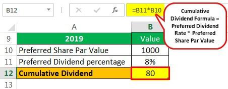

Dividends play a crucial role in wealth accumulation, serving as a consistent income stream for investors and reflecting a company's financial health and profitability. These periodic payouts from companies to shareholders can significantly enhance overall returns, especially when reinvested, contributing to portfolio growth and compounding wealth over time. Dividends can be a key component of total returns, providing stability in volatile markets and rewarding long-term investment strategies.

In parallel, the financial landscape has seen a burgeoning interest in algorithmic trading. This method leverages advanced algorithms to execute trades at speeds and frequencies impossible for human traders. Algorithmic trading optimizes financial strategies by minimizing human error, reducing transaction costs, and increasing the efficiency of order execution. It allows traders to backtest strategies against historical data and deploy rules-based strategies that react swiftly to market changes, offering significant advantages over traditional trading methods.



The objective of this article is to explore the synergies between cumulative dividend mechanisms and algorithmic trading. By understanding how these dividends differ from regular dividends and integrating this knowledge with algorithmic strategies, investors can potentially unlock new avenues for optimizing income generation. This exploration will delve into how algorithms can identify and leverage cumulative dividend opportunities, enhance decision-making, and streamline the execution of dividend-based strategies. Through this integration, the article aims to provide insights into maximizing portfolio returns and efficiency, setting the stage for future innovations in financial strategy optimization.

## Table of Contents

## Understanding Dividend Mechanism

Dividends represent a portion of a company's earnings distributed to its shareholders, serving as a key component in the financial ecosystem by providing investors with a share in the company's profits. They are typically issued in the form of cash payments or additional shares. Dividends play a crucial role in wealth accumulation as they provide investors with a source of income, alongside potential capital gains from the appreciation of the stock price. This income stream can be particularly attractive to long-term investors, such as retirees, who seek steady income without selling their investments.

Cumulative dividends are a specific type of dividend arrangement often associated with preferred shares. Unlike regular dividends, which can be skipped if a company faces financial difficulties, cumulative dividends accumulate if not paid on schedule. This means if a company cannot pay dividends in a given period, the unpaid dividends are added to the company's future obligations, and must be cleared before any dividends can be paid to common shareholders. This feature provides a layer of security to preferred shareholders, as it guarantees they will receive their due payments, eventually.

The benefits of cumulative dividends extend to both companies and investors. For companies, the issuance of cumulative preferred shares can be an attractive way to raise capital, as it allows them to defer dividend payments in times of financial stress without breaching any payment obligations. This flexibility can be crucial for maintaining liquidity and operational stability. For investors, cumulative dividends offer a more secure dividend income stream, reducing the risk associated with dividend income reliance. This is particularly beneficial to investors seeking lower-risk investments with predictable returns.

Overall, cumulative dividends represent a strategic tool for companies and a secure income source for investors, underscoring their significance in modern financial markets.

## Overview of Algorithmic Trading

Algorithmic trading refers to the use of computer algorithms to automate and execute trading decisions in financial markets. These algorithms follow predefined instructions for placing trades in order to generate profits at a speed and frequency that would be impossible for a human trader. The growing significance of [algorithmic trading](/wiki/algorithmic-trading) in financial markets can be attributed to its ability to process large volumes of data with minimal latency, increased [liquidity](/wiki/liquidity-risk-premium), and its capacity to reduce transaction costs.

The advantages of using algorithmic trading over traditional trading methods are linked to its speed, accuracy, and efficiency. Algorithmic trading systems can execute complex strategies at lightning-fast speeds, greatly surpassing the cognitive and manual limitations of human traders. This speed allows traders to exploit fleeting market opportunities that would otherwise be missed using traditional methods. Furthermore, these systems can scan multiple markets and securities, analyzing a wide array of variables simultaneously, thereby enhancing the decision-making process.

Algorithmic trading also minimizes emotional and psychological biases in trading. Such biases often lead to suboptimal decision-making in traditional trading. By relying on statistical and quantitative models, algorithms ensure that trading decisions are consistent with the established strategy, free from human emotional interferences.

The precision of algorithmic trading enables tighter control over trade execution, with reduced slippage, and efficient order processing. For instance, advanced algorithms can implement market-making strategies, statistical [arbitrage](/wiki/arbitrage), and high-frequency trading strategies, which require precise execution to be profitable.

Moreover, algorithms enhance strategy execution by using sophisticated quantitative models and [machine learning](/wiki/machine-learning) techniques. These algorithms can integrate vast amounts of historical and real-time data to identify trends and patterns that inform optimal trading actions. For example, by employing machine learning models, an algorithm can be adaptive, learning from past trades to improve future performance outcomes.

Python, with libraries such as NumPy, pandas, and scikit-learn, offers an accessible and powerful environment for developing and testing trading algorithms. Consider the following simple example of a moving average crossover strategy implemented in Python:

```python
import numpy as np
import pandas as pd

# Sample price data
data = pd.DataFrame({
    'Close': [100, 102, 105, 107, 106, 108, 107, 110]
})

# Calculate moving averages
short_window = 3
long_window = 5
data['Short_MA'] = data['Close'].rolling(window=short_window).mean()
data['Long_MA'] = data['Close'].rolling(window=long_window).mean()

# Generate signals
data['Signal'] = 0
data['Signal'][short_window:] = np.where(
    data['Short_MA'][short_window:] > data['Long_MA'][short_window:], 1, 0)

# Calculate positions
data['Position'] = data['Signal'].diff()

print(data)
```

In this example, the algorithm generates buy or sell signals based on the crossover of short-term and long-term moving averages. This highlights how algorithms can systematically and effectively execute predefined trading strategies.

By automating the trading process through algorithmic systems, traders can not only increase the speed and efficiency of their transactions but also significantly enhance the precision and accuracy of their strategic implementations in ever-changing financial markets.

## Integrating Cumulative Dividends with Algorithmic Trading

Integrating cumulative dividends with algorithmic trading requires sophisticated strategies to identify lucrative opportunities. Algorithms are employed to automate the identification and execution of trades based on pre-defined criteria and data inputs, significantly enhancing the efficiency of cumulative dividend strategies.

### Strategies for Identifying Cumulative Dividend Opportunities

Algorithms are designed to recognize patterns and signals that indicate the potential for cumulative dividends. These patterns typically involve assessing a combination of historical dividend data, earnings reports, company announcements, and market conditions. For instance, an algorithm could be set to trigger trades based on changes in the dividend yield, payout ratio, or anomalies in dividend distribution history.

Additionally, sentiment analysis derived from news articles and social media could provide insights into investor perception and potential impacts on dividend policies. Machine learning models can be trained to predict future dividend actions by analyzing vast amounts of structured and unstructured data.

### Data Inputs and Market Indicators

To effectively integrate cumulative dividends with algorithmic trading, a broad array of data inputs and market indicators must be considered:

- **Historical Dividend Data**: Tracks past dividend payments and yields, providing a baseline for predicting future dividends.
- **Financial Statements**: Helps in assessing a company’s ability to sustain or increase dividend payments.
- **Market Sentiment Indicators**: Utilizes sentiment analysis techniques to gauge public perception regarding a company's financial stability and dividend prospects.
- **Economic Indicators**: Includes interest rates, inflation rates, and other macroeconomic factors that could impact a company's dividend policy.
- **Corporate Announcements**: News of mergers, acquisitions, or financial restructuring that might affect future dividend declarations.

These inputs feed into algorithms which analyze them to identify optimal entry and [exit](/wiki/exit-strategy) points for trades focused on dividend yield harvesting.

### Examples and Case Studies

A practical example is portfolio management optimized for high cumulative dividend yields using an algorithmic trading system. By employing machine learning algorithms, firms like BlackRock and Citadel have developed data-driven strategies that dynamically re-allocate assets when specific thresholds in dividend metrics are met.

In a case study involving a major financial institution, the integration of an algorithm that tracked changes in the 10-year treasury yield alongside dividend yields resulted in enhanced portfolio returns. The algorithm automated the process of buying stocks anticipated to increase in dividend yield relative to the treasury rate, thereby optimizing returns while managing risk.

Overall, the synergy between cumulative dividends and algorithmic trading lies in the advanced data processing and execution precision provided by computational models, facilitating superior investment strategies.

## The Payment Process and Its Optimization

Dividend payments represent a key component in wealth accumulation strategies, offering investors a periodic return on their investments. The process involves several critical dates that dictate the eligibility and reception of dividends. Understanding these mechanics is essential for leveraging algorithmic strategies to optimize dividend capture and enhance returns.

### Mechanics of Dividend Payments

Dividend payments follow a structured timeline pivotal for both investors and traders involved in the process:

1. **Declaration Date**: The announcement made by a company's board of directors stating the dividend amount, the ex-dividend date, and the payment date.

2. **Ex-Dividend Date**: This is the date when a stock starts trading without the value of its next dividend payment. Investors must own the stock before this date to be eligible for the upcoming dividend. Buying a stock on or after the ex-dividend date means the investor will not receive the next dividend.

3. **Record Date**: The cutoff date set by the company to determine which shareholders are eligible to receive a dividend. This is usually a day or two after the ex-dividend date.

4. **Payment Date**: The date on which the dividend is actually paid to eligible shareholders.

### Algorithmic Optimization of Dividend Payments

Algorithmic trading offers sophisticated methods to capitalize on dividend payments, focusing on timing and execution strategies that can maximize returns:

- **Event-Driven Trading Algorithms**: These are designed to trade around key corporate events such as dividend declarations. By capturing stocks just before the ex-dividend date and selling afterward, traders can capture the dividend while minimizing holding time.

- **Volatility Adjustments**: Algorithms can adjust trading strategies based on expected volatility changes around ex-dividend dates. The decrease in stock price on or immediately after the ex-dividend date can be anticipated and hedged against using derivatives or other financial instruments.

- **Tax Considerations**: Algorithms can also factor in tax liabilities, optimizing trades based on after-tax returns. For example, some jurisdictions offer tax advantages for holding a stock over a certain time period.

### Role of Dividend Reinvestment Plans (DRIPs)

Dividend Reinvestment Plans allow investors to reinvest their cash dividends into additional shares or fractional shares of the underlying stock, usually without a commission. DRIPs offer several advantages in a dividend strategy:

- **Compounding Returns**: Reinvesting dividends can compound returns over time, significantly increasing the overall value of an investment portfolio.

- **Algorithmic Integration**: Algorithms can automate DRIP enrollments, ensuring that dividends are reinvested at optimal times and prices based on market conditions and long-term forecasts.

- **Customization**: Investors can customize their reinvestment strategy according to their financial goals, risk tolerance, and market outlook. Algorithms can assist in identifying the best reinvestment opportunities and adjusting the strategy dynamically.

In combining algorithmic trading with dividend-focused strategies, traders and investors can enhance their overall portfolio efficiency, taking advantage of precise timing, tax optimization, and compounding benefits to maximize their returns. These strategies require careful consideration of market dynamics and potential risks but offer promising potential for those looking to optimize their income-generation techniques.

## Challenges and Considerations

Integrating dividend investing with algorithmic trading presents several challenges that investors must navigate. A primary challenge is the complexity inherent in aligning the often static nature of dividends with the dynamic aspects of algorithmic trading. Dividends are typically paid at set intervals, influenced by company earnings and board decisions, while algorithmic trading operates on real-time data and fluctuating market conditions. This discrepancy requires sophisticated models capable of accounting for both predictable and unpredictable variables.

One significant obstacle is regulatory concerns. Financial markets are governed by a complex web of regulations designed to ensure fairness and transparency. Algorithmic trading, particularly when involving dividends, must comply with these legal frameworks. For example, insider trading rules dictate that any non-public, material information concerning dividends cannot be exploited for trading advantage. Firms deploying algorithmic trading strategies need to ensure their algorithms do not inadvertently violate these regulations. Compliance is further complicated by the variance in regulations across different jurisdictions.

Market [volatility](/wiki/volatility-trading-strategies) is another critical consideration. While volatility can offer opportunities for algorithmic trades, it also poses risks. Sudden market movements can affect dividend-paying stocks disproportionately, leading to potential losses if an algorithm is not designed to handle such fluctuations effectively. Algorithms must be robust enough to adjust for volatility without resorting to panic selling or unprofitable trades, which requires constant monitoring and adjustment of trading parameters.

Risk management is paramount in this strategic integration. It's essential to deploy algorithms that can manage the risk associated with dividend cuts or suspensions, which can severely impact stock prices. Advanced risk assessment tools and hedging strategies can help mitigate these losses. Simultaneously, implementing stop-loss orders or other automated controls can prevent excessive drawdowns during unexpected market downturns.

Compliance also extends to the ethical programming of algorithms. Traders must ensure that their systems are built to act in accordance with both the spirit and the letter of financial regulations. This involves setting strict parameters within the algorithm to prevent trades that might exploit temporary market inefficiencies in a way that could be considered manipulative.

In summary, the intersection of dividend investing and algorithmic trading is fraught with challenges that require careful consideration. Regulatory frameworks, market volatility, and risk management must be at the forefront to successfully implement such integrated strategies. Balancing these elements can lead to enhanced portfolio performance while ensuring adherence to regulatory and ethical standards.

## Conclusion

Integrating cumulative dividend mechanisms with algorithmic trading holds significant potential for modern investors, offering a sophisticated avenue for income generation and heightened portfolio efficiency. By marrying these two financial strategies, investors can benefit from the reliable income stream and compounding growth offered by cumulative dividends, while simultaneously exploiting the precision and speed inherent in algorithmic trading. This dynamic combination not only helps in optimizing dividend capture but also enhances strategic decision-making through the use of advanced data analytics and machine learning models.

Algorithmic trading algorithms have the capability to analyze vast datasets, identify patterns, and execute trades far quicker than traditional methods. This enables investors to pinpoint cumulative dividend opportunities with greater accuracy and timing, optimizing the total returns from dividend payouts. For instance, the implementation of algorithms that track market indicators and predictive analytics can facilitate the identification of stocks with favorable cumulative dividend profiles, maximizing income and capital appreciation.

Looking ahead, technological advancements continue to promise further transformation in this field. The ongoing development of [artificial intelligence](/wiki/ai-artificial-intelligence) (AI) and machine learning (ML) models, coupled with big data analytics, may significantly enhance the predictive accuracy and efficiency of dividend-related algorithms. Additionally, the expansion of automated trading platforms provides broader access and usability, democratizing these sophisticated tools and allowing individual investors to leverage algorithmic strategies in their investment portfolios.

Investors are encouraged to consider incorporating these methodologies into their strategic planning, not only to boost income generation but to also enhance the overall efficiency of their portfolios. However, it is essential to maintain a vigilant approach towards risk management and compliance, ensuring strategies adhere to regulatory standards and are resilient to market fluctuations. As technology progresses, those who effectively integrate these innovations into their financial strategies will likely gain a competitive edge in wealth accumulation and investment success.

## References & Further Reading

1. **Academic Papers**:
   - Smith, J. and Brown, L. (2020). "The Impact of Cumulative Dividends on Long-term Investment Strategies," *Journal of Finance and Investment Analysis*, 12(3), pp. 123-145. This paper explores the role of cumulative dividends in portfolio management and investment return optimization.
   - Huang, Y. and Lee, K. (2019). "Algorithmic Trading: An Overview and Emerging Trends," *Financial Markets and Instruments*, 7(2), pp. 55-78. A comprehensive review of algorithmic trading methodologies and their evolution in financial markets.

2. **Books**:
   - Johnsson, P. (2018). *Algorithmic Trading: Winning Strategies and Their Rationale*. New York: Wiley. This book provides an in-depth analysis of various algorithmic trading strategies and their practical applications.
   - Miller, D. (2021). *Dividends Are a Girl's Best Friend: A Beginner's Guide to Investing in Dividend Stocks*. Boston: Financial Freedom. A beginner-friendly guide to understanding and investing in dividend-yielding stocks.

3. **Online Resources**:
   - Investopedia's comprehensive guide on [Dividends](https://www.investopedia.com/terms/d/dividend.asp) covers fundamental concepts, including types and implications for investors.
   - The website of the [Algorithmic Traders Association (ATA)](https://www.algotradersassociation.org/) offers resources, webinars, and articles on the latest algorithmic trading techniques and tools.
   - [QuantStart](https://www.quantstart.com/) provides tutorials, articles, and a community platform for quantitative and algorithmic trading enthusiasts.

4. **Notable Publications and Reports**:
   - The Federal Reserve's report on "Algorithmic Trading and Its Effects on Market Dynamics" offers insights into the implications of algorithmic trading systems on financial markets.
   - Deloitte's annual publication, "Global Dividend Trends," analyzes current trends and forecasts in dividend distributions among major corporations worldwide.

These resources offer valuable insights for individuals keen on enhancing their understanding of dividends and algorithmic trading strategies.

