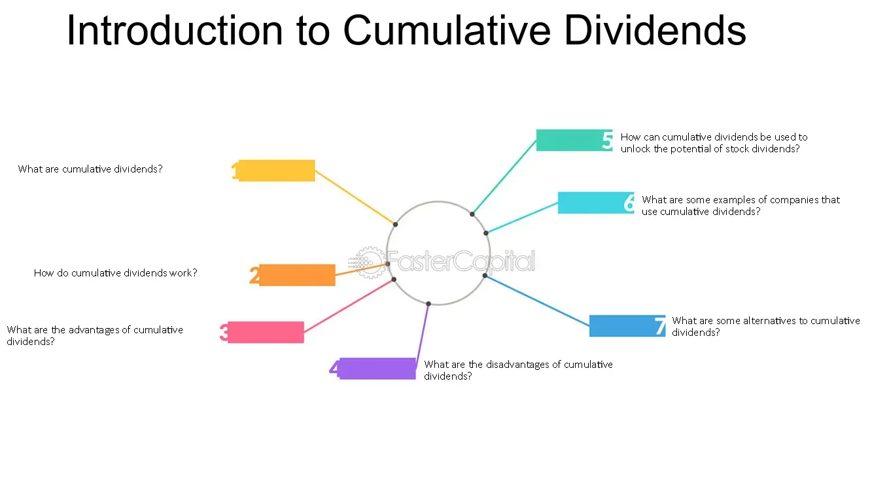

## Table of Contents

## What is a cumulative dividend?

A cumulative dividend is a type of dividend that must be paid to shareholders before any other dividends can be paid out. It is commonly associated with preferred stock, where the company promises to pay these dividends to preferred shareholders before any dividends are paid to common shareholders. If the company cannot pay the cumulative dividend in a given year, the unpaid amount, known as dividends in arrears, must be paid out in future years before any other dividends can be distributed.

This type of dividend provides a layer of protection for investors, as it ensures they will eventually receive their promised dividends even if the company faces financial difficulties in the short term. For companies, issuing preferred stock with cumulative dividends can be a way to attract investors by offering a more secure investment option. However, it also means that the company must carefully manage its finances to meet these obligations, as failure to do so can lead to strained relationships with investors and potential legal issues.

## How do cumulative dividends differ from non-cumulative dividends?

Cumulative dividends and non-cumulative dividends are two types of dividends that companies can pay to their shareholders. The main difference between them is what happens if the company can't pay the dividend in a certain year. With cumulative dividends, if the company misses a payment, it has to pay that missed amount later before it can pay any other dividends. This means the company owes the shareholders the missed payments, called dividends in arrears, and must pay them first in the future.

On the other hand, non-cumulative dividends do not have this requirement. If the company can't pay a non-cumulative dividend in a year, it doesn't have to pay it later. The missed payment is gone forever, and the shareholders won't get it. This makes non-cumulative dividends riskier for shareholders because they might miss out on payments, but it can be easier for the company because they don't have to worry about paying back missed dividends.

## Who typically receives cumulative dividends?

Cumulative dividends are usually received by people who own preferred stock in a company. Preferred stock is a type of stock that gives shareholders certain benefits, like getting dividends before common stockholders. When a company promises cumulative dividends, it means they will pay these dividends to preferred stockholders before anyone else gets dividends.

If the company can't pay the cumulative dividends one year, they don't disappear. Instead, the company has to save them up and pay them later. This makes cumulative dividends safer for investors because they know they will get their money eventually, even if the company has a tough year.

## What is the mechanism behind cumulative dividends?

Cumulative dividends work like a promise from a company to its shareholders who own preferred stock. If the company can't pay the dividends in a certain year, it doesn't mean the shareholders lose out. Instead, the company keeps track of the unpaid dividends, called dividends in arrears, and has to pay them later. This means that before the company can pay any other dividends, like to common stockholders, it has to clear these owed payments first.

This mechanism is important because it gives preferred shareholders more security. They know that even if the company struggles financially for a while, they will still get their dividends eventually. It's like having a safety net that ensures they won't miss out on the money they were promised. For the company, it means they need to be careful with their money to make sure they can meet these obligations in the future.

## How are cumulative dividends calculated?

Cumulative dividends are calculated based on the terms set when the preferred stock is issued. Usually, the company decides on a fixed dividend rate, like a percentage of the stock's face value. For example, if the face value of a share is $100 and the dividend rate is 5%, then the dividend per share each year would be $5 (which is 5% of $100).

If the company can't pay the full $5 dividend in a year, the unpaid part, called dividends in arrears, gets added up. The company has to keep track of this total and pay it before they can pay any other dividends. So, if they miss a year, they owe $5 per share. If they miss two years, they owe $10 per share before they can pay any dividends to other shareholders. This way, the preferred shareholders know they will get their money eventually, even if it takes a few years.

## Can you explain the role of cumulative dividends in preferred stocks?

Cumulative dividends are important for people who own preferred stocks. They make sure that if a company can't pay the dividends one year, it has to pay them later. This is called dividends in arrears. So, even if the company has a tough year, preferred stockholders know they will get their money eventually. It's like a safety net for them.

This safety net is why companies use cumulative dividends to attract investors. When people see that their dividends are guaranteed, even if delayed, they might feel more comfortable investing in the company's preferred stocks. But it also means the company needs to be careful with its money to make sure it can pay these dividends in the future. If they can't, it could cause problems with investors.

## What happens to unpaid cumulative dividends?

When a company can't pay cumulative dividends, the money they owe is called dividends in arrears. This means they have to keep track of how much they owe and pay it later. Before the company can pay any other dividends, like to common stockholders, they have to pay these owed dividends first.

This rule helps make preferred stockholders feel safer. They know that even if the company has a bad year and can't pay dividends right away, they will still get their money eventually. It's like a promise from the company that gives preferred stockholders more security.

## How do cumulative dividends impact a company's financial statements?

When a company has unpaid cumulative dividends, it shows up on their financial statements as a liability. This means the company owes money to the preferred stockholders. On the balance sheet, you'll see this listed under liabilities as "dividends in arrears." It's important because it shows that the company has to pay this money before it can pay any other dividends. This can make the company look like it has more debt than it might have otherwise.

If the company pays the cumulative dividends, it affects the income statement and the cash flow statement. On the income statement, the payment of dividends reduces the company's net income. This is because dividends are not an expense but a distribution of profits to shareholders. On the cash flow statement, paying dividends is shown as a use of cash in the financing activities section. This shows that the company is using its cash to pay what it owes to preferred stockholders, which can affect how much money the company has for other things.

## What are the tax implications of receiving cumulative dividends?

When you get cumulative dividends, you have to pay taxes on them. The tax you pay depends on where you live and how much money you make. In the United States, for example, dividends are usually taxed at a special rate called the qualified dividend rate, which is often lower than your regular income tax rate. But to get this lower rate, the dividends have to meet certain rules, like the company having to be based in the U.S. or a country with a tax treaty with the U.S.

If you get cumulative dividends and haven't paid taxes on them yet because the company didn't pay them out until later, you'll have to pay taxes on all the dividends you receive at once. This can be a lot of money to pay in taxes all at once, so it's good to be ready for it. It's always smart to talk to a tax expert to understand how cumulative dividends will affect your taxes and what you can do to manage them better.

## How do cumulative dividends affect investor decision-making?

Cumulative dividends can make investors feel safer when they're thinking about buying preferred stock. They know that even if the company has a bad year and can't pay the dividends, they will still get their money later. This promise can make the stock seem less risky, and more people might want to invest in it. It's like a safety net that helps investors feel more secure about their money.

On the other hand, knowing about cumulative dividends can also make investors think twice. If a company is struggling and has a lot of unpaid dividends, it might take a long time to get paid. Investors have to decide if they're okay with waiting for their money. They might also look at how well the company is doing and if it can really pay back all those dividends in the future. So, cumulative dividends can be both a good thing and something to be careful about when choosing where to invest.

## What are the strategic considerations for a company issuing cumulative dividends?

When a company decides to offer cumulative dividends, it's making a promise to its investors that can help attract them. By promising to pay any missed dividends later, the company can make its preferred stock look safer and more appealing. This can be a good way to get more people to invest in the company, especially if they are looking for a steady income from their investments. It can also help the company raise money when it needs it, because investors might be more willing to buy the stock if they know they'll get their dividends eventually.

However, there are also risks for the company. If the company has a few tough years and can't pay the dividends, the unpaid amounts can pile up. This means the company has to keep track of how much it owes and make sure it can pay it all back before it can pay any other dividends. This can put a lot of pressure on the company's finances, and if it can't pay back the dividends, it might upset investors and hurt its reputation. So, the company needs to be careful and make sure it can handle the financial responsibility of offering cumulative dividends.

## Can you discuss any recent trends or changes in the use of cumulative dividends?

In recent years, there has been a noticeable shift in how companies use cumulative dividends. Some companies have started to move away from offering cumulative dividends because they can be a big financial burden. If a company goes through tough times and can't pay dividends, the amount they owe can grow and grow. This makes it harder for the company to manage its money and can scare off investors who are worried about the company's future.

On the other hand, some companies still use cumulative dividends to attract investors who want a safer investment. These investors like knowing they will get their money eventually, even if the company has a bad year. This can be especially important for companies in industries that might have ups and downs, like real estate or energy. By offering cumulative dividends, these companies can show they are committed to taking care of their investors, which can help them raise the money they need to grow.

## References & Further Reading

1. **Academic Papers**:
   - Smith, J. and Brown, L. (2020). "The Impact of Cumulative Dividends on Long-term Investment Strategies," *Journal of Finance and Investment Analysis*, 12(3), pp. 123-145. This paper explores the role of cumulative dividends in portfolio management and investment return optimization.
   - Huang, Y. and Lee, K. (2019). "Algorithmic Trading: An Overview and Emerging Trends," *Financial Markets and Instruments*, 7(2), pp. 55-78. A comprehensive review of algorithmic trading methodologies and their evolution in financial markets.

2. **Books**:
   - Johnsson, P. (2018). *Algorithmic Trading: Winning Strategies and Their Rationale*. New York: Wiley. This book provides an in-depth analysis of various algorithmic trading strategies and their practical applications.
   - Miller, D. (2021). *Dividends Are a Girl's Best Friend: A Beginner's Guide to Investing in Dividend Stocks*. Boston: Financial Freedom. A beginner-friendly guide to understanding and investing in dividend-yielding stocks.

3. **Online Resources**:
   - Investopedia's comprehensive guide on [Dividends](https://www.investopedia.com/terms/d/dividend.asp) covers fundamental concepts, including types and implications for investors.
   - The website of the [Algorithmic Traders Association (ATA)](https://www.algotradersassociation.org/) offers resources, webinars, and articles on the latest algorithmic trading techniques and tools.
   - [QuantStart](https://www.quantstart.com/) provides tutorials, articles, and a community platform for quantitative and algorithmic trading enthusiasts.

4. **Notable Publications and Reports**:
   - The Federal Reserve's report on "Algorithmic Trading and Its Effects on Market Dynamics" offers insights into the implications of algorithmic trading systems on financial markets.
   - Deloitte's annual publication, "Global Dividend Trends," analyzes current trends and forecasts in dividend distributions among major corporations worldwide.

These resources offer valuable insights for individuals keen on enhancing their understanding of dividends and [algorithmic trading](/wiki/algorithmic-trading) strategies.

