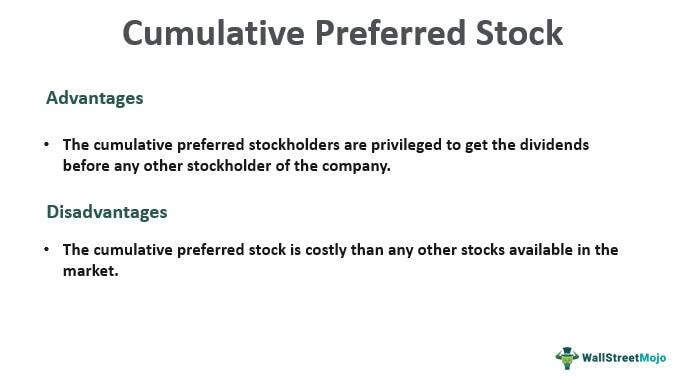

Cumulative preferred stock, stock investments, and algorithmic trading stand as pillars in contemporary financial markets, offering sophisticated tools and opportunities for investors. Cumulative preferred stock is a type of equity that promises fixed dividends, which, if not paid, accumulate and take precedence over common stock dividends. This feature provides a degree of financial security to investors, particularly appealing in periods of economic uncertainty. As investors seek to diversify their portfolios and minimize risks, the role of cumulative preferred stock becomes fundamental due to its potential for steady income and lower volatility compared to common stocks.

Algorithmic trading, on the other hand, has revolutionized how investments are managed and analyzed. It utilizes advanced mathematical models and computer algorithms to execute trading strategies at speeds and frequencies that are impossible for human traders. The integration of algorithmic trading in stock investments, including cumulative preferred stocks, offers significant advantages by enhancing the ability to process vast amounts of data, reduce transaction costs, and improve the timing of trades. This technology enables investors to respond swiftly to market changes, thus optimizing portfolio performance and risk management. 



Together, the strategic use of cumulative preferred stock and algorithmic trading provides investors with robust mechanisms to navigate complex market environments. These elements play a pivotal role in crafting investment strategies that are resilient to market fluctuations, ensuring that portfolios are not only diversified but also optimized for growth and stability. As such, understanding and effectively employing these tools is crucial for investors aiming to harness the full potential of financial markets.

## Table of Contents

## Understanding Cumulative Preferred Stock

Cumulative preferred stock is a type of preferred equity that entitles its investors to receive dividends before any distributions are made to common shareholders. A unique feature of these stocks is their "cumulative" nature, which mandates that if the issuing company is unable to pay dividends in any period, those dividends accumulate and must be paid out in the future before any dividends can be distributed to common shareholders. This characteristic provides a level of financial security to investors, ensuring that they will eventually receive their promised dividend payouts even if the company undergoes temporary financial difficulties.

The primary advantage of cumulative preferred stock lies in its ability to offer a predictable income stream. The cumulative feature is particularly beneficial during economic downturns or periods when a company might not be able to pay its dividends promptly. By accumulating unpaid dividends, these stocks protect investors, transforming deferred dividend payments into a senior obligation for the company. This makes cumulative preferred stocks attractive to risk-averse investors seeking reliable returns.

Cumulative preferred stocks differ significantly from non-cumulative preferred stocks, which do not offer the benefit of accumulating unpaid dividends. In the case of non-cumulative preferred stock, if a company decides not to issue a dividend in a period, those dividends are permanently forfeited by the investor. This lack of a safety net can make non-cumulative preferred stocks less appealing to conservative investors seeking consistent returns.

For example, consider a company that issues cumulative preferred shares at a fixed dividend rate of 5% per annum. Suppose the company encounters a financial setback and cannot pay dividends in year one. Due to the cumulative feature, the unpaid dividends from year one will [carry](/wiki/carry-trading) forward. If the company recovers in year two, it must first satisfy the accrued dividends from year one before paying common shareholders. Thus, investors in cumulative preferred stock can rely on eventual payment of their entitled dividends, which underscores the stability and lower risk profile of such investments.

In summary, cumulative preferred stock provides a blend of security and income certainty, making it an essential instrument for investors who prioritize steady returns with minimized [volatility](/wiki/volatility-trading-strategies). Understanding this type of stock helps investors make informed decisions and incorporate them effectively into diversified investment strategies.

## The Benefits and Risks of Investing in Preferred Stock

Preferred stock serves as an appealing investment choice for many investors due to its unique combination of characteristics. It offers specific benefits, primarily in the form of priority in dividends and additional security during financial downturns, which makes it a preferred option over common stock for risk-averse investors.

One of the primary advantages of investing in preferred stock is the priority it provides in the payment of dividends. Preferred shareholders receive dividend payments before common shareholders, ensuring a more stable income stream. This priority is particularly significant during periods of financial instability or decreases in a company's profitability, as preferred dividends must be paid out before any dividends can be issued to common shareholders. This guarantees a degree of income reliability, which is especially beneficial for conservative investors seeking steady returns.

During company downturns, when [liquidity](/wiki/liquidity-risk-premium) issues may arise, the preference in dividend payment acts as a financial cushion for investors. This security makes preferred stocks attractive to those who prioritize income generation with lower volatility compared to common stocks.

However, investing in preferred stock does come with certain limitations and risks. One of the main drawbacks is the lack of voting rights typically associated with preferred shares. This means that preferred shareholders generally do not have a say in corporate governance decisions, such as the election of board members or major corporate policy changes. This lack of influence can be a disadvantage for investors who wish to participate actively in the management and decision-making processes of the company.

Additionally, preferred stocks often come with fixed dividend payments, which, while providing stability, do not offer the growth potential of dividends that may increase over time with common stocks. This fixed nature limits the upside potential during periods of strong company performance, as the dividends do not rise with increased profitability.

Comparatively, cumulative preferred stocks, which allow for the accumulation of unpaid dividends, offer a distinct advantage over non-cumulative versions and common stocks. If a company chooses to suspend dividends due to financial strain, cumulative preferred shareholders are entitled to all missed payments before common dividends can be resumed. This feature provides an added layer of risk mitigation, ensuring that income is eventually recouped once the company resumes dividend payments.

However, the risk associated with preferred stocks, including cumulative ones, tends to be higher than that of common stocks regarding capital appreciation. Preferred stock values are more susceptible to changes in interest rates and credit risk perceptions, which can affect their market value in ways different from common stocks.

In conclusion, while preferred stocks offer valuable benefits such as dividend priority and relative financial security, they are accompanied by certain risks like lack of voting rights and limited dividend growth. Understanding these trade-offs and the nuances between cumulative preferred stocks and common stocks is essential for investors looking to optimize their portfolios in accordance with their risk tolerance and investment objectives.

## Preferred Stock Investment Strategies

Preferred stock investment strategies offer investors a unique avenue for portfolio diversification, combining elements of fixed income with potential equity growth. These strategies focus on maximizing returns while managing inherent risks.

### Portfolio Diversification with Preferred Stocks

Incorporating preferred stocks into an investment portfolio can provide steady income through dividends while mitigating overall volatility. As preferred stocks often offer fixed dividend payments, they serve as a stable income source even during market downturns, making them a valuable diversification tool. By blending preferred stocks with common equities and bonds, investors achieve a balanced portfolio designed to weather different market conditions.

### Evaluating Cumulative Preferred Stocks Using Financial Metrics

Investors can evaluate cumulative preferred stocks using several key financial metrics to assess their viability:

1. **Dividend Yield**: A crucial metric indicating the income component of an investment. Calculated as: 
$$
   \text{Dividend Yield} = \frac{\text{Annual Dividends per Share}}{\text{Price per Share}}

$$
   A higher yield signifies more attractive income potential.

2. **Credit Rating**: Assigned by agencies like Moody's or Standard & Poor's, a credit rating evaluates the issuer's credit risk. Higher ratings typically indicate lower risk.

3. **Payout Ratio**: This determines the sustainability of dividend payments. It's calculated as:
$$
   \text{Payout Ratio} = \frac{\text{Dividends}}{\text{Net Income}}

$$
   A lower ratio often suggests more sustainable dividend payments.

4. **Book Value per Share**: This represents the company's net asset value and is a safeguard measure for preferred shareholders.

### Risk Management in Preferred Stock Investments

Risk management is essential in developing a robust preferred stock strategy. Preferred stocks are inherently less volatile than common stocks but come with unique risks, including [interest rate](/wiki/interest-rate-trading-strategies) sensitivity and credit risk.

1. **Interest Rate Risk**: Preferred stocks are sensitive to interest rate changes. Rising rates can lead to declining stock prices; hence, monitoring interest rate environments is crucial.

2. **Credit Risk**: This reflects the issuer's ability to maintain dividend payments. Investors should diversify issuers to mitigate this risk.

A disciplined approach using these strategies ensures that investors benefit from the hybrid nature of preferred stocks, optimizing their portfolio's performance without significantly increasing risk exposure. This balance forms the core of a well-rounded investment strategy that leverages the stability and income potential offered by cumulative preferred stocks.

## Algorithmic Trading and Preferred Stock

Algorithmic trading involves the use of automated systems to execute trading decisions based on pre-defined criteria. These criteria can include mathematical models, statistical analyses, and various technical indicators. The primary goal is to enhance trading efficiency by eliminating human errors and emotional biases, which are common in manual trading. This approach is particularly useful in preferred stock investments, where timely and precise execution can significantly impact the investment outcome.

Preferred stocks, including cumulative preferred stocks, offer unique opportunities for [algorithmic trading](/wiki/algorithmic-trading) systems. Due to their hybrid nature—possessing qualities of both equities and fixed-income securities—preferred stocks provide a relatively stable income stream with certain rights that common stocks do not offer, such as priority in dividend payments. Algorithmic systems can manage these stocks by optimizing entry and [exit](/wiki/exit-strategy) points, based on market conditions, interest rate changes, and other relevant factors.

**Advantages of Algorithmic Trading Systems**

1. **Efficiency and Speed**: Algorithms can execute trades at speeds considerably faster than human traders, ensuring that preferred stock transactions are completed in the shortest possible time frame. This speed is crucial in capturing gains from small price movements, which is a central strategy in algorithmic trading.

2. **Reduction in Transaction Costs**: Automated systems can reduce costs associated with trading, as computers can swiftly identify the best prices available in the market. This efficiency in execution is particularly beneficial when managing large portfolios of cumulative preferred stocks.

3. **Accuracy and Reduced Human Bias**: By following predefined trading strategies, algorithmic trading systems eliminate human errors and emotional biases. This accuracy ensures that investments in preferred stocks are based on data-driven insights, which can enhance decision-making.

4. **Backtesting and Optimization**: Algorithms can be tested against historical data to validate their effectiveness. This backtesting enables traders and fund managers to refine their strategies for cumulative preferred stocks and tailor them for varying market conditions.

**Case Studies and Examples**

Consider the case of a [hedge fund](/wiki/hedge-fund-trading-strategies) employing algorithmic trading to manage a diverse portfolio that includes cumulative preferred stocks. The fund designs an algorithm that monitors interest rate fluctuations, preferred stock dividend yields, and historical volatility.

Here's a simplified Python example to illustrate algorithmic trading with preferred stocks:

```python
import pandas as pd
import numpy as np

# Load historical data of preferred stock
data = pd.read_csv('preferred_stock_data.csv')

# Define a simple moving average strategy
data['SMA_50'] = data['Close'].rolling(window=50).mean()
data['SMA_200'] = data['Close'].rolling(window=200).mean()

# Generate signals
data['Buy_Signal'] = np.where(data['SMA_50'] > data['SMA_200'], 1, 0)
data['Sell_Signal'] = np.where(data['SMA_50'] < data['SMA_200'], -1, 0)

# Determine positions
data['Position'] = data['Buy_Signal'] + data['Sell_Signal']

# Calculate returns
data['Returns'] = data['Close'].pct_change()
data['Strategy_Returns'] = data['Returns'] * data['Position'].shift(1)

# Calculate cumulative returns
cumulative_returns = (1 + data['Strategy_Returns']).cumprod()

print("Cumulative Returns with Strategy:", cumulative_returns.iloc[-1])
```

In this example, a simple moving average crossover strategy is used, which is a fundamental algorithmic trading strategy. When the 50-day moving average exceeds the 200-day moving average, a buy signal is triggered, and vice versa for a sell signal. This model provides a basic framework for how algorithms can be applied to manage preferred stock investments.

Real-world examples also exist where some investment firms use more complex algorithms, incorporating [machine learning](/wiki/machine-learning) and [artificial intelligence](/wiki/ai-artificial-intelligence), to predict and react to market trends involving preferred stocks. Such systems can instantly process large volumes of data, from dividend histories to macroeconomic indicators, to make split-second trading decisions. These robust models can outperform traditional discretionary trading approaches, especially in volatile markets.

Algorithmic trading is thus an invaluable tool for optimizing the management of preferred stock investments. By leveraging these systems, investors can enhance their returns while controlling risk, thereby achieving a more balanced and potentially profitable investment portfolio.

## Example: Managing Cumulative Preferred Stock with Algorithms

Algorithmic trading has proven valuable in managing cumulative preferred stock portfolios by automating and optimizing trading decisions based on predefined parameters and models. This example illustrates how algorithms can effectively streamline the management of these specific investments.

### Hypothetical Scenario

Consider a hypothetical investment firm, Apex Investments, which manages a diversified portfolio with a significant allocation to cumulative preferred stocks. The goal is to maximize dividend income while minimizing risk exposure through timely buy and sell decisions driven by data and predictive models.

### Process of Evaluating and Optimizing Stock Performance through Algorithms

1. **Data Collection and Analysis**:
   - Apex Investments collects historical price data, dividend issuance records, interest rates, and market volatility metrics for various cumulative preferred stocks.
   - Machine learning models, such as decision trees or neural networks, are trained on this data to predict future price movements and dividend stability.

2. **Algorithmic Model Implementation**:
   - Algorithm is coded to identify buying opportunities when the expected yield surpasses a predetermined threshold based on risk tolerance. 
   - Sell signals are triggered when predicted market downturns or adverse company earnings are detected.

3. **Code Snippet for Basic Buy/Sell Signal (Python)**:
   ```python
   import numpy as np
   import pandas as pd

   # Example data
   data = pd.DataFrame({
       'price': [100, 102, 101, 103, 99],  
       'expected_yield': [0.05, 0.06, 0.055, 0.057, 0.058]  
   })

   # Parameters
   yield_threshold = 0.056

   # Buy/Sell Signal Function
   def generate_signals(df):
       signals = np.where(df['expected_yield'] > yield_threshold, 'Buy', 'Hold')
       signals = np.where(df['price'].pct_change() < -0.02, 'Sell', signals)
       return signals

   data['signal'] = generate_signals(data)
   print(data)
   ```

4. **Backtesting and Optimization**:
   - The algorithm undergoes rigorous backtesting using historical data to validate its accuracy in decision-making.
   - Optimization processes refine parameters like yield thresholds and risk factors to improve forecast precision and maximize returns.

5. **Risk Management**:
   - Diversification and allocation adjustments are automatically triggered based on changes in volatility and other market indicators, ensuring a balanced risk profile.
   - Stop-loss features are incorporated, closing positions when portfolio values decline beyond a specific limit.

### Analysis of Outcomes versus Traditional Management

**Efficiency**: Unlike traditional portfolio management, which requires intensive manual analyses, algorithms process vast amounts of data rapidly, enabling real-time decision-making that adapts to market conditions.

**Accuracy**: Machine learning-based predictive models often surpass human judgment in identifying patterns, enhancing the accuracy of recommendations concerning cumulative preferred stocks.

**Consistency**: Algorithms mitigate emotional bias, executing trades objectively based on data-driven insights, unlike traditional methods which may suffer from subjective judgment errors.

**Cost**: Automated systems reduce the need for extensive human resources, lowering operational costs associated with managing investments manually.

In conclusion, integrating algorithmic trading with cumulative preferred stock investments offers substantial benefits in terms of efficiency, precision, and risk management capabilities, providing a robust alternative to conventional investment strategies.

## Conclusion

Cumulative preferred stock presents a compelling investment opportunity for those seeking stable returns and security. This type of stock ensures that unpaid dividends are accumulated and paid out before any dividends are distributed to common shareholders, providing an additional layer of financial safety. The potential for steady, priority dividends makes cumulative preferred stocks a valuable asset in diversifying a portfolio and reducing financial risk, especially during economic downturns.

On the other hand, algorithmic trading continues to revolutionize how investors approach stock management, offering efficiency and precision in handling vast amounts of data and transactions. Algorithms can rapidly analyze market trends and execute trades, optimizing the timing and strategy for buying or selling, including decisions involving cumulative preferred stocks. This approach not only enhances the efficiency of stock transactions but also mitigates human error and emotional bias, leading to potentially higher returns on investment.

The synergy between cumulative preferred stock and algorithmic trading provides a modern approach to stock market investment strategies. By combining the stable, predictable nature of cumulative preferred stocks with the analytical power and speed of algorithmic systems, investors can better navigate market complexities. This integration allows for more informed and timely decisions, maximizing investment returns while minimizing associated risks.

As the financial landscape continues to evolve, it is imperative for investors to stay informed about these innovative strategies. Ongoing research and development in algorithmic trading can further enhance the benefits of preferred stock investment. Encouraging deeper exploration into these areas can enable potential investors to leverage both tools effectively, potentially leading to improved investment outcomes and satisfaction. Engaging with these strategies can ultimately help in crafting a robust portfolio that meets diverse financial goals in today's dynamic market.

## FAQs on Cumulative Preferred Stock and Algorithmic Trading

**FAQs on Cumulative Preferred Stock and Algorithmic Trading**

**Q1: What is the primary mechanism behind cumulative preferred stock?**

Cumulative preferred stock is a type of equity that offers investors fixed dividend payments, with the guarantee that any missed dividends are accumulated and paid out before any dividends are distributed to common stockholders. This accumulation of unpaid dividends is known as "dividend arrears." For example, if a company decides not to pay dividends one year due to financial constraints, the amount will be carried forward. In subsequent years, shareholders must receive these arrears before any future dividends are disbursed to other stockholders.

**Q2: How does algorithmic trading integrate with stock investments?**

Algorithmic trading involves using complex algorithms to automate and optimize trading strategies. For stock investments, including cumulative preferred stocks, algorithms can quickly analyze market conditions, execute trades at ideal times, and balance portfolios based on predefined criteria. The integration of algorithmic trading allows investors to respond to market shifts with speed and precision, minimizing the emotional and timing errors traditionally associated with manual trading methods.

**Q3: What are some common constraints or limits when using algorithmic trading with preferred stocks?**

Algorithmic trading, while efficient, comes with certain constraints. Preferred stocks typically have lower liquidity compared to common stocks, which may affect the ability of algorithms to execute large trades without impacting market prices. Additionally, algorithmic strategies might require frequent adjustments to accommodate dividend changes or new issuance of stock, demanding comprehensive data inputs and constant monitoring.

**Q4: Can you recommend some resources for learning more about cumulative preferred stock and algorithmic trading?**

For further reading on cumulative preferred stocks, consider these resources:

- "Investing in Preferred Stock" by K.H. Spencer Pickett
- "The Handbook of Fixed Income Securities" by Frank J. Fabozzi

For algorithmic trading:

- "Algorithmic Trading: Winning Strategies and Their Rationale" by Ernie Chan
- "Advances in Financial Machine Learning" by Marcos López de Prado

Additionally, online platforms like Coursera and edX offer courses on financial markets and algorithmic trading, which can help deepen understanding and application in the stock market.

**Q5: What tools are available for engaging in algorithmic trading strategies with stock investments?**

Several platforms provide the necessary tools for algorithmic trading:

- **QuantConnect**: An open-source platform offering tools for strategy building and backtesting on a wide range of assets.
- **Interactive Brokers**: This service offers a rich API for developers looking to implement custom algorithms.
- **Alpaca**: A commission-free platform that allows algorithmic trading using Python, ideal for beginners and experienced traders alike.

These platforms not only enable automation but also provide educational materials to refine trading strategies.

## References & Further Reading

[1]: ["Algorithmic Trading: Winning Strategies and Their Rationale"](https://www.wiley.com/en-us/Algorithmic+Trading%3A+Winning+Strategies+and+Their+Rationale-p-9781118746912) by Ernie Chan

[2]: ["Advances in Financial Machine Learning"](https://www.amazon.com/Advances-Financial-Machine-Learning-Marcos/dp/1119482089) by Marcos López de Prado

[3]: ["The Handbook of Fixed Income Securities"](https://www.amazon.com/Handbook-Fixed-Income-Securities-Ninth/dp/1260473899) by Frank J. Fabozzi

[4]: ["Investing in Preferred Stock"](https://www.fidelity.com/learning-center/trading-investing/preferred-stock) by K.H. Spencer Pickett

[5]: ["Quantitative Trading: How to Build Your Own Algorithmic Trading Business"](https://www.amazon.com/Quantitative-Trading-Build-Algorithmic-Business/dp/1119800064) by Ernest P. Chan