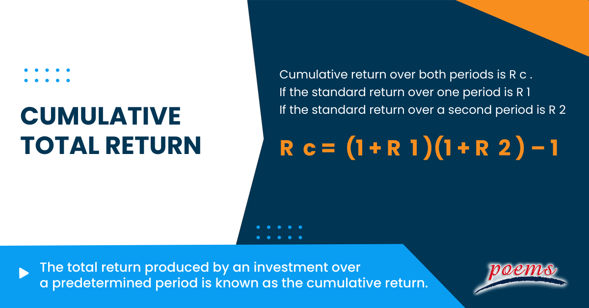

In the rapidly evolving world of finance, understanding and calculating cumulative returns is essential for investors who want to assess the performance of their assets over time. Cumulative returns offer a snapshot of how much an investment has grown or shrunk, expressed as a percentage. This measure is crucial for investors as it provides a straightforward way to evaluate the overall performance of an investment, incorporating both capital gains and income from dividends or interest.

In the context of algorithmic trading, the precision and reliability of cumulative return calculations are vital for the development and benchmarking of trading strategies. Algorithmic traders rely on historical data to backtest and fine-tune their trading models, making accurate cumulative return calculations indispensable for performance evaluation. These calculations help investors and traders alike in identifying the effectiveness of their strategies and making informed decisions about where to allocate resources.



This article aims to provide a comprehensive guide on cumulative return investment calculation, emphasizing financial examples and their application in algorithmic trading. By grasping the concept of cumulative returns, investors can enhance their decision-making processes and better optimize their investment strategies. Understanding the nuances of cumulative returns, such as accounting for fees, taxes, and reinvestments, offers a more realistic depiction of an investment's true performance, ultimately leading to more informed investment decisions and the development of optimized trading strategies.

## Table of Contents

## Understanding Cumulative Returns

Cumulative return represents the total gain or loss of an investment over a specified period, expressed as a percentage. This metric contrasts with annualized returns, which account for the time frame, providing an average yearly growth rate. Cumulative return simply aggregates the overall performance without regard to time, making it a valuable yet distinct measure for assessing investment performance.

Mathematically, cumulative return can be expressed as:

$$
\text{Cumulative Return} = \left( \frac{\text{Final Value} - \text{Initial Value}}{\text{Initial Value}} \right) \times 100
$$

Where "Final Value" is the investment value at the end of the period, and "Initial Value" is the starting value of the investment.

This metric is indispensable when comparing the total performance of various investments over identical or differing periods. It encapsulates not only capital gains but also accounts for dividends and interest earnings. By incorporating these elements, cumulative returns provide a comprehensive picture of an investment's overall performance.

However, caution must be taken when using cumulative returns for comparative analysis. Discrepancies in time frames across different investments can lead to distorted interpretations. For instance, two investments might yield the same cumulative return, but the one achieving it over a shorter period demonstrates superior annualized performance. Therefore, while cumulative returns furnish a holistic measure of investment growth, evaluating them alongside other metrics can yield more nuanced insights.

## Calculating Cumulative Returns

To calculate cumulative returns, begin by identifying the original price of the asset and its current price. The cumulative return represents the total gain or loss of that asset over a specific period and is expressed as a percentage. The formula is straightforward:

$$
\text{Cumulative Return} (\%) = \left( \frac{\text{Current Price} - \text{Original Price}}{\text{Original Price}} \right) \times 100
$$

For example, consider an initial investment of $1,000 in a stock, which has now appreciated to $1,500. The cumulative return calculation would be as follows:

$$
\text{Cumulative Return} = \left( \frac{1500 - 1000}{1000} \right) \times 100 = 50\%
$$

This indicates a 50% increase in the value of the investment.

When calculating cumulative returns, it's important to consider dividends or interest payments, as these contribute to the overall return. A common approach is to use the adjusted closing price, which reflects dividends reinvested into the asset. This provides a more comprehensive picture by accounting for additional income generated over the investment period.

The method for calculating cumulative returns is versatile and can be applied to various asset classes, including stocks, bonds, and exchange-traded funds (ETFs). For assets that generate income, the returns should be adjusted to reflect reinvestments, which amplify the investment's performance over time. 

This calculation forms the bedrock for understanding how different investments perform, providing a simplified metric to compare multiple options without delving into the complexities of annualized returns or time-weighted figures. By maintaining consistency in incorporating all elements, such as income reinvestment, investors can accurately assess the cumulative gain or loss their investments have achieved.

## Cumulative Returns in Algorithmic Trading

Algorithmic trading strategies depend significantly on precise cumulative return calculations to assess and improve their effectiveness. By examining cumulative returns, traders can gain insights into how well their strategies perform over a specified period. The process of [backtesting](/wiki/backtesting) trading strategies involves the computation of historical cumulative returns, which facilitates comparisons among various trading models. This helps traders understand which strategies have been successful in the past under different market conditions.

Python and other programming languages provide powerful tools to assist with these calculations. Libraries such as NumPy and Pandas are particularly valuable, offering functions that simplify the handling of large datasets and the execution of complex financial computations. For example, using Python, cumulative returns can be calculated as follows:

```python
import pandas as pd

# Sample price data
price_data = pd.Series([100, 105, 110, 120, 115])

# Calculate cumulative return
cumulative_return = (price_data.pct_change() + 1).cumprod() - 1
print(cumulative_return)
```

This code snippet calculates the cumulative returns based on a series of price data points, offering a straightforward way to quantify the growth or decline in asset value over time.

Visualization also plays a crucial role in analyzing cumulative returns, as charts and graphs can illuminate performance trends across multiple assets. Tools like Matplotlib or Seaborn can be employed in Python to create visual representations that make it easier to interpret complex data patterns and identify potential areas for strategy refinement.

Accurate cumulative return calculations are instrumental in identifying the effectiveness of [algorithmic trading](/wiki/algorithmic-trading) strategies. By analyzing cumulative returns, traders can discern whether adjustments are necessary and can optimize their approaches for future market engagements. The continual refinement of strategies based on cumulative return insights aids in maintaining a competitive edge in the fast-paced world of algorithmic trading.

## Factors Influencing Cumulative Returns

Reinvestment of dividends plays a crucial role in enhancing cumulative returns through the power of compounding. When dividends are reinvested, they purchase additional shares, which in turn produce more dividends. This creates a compounding effect, significantly boosting the growth of an investment over time. For instance, if a stock pays a 3% dividend and appreciates at 5% annually, reinvesting the dividends could substantially increase the overall return compared to merely receiving dividends as cash.

Fees, including management fees, transaction costs, and taxes, can have a significant impact on reducing cumulative returns if they are not carefully managed. Management fees, typically expressed as a percentage of assets under management, can erode returns over time, especially in low-yield environments. Transaction costs, incurred during the buying and selling of securities, further subtract from net returns. Taxes, particularly on capital gains and dividends, also diminish returns, depending on an investor's tax situation. For example, actively managed investment strategies may incur higher costs due to frequent trading and subsequently lower cumulative returns.

Market conditions and [volatility](/wiki/volatility-trading-strategies) are inherent influences on cumulative returns, reflecting the dynamic valuation of underlying assets. During periods of market growth, investments tend to appreciate, yielding positive cumulative returns. Conversely, during downturns, assets can depreciate, resulting in negative returns. Volatility, a measure of price fluctuations, can also affect cumulative returns, with high volatility typically indicating a higher risk and potential for varied return outcomes.

Strategic decisions, such as asset allocation and timing of buy/sell orders, directly affect cumulative returns. Asset allocation—the process of dividing investments among different categories like stocks, bonds, and cash—aims to balance risk and return according to an investor's goals and risk tolerance. Proper allocation can stabilize returns across different market conditions. Meanwhile, timing of trades is crucial; buying or selling assets at the right time can capitalize on favorable market movements, thereby enhancing returns. Conversely, poor timing can lead to missed opportunities or losses.

Considering these factors is vital for accurately assessing performance and optimizing investment strategies. By accounting for reinvestment benefits, managing costs effectively, understanding market impacts, and making informed strategic decisions, investors can better measure and improve their cumulative returns. This holistic approach ensures a clearer picture of true investment performance, enabling more effective strategy formulation and adjustment.

## Case Study: Cumulative Return Example

Imagine investing $10,000 in a diverse portfolio that grows to a balance of $15,000 over five years. The calculation of the cumulative return, in this case, is straightforward: $(\frac{15000 - 10000}{10000}) \times 100 = 50\%$. This figure does not account for external factors such as inflation, taxes, or management fees, which can significantly affect the final results. 

To illustrate the impact of fees, consider a 2% annual management fee applied over the five-year period. Calculating the effective cumulative return requires adjusting the nominal return to reflect these costs. Let's compute this step-by-step using Python for clarity:

```python
initial_investment = 10000
final_balance = 15000
management_fee_rate = 0.02
years = 5

# Calculate nominal cumulative return
nominal_return = (final_balance - initial_investment) / initial_investment * 100

# Calculate the compounded effect of management fees
adjusted_final_balance = initial_investment * (1 + ((nominal_return - management_fee_rate * 100) / 100)) ** years
effective_return = (adjusted_final_balance - initial_investment) / initial_investment * 100

print(f"Nominal cumulative return: {nominal_return}%")
print(f"Effective cumulative return after fees: {effective_return}%")
```

This computation reveals that the effective cumulative return is less than the nominal 50%, demonstrating how management fees reduce overall returns. This scenario emphasizes the importance of thorough analysis and adjustments to raw return figures. Investors should always consider these factors to reflect realistic market conditions when evaluating investment performance, ensuring more accurate and meaningful assessments.

## Conclusion

Cumulative returns offer a valuable perspective on investment performance, particularly within the dynamic landscape of financial markets. They encapsulate the overall gain or loss from an investment, providing investors with a straightforward measure of growth over time. For algorithmic traders, mastering the calculation and interpretation of cumulative returns is crucial. This knowledge informs strategy development and adjustments, helping traders determine the effectiveness of their algorithms. For instance, when backtesting, a cumulative return calculation can elucidate how different strategies perform compared to historical data, offering insights that can be pivotal in fine-tuning algorithms for better future performance.

Understanding the nuanced factors such as fees, taxes, and reinvestments is essential in deriving a clearer picture of true performance. Fees and taxes reduce the net return, while reinvestments can bolster cumulative growth through compounding. Therefore, adjusting the raw cumulative return to account for these elements is vital. This adjustment ensures that the return is reflective of real-world conditions, providing a more accurate measure of investment success.

Ultimately, leveraging cumulative return insights can lead to more informed investment decisions and optimized trading strategies. With a clear understanding of cumulative returns, investors can better gauge the impact of various factors on their portfolios and develop strategies that capitalize on market conditions effectively. Additionally, continual learning and adaptation to market changes are key to successful investing; incorporating cumulative returns as a guiding metric aids in navigating volatile markets, allowing for proactive adjustments that maintain or enhance portfolio performance.

By consistently applying these principles, both individual investors and algorithmic traders can enhance their strategies, aligning their decisions with long-term financial goals and ensuring that their investments are optimized for growth and resilience in fluctuating market environments.

## References & Further Reading

[1]: ["Advances in Financial Machine Learning"](https://www.amazon.com/Advances-Financial-Machine-Learning-Marcos/dp/1119482089) by Marcos Lopez de Prado

[2]: ["Evidence-Based Technical Analysis: Applying the Scientific Method and Statistical Inference to Trading Signals"](https://www.amazon.com/Evidence-Based-Technical-Analysis-Scientific-Statistical/dp/0470008741) by David Aronson

[3]: ["Machine Learning for Algorithmic Trading"](https://github.com/stefan-jansen/machine-learning-for-trading) by Stefan Jansen

[4]: ["Quantitative Trading: How to Build Your Own Algorithmic Trading Business"](https://www.amazon.com/Quantitative-Trading-Build-Algorithmic-Business/dp/1119800064) by Ernest P. Chan

[5]: ["Python for Finance: Analyze Big Financial Data"](https://books.google.com/books/about/Python_for_Finance.html?id=E93SBQAAQBAJ) by Yves Hilpisch

[6]: Grinold, R.C., & Kahn, R.N. (2000). ["Active Portfolio Management"](https://www.amazon.com/Active-Portfolio-Management-Quantitative-Controlling/dp/0070248826). McGraw-Hill Education.