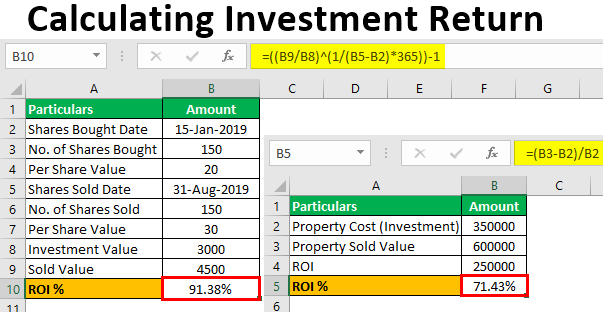

## Table of Contents

## What is cumulative return?

Cumulative return is the total amount of money you've made or lost from an investment over a period of time. It's like adding up all the gains and losses to see the overall performance. If you invest $100 and it grows to $110, your cumulative return is 10%.

This measure is useful for understanding how well your investment has done over time. It's different from annual returns because it looks at the total change, not just year by year. For example, if your investment goes up 5% one year and 10% the next, the cumulative return would show the combined effect of those changes.

## How is cumulative return different from simple return?

Cumulative return and simple return are two ways to measure how much money you've made or lost from an investment, but they look at things differently. Simple return, also called holding period return, looks at the gain or loss from the start to the end of a specific period. If you buy a stock for $100 and sell it for $110 after a year, the simple return is 10%. It's straightforward and only considers the start and end values.

Cumulative return, on the other hand, adds up all the gains and losses over multiple periods. It shows the total effect of your investment over time. If you keep that $100 investment and it grows to $110 after the first year, then to $120 the next year, the cumulative return would be 20%. This method is useful for understanding the overall performance of your investment, especially if you're looking at it over several years or if you're reinvesting your earnings.

## Why is cumulative return important in investment analysis?

Cumulative return is important in investment analysis because it shows you the total growth or loss of your investment over time. It's like looking at the big picture instead of just focusing on what happened in one year. This helps investors understand how well their money is doing overall. For example, if you invest in a stock and it goes up and down a lot but ends up higher than where you started, the cumulative return will show you that your investment has grown, even if there were some rough patches along the way.

Another reason cumulative return is useful is that it takes into account the effect of reinvesting earnings, like dividends. If you keep putting your profits back into the investment, the cumulative return will show how this can make your money grow even faster over time. This is especially helpful for long-term investors who want to see how their strategy is working over many years. By looking at the cumulative return, they can make better decisions about whether to keep their money in the same investment or try something different.

## What is the basic formula for calculating cumulative return?

The basic formula for calculating cumulative return is pretty simple. You take the final value of your investment and subtract the initial value from it. Then, you divide that number by the initial value and multiply by 100 to get a percentage. So, if you started with $100 and it grew to $120, you'd do this: (120 - 100) / 100 = 0.2. Multiply that by 100, and you get a 20% cumulative return.

This formula works well for showing the total growth or loss over time. It's different from looking at returns year by year because it adds up all the changes. If your investment goes up and down but ends up higher than where you started, the cumulative return will show you the overall gain. It's a great way to see how your money is doing over the long run.

## Can you explain cumulative return with an example?

Let's say you invested $1000 in a stock at the beginning of the year. After the first year, the stock value went up to $1100. That's a 10% increase. The next year, the stock value increased again, this time to $1200. That's another 9% increase from the $1100 it was worth at the end of the first year. To find the cumulative return, you don't just add the two yearly increases together. Instead, you look at how much the stock grew from the very beginning to the end.

So, you started with $1000 and ended up with $1200. To calculate the cumulative return, you subtract the initial value from the final value: $1200 - $1000 = $200. Then, you divide that by the initial value: $200 / $1000 = 0.2. Multiply by 100 to get a percentage, and you find that the cumulative return is 20%. This means your investment grew by 20% over the two years, which is different from adding the yearly returns of 10% and 9% because it takes into account the effect of the increase in the second year starting from a higher base.

## How does compounding affect cumulative return?

Compounding can make a big difference in your cumulative return. It's like [earning](/wiki/earning-announcement) money on the money you've already earned. Imagine you invest $100 and it grows by 10% in the first year, so you have $110. In the second year, if it grows by another 10%, you're not just earning 10% on your original $100, but on the new total of $110. This means you earn $11 instead of $10, making your investment worth $121 at the end of the second year. This process of earning on your earnings can really boost your cumulative return over time.

The effect of compounding becomes more powerful the longer you keep your money invested. If you keep reinvesting your earnings, each year's growth is based on a larger amount. Over many years, this can lead to a much higher cumulative return than if you just added up the yearly gains without compounding. For example, if you invest $1000 and it grows by 5% each year for 20 years, with compounding, your investment would be worth about $2653. Without compounding, it would only be $2000. That's a big difference, and it shows why compounding is so important for long-term investing.

## What are the common time periods used for calculating cumulative return?

People often look at cumulative return over different lengths of time, depending on what they want to know about their investment. A common time period is one year, which gives a quick snapshot of how the investment did over that time. Another popular choice is five years, which shows how the investment performed over a longer stretch. This can be helpful for seeing if the investment is doing well over time, not just in one year.

For long-term investors, looking at cumulative return over ten years or even longer can be useful. This helps them see how their money has grown over many years, which is important for retirement planning or other long-term goals. Some people might also look at cumulative return from the very start of their investment until now, no matter how long that is. This gives them the full picture of how their investment has done since they first put their money in.

## How can cumulative return be used to compare different investments?

Cumulative return is a great way to compare different investments because it shows you how much each one has grown over time. If you have two investments and one has a higher cumulative return than the other, it means the first one has done better overall. For example, if you invested $1000 in Stock A and it grew to $1200 over five years, and you invested $1000 in Stock B and it grew to $1100 over the same time, Stock A has a higher cumulative return. This tells you that Stock A has performed better than Stock B over those five years.

However, it's important to consider other factors too. Cumulative return doesn't tell you about the risk involved or how steady the growth was. An investment with a high cumulative return might have had a lot of ups and downs, while another with a lower cumulative return might have grown more steadily. So, when comparing investments using cumulative return, it's a good idea to also look at things like how risky the investment is and whether the returns were smooth or bumpy. This will give you a fuller picture of which investment might be better for you.

## What are the limitations of using cumulative return as a performance metric?

Using cumulative return to measure how well an investment is doing has some problems. One big issue is that it doesn't tell you about the risk involved. An investment might have a high cumulative return, but if it went up and down a lot along the way, it could be very risky. Some people might not want to take that risk, even if the overall return looks good. Also, cumulative return doesn't show you how steady the growth was. If an investment had a few really good years but a lot of bad ones, the cumulative return might still look okay, but it might not be a good choice for someone who wants steady growth.

Another limitation is that cumulative return doesn't take into account how long the money was invested. If you look at two investments and one has a higher cumulative return, but it took ten years to get there while the other took only five years, the one that took less time might actually be a better choice. Also, cumulative return can be affected a lot by when you start and end your calculation. If you start measuring right before a big jump in the investment's value, the cumulative return will look really good, but it might not show the whole story. So, while cumulative return is useful, it's important to look at other things too when deciding how well an investment has done.

## How does the frequency of compounding impact the cumulative return?

The more often your investment compounds, the higher your cumulative return can be. Compounding means earning interest on the money you've already earned. If you get interest every month instead of every year, you're earning on a bigger amount each time. It's like if you have a plant and you water it every day instead of once a week, it grows faster. So, if your investment compounds monthly instead of yearly, it can grow a lot more over time.

For example, let's say you invest $1000 and it grows by 5% each year. If it compounds yearly, after 10 years, your investment would be about $1629. But if it compounds monthly, after 10 years, it would be about $1647. That might not seem like a big difference, but over longer periods, like 20 or 30 years, the difference gets bigger. So, the frequency of compounding can really affect how much your investment grows, and it's something to think about when you're choosing where to put your money.

## Can you discuss the role of cumulative return in portfolio management?

Cumulative return is really important for people who manage their investments, like a portfolio. It helps them see how well their whole bunch of investments is doing over time. When you look at the cumulative return, you can tell if your portfolio is growing or if it's not doing so well. This helps you decide if you should keep your money where it is or if you should move it to different investments. It's like checking the score in a game to see if you're winning or losing.

Portfolio managers also use cumulative return to compare how their investments are doing against other options or against the market as a whole. If their portfolio's cumulative return is higher than the market's, it means they're doing a good job. But if it's lower, they might need to change their strategy. It's like a report card that shows if they're making smart choices with the money they're managing.

## What advanced statistical methods can be used to analyze cumulative return data?

One way to look at cumulative return data more deeply is by using something called regression analysis. This method helps you see how different things, like the overall market or interest rates, affect your investment's growth over time. It's like trying to figure out which parts of a recipe make a cake taste better. By using regression, you can find out if your investment's cumulative return is because of good choices you made or if it's just following the market's ups and downs.

Another useful method is time series analysis. This looks at how your investment's value changes over time, not just the total growth at the end. It can help you spot patterns, like if your investment goes up in the summer and down in the winter. Time series analysis can also help you predict what might happen next, so you can make better decisions about when to buy or sell. It's like looking at the weather forecast to decide if you need an umbrella.

Lastly, you can use something called Monte Carlo simulations. This method runs a lot of different scenarios to see how your investment might do in the future. It's like playing a game many times to see all the different ways it could end. Monte Carlo simulations help you understand the risks and possible rewards of your investment, so you can plan better for the future. By using these advanced methods, you can get a fuller picture of your cumulative return and make smarter choices with your money.

## What is Understanding Cumulative Returns?

Cumulative return represents the total gain or loss of an investment over a specified period, expressed as a percentage. This metric contrasts with annualized returns, which account for the time frame, providing an average yearly growth rate. Cumulative return simply aggregates the overall performance without regard to time, making it a valuable yet distinct measure for assessing investment performance.

Mathematically, cumulative return can be expressed as:

$$
\text{Cumulative Return} = \left( \frac{\text{Final Value} - \text{Initial Value}}{\text{Initial Value}} \right) \times 100
$$

Where "Final Value" is the investment value at the end of the period, and "Initial Value" is the starting value of the investment.

This metric is indispensable when comparing the total performance of various investments over identical or differing periods. It encapsulates not only capital gains but also accounts for dividends and interest earnings. By incorporating these elements, cumulative returns provide a comprehensive picture of an investment's overall performance.

However, caution must be taken when using cumulative returns for comparative analysis. Discrepancies in time frames across different investments can lead to distorted interpretations. For instance, two investments might yield the same cumulative return, but the one achieving it over a shorter period demonstrates superior annualized performance. Therefore, while cumulative returns furnish a holistic measure of investment growth, evaluating them alongside other metrics can yield more nuanced insights.

## How do you calculate cumulative returns?

To calculate cumulative returns, begin by identifying the original price of the asset and its current price. The cumulative return represents the total gain or loss of that asset over a specific period and is expressed as a percentage. The formula is straightforward:

$$
\text{Cumulative Return} (\%) = \left( \frac{\text{Current Price} - \text{Original Price}}{\text{Original Price}} \right) \times 100
$$

For example, consider an initial investment of $1,000 in a stock, which has now appreciated to $1,500. The cumulative return calculation would be as follows:

$$
\text{Cumulative Return} = \left( \frac{1500 - 1000}{1000} \right) \times 100 = 50\%
$$

This indicates a 50% increase in the value of the investment.

When calculating cumulative returns, it's important to consider dividends or interest payments, as these contribute to the overall return. A common approach is to use the adjusted closing price, which reflects dividends reinvested into the asset. This provides a more comprehensive picture by accounting for additional income generated over the investment period.

The method for calculating cumulative returns is versatile and can be applied to various asset classes, including stocks, bonds, and exchange-traded funds (ETFs). For assets that generate income, the returns should be adjusted to reflect reinvestments, which amplify the investment's performance over time. 

This calculation forms the bedrock for understanding how different investments perform, providing a simplified metric to compare multiple options without delving into the complexities of annualized returns or time-weighted figures. By maintaining consistency in incorporating all elements, such as income reinvestment, investors can accurately assess the cumulative gain or loss their investments have achieved.

## References & Further Reading

[1]: ["Advances in Financial Machine Learning"](https://www.amazon.com/Advances-Financial-Machine-Learning-Marcos/dp/1119482089) by Marcos Lopez de Prado

[2]: ["Evidence-Based Technical Analysis: Applying the Scientific Method and Statistical Inference to Trading Signals"](https://www.amazon.com/Evidence-Based-Technical-Analysis-Scientific-Statistical/dp/0470008741) by David Aronson

[3]: ["Machine Learning for Algorithmic Trading"](https://github.com/stefan-jansen/machine-learning-for-trading) by Stefan Jansen

[4]: ["Quantitative Trading: How to Build Your Own Algorithmic Trading Business"](https://www.amazon.com/Quantitative-Trading-Build-Algorithmic-Business/dp/1119800064) by Ernest P. Chan

[5]: ["Python for Finance: Analyze Big Financial Data"](https://books.google.com/books/about/Python_for_Finance.html?id=E93SBQAAQBAJ) by Yves Hilpisch

[6]: Grinold, R.C., & Kahn, R.N. (2000). ["Active Portfolio Management"](https://www.amazon.com/Active-Portfolio-Management-Quantitative-Controlling/dp/0070248826). McGraw-Hill Education.