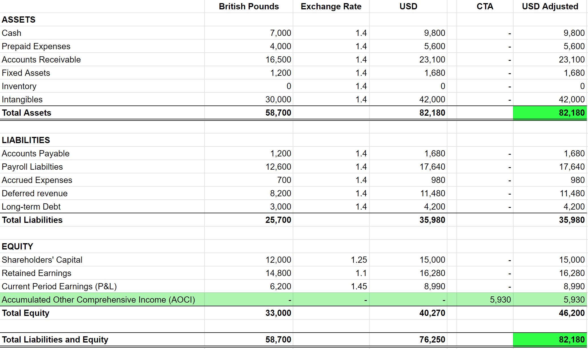

## Table of Contents

## What is a Cumulative Translation Adjustment (CTA)?

A Cumulative Translation Adjustment (CTA) is an entry in a company's financial statements that accounts for the changes in the value of foreign currency when converting a foreign subsidiary's financial statements into the parent company's reporting currency. This adjustment is necessary because exchange rates fluctuate over time, and these fluctuations can affect the reported value of the subsidiary's assets, liabilities, revenues, and expenses.

When a company has operations in different countries, it must translate the financial results of its foreign subsidiaries into its own reporting currency. The CTA represents the total gain or loss from these currency translations over time. It is recorded in the equity section of the parent company's balance sheet under "accumulated other comprehensive income," and it helps provide a more accurate picture of the company's financial health by accounting for the impact of currency fluctuations.

## Why is CTA important in accounting and finance?

CTA is important in accounting and finance because it helps companies show a true picture of their financial health when they have operations in different countries. When a company has a foreign subsidiary, it needs to convert that subsidiary's financial statements into its own reporting currency. But, since exchange rates change all the time, the value of the foreign currency can go up or down. The CTA helps account for these changes so that the parent company's financial statements are more accurate and fair.

Without the CTA, the financial statements might be misleading. For example, if the foreign currency gets weaker, the value of the subsidiary's assets would look smaller when converted back to the parent company's currency. This could make the company look less valuable than it really is. By using the CTA, the company can show the total effect of these currency changes over time, which gives a clearer view of its overall financial position. This is important for investors, creditors, and other people who use the financial statements to make decisions.

## How does CTA affect a company's financial statements?

The Cumulative Translation Adjustment (CTA) is a number that shows up on a company's financial statements when it has businesses in other countries. It helps to keep the company's money numbers correct when the value of different countries' money changes. When a company changes its foreign business's money numbers into its own country's money, the CTA makes sure that any changes in the value of the foreign money are shown properly. This helps the company's big financial picture stay accurate and fair.

Without the CTA, the company's financial statements might not show the real value of its foreign businesses. For example, if the foreign money becomes worth less, the value of the foreign business's things (like buildings or machines) would look smaller when changed to the company's home money. This could make the company seem less valuable than it really is. By using the CTA, the company can show how much the value of the foreign money has changed over time, which helps everyone see a clearer picture of the company's money situation.

## What is the difference between CTA and foreign currency translation?

CTA, or Cumulative Translation Adjustment, is a specific number on a company's financial statements that shows the total effect of changing money values over time when a company has businesses in other countries. It's like a running total that gets bigger or smaller as the value of foreign money goes up or down. This number helps to make sure that the company's big financial picture is accurate and fair by showing how much the value of foreign money has changed.

Foreign currency translation, on the other hand, is the process of changing all the money numbers from a foreign business into the company's home money. This happens every time the company needs to show its financial statements. It's like converting prices from one country's money to another. The CTA is just one part of this process, showing the total change in value over time, while foreign currency translation is the whole act of changing the numbers.

## Can you explain the process of calculating CTA?

Calculating the Cumulative Translation Adjustment (CTA) involves looking at how the value of foreign money changes when you convert a foreign business's financial numbers into your own country's money. When you do this conversion, you use the exchange rate, which is how much one country's money is worth in another country's money. If the exchange rate changes, the value of the foreign business's things, like buildings or machines, will also change when you convert them. To find the CTA, you need to figure out the difference between the new value of these things after conversion and their old value before the exchange rate changed.

Let's say you have a business in another country, and you need to show its financial numbers in your home country's money. At the end of the year, you use the current exchange rate to convert all the numbers. If the exchange rate has changed since the last time you did this, the new converted numbers will be different. The CTA is the total of all these differences over time. You add up all the changes in value caused by the exchange rate changes, and that total becomes the CTA. This number goes on your financial statements to show how much the value of foreign money has changed and affected your business's overall value.

## What are the common methods used for foreign currency translation that lead to CTA?

There are two main ways to change foreign money numbers into your own country's money: the current rate method and the temporal method. The current rate method is the most common one used. With this method, you use the exchange rate on the day you are making the financial statements to convert all the foreign money numbers. This includes everything like buildings, machines, money the company owes, and money the company makes. If the exchange rate changes a lot, the value of these things can change a lot too, and that's when you get the CTA. The CTA is the total of all these changes over time.

The temporal method is another way to do the conversion, but it's not used as much. With this method, you use different exchange rates for different things. For example, you might use the exchange rate from when you bought a building to convert its value, but use the current exchange rate to convert the money the company makes. This method can also lead to a CTA, but it's more complicated because you're using different rates for different things. Both methods are important because they help make sure the company's financial statements are accurate and fair, even when the value of foreign money changes.

## How does CTA impact a company's equity?

The Cumulative Translation Adjustment (CTA) shows up in a company's financial statements when it has businesses in other countries. It's a number that helps keep the company's money numbers correct when the value of different countries' money changes. When a company changes its foreign business's money numbers into its own country's money, the CTA makes sure that any changes in the value of the foreign money are shown properly. This CTA number goes into the part of the financial statements called "equity," under something called "accumulated other comprehensive income." This helps show how much the value of the foreign money has changed and affected the company's overall value.

When the CTA is added to or taken away from the equity section, it can make the company's total equity go up or down. If the foreign money gets stronger, the CTA might make the equity go up because the value of the foreign business's things, like buildings or machines, will look bigger when converted back to the company's home money. But if the foreign money gets weaker, the CTA might make the equity go down because those things will look smaller. This way, the CTA helps everyone see a clearer picture of the company's money situation, which is important for investors and other people who use the financial statements to make decisions.

## What are the tax implications of CTA?

When a company has businesses in other countries, it needs to change the foreign money numbers into its own country's money. This process can lead to something called Cumulative Translation Adjustment (CTA). The CTA shows up on the company's financial statements and can affect how much tax the company has to pay. In many countries, the CTA itself is not taxed right away. It's seen as a part of the company's overall money situation and is only taxed when the company brings the money back home or sells the foreign business.

The tax rules can be different in different countries. In the United States, for example, the CTA is part of "other comprehensive income" and is not taxed until it's realized, which means it's not taxed until the company does something with the money, like bringing it back to the U.S. or selling the foreign business. This can help the company plan its taxes better because it knows it won't have to pay tax on the CTA right away. But, it's important for companies to keep up with the tax laws in their own country and in the countries where they have businesses, because these laws can change and affect how much tax they have to pay on the CTA.

## How do different accounting standards (like GAAP and IFRS) treat CTA?

When companies have businesses in other countries, they need to change the foreign money numbers into their own country's money. This can lead to something called Cumulative Translation Adjustment (CTA). Different countries use different rules for how to show this CTA on their financial statements. In the United States, they use rules called Generally Accepted Accounting Principles (GAAP). Under GAAP, the CTA is part of "accumulated other comprehensive income" and shows up in the equity section of the financial statements. This means it's not counted as part of the company's regular money-making activities, but it still affects the overall value of the company.

In many other countries, they use rules called International Financial Reporting Standards (IFRS). Under IFRS, the CTA is also part of "other comprehensive income" and goes into the equity section of the financial statements, just like under GAAP. But, there can be small differences in how they handle the details. For example, IFRS might allow more choices in how to change the foreign money numbers, which can affect the CTA. Both GAAP and IFRS want to make sure the company's financial statements are accurate and fair, but they might use slightly different ways to do it.

## Can you provide an example of how CTA is reported in financial statements?

Imagine a company called "Global Toys" that has a business in Japan. At the end of the year, Global Toys needs to change the money numbers from its Japanese business into U.S. dollars to show on its financial statements. Let's say the Japanese yen got weaker compared to the U.S. dollar this year. When Global Toys converts the value of its buildings and machines in Japan into U.S. dollars, those things will look less valuable than they did last year. The difference in value because of the change in the exchange rate is called the Cumulative Translation Adjustment (CTA).

Global Toys will show this CTA on its financial statements in the equity section, under "accumulated other comprehensive income." If the CTA is a loss because the yen got weaker, it will make the equity section smaller. For example, if the CTA loss is $100,000, Global Toys will subtract $100,000 from its equity. This helps everyone see a clearer picture of how the change in the value of the yen affected Global Toys' overall value. By showing the CTA, Global Toys makes sure its financial statements are accurate and fair, even when the value of foreign money changes.

## What strategies can companies use to manage or minimize the impact of CTA?

Companies can use a few different strategies to manage or minimize the impact of CTA. One way is to use something called hedging. Hedging is like making a bet that the value of the foreign money will change in a certain way. By doing this, the company can protect itself from big changes in the exchange rate. For example, if a company thinks the foreign money will get weaker, it can use hedging to make sure it doesn't lose too much money when it converts the foreign money numbers into its own country's money.

Another way to manage CTA is to match the money the company makes with the money it spends in the same country. This is called currency matching. If a company can make sure it's using the same kind of money for both its income and its expenses, it won't have to change as much money from one country to another. This can help reduce the effect of the CTA because there will be fewer changes in the exchange rate to worry about. By using these strategies, companies can make their financial statements more stable and easier to understand, even when the value of foreign money changes.

## How does CTA influence multinational corporations' financial planning and risk management?

CTA, or Cumulative Translation Adjustment, is an important number for multinational corporations because it shows how changes in foreign money values can affect their overall financial health. When a company has businesses in different countries, it needs to change the foreign money numbers into its own country's money. If the value of the foreign money goes up or down, this can make the company's buildings, machines, and other things look more or less valuable. The CTA helps the company show this change on its financial statements, which is important for planning and managing risks. By knowing how much the CTA can change, the company can make better plans for the future and take steps to protect itself from big swings in the value of foreign money.

To manage the risks that come with CTA, multinational corporations often use strategies like hedging and currency matching. Hedging is like making a bet on how the foreign money will change in value. If the company thinks the foreign money will get weaker, it can use hedging to protect itself from losing too much money when it converts the foreign money numbers. Currency matching means trying to make and spend money in the same country, so there's less need to convert money from one country to another. By using these strategies, companies can make their financial statements more stable and easier to understand, even when the value of foreign money changes a lot. This helps them plan better and manage the risks that come with doing business in different countries.

## What is the significance of CTA in financial reporting?

Accurate reflection of cumulative translation adjustment (CTA) is crucial for companies engaged in global trade, as it ensures transparent financial statements. CTA is a key metric that helps differentiate between a company’s operational performance and the gains or losses arising from currency exchange rate fluctuations. This distinction is vital for providing stakeholders with a transparent view of the financial health of multinational enterprises.

Financial statements that accurately incorporate CTA demonstrate a company’s vigilance in addressing currency risks, offering clarity on the financial impact of exchange rate movements on its international operations. By isolating currency-related gains or losses, stakeholders are better equipped to assess the company’s pure operational performance, devoid of exchange rate noise. The separation is achieved by adhering to generally accepted accounting principles (GAAP) or International Financial Reporting Standards (IFRS), which guide how CTA is computed and disclosed.

For instance, consider a company with significant operations in countries with volatile currencies. Without adjustments like CTA, its financial outcomes might appear erratic, misleading investors about its actual performance. CTA provides a comprehensive view by adjusting for such volatility, giving investors confidence in the published figures.

The role of CTA extends into risk management and strategic decision-making processes for multinational corporations. Identifying and quantifying currency exposure through CTA enables companies to develop informed hedging strategies and align their financial operations with their strategic objectives. It becomes an integral part of financial planning, as understanding the impact of currency fluctuations can influence investment decisions, pricing strategies, and capital allocation.

Potential investors and financial analysts also rely on CTA to assess a company’s currency exposure and operational stability. A company with a high CTA might signal substantial foreign currency risks, prompting a deeper analysis of its risk management practices. Conversely, effective CTA management can be a testament to robust financial governance, potentially enhancing a company's attractiveness to investors.

In practical application, consider the impact of exchange rate changes on a foreign subsidiary’s net assets. If a company reports in USD but operates a subsidiary in the Eurozone, any fluctuations in the EUR/USD exchange rate will affect the translated value of the subsidiary’s assets and liabilities. CTA serves as the balancing figure in the consolidated financial statements, ensuring accurate presentation of the parent company's equity.

For computation, CTA can be expressed through the formula:

$$
\text{CTA} = \sum (\text{Current Rate} - \text{Historical Rate}) \times \text{Foreign Entity Net Assets}
$$

This formula highlights how exchange rate differences are applied to the net assets of foreign entities, subsequently impacting the cumulative translation adjustment in the company's consolidated balance sheet.

In summary, CTA is an indispensable component of financial reporting for global companies, providing transparency and insight into the operational and financial dynamics influenced by currency exchange movements. It empowers businesses and investors alike to make informed decisions in a complex global market landscape.

## References & Further Reading

[1]: ["Advances in Financial Machine Learning"](https://www.amazon.com/Advances-Financial-Machine-Learning-Marcos/dp/1119482089) by Marcos Lopez de Prado

[2]: ["Machine Learning for Algorithmic Trading"](https://github.com/stefan-jansen/machine-learning-for-trading) by Stefan Jansen

[3]: ["Quantitative Trading: How to Build Your Own Algorithmic Trading Business"](https://www.amazon.com/Quantitative-Trading-Build-Algorithmic-Business/dp/1119800064) by Ernest P. Chan

[4]: Shapiro, Alan C., & Moles, Peter. (2014). ["International Financial Management."](https://www.amazon.com/International-Financial-Management-Peter-Shapiro/dp/1118929322) Wiley.

[5]: Dodd, Nigel, & Pepper, Gareth. (2008). ["Foreign Exchange: A Practical Guide to the FX Markets."](https://archive.org/details/foreignexchangep0000weit) Wiley.