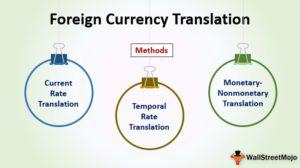

The multifaceted world of foreign exchange (Forex) offers numerous opportunities and challenges, especially in financial reporting and trading. In the context of international business, understanding the cumulative translation adjustment (CTA) is crucial as it reflects the impact of exchange rate fluctuations on financial statements. CTA is instrumental in ensuring that financial statements accurately represent the financial health of companies with international operations. By differentiating between operational gains or losses and those arising from currency translation, CTA provides businesses with a clearer picture of their financial performance.

Furthermore, the rapid evolution of algorithmic trading has significantly transformed Forex markets. This rise of algorithmic trading introduces new mechanisms for managing Forex risks, emphasizing speed, accuracy, and efficiency. As Forex operates continuously, the use of computer algorithms in trading strategies ensures that trades are executed optimally across global markets, which are known for their significant liquidity and 24-hour dynamics. For investors, accountants, and traders, understanding both CTA and algorithmic trading is essential in order to navigate the complexities of international finance effectively. This article will explore these concepts in detail, providing valuable insights into the intertwining roles of CTA and algorithmic trading in today's global market dynamics.



## Table of Contents

## Understanding Cumulative Translation Adjustment (CTA)

Cumulative Translation Adjustment (CTA) is a crucial component in the financial reporting of multinational corporations. It reflects the impact of changes in foreign currency exchange rates on an entity's consolidated financial statements. Specifically, CTA measures the differences arising from translating foreign subsidiaries' financial statements from their functional currencies to the reporting currency of the parent company.

CTA is recorded under the "accumulated other comprehensive income" section of the balance sheet. This placement distinguishes it from operational gains and losses, which appear on the income statement, thereby helping investors and analysts differentiate between the effects of operational activities and those resulting from currency translation fluctuations.

The calculation of CTA involves converting the financial statements of foreign operations into the reporting currency using the exchange rates at the balance sheet date. The basics of this process involve converting assets and liabilities at the current exchange rate, income and expenses at the average exchange rate for the period, and equity components at historical exchange rates. This procedure ensures that the consolidated financial report accurately represents the foreign currency exchange activity's impact.

The following Python code snippet demonstrates the basic concept of calculating CTA for balance sheet items:

```python
def calculate_cta(foreign_currency_value, current_exchange_rate, historical_exchange_rate):
    translated_value_current = foreign_currency_value * current_exchange_rate
    translated_value_historical = foreign_currency_value * historical_exchange_rate
    cta = translated_value_current - translated_value_historical
    return cta

# Example usage:
foreign_currency_value = 1000000  # Value in foreign currency
current_exchange_rate = 1.2       # Current exchange rate
historical_exchange_rate = 1.1    # Historical exchange rate

cta_value = calculate_cta(foreign_currency_value, current_exchange_rate, historical_exchange_rate)
print(f"Cumulative Translation Adjustment (CTA): {cta_value}")
```

Key factors influencing [CTA](/wiki/cta-strategy) include currency value fluctuations and the strategic choice of a functional currency for foreign operations. Fluctuating exchange rates can lead to [volatility](/wiki/volatility-trading-strategies) in CTA, impacting reported equity and investor perceptions. The choice of functional currency—generally determined by the primary economic environment in which subsidiary entities operate—also plays a critical role, as it dictates the base currency for translation.

Understanding CTA is vital for stakeholders because it ensures transparency in financial reporting practices, allowing for a clearer assessment of a multinational's financial position and performance without the distorting effects of currency volatility.

## Significance of CTA in Financial Reporting

Accurate reflection of cumulative translation adjustment (CTA) is crucial for companies engaged in global trade, as it ensures transparent financial statements. CTA is a key metric that helps differentiate between a company’s operational performance and the gains or losses arising from currency exchange rate fluctuations. This distinction is vital for providing stakeholders with a transparent view of the financial health of multinational enterprises.

Financial statements that accurately incorporate CTA demonstrate a company’s vigilance in addressing currency risks, offering clarity on the financial impact of exchange rate movements on its international operations. By isolating currency-related gains or losses, stakeholders are better equipped to assess the company’s pure operational performance, devoid of exchange rate noise. The separation is achieved by adhering to generally accepted accounting principles (GAAP) or International Financial Reporting Standards (IFRS), which guide how CTA is computed and disclosed.

For instance, consider a company with significant operations in countries with volatile currencies. Without adjustments like CTA, its financial outcomes might appear erratic, misleading investors about its actual performance. CTA provides a comprehensive view by adjusting for such volatility, giving investors confidence in the published figures.

The role of CTA extends into risk management and strategic decision-making processes for multinational corporations. Identifying and quantifying currency exposure through CTA enables companies to develop informed hedging strategies and align their financial operations with their strategic objectives. It becomes an integral part of financial planning, as understanding the impact of currency fluctuations can influence investment decisions, pricing strategies, and capital allocation.

Potential investors and financial analysts also rely on CTA to assess a company’s currency exposure and operational stability. A company with a high CTA might signal substantial foreign currency risks, prompting a deeper analysis of its risk management practices. Conversely, effective CTA management can be a testament to robust financial governance, potentially enhancing a company's attractiveness to investors.

In practical application, consider the impact of exchange rate changes on a foreign subsidiary’s net assets. If a company reports in USD but operates a subsidiary in the Eurozone, any fluctuations in the EUR/USD exchange rate will affect the translated value of the subsidiary’s assets and liabilities. CTA serves as the balancing figure in the consolidated financial statements, ensuring accurate presentation of the parent company's equity.

For computation, CTA can be expressed through the formula:

$$
\text{CTA} = \sum (\text{Current Rate} - \text{Historical Rate}) \times \text{Foreign Entity Net Assets}
$$

This formula highlights how exchange rate differences are applied to the net assets of foreign entities, subsequently impacting the cumulative translation adjustment in the company's consolidated balance sheet.

In summary, CTA is an indispensable component of financial reporting for global companies, providing transparency and insight into the operational and financial dynamics influenced by currency exchange movements. It empowers businesses and investors alike to make informed decisions in a complex global market landscape.

## Algorithmic Trading in Forex Markets

Algorithmic trading in Forex markets involves using computer algorithms to automate trading strategies and execute trades with precision and speed. This method capitalizes on the continuous nature and [liquidity](/wiki/liquidity-risk-premium) of Forex markets, enabling traders to react swiftly to market changes and leverage minute price differences effectively. The primary advantages of [algorithmic trading](/wiki/algorithmic-trading) include enhanced speed, accuracy, and efficiency, substantially minimizing human error.

In particular, Forex markets benefit from algorithmic trading due to their operational round-the-clock dynamics. Trades can be executed at any moment, without the constraints of time zones, ensuring that trading strategies can be applied regardless of the hour. The significant liquidity available in Forex markets allows algorithmic trading systems to handle large volumes of trades without causing substantial price fluctuations, optimizing entry and [exit](/wiki/exit-strategy) points.

Several strategies are commonly employed in algorithmic trading. Trend following is a sustainable approach where algorithms are designed to identify and capitalize on market trends. This often involves the analysis of historical data to predict future price movements, allowing traders to ride trends until a reversal is detected. Arbitrage opportunities, though fleeting, are another strategic aspect where algorithms exploit price differentials across different markets or currency pairs to secure risk-free profits. High-frequency trading ([HFT](/wiki/high-frequency-trading-strategies)), which involves executing thousands of trades in a fraction of a second, can also be an effective strategy particularly in highly liquid Forex markets.

The use of advanced data analytics and [machine learning](/wiki/machine-learning) algorithms further enhances the functionality and effectiveness of algorithmic trading. Machine learning algorithms can analyze vast datasets to identify patterns or correlations in market movements that may not be immediately apparent to human traders. Additionally, these algorithms can learn and adapt over time, refining their strategies based on the success or failure of past trades.

Python, with its robust libraries such as Pandas for data manipulation, NumPy for numerical calculations, and scikit-learn for machine learning, is a favored language for implementing algorithmic trading systems. Below is an illustrative example of a simple moving average crossover strategy using Python:

```python
import pandas as pd
import numpy as np

# Load forex data
forex_data = pd.read_csv('forex_data.csv')

# Calculate moving averages
forex_data['SMA_50'] = forex_data['Close'].rolling(window=50).mean()
forex_data['SMA_200'] = forex_data['Close'].rolling(window=200).mean()

# Define trading signals
forex_data['Signal'] = 0
forex_data['Signal'][50:] = np.where(forex_data['SMA_50'][50:] > forex_data['SMA_200'][50:], 1, 0)   

# Generate trading orders
forex_data['Position'] = forex_data['Signal'].diff()

print(forex_data[['Date', 'Close', 'Signal', 'Position']].tail())
```

In this example, signals are generated when a shorter-term moving average (SMA_50) crosses a longer-term moving average (SMA_200). This forms a foundation for executing trades based on predicted market movements derived from historical price data.

Incorporating algorithms into Forex strategies not only streamlines the trading process but also enhances its capacity to adapt to ever-changing market conditions, making it a crucial component in modern trading environments.

## Interrelation Between CTA and Algo Trading

The interplay between Cumulative Translation Adjustment (CTA) and algorithmic trading in the Forex market plays a crucial role in managing foreign exchange risks. CTA adjustments often have a direct impact on the algorithms employed in trading strategies, particularly those focused on managing currency exposures. By observing these adjustments, algorithms can be programmed to ensure that trading activities are in sync with financial reporting standards. This alignment is essential for maintaining consistency and transparency in financial operations.

Real-time Forex data, which is integral to algorithmic trading, offers critical insights that can enhance CTA management. For instance, by analyzing real-time currency fluctuations, trading systems can anticipate potential changes in CTA and adjust their strategies accordingly. This proactive approach allows companies to maintain stable financial reports by hedging against possible CTA impacts.

Automated trading systems serve as a valuable tool for companies looking to mitigate the adverse effects of CTA. These systems can execute transactions at a speed and efficiency unattainable by manual trading, thus providing a solid defense against the volatility of currency markets. By doing so, they help stabilize financial reports, ensuring that the impacts of currency exchanges are accurately reflected and managed.

Moreover, by integrating CTA considerations into their algorithms, companies can develop more robust trading strategies that account for financial reporting variables. This holistic approach not only aids in managing foreign exchange risk but also supports the strategic financial planning of multinational entities. The use of Python or other programming languages can be instrumental in crafting such sophisticated algorithms, allowing for real-time data processing and dynamic adaptation to market conditions. 

For example, a simple Python script that demonstrates how real-time data can help manage CTA might look like this:

```python
import requests

def fetch_forex_data(base_currency, target_currency):
    # Fetching real-time forex rates
    url = f"https://api.exchangeratesapi.io/latest?base={base_currency}"
    response = requests.get(url)
    data = response.json()
    return data['rates'][target_currency]

def adjust_trading_strategy(cta_value, forex_rate, threshold=0.05):
    # Adjusting strategy based on CTA and forex rate
    if abs(cta_value - forex_rate) > threshold:
        return "Adjust trade strategy"
    return "Maintain current strategy"

base_currency = "USD"
target_currency = "EUR"
cta_value = 1.18  # Hypothetical CTA value

forex_rate = fetch_forex_data(base_currency, target_currency)
strategy_advice = adjust_trading_strategy(cta_value, forex_rate)

print(f"Forex Rate: {forex_rate}, Strategy Advice: {strategy_advice}")
```

This code highlights how automated systems can leverage real-time foreign exchange rates to make informed trading decisions based on CTA values. Such mechanisms illustrate the sophisticated yet essential nature of integrating CTA with algorithmic trading to proficiently manage foreign exchange risks in an increasingly globalized business environment.

## Challenges and Future Directions

Algorithmic trading, while highly advantageous, presents several challenges that necessitate careful management. One significant challenge is the requirement for continuous monitoring of trading systems to ensure optimal performance and adherence to risk management protocols. The rapid pace of Forex markets, alongside the complexity of implemented algorithms, demands solutions that can cope with high-frequency data and potential algorithmic errors. Additionally, regulatory concerns are becoming increasingly prominent as authorities strive to keep pace with technological advancements. These regulations aim to ensure market integrity and protect against systemic risks posed by high-frequency trading techniques.

For the cumulative translation adjustment (CTA), accuracy remains a persistent challenge. The volatile nature of exchange rates drives the need for precise calculations, further complicated by the multi-faceted operations of international businesses. Calculating CTA accurately involves constantly updated exchange rate data to reflect real-time values accurately, a task compounded by the diversity of currencies and international financial rules.

Looking to the future, enhancing technological integration and regulatory standards could address several current pain points in Forex trading and financial reporting. The adoption of blockchain technology offers promising prospects, potentially improving transparency and reducing instances of fraud through immutable transaction records. Meanwhile, [artificial intelligence](/wiki/ai-artificial-intelligence) can streamline trading operations by identifying patterns and optimizing decision-making processes. 

The continuous development in data analytics and machine learning holds promise for refining the precision of algorithmic trading systems. Advanced analytics can improve the predictive capabilities of trading algorithms, while machine learning models can adapt to new market conditions rapidly, thereby enhancing trade execution accuracy and efficiency. Furthermore, these technologies can improve CTA accuracy by providing real-time data analysis and predictive exchange rate modeling, ensuring financial statements better reflect economic realities.

Overall, staying ahead in the rapidly evolving Forex landscape requires leveraging technological advancements and adhering to robust regulatory frameworks. Embracing these innovations can position businesses and traders advantageously in the global market, facilitating effective foreign exchange risk management and accurate financial reporting.

## Conclusion

The intertwined roles of cumulative translation adjustment (CTA) and algorithmic trading highlight the complexity of managing international financial activities. Understanding and effectively using CTA enhances transparency and builds investor confidence in financial reporting. CTA allows investors and stakeholders to distinguish between operational performance and fluctuations arising from currency translation, providing a more comprehensive view of a company's financial health.

Algorithmic trading, on the other hand, offers innovative solutions for efficiently navigating the foreign exchange (Forex) market's volatility. By utilizing complex algorithms, traders can execute strategies involving [trend following](/wiki/trend-following), [arbitrage](/wiki/arbitrage), and high-frequency trading with greater precision and reduced errors. The inclusion of advanced data analytics and machine learning models enhances these trading strategies further, making them more responsive to market changes and beneficial for managing risks.

Aligning financial reporting with advanced trading strategies enables companies to manage foreign exchange risks more effectively. By integrating real-time Forex data in algorithmic trading systems, firms can make informed decisions about hedging against potential adverse impacts on CTA. This alignment ensures that trading activities conform to financial reporting standards while optimizing for the best possible financial outcomes.

Looking forward, promising developments in technology and regulation are expected to significantly reshape the Forex landscape. Advances in blockchain and artificial intelligence have the potential to streamline trading and accounting operations, while improvements in data analytics and machine learning can enhance the precision of algorithmic trading and the accuracy of CTA. As these innovations evolve, they may provide even more efficient and transparent management of international financial activities, benefiting companies and investors alike.

## References & Further Reading

[1]: ["Advances in Financial Machine Learning"](https://www.amazon.com/Advances-Financial-Machine-Learning-Marcos/dp/1119482089) by Marcos Lopez de Prado

[2]: ["Machine Learning for Algorithmic Trading"](https://github.com/stefan-jansen/machine-learning-for-trading) by Stefan Jansen

[3]: ["Quantitative Trading: How to Build Your Own Algorithmic Trading Business"](https://www.amazon.com/Quantitative-Trading-Build-Algorithmic-Business/dp/1119800064) by Ernest P. Chan

[4]: Shapiro, Alan C., & Moles, Peter. (2014). ["International Financial Management."](https://www.amazon.com/International-Financial-Management-Peter-Shapiro/dp/1118929322) Wiley.

[5]: Dodd, Nigel, & Pepper, Gareth. (2008). ["Foreign Exchange: A Practical Guide to the FX Markets."](https://archive.org/details/foreignexchangep0000weit) Wiley.