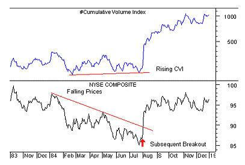

Financial indicators are essential tools in algorithmic trading, providing quantitative data that guides traders' decisions and helps predict market movements. These indicators, derived from historical price and volume data, facilitate automated trading strategies by offering insights into trends, volatility, and potential price shifts. Algorithmic trading, which relies heavily on these indicators, has become a cornerstone of modern financial markets due to its efficiency and ability to capitalize on fleeting opportunities.

The Cumulative Volume Index (CVI) is a pivotal volume-based indicator widely used in algorithmic trading. It measures the cumulative flow of market volume, thus providing an aggregated view of the buying and selling pressure within a market over time. By considering volume changes, the CVI helps traders understand the underlying sentiment and momentum, making it a valuable tool for crafting trading strategies.



This article aims to provide a comprehensive understanding of the CVI, encompassing its calculation methods and applications in trading. We will explore its historical context, compare it with other volume indicators, and illustrate its utility in gauging market trends. Understanding how to calculate the CVI can significantly enhance a trader's ability to interpret market data and anticipate future movements. Through detailed breakdowns and practical examples, the article will guide readers on incorporating the CVI into algorithmic trading frameworks effectively.

The CVI's importance in trading strategies stems from its ability to aggregate volume data over time, thus acting as a barometer for market pressure. By reflecting cumulative buying or selling volume, it offers traders a nuanced interpretation of market conditions, aiding in timely decision-making and strategy adjustments. Being able to predict market direction and investor sentiment through the CVI can enhance trading outcomes, making it a strategic asset in the arsenal of any algorithmic trader.

The goal of this article is to equip traders with the necessary knowledge and skills to use the Cumulative Volume Index effectively. By covering the CVI's components, calculation methods, and practical applications, we will ensure that traders can leverage this indicator to improve their trading strategies. Recognizing the continuous need for learning and adaptation in trading, we encourage readers to integrate the insights and techniques discussed herein within their algorithmic trading systems.

## Table of Contents

## Understanding the Cumulative Volume Index (CVI)

The Cumulative Volume Index (CVI) is a technical indicator designed to measure the cumulative flow of trading volume in a stock market over time. It reflects the net accumulation or distribution of volume, providing insights into market trends and investor behavior. The primary purpose of the CVI is to discern market sentiment by analyzing buying and selling pressure. It is regarded as a volume-based indicator that helps traders identify whether a market is experiencing buying pressure (accumulation) or selling pressure (distribution).

Historically, the concept of cumulative [volume](/wiki/volume-trading-strategy) as an analytical tool has its roots in the early studies of trading volume and its impact on price movements. The CVI specifically emerged as a means to provide a broader understanding of market movements by concentrating on volume flows, distinguishing itself from price-based indicators which focus solely on price changes.

Compared to other volume indicators such as the On-Balance Volume (OBV) and the Accumulation/Distribution line, the CVI offers a unique perspective. The OBV considers whether prices close higher or lower than the previous day's close, attributing volume accordingly, whereas the CVI aggregates volume in a straightforward cumulative manner without weighting it by price changes. This makes the CVI a purer reflection of volume movements, detached from price fluctuations. The Accumulation/Distribution line, on the other hand, combines price and volume but focuses more on the relationship between the day’s close and the range of prices throughout the day.

The utility of the CVI in gauging market trends lies in its ability to signal potential trend reversals or confirm existing trends through volume analysis. When the CVI is rising, it indicates strong buying pressure, suggesting an uptrend. Conversely, a declining CVI suggests selling pressure and the possibility of a downtrend. By examining the trend in accumulated volume data, traders can infer investor sentiment, as sustained increases or decreases in cumulative volume reflect changing market outlooks.

The significance of cumulative volume in market analysis cannot be overstated, as it helps traders and analysts understand whether price movements are supported by corresponding changes in volume. High cumulative volume during price increases indicates strong market conviction, while low cumulative volume suggests a lackluster trend, potentially preceding a reversal. Overall, the CVI can provide crucial context for technical analysis, adding a volumetric dimension to price observations.

Through its distinct focus on volume, the CVI serves as a valuable tool for traders seeking to enhance their market analysis process by incorporating insights derived from volume trends.

## Components and Calculation of CVI

The Cumulative Volume Index (CVI) is a vital indicator in financial markets that helps to gauge market sentiment by analyzing the cumulative total of volume changes. To calculate the CVI, it is essential to understand its key components and the sequential steps involved in its computation.

### Key Components for CVI Calculation

1. **Daily Volume (V_t)**: The volume of traded shares on a particular day.
2. **Advance/Decline Ratio**: This ratio is calculated using the difference between advancing stocks and declining stocks from the previous day's close.
3. **Previous CVI Value (CVI_t-1)**: The CVI value from the prior trading day, which serves as a foundation for calculating the current CVI.

### Step-by-Step Guide to Calculating the CVI Manually

To compute the CVI, the following formula is utilized:

$$
\text{CVI}_t = \text{CVI}_{t-1} + V_t \cdot \left( \frac{\text{Advancing Issues} - \text{Declining Issues}}{\text{Total Issues}} \right)
$$

**Step 1**: Identify the number of advancing and declining stocks for the current day along with the total volume of the market. 

**Step 2**: Calculate the Advance/Decline ratio: 
$$
\text{Advance/Decline Ratio} = \frac{\text{Advancing Issues} - \text{Declining Issues}}{\text{Total Issues}}
$$

**Step 3**: Compute the CVI for the current day using the formula provided above.

### Formulae Involved in CVI Calculation

The primary formula requires daily market volume and the difference in advancing and declining issues. This provides insight into whether the market sentiment is bullish (more advancing issues) or bearish (more declining issues). The cumulative aspect allows the CVI to reflect both short-term trends and long-term sentiment shifts.

### Understanding Incremental Changes

The incremental changes in daily volumes directly impact the CVI value. On days where advancing stocks outnumber declining ones, the CVI will increase, indicating bullish overall market sentiment. Conversely, a decrease in CVI would indicate a bearish trend. Instantaneous fluctuations provide a dynamic measure of market activity and sentiment, influential in decision-making for traders.

### Example Calculation

Consider a day where there are 800 advancing issues, 400 declining issues, and the total volume traded is 1,500,000 shares. Assume the previous day's CVI was 10,000.

1. Calculate the Advance/Decline Ratio:
   \[ \frac{800 - 400}{1200} = \frac{400}{1200} = \frac{1}{3}
$$

2. Calculate current day's CVI:
   \[ \text{CVI}_t = 10,000 + 1,500,000 \times \frac{1}{3}
$$
   \[ \text{CVI}_t = 10,000 + 500,000
$$
   \[ \text{CVI}_t = 510,000
$$

This value expresses the cumulative sentiment as bullish due to the increase. Traders can thus infer potential upward trends in the broader market and adjust their strategies accordingly.

## Implementing CVI in Algorithmic Trading

The integration of the Cumulative Volume Index (CVI) into [algorithmic trading](/wiki/algorithmic-trading) strategies is a sophisticated yet effective approach to enhancing market analysis and decision-making processes. The CVI serves as a critical tool for predicting market moves by providing insights into investor sentiment and potential market direction. It measures the cumulative total of a security's trading volume based on the advancing or declining condition of the market, making it particularly useful for identifying bullish or bearish trends.

**Role of CVI in Predicting Market Moves:**

The CVI provides a proxy for market sentiment by indicating whether more volume is directed towards advancing or declining stocks. In general, an increasing CVI suggests a strengthening market, whereas a decreasing CVI indicates weakening conditions. Traders often monitor these movements to anticipate potential reversals or confirmations of ongoing trends.

**Steps to Incorporate CVI within Trading Algorithms and Software:**

1. **Data Collection:** Gather historical price and volume data for the assets of interest. This data is crucial for calculating the CVI and should be updated in real-time for dynamic trading environments.

2. **CVI Calculation:**
   - Identify advancing and declining stocks, A and D, respectively.
   - Calculate the daily change in CVI using the formula: $\Delta \text{CVI} = \text{Volume}_A - \text{Volume}_D$,
     where $\text{Volume}_A$ is the total volume of advancing stocks and $\text{Volume}_D$ is the total volume of declining stocks.
   - Update the CVI by adding the daily change: $\text{CVI}_{t} = \text{CVI}_{t-1} + \Delta \text{CVI}$.

3. **Integration in Algorithms:** Code the calculation and update mechanism into trading software using programming languages such as Python. Libraries such as Pandas and NumPy can streamline data manipulation processes.

   ```python
   import pandas as pd

   def calculate_cvi(dataframe):
       dataframe['CVI'] = (dataframe['Volume_Advancing'] - dataframe['Volume_Declining']).cumsum()
       return dataframe

   # Sample DataFrame structure
   data = {'Volume_Advancing': [1000, 2000, 1500],
           'Volume_Declining': [500, 1000, 1200]}
   df = pd.DataFrame(data)

   df = calculate_cvi(df)
   print(df)
   ```

4. **Backtesting and Optimization:** Conduct rigorous backtesting of the algorithm to assess its performance against historical data. Optimize the algorithm parameters to enhance predictive accuracy before deploying it in a live trading environment.

**Case Studies and Examples of Successful CVI-Based Algo Trading:**

While concrete public examples of successful CVI-based strategies might be proprietary, many trading firms use volume-based indicators as part of a larger algorithmic strategy. An academic study might highlight instances where CVI application improved risk-adjusted returns by capturing trending markets more efficiently than price-based indicators alone.

**Potential Challenges and Limitations:**

Several challenges might arise when utilizing CVI in trading algorithms. These include sensitivity to sudden market shifts due to news events, the requirement for high-frequency data for accuracy, and the potential for false signals in low-volume markets. Additionally, reliance on CVI necessitates consideration of market [liquidity](/wiki/liquidity-risk-premium) and asset-specific characteristics, as these factors can heavily influence volume dynamics.

Mitigating these challenges involves combining CVI with other technical indicators or fundamental factors. Moreover, continuous adaptation and refinement of the algorithm are essential to align with evolving market conditions. This comprehensive integration strengthens the robustness and resilience of CVI-based trading strategies.

## Advantages and Limitations of Using CVI

The Cumulative Volume Index (CVI) is a valuable tool in trading, offering several advantages over other indicators due to its unique ability to incorporate volume data into trend analysis. One primary advantage of the CVI is its focus on cumulative volume, which can provide a clearer picture of the underlying strength or weakness in market trends compared to price-only indicators. By emphasizing volume, the CVI can reveal the intensity of buying or selling pressure, which is crucial for verifying the sustainability of price movements.

Real-world application of the CVI can be seen in successful trading strategies where investors use the index to identify potential reversals or confirm trends. For example, when the CVI is rising, it may signify an accumulation phase, suggesting that bulls are gaining control, which could precede a price increase. Conversely, if the CVI is declining, it could indicate distribution, where selling pressure may result in a downward trend.

Despite its advantages, the CVI does have limitations. One notable drawback is that it is not immune to false signals, especially in markets with low volume or erratic trading patterns. Such conditions can lead to misleading interpretations of accumulation or distribution phases. Furthermore, the CVI may lag in reacting to rapid market changes, particularly in volatile environments.

To mitigate risks associated with relying solely on the CVI, traders should use it in conjunction with other technical indicators. Combining the CVI with, for example, moving averages or the Relative Strength Index (RSI), can provide a more comprehensive market analysis. This balanced approach helps to confirm signals and reduce the likelihood of making decisions based on incomplete data.

A practical way to combine these indicators is to establish rules where a trading signal is only valid if both the CVI and other chosen indicators align. For instance, a trader might decide to buy an asset only if the CVI indicates accumulation and the moving average trend is upward. This method strengthens the reliability of trading signals and helps in adapting to different market conditions.

In conclusion, while the CVI offers significant insights into market dynamics through its volume-based approach, understanding its limitations and complementing it with additional indicators can greatly enhance trading strategies. This balanced use is key to improving trading outcomes and managing risks effectively.

## Conclusion

The Cumulative Volume Index (CVI) plays a significant role in financial analysis by providing insights into market trends and investor sentiment through the lens of trading volumes. As a volume-based indicator, it offers traders additional context beyond price movements alone, helping to identify underlying market trends that might not be immediately apparent. The CVI's methodological approach—incorporating cumulative changes in volume relative to price direction—makes it a valuable tool for understanding the broader market landscape.

In algorithmic trading, leveraging CVI can enhance trading strategies by introducing a dimension of volume analysis that is often overlooked in purely price-focused models. By integrating CVI into trading algorithms, traders can potentially anticipate market moves with greater accuracy, offering a competitive edge in decision-making. Algorithmically, CVI can function as both a primary indicator and a complementary one, bolstering the robustness of trading systems.

Traders are encouraged to incorporate CVI into their strategies due to its ability to provide a more nuanced understanding of market dynamics. As financial markets are perpetually evolving, continuous learning and adaptation of techniques are crucial. Embracing tools like the CVI not only broadens a trader's analytical capabilities but also promotes agility in crafting responsive trading strategies.

For readers seeking to deepen their understanding of the CVI, further exploration of resources, such as comprehensive literature on volume indicators and participation in webinars or courses, is recommended. Engaging with trading communities and forums can also provide valuable practical insights and real-world experiences. Moreover, making use of software tools to automate CVI calculations can streamline processes and enhance analytical efficiency.

In summary, the Cumulative Volume Index serves as a vital component in the toolkit of traders striving for informed and strategic decision-making. Its integration into algorithmic models reflects a commitment to thorough and adaptive financial analysis, encouraging an ongoing journey of discovery and innovation in the ever-changing landscape of financial trading.

## Further Reading and Resources

### Further Reading and Resources

For traders and researchers interested in enhancing their knowledge of the Cumulative Volume Index (CVI) and other volume-based indicators, a variety of [books](/wiki/algo-trading-books), articles, courses, and tools are available.

**Recommended Books and Articles:**
1. "Technical Analysis of the Financial Markets" by John J. Murphy. This comprehensive guide covers a wide range of technical indicators, including volume-based ones.
2. "Volume Analysis: The Key to Price Action" by Buff Dormeier. This book offers insights into how volume analysis, including indicators like the CVI, can inform trading strategies.
3. Numerous academic journals frequently publish articles on volume indicators and their applications in trading. Journals such as the "Journal of Technical Analysis" provide research-based insights that could be valuable.

**Online Courses and Webinars:**
1. Coursera and Udemy offer courses on technical analysis, some of which include sections on volume indicators. One recommended course is "Technical Analysis Masterclass: Trading by Technicals" by Jyoti Bansal.
2. The Training Hub on the Chartered Financial Analyst (CFA) Institute's website occasionally offers webinars on technical indicators and trading strategies.
3. The "QuantInsti" website provides specialized courses on algorithmic trading, sometimes featuring content on volume indicators.

**Software Tools:**
Automating calculations and integrating CVI into trading systems can be simplified through several software tools:
- **MetaTrader 4/5**: Popular trading platforms that offer plugins and custom indicators for CVI calculations.
- **Python Libraries**: Libraries such as `TA-Lib` and `Pandas` can be utilized for implementing CVI calculations in Python scripts.

  Example Python Code for CVI Calculation:
  ```python
  import pandas as pd

  def calculate_cvi(data):
      close_change = data['Close'].diff()
      up_volume = data['Volume'].where(close_change > 0, 0)
      down_volume = data['Volume'].where(close_change <= 0, 0)
      cvi = (up_volume.cumsum() - down_volume.cumsum()).ffill().fillna(0)
      return cvi

  # Assume 'data' is a DataFrame with 'Close' and 'Volume' columns
  data['CVI'] = calculate_cvi(data)
  ```

- **TradingView**: Offers scripting capabilities for custom indicators, including CVI, which can be shared with the community.

**Communities and Forums:**
- The Trade2Win and Elite Trader forums are platforms where traders discuss technical indicators and share insights on algorithmic trading strategies.
- Reddit’s r/algotrading is a community dedicated to discussions on algorithmic trading and related indicators.

**Industry Experts and Consultants:**
For those seeking professional guidance, industry experts such as Mark Minervini and Linda Raschke provide consulting services. Their expertise in trading indicators can aid in understanding and applying CVI effectively within trading strategies.

Incorporating these resources can provide a deeper understanding of CVI and enhance the application of this indicator in financial analysis and trading strategies.

## References & Further Reading

[1]: Murphy, J. J. ["Technical Analysis of the Financial Markets"](https://archive.org/details/technicalanalysi0000murp). New York Institute of Finance.

[2]: Dormeier, B. ["Volume Analysis: The Key to Price Action"](https://buffdormeier.com/publications/). FT Press.

[3]: Prado, M. L., ["Advances in Financial Machine Learning"](https://www.amazon.com/Advances-Financial-Machine-Learning-Marcos/dp/1119482089). Wiley.

[4]: Jansen, S. ["Machine Learning for Algorithmic Trading"](https://github.com/stefan-jansen/machine-learning-for-trading). Packt Publishing.

[5]: Chan, E. P. ["Algorithmic Trading: Winning Strategies and Their Rationale"](https://github.com/ftvision/quant_trading_echan_book). Wiley.

[6]: Aronson, D. R. ["Evidence-Based Technical Analysis: Applying the Scientific Method and Statistical Inference to Trading Signals"](https://www.amazon.com/Evidence-Based-Technical-Analysis-Scientific-Statistical/dp/0470008741). Wiley.

[7]: Official Pandas Documentation, ["Pandas Documentation"](https://pandas.pydata.org/docs/).

[8]: Berk, J., & DeMarzo, P. ["Corporate Finance"](https://www.pearson.com/en-us/subject-catalog/p/corporate-finance/P200000005829/9780135635926). Pearson.