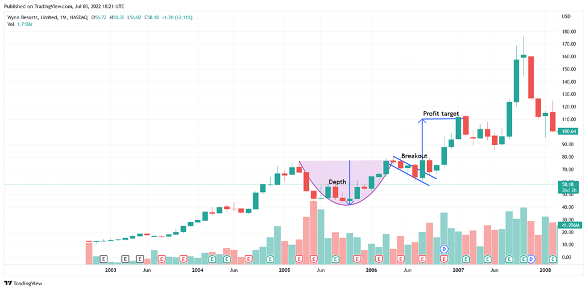

In today's rapidly evolving financial markets, traders are increasingly embracing algorithmic trading, commonly known as algo trading, to refine and enhance their trading strategies. With advancements in computing power and the availability of sophisticated trading platforms, algo trading has transitioned from a niche subset of finance to a mainstream strategy employed by both individual investors and institutional players.

Among the innovative methodologies within algo trading, the Cup Strategy has emerged as a noteworthy approach, drawing considerable interest from traders aiming to automate their processes and achieve greater precision. This article explores the intricate details of the Cup Strategy, a method that leverages automation while drawing inspiration from traditional technical analysis patterns, specifically the well-known 'Cup and Handle' pattern.

Technical analysis has long been a fundamental aspect of trading, providing traders with the tools to forecast future price movements based on historical price data. The Cup and Handle pattern, characterized by its unique 'U' shape followed by a smaller consolidation phase resembling a handle, is a bullish continuation pattern that signals potential upward trends. By automating the identification and execution associated with this pattern, the Cup Strategy seeks to minimize human error and exploit market patterns with improved efficiency.

This article investigates the advantages of the Cup Strategy, including enhanced trade execution speed, consistency in decision-making, and the reduction of emotional biases, which are common pitfalls in manual trading. Additionally, practical insights into the strategy's components, key features, and approaches to deployment in real-world trading environments will be examined. By understanding and implementing the Cup Strategy, traders can enhance their ability to navigate the complexities of modern markets effectively.

## Table of Contents

## Understanding the Cup Strategy

The Cup Strategy is a trading approach derived from the traditional 'Cup and Handle' pattern, which is a significant aspect of technical analysis due to its indication of bullish market continuation. This strategy has been designed to automate the process of identifying the cup and handle formation, eliminating the need for constant manual monitoring and intervention. 

In technical terms, the Cup Strategy focuses on the precise recognition of a 'U'-shaped formation, representative of the "cup." This is typically characterized by a rounded bottom, suggesting a period of market stabilization following a decline. The "handle" forms as a consolidation phase, a relatively short pause or minor decline that occurs after the cup's establishment. This setup signals a potential upward breakout, where the price is expected to rise above the resistance level formed at the cup's rim.

One of the primary advantages of the Cup Strategy is its ability to automate entry and [exit](/wiki/exit-strategy) points. By using [algorithmic trading](/wiki/algorithmic-trading) systems, traders can pre-define conditions based on the pattern's distinct structure to execute trades efficiently as soon as the anticipated [breakout](/wiki/breakout-trading) occurs. This automation facilitates a level of reliability and speed that surpasses traditional manual trading methods, which can often be hindered by human error and delay.

For traders, the automation embedded within the Cup Strategy provides an opportunity to leverage market trends systematically. Algorithms continuously scan the market for the pattern's emergence and execute trades in line with the strategy's predefined rules. This not only enhances trading discipline by adhering to objective criteria but also maximizes the chances of capturing profitable opportunities promptly.

The integration with algorithmic systems ensures that the Cup Strategy remains a robust tool for trading, allowing for swift adjustments and execution on encountering the right market conditions. The increased speed and accuracy of trade executions are vital in capitalizing on the short-lived trading opportunities that can arise once the breakout is underway.

## Benefits of Utilizing the Cup Strategy in Algo Trading

Incorporating the Cup Strategy into algorithmic trading offers several significant advantages for traders, particularly by automating decision-making processes. The primary benefit of using this strategy is the elimination of emotional biases that often impair judgment during manual trading. Emotional responses can lead to poor decisions, such as premature exits or misplaced confidence in a declining asset. Automation ensures that trades are executed based on predefined criteria rather than emotional impulses.

Another critical advantage is the ability to monitor markets continuously, 24/7. This constant vigilance allows traders to capture opportunities at any time, irrespective of their availability to actively observe the market. Automated systems can execute trades swiftly when the Cup and Handle pattern emerges, ensuring no opportunity is missed due to human limitations like time zones or fatigue.

The Cup Strategy in algo trading ensures consistent adherence to trading rules, enhancing discipline in implementation. Traders set specific rules for entries, exits, and risk management that the automated system follows without deviation. This consistency is crucial for maintaining long-term trading discipline and avoiding the sporadic decision-making common in manual trading.

Speed and accuracy in trade execution represent another benefit of using the Cup Strategy. In financial markets, delays or inaccuracies can erode potential profits. Automated systems react faster than humans to emerging patterns, completing trades with precision, which is essential for capitalizing on short-lived market opportunities that might disappear in mere seconds.

Furthermore, the Cup Strategy's deployment in algorithmic trading allows for diversification across multiple assets and markets. Traders can set algorithms to monitor several markets simultaneously, deploying the strategy to various securities without the need for manual intervention. This capability broadens the potential for profit, as traders are not limited to a single market or asset class, reducing risk through diversification.

Utilizing the Cup Strategy within an algorithmic framework integrates technical analysis with modern technology. Consequently, it presents a structured, disciplined, and efficient approach to trading that can potentially improve outcomes by taking advantage of the systematic nature of algo trading.

## Implementing the Cup Strategy in Algo Systems

Implementing the Cup Strategy in algorithmic trading systems involves a systematic approach to coding and strategy development to effectively leverage the 'Cup and Handle' pattern for trading purposes. The process begins with the precise definition of trading rules and parameters within an algorithm to recognize and execute trades based on the distinctive cup and handle formation. The aim is to automate the detection and reaction to this pattern, providing timely market actions with minimal human intervention.

Several platforms facilitate the implementation of the Cup Strategy in an accessible manner. Notably, TradingView and Capitalise.ai offer user-friendly interfaces that simplify strategy setup and testing. These platforms enable traders to visually chart potential trading patterns and create custom scripts that trigger trades automatically when specific conditions are met.

An essential component of strategy implementation is the establishment of clear entry and exit rules. These rules are crucial for identifying optimal points to enter or exit trades, thus maximizing profit and minimizing loss. The entry point typically occurs at the breakout from the handle formation, while exit points may be determined by predefined profit targets or trailing stop-loss mechanisms. These elements help manage risk and optimize the strategy's performance across various market conditions.

To ensure the strategy's effectiveness, traders engage in rigorous [backtesting](/wiki/backtesting) using historical data. This process involves applying the Cup Strategy to past market data to evaluate how it would have performed under different circumstances. Based on these results, traders can refine and optimize the algorithm, tweaking parameters to improve accuracy and responsiveness in capturing trading opportunities.

Continuous monitoring and evaluation are vital for maintaining the Cup Strategy's efficacy. Market conditions are dynamic, and a strategy that performs well under certain conditions may become less effective during periods of increased [volatility](/wiki/volatility-trading-strategies). Therefore, traders must regularly assess their algorithm's performance, making necessary adjustments to adapt to changes in market behavior. This adaptive approach minimizes risk and enhances the potential for consistent profitability.

In summary, implementing the Cup Strategy within algorithmic trading systems requires careful planning, precise coding, and ongoing optimization. With the assistance of technologically advanced platforms, traders can automate and refine their strategies, staying responsive to market conditions and improving trading outcomes over time.

## Risk Management and Challenges

The Cup Strategy, while advantageous in algo trading, requires diligent risk management to prevent potential losses. Establishing clear stop-loss levels is crucial, relying on the pattern's characteristics and current market conditions. The "Cup and Handle" pattern necessitates setting stop-losses that correspond to the price level at which the pattern would be considered invalid. For instance, traders could set a stop-loss below the lowest point of the handle to mitigate risks if the anticipated breakout does not occur.

Market volatility can pose a significant challenge to the strategy's effectiveness, potentially impacting the validity of detected patterns. To address this, traders need to ensure that their algorithms account for such fluctuations by incorporating adaptability mechanisms. This could involve dynamically adjusting parameters like the cup's depth or handle's length based on real-time volatility measures.

Moreover, over-optimization during backtesting is a common pitfall. Traders may inadvertently tailor their algorithms too closely to historical data, making the strategy less effective in real market conditions. To counter this, it's essential to use out-of-sample testing and walk-forward analysis, ensuring the strategy remains robust across different market environments.

Continual education and strategy refinement are vital in the ever-evolving financial landscape. The successful deployment of the Cup Strategy demands ongoing evaluations and adjustments to keep pace with market changes. This might involve regular reassessment of the assumptions underlying the strategy or incorporating new data sources to enhance its predictive capabilities.

Traders must also remain vigilant to the possibility of unprecedented market events, which could render traditional patterns like the Cup and Handle less predictive. Diversifying strategies and incorporating alternative risk management techniques can provide additional protection against such anomalies, ensuring the overall robustness of the trading approach.

## Conclusion

The Cup Strategy exemplifies a sophisticated amalgamation of proven technical analysis techniques and the precision of algorithmic trading. By correctly implementing this approach, traders are able to significantly boost their trading performance by leveraging the consistency and discipline that algorithmic trading affords. Unlike manual trading methods, the automation inherent in the Cup Strategy ensures that trades are executed based on pre-established criteria, thus removing emotional biases and improving decision-making accuracy.

To achieve sustainable success, however, traders must exercise due diligence. This includes continuous monitoring of the strategy’s performance and making necessary adaptations as market conditions evolve. Despite its structured framework, the volatility and unpredictability of markets demand that traders remain vigilant and responsive to new information.

Advancements in algorithmic trading technologies are expected to further enhance strategies like the Cup, offering greater flexibility and adaptability. These innovations could integrate more sophisticated [machine learning](/wiki/machine-learning) algorithms or real-time data analysis to refine pattern recognition and trade execution processes. Traders who stay informed about these technological developments and incorporate them into their trading strategies will likely secure a competitive advantage.

In conclusion, the Cup Strategy, when utilized with an informed and adaptive approach, provides a robust framework for optimizing trade outcomes. It embodies the future of trading where technical analysis is synergized with cutting-edge technology, and those equipped with the requisite knowledge and tools are well-positioned to capitalize on emerging opportunities in financial markets.

## References & Further Reading

[1]: O'Neil, W. J. (1988). ["How to Make Money in Stocks: A Winning System in Good Times and Bad, Fourth Edition"](https://www.amazon.com/How-Make-Money-Stocks-Winning/dp/0071614133). McGraw-Hill Education.

[2]: Bulkowski, T. (2008). ["Encyclopedia of Chart Patterns"](https://www.wiley.com/en-us/Encyclopedia+of+Chart+Patterns,+3rd+Edition-p-9781119739685). Wiley Trading.

[3]: Chan, E. P. (2009). ["Quantitative Trading: How to Build Your Own Algorithmic Trading Business"](https://github.com/ftvision/quant_trading_echan_book). Wiley.

[4]: Aronson, D. R. (2006). ["Evidence-Based Technical Analysis: Applying the Scientific Method and Statistical Inference to Trading Signals"](https://www.amazon.com/Evidence-Based-Technical-Analysis-Scientific-Statistical/dp/0470008741). Wiley.

[5]: Prado, M. L. (2018). ["Advances in Financial Machine Learning"](https://www.amazon.com/Advances-Financial-Machine-Learning-Marcos/dp/1119482089). Wiley.