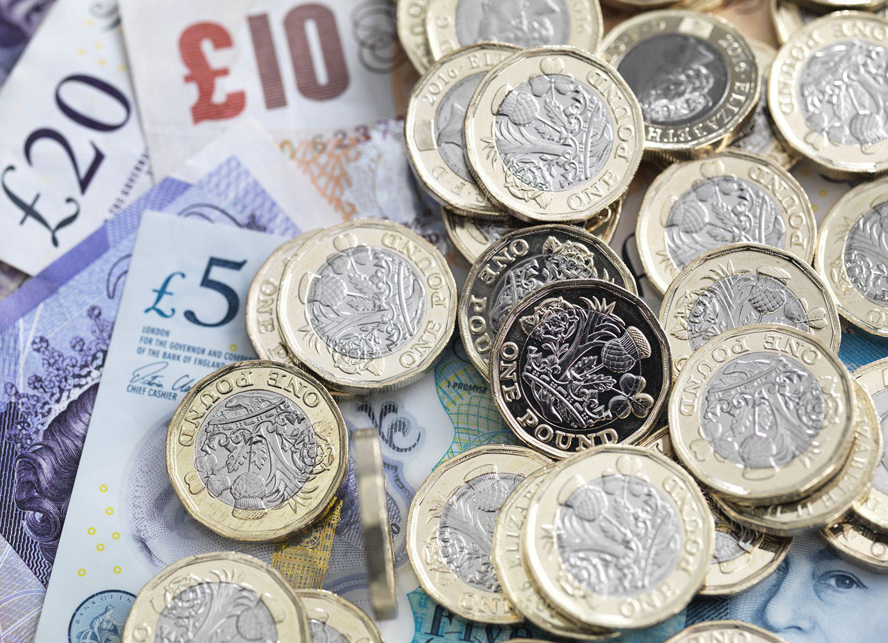

## Table of Contents

## What is a currency and how is its strength measured?

A currency is a type of money that is used in a specific country or group of countries. It can be in the form of coins, paper notes, or even digital money. Each country usually has its own currency, like the US dollar in the United States or the Euro in many European countries. People use currency to buy things, pay for services, and save money.

The strength of a currency is measured by comparing it to other currencies. This comparison is called the exchange rate. If one US dollar can buy more of another currency, like the Japanese yen, then the US dollar is considered strong compared to the yen. A strong currency means that goods and services from that country might be more expensive for people from other countries. On the other hand, a weak currency can make a country's exports cheaper and more attractive to foreign buyers. Factors like a country's economy, interest rates, and political stability can affect how strong or weak its currency is.

## Which currencies are generally considered stronger than the US dollar?

Some currencies are often seen as stronger than the US dollar. One of these is the Swiss Franc. Switzerland is known for its strong economy and stable government, which makes its currency valuable. Another strong currency is the Euro, used by many countries in Europe. The Euro can be stronger than the US dollar because the European economy is very big and important in the world.

Another currency that can be stronger than the US dollar is the British Pound. The UK has a strong economy and a long history of being an important trading nation, which helps make its currency strong. However, the strength of these currencies can change over time. Things like economic news, political events, and global trade can all affect how strong a currency is compared to the US dollar.

## What factors contribute to a currency being stronger than the US dollar?

A currency can be stronger than the US dollar because of a country's strong economy. When a country's economy is doing well, people trust its money more. This trust makes the currency more valuable. For example, if a country has a lot of successful businesses and low unemployment, its currency might be seen as strong. Also, if a country has good trade relationships with other countries, this can make its currency stronger. People want to buy things from that country, so they need its currency, which increases its value.

Another important [factor](/wiki/factor-investing) is the country's political stability. If people think a country's government is stable and makes good decisions, they will trust its currency more. This trust can make the currency stronger than the US dollar. Interest rates also play a role. If a country's interest rates are high, people might want to invest their money there. This demand for the currency can make it stronger. All these things together can make a currency stronger than the US dollar, but they can change over time.

## How does the exchange rate between these currencies and the US dollar fluctuate?

The exchange rate between currencies like the Swiss Franc, the Euro, and the British Pound and the US dollar changes all the time. This happens because many different things can affect how much one currency is worth compared to another. For example, if the economy of the United States is doing really well, the US dollar might become stronger compared to other currencies. On the other hand, if the US economy is not doing so well, the dollar might get weaker. Also, big news events like elections or economic reports can make the exchange rate go up or down quickly.

Another reason exchange rates change is because of what people think might happen in the future. If people think that a country's economy will do better in the future, they might start buying its currency now, which makes it stronger. For example, if people think the Eurozone's economy will improve, they might buy more Euros, making the Euro stronger against the US dollar. Interest rates also play a big role. If a country raises its interest rates, people might want to invest their money there, which can make its currency stronger compared to the US dollar. All these factors together cause the exchange rates to go up and down every day.

## What are the economic implications for countries whose currencies are stronger than the US dollar?

When a country's currency is stronger than the US dollar, it can make things more expensive for people from other countries who want to buy things from that country. For example, if the Swiss Franc is strong, a watch made in Switzerland might cost more for someone in the US. This can make it harder for the country to sell things to other countries because their products become more expensive. On the other hand, it can be good for people in that country because they can buy things from other countries more cheaply. If the Swiss Franc is strong, Swiss people can buy more with their money when they travel to the US or buy things from there.

A strong currency can also affect the country's economy in other ways. For example, if the currency is too strong, it might make it hard for the country to sell things to other countries, which can lead to fewer jobs in industries that rely on exports. But a strong currency can also make the country look good to investors. If people think the country's economy is strong and stable, they might want to invest their money there. This can bring more money into the country and help its economy grow. So, having a currency stronger than the US dollar can have both good and bad effects on a country's economy.

## How do central banks influence the strength of their currencies relative to the US dollar?

Central banks can influence how strong their currency is compared to the US dollar by changing interest rates. If a central bank raises interest rates, it can make its currency stronger. This happens because higher interest rates can attract more investors who want to earn more on their money. When more people want to buy the currency, its value goes up compared to the US dollar. On the other hand, if the central bank lowers interest rates, it might make the currency weaker because investors might move their money to places with higher interest rates.

Central banks can also use other tools to affect their currency's strength. They can buy or sell their own currency in the foreign exchange market. If a central bank wants to make its currency weaker, it can sell a lot of it. This makes more of the currency available, which can lower its value compared to the US dollar. If the central bank wants to make its currency stronger, it can buy it back, which reduces the amount available and can increase its value. These actions help central banks manage their currency's strength and keep their economy stable.

## What historical events have led to certain currencies becoming stronger than the US dollar?

Over the years, different events have made some currencies stronger than the US dollar. One big event was the introduction of the Euro in 1999. Before the Euro, many European countries had their own currencies. When they started using the Euro, it became a very important currency because it was used by so many countries. The Euro became strong because the European economy was big and important. Also, the European Central Bank worked to keep the Euro stable, which made people trust it more.

Another event that affected currency strength was the global financial crisis in 2008. During this time, many people lost trust in the US economy because of problems with banks and housing. This made the US dollar weaker compared to other currencies. The Swiss Franc, for example, became much stronger during this time. Switzerland's economy was seen as very stable, and people wanted to keep their money safe there. So, they bought a lot of Swiss Francs, which made it stronger than the US dollar.

In more recent years, political events like Brexit have also influenced currency strength. When the UK voted to leave the European Union in 2016, it caused a lot of uncertainty about the British economy. This uncertainty made the British Pound weaker compared to the US dollar for a while. However, the Pound has since regained some strength as the UK has worked to stabilize its economy and trade relationships. These events show how big changes in the world can affect how strong or weak a currency is compared to the US dollar.

## How do global trade dynamics affect the strength of currencies relative to the US dollar?

Global trade dynamics can make a currency stronger or weaker compared to the US dollar. When a country exports a lot of things to other countries, it means that people from other countries need to buy its currency to pay for those things. If a country like Germany exports a lot of cars, people from other countries need Euros to buy them. This demand for Euros can make the Euro stronger compared to the US dollar. On the other hand, if a country imports more than it exports, it might need to buy a lot of other currencies, which can make its own currency weaker.

Another way global trade affects currency strength is through trade agreements and economic policies. For example, if countries agree to lower tariffs on each other's goods, it can increase trade between them. This can make the currencies of the countries involved stronger because more trade means more demand for their currencies. Also, if a country has a trade surplus, meaning it exports more than it imports, its currency can become stronger. But if a country has a trade deficit, meaning it imports more than it exports, its currency might become weaker compared to the US dollar.

## What are the investment opportunities and risks associated with currencies stronger than the US dollar?

Investing in currencies that are stronger than the US dollar can offer some good opportunities. If you think a currency like the Swiss Franc or the Euro will keep getting stronger, you might want to buy it. If it does get stronger, you can sell it later for more US dollars than you paid. This can make you money. Also, if you want to invest in a country with a strong currency, it might be a good sign that the country's economy is doing well. This can make you feel more confident about your investment.

But there are also risks when you invest in stronger currencies. If the currency gets weaker instead of stronger, you could lose money. For example, if you buy Euros and then the Euro gets weaker compared to the US dollar, you will get fewer dollars back when you sell your Euros. Also, things like political changes or big economic news can make a currency go up or down a lot very quickly. This can be risky if you are not ready for it. So, while there are opportunities, you need to be careful and think about the risks too.

## How do geopolitical factors impact the relative strength of currencies against the US dollar?

Geopolitical factors can make a big difference in how strong a currency is compared to the US dollar. If a country is having problems with other countries or facing political instability, people might lose trust in its currency. For example, if there is a war or a big political change, people might think the country's economy will do badly. This can make its currency weaker compared to the US dollar. Also, if countries put trade restrictions or sanctions on each other, it can affect their currencies. If a country can't trade as much because of these restrictions, its currency might get weaker.

On the other hand, good geopolitical relations can make a currency stronger. If countries work well together and have strong trade agreements, it can make their currencies more valuable. For example, if two countries sign a big trade deal, it can make their currencies stronger because more trade means more demand for their money. Also, if a country is seen as a safe place to invest because it has good relationships with other countries, people might want to buy its currency. This can make it stronger compared to the US dollar.

## What advanced economic indicators should be monitored to predict changes in currency strength against the US dollar?

To predict changes in a currency's strength against the US dollar, it's important to keep an eye on several key economic indicators. One important indicator is the Gross Domestic Product (GDP) growth rate. If a country's GDP is growing faster than the US, its currency might get stronger. Another useful indicator is the inflation rate. If a country's inflation is lower than in the US, its currency might become stronger because its money can buy more. Interest rates are also crucial. If a country raises its interest rates compared to the US, investors might move their money there, making its currency stronger.

Other indicators to watch include the balance of trade and employment data. A country with a trade surplus, meaning it exports more than it imports, might see its currency strengthen. On the other hand, a trade deficit can weaken a currency. Employment data, like the unemployment rate, can also affect currency strength. If a country's unemployment rate is going down, it might mean the economy is doing well, which can make its currency stronger. Keeping an eye on these indicators can help predict how a currency might move against the US dollar.

## How do sophisticated financial instruments like derivatives affect the strength of currencies relative to the US dollar?

Sophisticated financial instruments like derivatives can have a big impact on how strong a currency is compared to the US dollar. Derivatives are financial contracts whose value depends on something else, like the exchange rate between two currencies. When people use derivatives to bet on whether a currency will get stronger or weaker, it can affect its value. For example, if a lot of people use derivatives to bet that the Euro will get stronger against the US dollar, this can increase demand for Euros and make it stronger. On the other hand, if many people bet that the Euro will get weaker, it can put downward pressure on its value.

These instruments can also create a lot of movement in currency values. Because derivatives can be used to make big bets with relatively little money, they can lead to quick changes in currency strength. If there is a sudden event that makes people change their bets, like a big economic report or a political change, it can cause the currency to go up or down a lot very quickly. This can make it harder to predict how strong a currency will be compared to the US dollar, but it also means that people who understand derivatives well can use them to make money from these changes.

## References & Further Reading

[1]: ["Algorithmic Trading and Market Dynamics"](https://www.cmegroup.com/education/files/Algo_and_HFT_Trading_0610.pdf) European Central Bank.

[2]: ["High Frequency Trading and Regulatory Challenges"](https://sgp.fas.org/crs/misc/R43608.pdf) Financial Conduct Authority.

[3]: ["Monitoring of Fast-Paced Automated Trading"](https://www.investopedia.com/articles/trading/11/automated-trading-systems.asp) Markets Committee, Bank for International Settlements.

[4]: ["Advances in Financial Machine Learning"](https://www.amazon.com/Advances-Financial-Machine-Learning-Marcos/dp/1119482089) by Marcos Lopez de Prado.

[5]: ["Quantitative Trading: How to Build Your Own Algorithmic Trading Business"](https://www.amazon.com/Quantitative-Trading-Build-Algorithmic-Business/dp/1119800064) by Ernest P. Chan.

[6]: ["Machine Learning for Algorithmic Trading"](https://github.com/stefan-jansen/machine-learning-for-trading) by Stefan Jansen.

[7]: ["Evidence-Based Technical Analysis: Applying the Scientific Method and Statistical Inference to Trading Signals"](https://www.amazon.com/Evidence-Based-Technical-Analysis-Scientific-Statistical/dp/0470008741) by David Aronson.