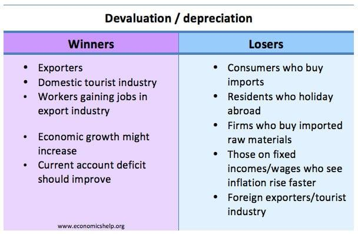

## Table of Contents

## What is currency appreciation?

Currency appreciation happens when the value of a country's money goes up compared to other countries' money. This can happen for many reasons, like if a country's economy is doing well or if people from other countries want to buy more of that country's money. When a currency appreciates, it means you can get more foreign money for your own money. For example, if you have US dollars and the dollar appreciates against the euro, you can buy more euros with your dollars than before.

This can affect many things. For businesses, it might mean their products cost more in other countries, which could make them less competitive. For travelers, it means their money goes further when they visit countries with currencies that have depreciated against their own. But it can also make imports cheaper, which is good for people buying things from other countries. Overall, currency appreciation can have both good and bad effects, depending on who you are and what you're doing.

## How does currency appreciation differ from currency depreciation?

Currency appreciation and currency depreciation are opposite things that happen to money. Appreciation happens when a country's money becomes worth more compared to other countries' money. For example, if you have US dollars and the dollar appreciates against the euro, it means you can buy more euros with your dollars than before. This usually happens when a country's economy is doing well or if people from other countries want to buy more of that country's money.

On the other hand, currency depreciation happens when a country's money becomes worth less compared to other countries' money. If the US dollar depreciates against the euro, it means you can buy fewer euros with your dollars than before. This can happen if a country's economy is not doing well or if people do not want to hold onto that country's money. Both appreciation and depreciation can affect how much things cost, how much people can buy from other countries, and how competitive a country's businesses are in the global market.

## What are the main factors that cause a currency to appreciate?

A currency can appreciate for several reasons. One big reason is when a country's economy is doing well. When a country's economy grows, it often means that businesses are making more money, and people are spending more. This can make investors from other countries want to buy that country's money because they think it will keep doing well. Also, if a country has low inflation, it can make its currency more attractive because the money keeps its value better over time.

Another [factor](/wiki/factor-investing) is interest rates. If a country's central bank raises interest rates, it can make that country's money more appealing to investors. Higher interest rates mean that people who lend money to that country, or buy its bonds, can get more money back. This can lead to more demand for the currency, causing it to appreciate. Additionally, if a country has a trade surplus, meaning it exports more than it imports, it can also lead to currency appreciation because other countries need to buy that country's currency to pay for the goods.

## Can you explain the role of interest rates in currency appreciation?

Interest rates play a big role in whether a country's currency goes up in value. When a country's central bank decides to raise interest rates, it makes that country's money more attractive to people who want to invest. Imagine you have some money to lend. If one country offers you a higher [interest rate](/wiki/interest-rate-trading-strategies), you'll get more money back. So, you might want to buy that country's currency to take advantage of the higher rates. When more people want to buy a currency because of high interest rates, the value of that currency can go up.

On the other hand, if interest rates are low, it might make the currency less attractive to investors. They might not want to lend money to that country because they won't get much back. This can lead to less demand for the currency, and its value might go down. So, when you hear about a country raising its interest rates, it's often a sign that its currency might appreciate because more people will want to buy it.

## How does inflation impact currency appreciation?

Inflation is when prices go up over time. When a country has low inflation, it can make its currency more valuable. This is because low inflation means the money keeps its value better. People from other countries might want to buy that currency because it won't lose value as quickly. So, if a country can keep its inflation low, it can help its currency appreciate.

On the other hand, high inflation can make a currency less valuable. If prices are going up a lot, the money doesn't buy as much as it used to. This can make people from other countries not want to buy that currency because it's losing value. So, high inflation can lead to currency depreciation instead of appreciation. Keeping inflation under control is important for a country that wants its currency to stay strong.

## What is the effect of trade balances on currency appreciation?

Trade balances play a big role in whether a country's currency goes up in value. When a country exports more than it imports, it has a trade surplus. This means other countries need to buy that country's currency to pay for the goods they are buying. When more people want to buy a currency, its value goes up. So, a trade surplus can help a country's currency appreciate because there is more demand for it.

On the flip side, if a country imports more than it exports, it has a trade deficit. This means the country needs to buy more foreign currency to pay for the goods it's importing. When a country needs to buy more of another country's currency, it can make its own currency less valuable. So, a trade deficit can lead to currency depreciation because there is less demand for the country's own currency. Keeping a good balance in trade can help a country's currency stay strong.

## How do political stability and economic performance influence currency appreciation?

Political stability and good economic performance can help a country's currency go up in value. When a country is politically stable, it means there are no big fights or changes that could scare away investors. People from other countries feel safer putting their money into a country that is stable. Also, if the economy is doing well, it means businesses are making more money and people are spending more. This can make investors want to buy that country's money because they think it will keep doing well. So, both political stability and a strong economy can make more people want to buy a country's currency, which can make it appreciate.

On the other hand, if a country is going through a lot of political trouble or if its economy is not doing well, it can make its currency less valuable. Political instability can scare investors away because they might think their money is not safe. If the economy is struggling, it might mean businesses are not making as much money and people are spending less. This can make investors not want to buy that country's money because they think it might lose value. So, political instability and a weak economy can lead to less demand for a country's currency, which can cause it to depreciate.

## What are the short-term and long-term effects of currency appreciation on an economy?

In the short term, currency appreciation can have both good and bad effects on an economy. On the positive side, it can make imports cheaper. This means that people and businesses in the country can buy things from other countries for less money. For example, if you want to buy a car from another country, it might cost less because your currency is stronger. But there are also downsides. If the currency appreciates too quickly, it can make the country's exports more expensive. This might hurt businesses that sell things to other countries because their products cost more for foreign buyers. Also, if a country relies a lot on tourism, fewer people might visit because their money doesn't go as far.

In the long term, the effects of currency appreciation can be more complex. A strong currency can help keep inflation low because imports are cheaper, which can be good for the economy. It can also make the country more attractive to foreign investors because they can get more for their money. However, if the currency stays strong for a long time, it can make it hard for the country's businesses to compete in the global market. Over time, this could lead to job losses in industries that rely on exports. So, while a strong currency has its benefits, it can also create challenges that need to be managed carefully.

## How does currency appreciation affect exporters and importers?

Currency appreciation makes things harder for exporters. When a country's currency goes up in value, it means their products cost more for people in other countries. Imagine you're selling toys to another country. If your currency gets stronger, those toys will be more expensive for the people buying them. This can make it tough to sell as many toys because they cost more. Exporters might have to lower their prices to keep selling, which can hurt their profits.

On the other hand, currency appreciation is good news for importers. When the currency is stronger, it means they can buy things from other countries for less money. If you're a business that buys parts from another country to make your products, those parts will be cheaper when your currency appreciates. This can help you save money and maybe even lower the prices of your products. So, importers benefit from a stronger currency because their costs go down.

## What strategies can countries use to manage or counteract currency appreciation?

Countries can use different strategies to manage or slow down currency appreciation. One common way is by having the central bank step into the market and sell their own currency. This makes more of their currency available, which can make it less valuable. Another strategy is to lower interest rates. When interest rates go down, it can make the currency less attractive to people who want to invest because they won't get as much money back. Countries might also try to make their exports cheaper by giving businesses tax breaks or other help, so they can sell more abroad and keep the currency from getting too strong.

Another approach is to use verbal warnings or hints to the market. Sometimes, just talking about wanting a weaker currency can make people think twice about buying it. Countries can also set up currency pegs or bands, which means they try to keep their currency's value within a certain range compared to another currency. This can help stop the currency from appreciating too much. Each of these strategies has its own pros and cons, and countries need to think carefully about what will work best for their situation.

## Can you discuss a historical example where currency appreciation had a significant impact on an economy?

In the 1980s, Japan experienced a big currency appreciation that had a huge impact on its economy. The yen got much stronger because of a deal called the Plaza Accord in 1985. This deal was made by big countries like the US, Japan, Germany, France, and the UK to make the US dollar weaker. As a result, the yen became much stronger against the dollar. This made Japanese products more expensive for people in other countries to buy. Japanese companies that exported things like cars and electronics found it harder to sell their products abroad because they cost more.

This strong yen led to some big changes in Japan. At first, it helped make imports cheaper, which was good for Japanese people and businesses that needed things from other countries. But over time, the strong yen hurt Japan's economy. Many Japanese businesses had to move their factories to other countries where costs were lower. This led to fewer jobs in Japan and slower economic growth. The strong yen also played a part in the bubble economy in Japan during the late 1980s, which eventually burst and caused a long period of economic trouble. So, while the yen's appreciation had some short-term benefits, it created big challenges for Japan in the long run.

## What are the advanced economic models used to predict currency appreciation?

Economists use different models to try and guess if a country's money will go up in value. One popular model is called the Purchasing Power Parity (PPP) model. This model looks at how much things cost in different countries. If things are cheaper in one country, its money might go up in value because people from other countries will want to buy more of that country's stuff. Another model is the Interest Rate Parity (IRP) model. This model looks at the interest rates in different countries. If one country has higher interest rates, its money might go up in value because more people will want to invest there to get more money back.

Another important model is the Balance of Payments model. This model looks at how much a country buys and sells with other countries. If a country sells more than it buys, it might have a trade surplus, which can make its money go up in value. There's also the Asset Market Model, which looks at how investors feel about a country's money. If investors think a country's economy will do well, they might buy more of that country's money, making it go up in value. These models help economists make guesses, but they're not perfect because lots of things can change and affect currency values.

## References & Further Reading

[1]: Evans, M. D. D., & Lyons, R. K. (2002). ["Order flow and exchange rate dynamics."](https://www.nber.org/papers/w7317) Journal of Political Economy, 110(1), 170-180.

[2]: Rogoff, K. (1996). ["The Purchasing Power Parity Puzzle."](https://scholar.harvard.edu/rogoff/publications/purchasing-power-parity-puzzle) Journal of Economic Literature, 34(2), 647-668.

[3]: ["Exchange Rate Determination"](https://www.economicsdiscussion.net/foreign-exchange/theories-foreign-exchange/theories-of-exchange-rate-determination-international-economics/30637) by Richard A. Meese and Kenneth Rogoff, Oxford Review of Economic Policy

[4]: Chaboud, A. P., Chiquoine, B., Hjalmarsson, E., & Vega, C. (2009). ["Rise of the Machines: Algorithmic Trading in the Foreign Exchange Market."](https://www.jstor.org/stable/43612951) FRB International Finance Discussion Paper No. 980.

[5]: King, M. R., Osler, C. L., & Rime, D. (2012). ["Foreign exchange market structure, players, and evolution."](https://papers.ssrn.com/sol3/papers.cfm?abstract_id=1935858) National Bureau of Economic Research.

[6]: Aldridge, I. (2013). ["High-Frequency Trading: A Practical Guide to Algorithmic Strategies and Trading Systems"](https://books.google.com/books/about/High_Frequency_Trading.html?id=8QpIsVUMhmEC) (2nd ed.). Wiley.

[7]: ["Algorithmic and High-Frequency Trading"](https://assets.cambridge.org/97811070/91146/frontmatter/9781107091146_frontmatter.pdf) by Álvaro Cartea, Sebastian Jaimungal, and José Penalva, Cambridge University Press