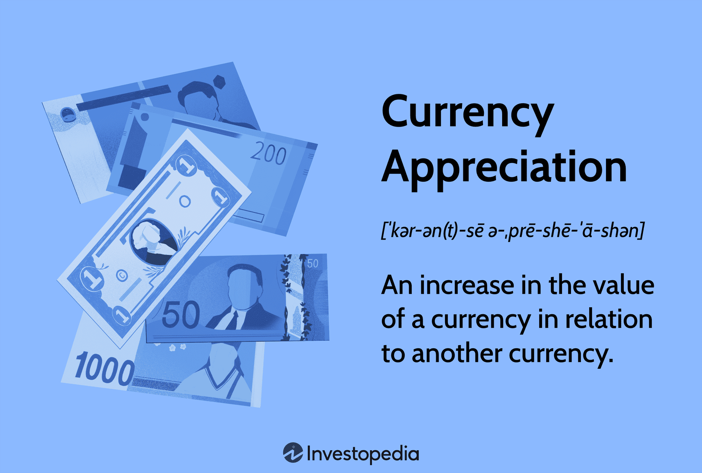

## Table of Contents

## What is currency appreciation?

Currency appreciation happens when the value of a country's money goes up compared to other countries' money. This can happen because more people want to buy that country's currency, maybe because their economy is doing well or because their interest rates are high. When a currency appreciates, it means you can buy more foreign goods and services with the same amount of your own money.

However, currency appreciation can also have some downsides. For example, if a country's currency becomes too strong, it can make their exports more expensive for other countries to buy. This might hurt businesses that sell things abroad because fewer people might want to buy their products. So, while a stronger currency can be good for buying things from other countries, it can be bad for a country's own exporters.

## How is currency appreciation different from currency depreciation?

Currency appreciation and currency depreciation are opposite things. Appreciation happens when a country's money becomes worth more compared to other countries' money. This means you can buy more things from other countries with the same amount of your money. It's like your money getting stronger. People might want to buy your country's money more if your economy is doing well or if interest rates are high.

On the other hand, currency depreciation is when a country's money becomes worth less compared to other countries' money. This means you can buy fewer things from other countries with the same amount of your money. It's like your money getting weaker. This can happen if people don't want to buy your country's money as much, maybe because your economy is not doing so well or interest rates are low. While this can make your country's exports cheaper and maybe help businesses that sell things abroad, it can also make things from other countries more expensive for you to buy.

## What are the main causes of currency appreciation?

Currency appreciation can happen for a few reasons. One big reason is when a country's economy is doing really well. When a country's businesses are making more money and people are working more, other countries might want to invest in that country. They need to buy that country's currency to invest, which makes the currency's value go up. Another reason is high interest rates. If a country's interest rates are higher than other countries, people from other places might want to put their money there to get a better return. This demand for the currency can make it appreciate.

Another cause of currency appreciation is when a country has a lot of exports. If a country is selling a lot of goods and services to other countries, it means other countries need to buy that country's currency to pay for those exports. This increased demand can make the currency's value go up. Also, if people think a country's currency will become more valuable in the future, they might buy it now, hoping to sell it later for a profit. This speculation can also lead to currency appreciation.

## How does currency appreciation affect a country's economy?

When a country's currency appreciates, it means their money becomes more valuable compared to other countries' money. This can be good for the people in that country because they can buy more things from other places with the same amount of their money. For example, if you live in a country with an appreciated currency, you might find it cheaper to go on a vacation abroad or buy imported goods like electronics or cars. Also, if your country has a lot of people sending money back home from working in other countries, those remittances will be worth more when they are converted back to your country's currency.

However, currency appreciation can also have some downsides. It can make it harder for businesses in your country to sell their products to other countries because their products become more expensive for foreigners to buy. This might lead to fewer exports, which can hurt businesses and cause them to lay off workers. Also, if your country relies a lot on tourism, fewer people might want to visit because it becomes more expensive for them. So, while a stronger currency can help people buy things from abroad, it can hurt businesses that sell things to other countries and affect the overall economy in different ways.

## Can you explain the impact of currency appreciation on exports and imports?

When a country's currency appreciates, it means their money becomes more valuable compared to other countries' money. This can make it harder for businesses in that country to sell their products to other countries. Their products become more expensive for foreigners to buy because they need more of their own money to buy the same amount of the appreciated currency. This can lead to fewer exports, which can hurt businesses and even cause them to lay off workers. So, when a country's currency goes up in value, it can make it tougher for them to sell things abroad.

On the other hand, currency appreciation makes it easier and cheaper for people in that country to buy things from other countries. When their money is worth more, they can get more foreign goods and services with the same amount of their own money. This means imports become cheaper, which can be good for people who like to buy things from abroad, like electronics, cars, or even take vacations in other countries. So, while currency appreciation can hurt a country's exports, it can make imports cheaper and more appealing to the people in that country.

## What role do interest rates play in currency appreciation?

Interest rates can have a big impact on whether a country's currency goes up in value. If a country has high interest rates compared to other countries, people from other places might want to put their money there to get a better return. When they buy the country's currency to invest, it can make the currency more valuable. This is because more people want to buy the currency, which makes its value go up.

On the other hand, if a country has low interest rates, people might not want to invest their money there as much. They might take their money out of the country to put it somewhere with higher interest rates. When they sell the country's currency to do this, it can make the currency less valuable. So, high interest rates can lead to currency appreciation because they attract more money from other countries, while low interest rates can have the opposite effect.

## How do central banks influence currency appreciation?

Central banks can influence whether a country's money goes up in value by changing interest rates. If they raise interest rates, it can make their country's money more attractive to people from other countries. These people might want to put their money in the country with higher interest rates to get a better return. When they buy the country's money to invest, it can make the money's value go up. So, by setting high interest rates, central banks can help their currency appreciate.

Central banks can also affect currency value by buying or selling their own money in the foreign exchange market. If they want their currency to go up in value, they can buy it themselves. This increases the demand for their currency, which can make its value go up. On the other hand, if they want to keep their currency from going up too much, they can sell it. This increases the supply of their currency, which can keep its value from rising too quickly. So, central banks have different ways to influence whether their currency appreciates or not.

## What are the long-term effects of sustained currency appreciation?

When a country's money stays strong for a long time, it can make things from other countries cheaper for people living there. They might buy more things from abroad, like cars, electronics, or even go on vacations more often because it costs less. This can be good for people because they can enjoy more things without spending more money. However, it can also hurt businesses that make things to sell to other countries. Their products become more expensive for people in other countries to buy, so they might sell less. This can lead to fewer jobs and slower growth for the country's economy.

Over time, a strong currency can also affect how much money people want to invest in the country. If the currency keeps going up, investors might think it will go down soon and decide to take their money out. This can make the currency weaker in the future. Also, if the country relies a lot on selling things to other countries, a strong currency for a long time can make it hard for the economy to grow. The government might need to find new ways to help businesses and keep the economy strong, like giving money to businesses or making it easier for them to sell things abroad.

## How can investors benefit from currency appreciation?

Investors can benefit from currency appreciation when they hold or invest in a country's currency that is getting stronger. If an investor buys a currency that goes up in value, they can sell it later for more money than they paid for it. This is like buying something cheap and selling it for a higher price. For example, if an investor thinks a country's economy will do well and their currency will go up, they can buy that currency and wait for it to appreciate. When it does, they can sell it and make a profit.

Another way investors can benefit is by investing in assets in a country with a strong currency. If an investor puts money into stocks, bonds, or real estate in a country where the currency is appreciating, the value of their investment can go up in two ways. First, the investment itself might grow in value. Second, when they convert the profits back to their home currency, they get more money because the foreign currency is worth more. This can lead to bigger returns on their investments.

## What are some historical examples of significant currency appreciation?

One big example of currency appreciation happened with the Japanese yen in the 1980s. Back then, Japan's economy was growing a lot and doing really well. People from other countries wanted to invest in Japan, so they bought a lot of yen. This made the yen go up in value a lot. By 1985, the yen got so strong that other countries, like the United States, were worried because it was making their products too expensive for Japanese people to buy. So, they made an agreement called the Plaza Accord to try to make the yen weaker, but it still stayed strong for a while.

Another example is the Swiss franc in the early 2010s. Switzerland had a strong economy and was seen as a safe place to keep money, especially during times when other countries were having problems. Because of this, a lot of people wanted to buy Swiss francs. This made the Swiss franc go up in value a lot. In 2011, the Swiss National Bank tried to stop the franc from getting too strong by setting a limit on how much it could go up against the euro. But in 2015, they took away this limit, and the Swiss franc went up even more, which surprised a lot of people and caused some problems for investors.

## How do global economic factors contribute to currency appreciation?

Global economic factors can make a country's money go up in value in different ways. One big thing is how well the world economy is doing. If the world economy is doing well, countries that sell a lot of things to other countries might see their money go up in value. This is because other countries need to buy their money to pay for the things they are buying. Also, if a lot of money is moving around the world and investors are looking for good places to put their money, they might choose countries with strong economies and high interest rates. This can make the money of those countries go up in value because more people want to buy it.

Another way global economic factors can affect currency value is through big events like financial crises or changes in oil prices. If there's a crisis in one part of the world, investors might move their money to countries they think are safer. This can make the money of those safe countries go up in value. Also, if the price of oil goes up a lot, countries that sell oil might see their money go up in value because other countries need to buy more of their money to pay for the oil. So, what happens in the global economy can really affect whether a country's money goes up or down in value.

## What are the challenges in predicting currency appreciation?

Predicting when a country's money will go up in value is really hard because a lot of different things can affect it. One big challenge is that the world economy is always changing. Things like how well other countries are doing, what's happening with interest rates, or even big events like financial crises can all make a currency go up or down. It's tough to know what will happen next because these things can change quickly and in ways that are hard to predict.

Another challenge is that people's feelings and guesses about the future can also change how much a currency is worth. If a lot of people think a country's money will go up in value soon, they might buy it now, hoping to sell it later for more money. This can actually make the currency go up in value, but it's hard to predict what people will think or do. Also, governments and central banks can do things to try to change how much their money is worth, which adds another layer of unpredictability. So, trying to guess when a currency will appreciate is tricky because there are so many things that can affect it, and they can be hard to see coming.

## How does monetary policy influence currency value?

Monetary policy, implemented by a nation's central bank, plays a crucial role in influencing a currency's value through the regulation of money supply and the manipulation of interest rates. This process is a fundamental aspect of macroeconomic management, directly impacting foreign exchange markets. Central banks, such as the U.S. Federal Reserve or the European Central Bank, utilize monetary policy tools to achieve specific economic objectives such as controlling inflation, managing employment levels, and maintaining financial stability.

When central banks alter interest rates, these adjustments have immediate and significant implications for currency valuation. For instance, an increase in interest rates typically attracts foreign capital as global investors seek higher returns on their investments. This influx of capital increases the demand for the domestic currency, leading to its appreciation. The relationship can be represented as follows:

$$
\text{Currency Value}_{\text{Domestic}} = f(\text{Interest Rate}_{\text{Domestic}}, \text{Capital Inflows})
$$

Where a rise in $\text{Interest Rate}_{\text{Domestic}}$ generally causes an increase in $\text{Currency Value}_{\text{Domestic}}$.

Conversely, when central banks decrease interest rates, it may result in currency depreciation. Lower interest rates reduce the attractiveness of holding monetary assets denominated in the domestic currency, encouraging investors to seek higher returns in other countries. Consequently, this can lead to capital outflows and a reduction in currency value:

$$
\text{Currency Value}_{\text{Domestic}} = f(\text{Interest Rate}_{\text{Domestic}}, \text{Capital Outflows})
$$

A decrease in $\text{Interest Rate}_{\text{Domestic}}$ typically leads to a decrease in $\text{Currency Value}_{\text{Domestic}}$.

It is important to note that central banks also consider inflation rates when setting interest rates, as inflation influences the real return on investments. High inflation typically erodes purchasing power, prompting central banks to raise interest rates to maintain currency stability. Thus, the interplay between interest rates, inflation, and currency valuation reflects a complex yet systematic approach in monetary policy to guide economic outcomes. By understanding these dynamics, traders and investors can make informed decisions by anticipating potential shifts in currency valuation influenced by central bank actions.

## References & Further Reading

[1]: Madura, J. (2017). ["International Financial Management"](https://books.google.com/books/about/International_Financial_Management.html?id=Z3TLDwAAQBAJ). Cengage Learning.

[2]: Taylor, M. P. (1995). ["The Economics of Exchange Rates."](https://www.jstor.org/stable/2728909) Journal of Economic Literature, 33(1), 13-47.

[3]: Lopez de Prado, M. (2018). ["Advances in Financial Machine Learning"](https://www.amazon.com/Advances-Financial-Machine-Learning-Marcos/dp/1119482089). Wiley.

[4]: Murphy, J. J. (1999). ["Technical Analysis of the Financial Markets: A Comprehensive Guide to Trading Methods and Applications."](https://archive.org/details/technicalanalysi0000murp) New York Institute of Finance.

[5]: Chan, E. (2009). ["Quantitative Trading: How to Build Your Own Algorithmic Trading Business"](https://github.com/ftvision/quant_trading_echan_book). Wiley Trading.