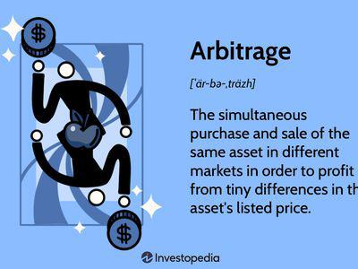

The foreign exchange market, often referred to as Forex or FX, represents the largest and most liquid financial market globally. It operates as a decentralized platform where currencies are traded, creating opportunities for participants ranging from global banks to individual retail traders. Within this fast-paced landscape, two components have emerged as critical factors in leveraging financial risks and maximizing returns: currency arbitrage and algorithmic trading.

Currency arbitrage allows traders to exploit price discrepancies between different markets or financial instruments. By simultaneously buying and selling the same currency pair, traders seek to capitalize on small inefficiencies in currency pricing, typically generated by market discrepancies. This process is integral to the trading strategies employed within the Forex market, offering avenues for potential profit with a lower risk profile compared to other speculative endeavors.



On the other hand, algorithmic trading introduces a technological edge to trading strategies. It involves automating the execution of trading orders through pre-programmed strategies and parameters, thereby enhancing efficiency and reducing the need for manual intervention. In the Forex market, algorithmic trading is pivotal, particularly with the advent of high-frequency trading, which allows for rapid execution capabilities and quick exploitation of price inefficiencies.

The fusion of currency arbitrage strategies and algorithmic trading presents a robust approach to navigating the complexities of Forex markets. Applying sophisticated algorithms, traders can identify and exploit fleeting market inefficiencies with remarkable speed and precision. By integrating these strategies, market participants can effectively manage financial risk while maximizing their potential for returns.

Exploring this integration further, this article deliberates on fundamental principles of currency arbitrage, the pivotal role of algorithms in modern trading, and the subsequent implications for financial risk management. Additionally, it uncovers the key challenges and opportunities present within this dynamic financial landscape, highlighting the intricate balance between risk and reward in contemporary Forex trading environments.

## Table of Contents

## Understanding Foreign Exchange Markets

The foreign exchange market, commonly referred to as the Forex or [FX](/wiki/fx-anomaly) market, stands as the world’s largest and most liquid financial market, facilitating the trading of national currencies. It plays a critical role in global commerce as it provides mechanisms for currency conversion, impacting the operations of businesses and the global economy at large. The primary activity within Forex is the exchange of currency pairs, where traders buy one currency while simultaneously selling another. This dual operation emphasizes the market's complexity and efficiency.

Participants in this market are diverse, ranging from large international banks and financial institutions to individual retail investors. Major banks account for a significant portion of trading [volume](/wiki/volume-trading-strategy), engaging in both proprietary trading and transactions on behalf of their clients. Meanwhile, retail traders have significantly increased their presence due to the rise of online trading platforms, making Forex more accessible to the public.

The pricing in Forex markets is expressed as currency pairs, where the first currency listed is the base currency, and the second is the quote currency. The quote indicates how much of the quote currency is needed to purchase one unit of the base currency. For example, in the EUR/USD currency pair, the Euro (EUR) is the base currency, and the US Dollar (USD) is the quote currency. The movement or fluctuation of these pairs is influenced by numerous factors such as interest rates, economic indicators, political events, and market sentiment.

Crucial to successful trading in Forex is an understanding of market dynamics, including quotes, spreads, and currency pair [volatility](/wiki/volatility-trading-strategies). The spread is particularly important as it represents the difference between the bid (buy) and ask (sell) prices and constitutes a transaction cost for traders. Tighter spreads generally indicate more [liquidity](/wiki/liquidity-risk-premium) and lower trading costs, making certain currency pairs more attractive to traders.

Forex markets operate on a nearly continuous basis, 24 hours a day, five days a week, due to their global nature and the presence of different time zones across financial centers from Tokyo to London to New York. This constant operation provides traders with ample opportunities to engage in trading activities, including [arbitrage](/wiki/arbitrage)—a strategy that involves capitalizing on price discrepancies across different markets.

In summary, the Forex market's vastness, high liquidity, and round-the-clock operation present both opportunities and challenges to market participants. A comprehensive understanding of its dynamics is essential for effective participation and successful trading outcomes.

## What Is Currency Arbitrage?

Currency arbitrage exploits price discrepancies across different markets or brokers by simultaneously buying and selling the same currency pair. This process takes advantage of temporary imbalances in currency pricing to realize profit with minimal risk. Arbitrage opportunities can arise due to differences in supply and demand across markets, varying transaction costs, and lag in price updates.

Two primary types of currency arbitrage exist: two-currency arbitrage and three-currency, or triangular, arbitrage. Two-currency arbitrage involves identifying price differences in a single currency pair across different platforms or markets. For example, if EUR/USD is quoted at 1.1800 on one exchange and 1.1820 on another, a trader can purchase the pair at the lower price and sell at the higher one, capturing the spread.

Three-currency or triangular arbitrage is more complex and involves three different currency pairs. In this scenario, traders exploit discrepancies in the cross-exchange rates between three currencies. For instance, assume the currency pairs USD/EUR, EUR/GBP, and GBP/USD are quoted on a market. By converting an initial amount of currency through these pairs in sequence and arriving back at the original currency, traders can profit if the resulting amount exceeds the initial input, violating the no-arbitrage condition.

The mathematical foundation for triangular arbitrage is based on the concept that the product of exchange rates in a closed loop should equal one if there are no arbitrage opportunities. If:
- $A$ is the rate for USD/EUR,
- $B$ is the rate for EUR/GBP,
- $C$ is the rate for GBP/USD,

A profitable arbitrage opportunity exists if the inequality $A \times B \times C \neq 1$ is true.

Recent advancements in technology have facilitated the rapid identification and exploitation of these inefficiencies through algorithmic systems, allowing for near-instantaneous transactions and more effective arbitrage strategies. Nonetheless, market efficiency continually reduces the window period for such discrepancies, urging traders to adopt more sophisticated tools to sustain profitability.

## Algorithmic Trading in Forex

Algorithmic trading, often referred to as algo trading, plays a crucial role in modern Forex markets by automating the execution of trading orders through pre-programmed strategies and parameters. This automation enhances trading efficiency by executing trades at speeds unattainable by manual trading, thereby reducing human intervention. The adoption of [algorithmic trading](/wiki/algorithmic-trading) in Forex has led to significant improvements in accuracy and the ability to exploit price inefficiencies rapidly, as algorithms can analyze enormous datasets and execute orders within microseconds.

A key component of algorithmic trading in Forex is High-Frequency Trading ([HFT](/wiki/high-frequency-trading-strategies)), which has revolutionized the market with its rapid execution capabilities. HFT utilizes sophisticated algorithms to conduct a large number of trades at exceptionally fast speeds. This approach allows traders to profit from small price discrepancies across different markets or over short time frames, often in fractions of a second.

Python, a popular programming language for algo trading, offers various libraries to support the development and implementation of trading algorithms. These libraries include NumPy for numerical computations, Pandas for data manipulation, and TA-Lib for technical analysis. A simple example of a Forex algo trading strategy in Python might look like this:

```python
import numpy as np
import pandas as pd
from ta.volatility import BollingerBands
from ta.momentum import RSIIndicator

# Import historical price data
data = pd.read_csv('forex_data.csv')
close_prices = data['Close']

# Calculate technical indicators
bb_indicator = BollingerBands(close=close_prices)
data['bb_hband'] = bb_indicator.bollinger_hband()
data['bb_lband'] = bb_indicator.bollinger_lband()

rsi_indicator = RSIIndicator(close=close_prices)
data['rsi'] = rsi_indicator.rsi()

# Define a simple strategy
def trading_signal(row):
    if row['Close'] < row['bb_lband'] and row['rsi'] < 30:
        return 'buy'
    elif row['Close'] > row['bb_hband'] and row['rsi'] > 70:
        return 'sell'
    return 'hold'

# Apply strategy to data
data['signal'] = data.apply(trading_signal, axis=1)
```

In this example, the strategy uses Bollinger Bands and the Relative Strength Index (RSI) as indicators to generate buy and sell signals. While simplistic, this demonstrates how algorithmic trading can be employed to systematically capitalize on technical patterns.

The speed and efficiency of algorithmic trading confer a competitive advantage in Forex markets by significantly decreasing the reaction time to market changes. However, the success of algo trading also heavily depends on the quality and robustness of the underlying algorithms. Continuous refinement and [backtesting](/wiki/backtesting) of strategies are necessary to adapt to evolving market conditions and maintain their effectiveness.

## Integrating Arbitrage and Algo Trading

Combining currency arbitrage and algorithmic trading offers a strategic advantage by enabling traders to capitalize on brief market inefficiencies with speed and precision. This integration leverages the capabilities of advanced algorithms, which are structured to identify arbitrage opportunities across currency markets and execute trades in mere milliseconds. This process not only enhances the probability of profit but also reduces the inherent drawbacks of manual execution.

The essence of this integration lies in the design of algorithms capable of continuous market monitoring. These algorithms can quickly assess multiple market conditions, such as bid-ask spreads and currency pair price discrepancies, to detect arbitrage chances that might not be noticeable to human traders. Once identified, the algorithm can execute a series of trades to exploit these opportunities almost instantaneously.

To exemplify, consider a simplistic Python-based framework that algorithms might deploy for identifying arbitrage situations:

```python
import time
from forex_python.converter import CurrencyRates

def check_arbitrage_opportunity(pair1, pair2, pair3):
    c = CurrencyRates()

    rate1 = c.get_rate(pair1[:3], pair1[3:])
    rate2 = c.get_rate(pair2[:3], pair2[3:])
    rate3 = c.get_rate(pair3[:3], pair3[3:])

    arbitrage_opportunity = rate1 * rate2 * rate3
    return arbitrage_opportunity > 1

currency_pairs = [('EURUSD', 'USDJPY', 'EURJPY')]

while True:
    for pair1, pair2, pair3 in currency_pairs:
        if check_arbitrage_opportunity(pair1, pair2, pair3):
            print(f'Arbitrage opportunity detected in {pair1}, {pair2}, {pair3}')
    time.sleep(1)
```

In this code example, `check_arbitrage_opportunity` calculates if an arbitrage opportunity exists by comparing currency exchange rates. If the multiplication of rates surpasses a threshold of 1, an opportunity is considered present.

The tight integration of algorithmic trading with arbitrage strategies facilitates rapid decision-making and execution, thereby effectively mitigating risks associated with manual processing errors and delays. By automating the identification and execution phases, the potential for profit is significantly enhanced, and human error is minimized. These algorithms accommodate the volatility and rapid pace of Forex markets, ensuring that traders can adapt swiftly to new information and capitalize on transient pricing inefficiencies. The strategic enhancement provided by this technologically driven approach represents a vital tool for modern Forex trading and risk management.

## Financial Risk Management in Forex Trading

In the context of Forex trading, financial risk management is crucial to navigate the inherent risks associated with market fluctuations and execution errors. Currency arbitrage, while generally considered a low-risk strategy due to instantaneous buy and sell actions across different markets, is still susceptible to execution risk. This is defined by the potential for unfavorable market movements in the short time span between executing trades. 

To mitigate such risks, algorithmic trading systems play a pivotal role. These systems are designed with advanced risk management protocols that are integral to minimizing potential losses. One fundamental aspect of these systems is their capacity to execute trades quickly and accurately, thereby reducing the window of exposure to adverse market movements. Additionally, they rely on pre-programmed strategies that adhere to set risk parameters, preventing trades that could exponentially increase exposure.

The sophistication of risk models within these algorithms is vital. They often utilize statistical methods and financial theories to predict potential market behavior, thus allowing traders to prepare for various scenarios. For instance, Value at Risk (VaR) models may be used to estimate the potential loss in value of a portfolio with a given confidence interval over a specific time period. This formula can be defined as:

$$
\text{VaR} = \sigma \times Z \times \sqrt{t}
$$

where $\sigma$ is the standard deviation of the portfolio returns, $Z$ is the Z-score corresponding to the desired confidence level, and $t$ represents the time horizon.

Real-time monitoring of trades and market conditions also forms the backbone of effective financial risk management in Forex trading. This involves continuous observation of global market data and rapid adjustment of trading algorithms to reflect current conditions. With this setup, traders can dynamically adjust their strategies to avoid significant financial exposure due to unexpected market events.

Python, widely used in the development of algorithmic trading systems, can facilitate real-time monitoring and risk management processes. Below is a simple example of Python code that demonstrates how such monitoring might be implemented:

```python
import pandas as pd
import numpy as np

# Generate a series representing portfolio returns
portfolio_returns = np.random.normal(0, 0.01, size=1000)

# Calculate Value at Risk
confidence_level = 0.95
z_score = abs(np.percentile(portfolio_returns, (1-confidence_level)*100))
VaR = np.std(portfolio_returns) * z_score * np.sqrt(1)  # Simplified for one day

print(f'Value at Risk: {VaR:.2f}')
```

In conclusion, effective financial risk management in Forex trading necessitates the integration of algorithmic systems with robust risk protocols and real-time monitoring. This approach not only helps in safeguarding investments against market volatility but also maximizes the advantage of employing currency arbitrage strategies.

## Challenges and Opportunities

High-speed algorithmic trading has transformed the foreign exchange (Forex) market, significantly impacting currency arbitrage opportunities. The rapid evolution of technology and the widespread adoption of algorithmic trading strategies have led to more efficient markets, thus diminishing some arbitrage potential. As markets adjust to these advanced technologies, traditional inefficiencies that once offered arbitrage prospects are increasingly rare.

To maintain a competitive edge, traders and institutions must innovate continuously. This involves developing sophisticated algorithms capable of identifying novel market inefficiencies that emerge despite increased efficiency. For example, traders can leverage [machine learning](/wiki/machine-learning) algorithms to analyze vast datasets for subtle patterns and correlations that may indicate arbitrage opportunities.

Consider the Python implementation of a simple moving average crossover strategy as a foundation for more complex algorithmic approaches:

```python
import pandas as pd
import numpy as np

def moving_average_strategy(prices, short_window=40, long_window=100):
    signals = pd.DataFrame(index=prices.index)
    signals['price'] = prices
    signals['short_mavg'] = prices.rolling(window=short_window, min_periods=1).mean()
    signals['long_mavg'] = prices.rolling(window=long_window, min_periods=1).mean()
    signals['signal'] = 0.0
    signals['signal'][short_window:] = np.where(
        signals['short_mavg'][short_window:] > signals['long_mavg'][short_window:], 1.0, 0.0)
    signals['positions'] = signals['signal'].diff()

    return signals

# Assume 'data' is a DataFrame with a DateTime index and a 'Close' column representing price
# signals = moving_average_strategy(data['Close'])
```

Despite the challenges of diminishing arbitrage opportunities, technology's role in Forex trading presents substantial profit potential. Operators can utilize real-time data analytics, machine learning, and [artificial intelligence](/wiki/ai-artificial-intelligence) to enhance decision-making processes and identify fleeting opportunities that manual methods might miss. Advanced predictive modeling and risk management strategies can further optimize trading performance and reduce exposure in volatile market conditions.

Moreover, the development of more sophisticated algorithmic frameworks allows traders to adapt rapidly to market changes, ensuring they are well-positioned to exploit emerging inefficiencies. This necessity for innovation drives continuous improvement in trading strategies, technology adoption, and computational techniques.

In conclusion, while high-speed algorithms have made markets more efficient, thus reducing some arbitrage opportunities, the continuous integration of new technologies and strategies ensures that significant opportunities for profit remain in the Forex market. Traders who successfully leverage these advancements while mitigating associated risks will be well-equipped to thrive in today's dynamic financial landscape.

## Conclusion

The integration of currency arbitrage, financial risk management, and algorithmic trading strategies offers a formidable approach to navigating modern [forex](/wiki/forex-system) markets. These components work synergistically, providing traders with the tools necessary to leverage market inefficiencies and optimize profit potential. Currency arbitrage allows for the exploitation of price discrepancies, while algorithmic trading enhances the speed and precision of these transactions, enabling execution in moments where manual trading would miss opportunities. Through automated systems, traders can apply pre-programmed strategies to manage transactions quickly and with reduced risk.

Financial risk management is crucial, as it incorporates sophisticated models and real-time data analysis to mitigate losses from unfavorable market movements. Traders must be vigilant in employing these technologies, understanding the inherent risks in forex trading, and updating their systems to adapt to market changes. The high-speed nature of algorithmic trading brings about its own challenges, as markets become increasingly efficient, reducing some traditional arbitrage opportunities.

Despite these challenges, the dynamic landscape of foreign exchange continually provides fresh opportunities for profit. The intersection of advanced technology and forex trading continues to evolve, offering innovative solutions for adept traders proficient in algorithmic strategies. Success in this field hinges not only on identifying these opportunities but also on the strategic application of technology-driven methods to effectively manage them. As forex markets advance, those who can skillfully integrate these elements stand to gain significantly in an ever-shifting financial environment.

## References & Further Reading

[1]: Fama, E. F. (1970). ["Efficient Capital Markets: A Review of Theory and Empirical Work."](https://www.jstor.org/stable/2325486) The Journal of Finance, 25(2), 383–417.

[2]: Lopez de Prado, M. (2018). ["Advances in Financial Machine Learning."](https://books.google.com/books/about/Advances_in_Financial_Machine_Learning.html?id=oU9KDwAAQBAJ) Wiley.

[3]: Hasbrouck, J. (2015). ["High-Frequency Trading and Price Discovery."](https://www.jstor.org/stable/24465658) The Review of Financial Studies, 28(3), 835–859.

[4]: Aronson, D. R. (2006). ["Evidence-Based Technical Analysis: Applying the Scientific Method and Statistical Inference to Trading Signals."](https://www.amazon.com/Evidence-Based-Technical-Analysis-Scientific-Statistical/dp/0470008741) Wiley.

[5]: Chan, E. P. (2009). ["Quantitative Trading: How to Build Your Own Algorithmic Trading Business."](https://github.com/ftvision/quant_trading_echan_book) Wiley.