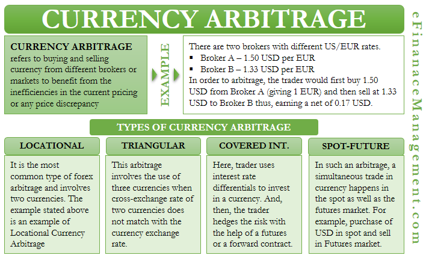

## Table of Contents

## What is currency arbitrage?

Currency arbitrage is when people make money by taking advantage of different prices for the same currency in different places. Imagine you can buy a dollar for less in one country and sell it for more in another country. By doing this, you can make a profit from the difference in prices.

This kind of trading happens quickly because the price differences usually don't last long. Traders use computers and special software to spot these opportunities and act fast. It's a bit like finding a good deal and selling it for a higher price, but it's all about currencies and happens around the world.

## How does currency arbitrage work?

Currency arbitrage works by taking advantage of small differences in the exchange rates of currencies across different markets. For example, if the exchange rate for converting US dollars to Euros is better in New York than in London, a trader could buy dollars in London and then sell them in New York for Euros, making a profit from the difference in rates. This process happens very quickly because these price differences usually don’t last long.

Traders use special computer programs to find these opportunities and act fast. These programs can look at exchange rates all over the world and spot where the rates are different. Once they find a good deal, the program can automatically buy and sell the currencies to make a profit. It’s like shopping for the best price, but it’s done with money and happens all around the world in just seconds.

## What are the different types of currency arbitrage?

There are a few types of currency [arbitrage](/wiki/arbitrage) that traders use. The first type is called simple arbitrage. This happens when a trader finds a difference in the price of a currency between two markets. For example, if the US dollar is cheaper in London than in New York, a trader can buy dollars in London and sell them in New York to make a profit. This type of arbitrage is the most straightforward and depends on quick action to take advantage of the price difference before it goes away.

Another type is called triangular arbitrage. This is a bit more complex. It involves three currencies and three different markets. For example, a trader might start with US dollars, convert them to Euros, then convert the Euros to British pounds, and finally convert the pounds back to US dollars. If the exchange rates are just right, the trader ends up with more US dollars than they started with. This type of arbitrage requires careful calculation and fast trading to work.

The last type is called covered interest arbitrage. This type mixes currency trading with investing. A trader might move money to a country where the interest rates are higher, but they also use something called a forward contract to protect themselves from changes in the currency's value. If everything works out, the trader makes money from the higher [interest rate](/wiki/interest-rate-trading-strategies) and also from any profit in the currency exchange. This type of arbitrage needs a good understanding of both currency markets and interest rates.

## What is triangular arbitrage?

Triangular arbitrage is a way to make money by using three different currencies and three markets. Imagine you start with US dollars. You convert those dollars into Euros, then take those Euros and convert them into British pounds. Finally, you convert the pounds back into US dollars. If the exchange rates are just right, you end up with more US dollars than you started with. This is like finding a special path where each step helps you make a little more money.

To do triangular arbitrage, you need to be quick and good at math. You have to watch the exchange rates very closely because they change all the time. If you see that the rates line up in a way that you can make a profit, you need to act fast. Traders often use computers to help them spot these opportunities and make the trades quickly. It's a bit like solving a puzzle, but you have to solve it before anyone else does.

## What is covered interest arbitrage?

Covered interest arbitrage is a way to make money by mixing currency trading with investing. Imagine you have some money and you see that another country has higher interest rates. You could move your money to that country to earn more interest. But, since currency values can change, you use something called a forward contract to protect yourself. A forward contract lets you agree today on the price you'll get for changing your money back in the future. If everything goes well, you make money from the higher interest rate and also from any profit in the currency exchange.

This type of arbitrage needs you to understand both currency markets and interest rates. You have to be smart about when and where to move your money. If the interest rate in the other country is high enough and the forward contract is good, you can make a profit. It's like finding a good deal on a savings account, but you also need to think about how the value of money might change between countries.

## What are the basic requirements to engage in currency arbitrage?

To engage in currency arbitrage, you need a few important things. First, you need some money to start with. This is called capital. You use this money to buy and sell different currencies. You also need to know a lot about how currency markets work. This means understanding exchange rates and how they change. It's helpful to be good at math too, because you need to quickly figure out if you can make a profit.

Second, you need a way to keep track of exchange rates around the world. This usually means using a computer with special software. The software helps you see when the rates are different in different places. It can also help you make trades very fast, which is important because the price differences don't last long. Sometimes, you might need to use a bank or a broker to help you make the trades. They can help you move your money quickly and safely between different countries.

## What are the risks associated with currency arbitrage?

Currency arbitrage can be risky. One big risk is that the exchange rates can change very quickly. If you're in the middle of a trade and the rates change, you might lose money instead of making a profit. Another risk is that the costs of making the trades, like fees from banks or brokers, can eat into your profits. If these costs are too high, you might not make as much money as you hoped.

Another risk is that technology can fail. If your computer or software stops working, you might miss a good chance to make money or lose money on a trade that goes wrong. Also, some countries have rules about moving money in and out. If you don't follow these rules, you could get into trouble or have your money stuck in another country. So, it's important to know the laws where you're trading.

## How can one identify arbitrage opportunities in the forex market?

To identify arbitrage opportunities in the [forex](/wiki/forex-system) market, you need to keep a close eye on exchange rates around the world. This means using special software that can quickly show you where the rates are different. For example, if the US dollar is cheaper in London than in New York, you might be able to buy dollars in London and sell them in New York to make a profit. The key is to act fast because these price differences usually don't last long. Traders often use computers to help them spot these opportunities and make the trades quickly.

Another way to find arbitrage opportunities is by looking at three different currencies and their exchange rates. This is called triangular arbitrage. You might start with US dollars, convert them to Euros, then convert the Euros to British pounds, and finally convert the pounds back to US dollars. If the exchange rates are just right, you end up with more US dollars than you started with. This type of arbitrage needs careful calculation and fast trading to work. It's like solving a puzzle, but you have to solve it before anyone else does.

## What tools and platforms are commonly used for currency arbitrage?

To do currency arbitrage, people often use special computer programs and software. These tools help them see exchange rates from all over the world in real time. They can quickly find where the rates are different and make trades fast. Some popular software includes MetaTrader 4 and 5, which are used by many traders. These programs can also do things like triangular arbitrage automatically, which means they can find the best way to trade three different currencies to make a profit.

Another important tool is a trading platform. These platforms let you buy and sell currencies easily. Some well-known platforms are Forex.com, eToro, and [Interactive Brokers](/wiki/interactive-brokers-api). They help you move your money quickly and safely between different countries. They also have tools to help you keep track of your trades and see how much money you're making or losing. Using these platforms and software together can make it easier to find and take advantage of arbitrage opportunities in the forex market.

## How do transaction costs and bid-ask spreads affect arbitrage profitability?

Transaction costs and bid-ask spreads can really change how much money you make from arbitrage. When you trade currencies, you have to pay fees. These fees come from banks or brokers and can eat into your profits. If these costs are too high, you might not make as much money as you hoped. It's like buying something at a store and then finding out you have to pay extra to take it home. If the extra cost is too high, it might not be worth buying it in the first place.

The bid-ask spread is also important. This is the difference between the price someone is willing to pay for a currency and the price someone is willing to sell it for. If this spread is big, it means you have to buy at a higher price and sell at a lower price, which can make it harder to make a profit. It's like trying to buy a toy for $10 and then sell it for $9. If the difference is too big, you won't make any money. So, to make arbitrage work, you need to find opportunities where the profit is bigger than the costs and the spread.

## Can you provide a real-world example of successful currency arbitrage?

A real-world example of successful currency arbitrage happened a few years ago with the Japanese yen and the US dollar. A trader noticed that the exchange rate for yen to dollars was better in Tokyo than in New York. So, the trader quickly bought yen in New York, where it was cheaper, and then sold those yen in Tokyo for dollars, where the rate was higher. Because the trader acted fast, they made a profit from the small difference in exchange rates between the two cities.

This kind of trade is not easy because the price differences usually don't last long. But with the right tools and quick action, traders can spot these opportunities and make money. In this case, the trader used special software to watch the exchange rates in real time and make the trades quickly. This helped them take advantage of the arbitrage opportunity before it disappeared.

## What advanced strategies can be used to optimize currency arbitrage?

To optimize currency arbitrage, traders can use a strategy called [statistical arbitrage](/wiki/statistical-arbitrage). This involves using math and computers to find patterns in how currencies move. Traders look at past data to see if they can predict when exchange rates might change. If they find a pattern, they can buy and sell currencies based on these predictions. This strategy needs a lot of data and fast computers, but it can help traders find more arbitrage opportunities than just looking at current exchange rates.

Another advanced strategy is called multi-market arbitrage. This means looking at more than two markets at once. For example, a trader might watch exchange rates in Tokyo, London, and New York all at the same time. By doing this, they can find more chances to make money. They might see that the US dollar is cheaper in Tokyo than in London, and then sell it for a higher price in New York. This strategy can be more complex, but it can lead to bigger profits if done right.

## What is Financial Risk Management in Forex Trading?

In the context of Forex trading, financial risk management is crucial to navigate the inherent risks associated with market fluctuations and execution errors. Currency arbitrage, while generally considered a low-risk strategy due to instantaneous buy and sell actions across different markets, is still susceptible to execution risk. This is defined by the potential for unfavorable market movements in the short time span between executing trades. 

To mitigate such risks, [algorithmic trading](/wiki/algorithmic-trading) systems play a pivotal role. These systems are designed with advanced risk management protocols that are integral to minimizing potential losses. One fundamental aspect of these systems is their capacity to execute trades quickly and accurately, thereby reducing the window of exposure to adverse market movements. Additionally, they rely on pre-programmed strategies that adhere to set risk parameters, preventing trades that could exponentially increase exposure.

The sophistication of risk models within these algorithms is vital. They often utilize statistical methods and financial theories to predict potential market behavior, thus allowing traders to prepare for various scenarios. For instance, Value at Risk (VaR) models may be used to estimate the potential loss in value of a portfolio with a given confidence interval over a specific time period. This formula can be defined as:

$$
\text{VaR} = \sigma \times Z \times \sqrt{t}
$$

where $\sigma$ is the standard deviation of the portfolio returns, $Z$ is the Z-score corresponding to the desired confidence level, and $t$ represents the time horizon.

Real-time monitoring of trades and market conditions also forms the backbone of effective financial risk management in Forex trading. This involves continuous observation of global market data and rapid adjustment of trading algorithms to reflect current conditions. With this setup, traders can dynamically adjust their strategies to avoid significant financial exposure due to unexpected market events.

Python, widely used in the development of algorithmic trading systems, can facilitate real-time monitoring and risk management processes. Below is a simple example of Python code that demonstrates how such monitoring might be implemented:

```python
import pandas as pd
import numpy as np

# Generate a series representing portfolio returns
portfolio_returns = np.random.normal(0, 0.01, size=1000)

# Calculate Value at Risk
confidence_level = 0.95
z_score = abs(np.percentile(portfolio_returns, (1-confidence_level)*100))
VaR = np.std(portfolio_returns) * z_score * np.sqrt(1)  # Simplified for one day

print(f'Value at Risk: {VaR:.2f}')
```

In conclusion, effective financial risk management in Forex trading necessitates the integration of algorithmic systems with robust risk protocols and real-time monitoring. This approach not only helps in safeguarding investments against market [volatility](/wiki/volatility-trading-strategies) but also maximizes the advantage of employing currency arbitrage strategies.

## References & Further Reading

[1]: Fama, E. F. (1970). ["Efficient Capital Markets: A Review of Theory and Empirical Work."](https://www.jstor.org/stable/2325486) The Journal of Finance, 25(2), 383–417.

[2]: Lopez de Prado, M. (2018). ["Advances in Financial Machine Learning."](https://books.google.com/books/about/Advances_in_Financial_Machine_Learning.html?id=oU9KDwAAQBAJ) Wiley.

[3]: Hasbrouck, J. (2015). ["High-Frequency Trading and Price Discovery."](https://www.jstor.org/stable/24465658) The Review of Financial Studies, 28(3), 835–859.

[4]: Aronson, D. R. (2006). ["Evidence-Based Technical Analysis: Applying the Scientific Method and Statistical Inference to Trading Signals."](https://www.amazon.com/Evidence-Based-Technical-Analysis-Scientific-Statistical/dp/0470008741) Wiley.

[5]: Chan, E. P. (2009). ["Quantitative Trading: How to Build Your Own Algorithmic Trading Business."](https://github.com/ftvision/quant_trading_echan_book) Wiley.