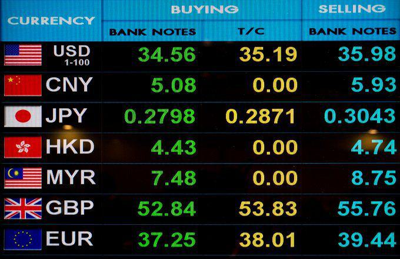

Understanding the dynamics of exchange rates is crucial in today's globalized economy. Exchange rates influence international trade by affecting the cost of imports and exports, foreign investment decisions, and cross-border financial activities. They also have significant implications for macroeconomic stability, as fluctuations can impact inflation, economic growth, and the balance of payments.

Exchange rate regimes provide a framework for how a country's currency interacts in the international financial markets. They encompass a spectrum from flexible rates, where market forces determine the currency's value, to fixed rates, where a currency's value is pegged to another currency or a basket of currencies for stability. Between these extremes lies a range of hybrid systems, such as the crawling peg, which allows gradual adjustments to maintain balance between control and flexibility.



Currency bands offer an additional layer of control and flexibility by setting upper and lower limits for currency fluctuations. This approach aims to stabilize exchange rates while allowing some movement within predefined limits, thus helping to manage economic volatility. By integrating currency bands within their monetary policy framework, countries can influence economic stability and control inflation by mitigating exchange rate volatility.

Furthermore, the evolving landscape of the foreign exchange (FX) markets has seen the rise of algorithmic trading, which uses automated systems to execute trades based on pre-defined strategies. Algorithmic trading can quickly adapt to changes in exchange rates within currency bands, optimizing trading outcomes. The incorporation of technologies such as machine learning and artificial intelligence enhances the ability to predict and react to market movements, thereby aiding in efficient currency risk management.

By examining these elements collectively, we gain insights into crafting strategies for effective currency risk management. Efficient management of exchange rate risk is imperative for investors, policymakers, and businesses as they navigate the complexities of the global financial system.

## Table of Contents

## Exchange Rate Regimes

Exchange rate regimes determine how a nation's currency is valued in relation to other currencies. These regimes are integral to international trade and financial relationships. The decision on which exchange rate regime to adopt influences a country's monetary policy, economic stability, and international competitiveness.

**Flexible Exchange Rate Regimes**

Under a flexible exchange rate regime, also known as a floating exchange rate system, the value of a currency is determined by market forces without direct governmental control or intervention. Rates fluctuate based on supply and demand dynamics, economic indicators, market speculation, and geopolitical events. The flexibility allows economies to automatically adjust to external shocks, buffer against inflationary pressures, and maintain autonomous monetary policies. Countries like the United States and Canada operate under this system, where market mechanisms guide currency valuation and adjustment processes.

**Fixed Exchange Rate Regimes**

In contrast, fixed exchange rate regimes peg a currency's value to another currency or a basket of currencies. This peg provides stability, fostering predictability in international transactions and reducing exchange rate risk. Such a regime requires a central bank to maintain currency reserves to defend the pegged value, intervening in the market when necessary. The fixed rate is generally aligned with key trading partners or stable currencies like the US dollar or euro. An example of this regime is the Hong Kong dollar, which is pegged to the US dollar, ensuring exchange rate stability despite market fluctuations.

**Crawling Peg System**

The crawling peg system operates as a hybrid between fixed and flexible regimes. It allows for periodic adjustments to the pegged exchange rate within a predetermined range or according to particular rules. These adjustments can be preannounced or based on specific economic indicators like inflation differentials or balance of payments disequilibria. The crawling peg aims to combine the benefits of stability found in fixed regimes with the flexibility of floating systems, enabling gradual alignment with underlying economic conditions. Countries with transitional or developing economies may adopt this regime to balance the need for stability with economic growth requirements.

In summary, the choice of an exchange rate regime can profoundly impact a nation's economic strategy and performance. While a flexible regime offers autonomous monetary policies and natural economic adjustments, a fixed regime ensures stability and reduced transaction costs. The crawling peg provides a median approach, allowing for controlled flexibility and gradual economic adjustment. Understanding these regimes assists in optimizing currency interactions on the global stage, aligning with national economic objectives.

## Understanding Currency Bands

A currency band is a system used in monetary policy to stabilize exchange rates and manage economic [volatility](/wiki/volatility-trading-strategies). It establishes upper and lower limits for currency value fluctuations relative to another currency or a basket of currencies. This structure seeks to balance the need for stability inherent in fixed exchange rate regimes with the flexibility associated with floating regimes.

In a fixed exchange rate regime, a country's currency value is tied or pegged to another major currency like the U.S. dollar. While this can provide stability, it limits a country's ability to respond to economic shifts. Conversely, a floating exchange rate regime allows market forces to determine currency values, offering flexibility but also subjecting the nation to potentially significant volatility.

A currency band offers a middle ground by permitting the currency to fluctuate within a predetermined range. This approach provides stability while still allowing for some adaptive movement in response to market pressures. For example, if a country's currency starts to approach the upper or lower boundary of the band, the central bank might intervene by buying or selling currency to revert the value toward the center of the band.

The formula for calculating the bounds of a currency band could be expressed as:
$$
\text{Upper Limit} = \text{Central Rate} \times (1 + \text{Band Percentage})
$$
$$
\text{Lower Limit} = \text{Central Rate} \times (1 - \text{Band Percentage})
$$

For instance, if a central rate is set at 100 units and the band percentage is 5%, the currency would be allowed to float between 95 and 105 units.

Currency bands can be instrumental in shielding economies from external shocks and speculative attacks. By controlling the extent of permissible fluctuations, they help to mitigate economic uncertainties, contributing to a more predictable business environment. Additionally, currency bands can enhance investor confidence by reducing the risk of sudden or drastic currency devaluations.

This approach has been utilized by several countries as part of their overall monetary policy strategy to achieve a blend of stability and autonomy. By providing a structured yet adaptable exchange rate mechanism, currency bands can support economic resilience in the face of global financial dynamics.

## Monetary Policy and Currency Bands

Currency bands play a significant role in enhancing monetary policy by helping to stabilize exchange rates, which is crucial in maintaining economic stability. By setting upper and lower limits for currency value fluctuations, currency bands offer a middle ground between fixed and floating exchange rate regimes. This structure allows central banks to manage economic volatility more effectively while maintaining a degree of control over their currency.

Central banks can use currency bands to influence economic stability and control inflation. When a currency strays towards the limits of the band, the central bank may intervene by buying or selling its currency to maintain stability, thereby preventing excessive volatility that can disrupt economic planning and international trade. This ability to manipulate the currency within specified bounds allows central authorities to respond to external economic shocks more flexibly, shielding the domestic economy from rapid changes in exchange rates.

The use of currency bands has significant implications for [liquidity](/wiki/liquidity-risk-premium) and interest rates, forming a critical element of monetary policy strategy. When a central bank intervenes to keep a currency within its band, it may affect domestic money supply. For example, purchasing domestic currency to appreciate its value can reduce liquidity, potentially leading to higher interest rates. Conversely, selling domestic currency can increase liquidity, putting downward pressure on interest rates. This interplay between liquidity management and interest rates is a fundamental part of how currency bands impact overall economic policy.

By controlling the [interest rate](/wiki/interest-rate-trading-strategies) through monetary policy actions aligned with currency bands, central banks aim to manage inflation. If a currency threatens to depreciate beyond the lower limit, prompting inflationary pressures, the central bank might increase interest rates to attract foreign capital and prop up the currency. Conversely, if deflationary pressures arise, a reduction in interest rates can be facilitated by purchasing foreign reserves, providing liquidity to the market. This dual leverage gives central banks an efficient tool for maintaining price stability within a targeted inflation range.

Hence, integrating currency bands into monetary policy provides a strategic advantage in controlling economic variables and directing economic outcomes towards predefined targets. Central banks can navigate the delicate balance between maintaining currency stability and fostering economic growth, ensuring a resilient economic framework amidst global fluctuations.

## Algorithmic Trading in the FX Markets

Algorithmic trading in foreign exchange ([FX](/wiki/fx-anomaly)) markets utilizes sophisticated, automated systems to execute trades based on pre-defined strategies. These systems are designed to exploit even the smallest fluctuations in currency prices to generate profits, thus playing a crucial role in modern financial markets.

At its core, [algorithmic trading](/wiki/algorithmic-trading) involves the use of computer algorithms to identify trading opportunities and execute trades at the best possible prices. These algorithms can process vast amounts of data and make decisions in fractions of a second, a task that would be impossible for human traders to accomplish with the same speed and efficiency. The primary advantage of algorithmic trading lies in its ability to minimize human emotions and trading errors, thereby optimizing outcomes.

In the context of currency bands, algorithmic trading systems are particularly effective. Currency bands set upper and lower limits for currency exchange rates, allowing a certain degree of fluctuation while maintaining overall stability. Algorithms can be programmed to exploit the predictable trends and movements within these bands. For instance, an algorithm can be devised to automatically buy a currency when it approaches the lower limit of its band and sell as it nears the upper limit, thereby capitalizing on the cyclical movements.

Furthermore, the integration of [machine learning](/wiki/machine-learning) (ML) and [artificial intelligence](/wiki/ai-artificial-intelligence) (AI) significantly enhances the potential of algorithmic trading systems. By employing these advanced technologies, trading algorithms can learn from historical data to identify patterns and make predictions about future market movements. This predictive capability is highly valuable, as it allows traders to pre-emptively position themselves in anticipation of market changes.

Python, a popular programming language in financial analysis, provides a robust platform for developing these trading models. Below is a simple illustration of how a moving average crossover strategy might be implemented:

```python
import pandas as pd

# Load historical FX data
data = pd.read_csv('fx_data.csv')

# Define short and long moving averages
data['Short_MA'] = data['Close'].rolling(window=20).mean()
data['Long_MA'] = data['Close'].rolling(window=50).mean()

# Generate signals
data['Signal'] = 0
data.loc[data['Short_MA'] > data['Long_MA'], 'Signal'] = 1  # Buy
data.loc[data['Short_MA'] < data['Long_MA'], 'Signal'] = -1  # Sell

# Backtesting the strategy
data['Returns'] = data['Close'].pct_change()
data['Strategy_Returns'] = data['Signal'].shift(1) * data['Returns']

# Calculate the total return
total_return = (1 + data['Strategy_Returns']).prod() - 1
print(f'Total Return for the strategy: {total_return:.2%}')
```

In this example, the algorithm implements a simple moving average crossover strategy, calculating short and long-term moving averages to generate buy or sell signals based on their crossovers. More sophisticated strategies could include statistical [arbitrage](/wiki/arbitrage), sentiment analysis, and high-frequency trading, all potentially augmented by AI capabilities.

The current and future integration of AI and ML in algorithmic trading not only promises increased market efficiency but also introduces new complexities and challenges. As these technologies evolve, they will likely continue to redefine the landscape of trading in FX markets and beyond.

## Case Study: China's Yuan and Currency Band Implementation

China's Yuan, officially known as the Renminbi (RMB), exemplifies the use of currency bands as a means of exchange rate management within a large and rapidly growing economy. Since 2005, China has adopted a currency band regime that establishes a stipulated range within which the Yuan is permitted to fluctuate against a basket of currencies. This approach signifies a shift from a strictly pegged exchange rate system to a more flexible, yet controlled, currency regime.

The decision to transition to a currency band regime was underpinned by several strategic economic objectives. Primarily, this framework aims to balance the necessity for exchange rate stability with the advantages of gradual flexibility. By allowing the Yuan to experience modest daily fluctuations, China can maintain its global export competitiveness. The controlled flexibility enables China to absorb external economic shocks and adapt to changes in the international markets, while still exerting a level of control to prevent excessive volatility that could harm its economic agenda.

Since the implementation of the currency band in 2005, the People’s Bank of China (PBOC), the country’s central bank, has played a pivotal role in managing the band. The PBOC sets the daily midpoint rate of the Yuan against the U.S. dollar and other major currencies, allowing the Yuan to trade within a band typically set at ±2% from this central rate. This mechanism provides a buffer against rapid speculative attacks and unwanted currency fluctuations.

The maintenance of this band is a critical component of China's broader monetary policy strategy. It allows for targeted interventions in the foreign exchange market by the PBOC, thereby helping to control inflation and support employment rates by ensuring that export prices remain competitive. Moreover, this managed flexibility has been instrumental in guiding the Yuan towards a more market-determined exchange rate without foregoing the central bank’s ability to steer economic outcomes.

China’s currency band system demonstrates a pragmatic approach to integrating into the global economy while maintaining domestic economic stability. The Yuan’s controlled flexibility through currency bands has supported the nation’s goal of gradual economic liberalization, reflecting an adaptive strategy to international monetary standards and pressures. This case highlights the practical application of currency bands and underscores their significance in orchestrating a large economy's exchange rate policies effectively.

## Implications and Future Outlook

Exchange rate regimes and currency bands play a pivotal role in shaping the future of global monetary policies. These financial instruments provide stability and flexibility by allowing countries to control their currency values while accommodating market forces. As globalization continues to intensify, the importance of these mechanisms in managing economic interactions cannot be overstated.

Algorithmic trading is growing in prominence, significantly boosting market efficiency and complexity. Through the use of sophisticated algorithms, traders can execute high-speed transactions based on pre-defined strategies, rapidly adapting to exchange rate fluctuations. Algorithms analyze vast datasets to identify trading opportunities, allowing market participants to capitalize on even slight changes within currency bands.

The integration of machine learning and artificial intelligence (AI) into algorithmic trading is revolutionizing foreign exchange markets. These technologies enable systems to learn from historical data, predict market trends, and adapt strategies in real-time. For example, [reinforcement learning](/wiki/reinforcement-learning) algorithms can be employed to forecast currency movements, enhancing decision-making processes. Here's a simple illustration of a reinforcement learning model using Python:

```python
import numpy as np

class SimpleFXTrader:
    def __init__(self, learning_rate=0.01, discount=0.95):
        self.learning_rate = learning_rate
        self.discount = discount
        self.q_table = {}

    def get_q_value(self, state, action):
        return self.q_table.get((state, action), 0.0)

    def learn(self, state, action, reward, next_state):
        q_value = self.get_q_value(state, action)
        future_reward = max([self.get_q_value(next_state, a) for a in ['buy', 'sell', 'hold']])
        q_value += self.learning_rate * (reward + self.discount * future_reward - q_value)
        self.q_table[(state, action)] = q_value

# Usage
trader = SimpleFXTrader()
# Market conditions and rewards would be fed into the learning function as the trader operates
```

Understanding these financial mechanisms is vital for individuals and institutions aiming to prepare for economic uncertainties. They offer valuable insights into potential risks and opportunities, allowing for informed decision-making. As technology evolves, so too will the strategies employed in currency risk management, making continuous learning and adaptation crucial.

The future outlook for exchange rate regimes and currency bands is closely interlinked with advancements in technology and changes in global trade dynamics. As economies become increasingly interconnected, countries will rely more on these tools to sustain economic stability and growth.

Overall, the ongoing evolution of exchange rate regimes, currency bands, and algorithmic trading underscores the need for vigilance and adaptation in the global financial landscape. These elements, when effectively harnessed, will continue to be essential in navigating future economic challenges.

## Conclusion

The interplay of exchange rate regimes, currency bands, and algorithmic trading showcases the complexity of modern finance, providing a nuanced understanding of how global economies interact and adapt to ongoing challenges and opportunities. Exchange rate regimes, whether flexible or fixed, establish the framework within which currencies are valued and exchanged. Flexible regimes allow currencies to float freely based on market forces, while fixed regimes peg a currency to another to maintain stability. The introduction of currency bands adds a layer of control, allowing currencies to fluctuate within predefined limits to balance stability and flexibility.

The mastery of these concepts is crucial for investors and policymakers striving to navigate the intricate global financial system. A thorough understanding allows for the deployment of strategies that mitigate financial risks associated with currency fluctuations and economic volatility. By employing strategic interventions such as currency bands, nations can support economic stability and foster sustainable growth. Policymakers must carefully calibrate these interventions to ensure they align with broader economic objectives, such as controlling inflation and maintaining employment.

Moreover, with the rise of algorithmic trading and advancements in technology, participants in the foreign exchange (FX) markets can efficiently identify and seize lucrative trading opportunities. Algorithmic trading systems utilize complex algorithms to analyze large datasets, execute trades at high speeds, and adapt swiftly to market changes. These systems leverage machine learning and artificial intelligence to enhance predictive accuracy and optimize trading outcomes in a fast-paced market environment.

As global trade and technology continue to evolve, these financial tools will remain integral in managing currency risks. The adoption and refinement of algorithmic trading strategies are expected to enhance market efficiency, although they may also contribute to increased market complexity. By understanding these intertwined financial elements, stakeholders can better anticipate and respond to economic uncertainties, positioning themselves to benefit from the ever-changing landscape of global finance. The ongoing integration of technology and finance signifies a future where currency risk management is more sophisticated, offering new potential for innovation and growth in the financial sector.

## References & Further Reading

[1]: Williamson, J. (2000). ["Exchange Rate Regimes for Emerging Markets: Reviving the Intermediate Option."](https://archive.org/details/exchangerateregi0000will) Institute for International Economics.

[2]: LeBaron, B. (2001). ["Empirical Regularities from Interacting Long- and Short-Memory Investors in an Agent-Based Stock Market."](https://ieeexplore.ieee.org/document/956709) IEEE Transactions on Evolutionary Computation 5 (5).

[3]: "Foreign Exchange Intervention: A Specific Example from Hong Kong" in ["Managing Economic Volatility in Foreign Exchange Markets."](https://www.khbanaszak.org/8ManagingEconomicVolatilityForeignExchangeMarkets.pdf) International Monetary Fund, Occasional Paper.

[4]: ["The Benefits and Drawbacks of a Crawling Peg."](https://en.wikipedia.org/wiki/Crawling_peg) Journal of Economic Asymmetries.

[5]: Taylor, J.B., & Williams, J.C. (2010). ["Simple and Robust Rules for Monetary Policy"](https://www.nber.org/papers/w15908) in Handbook of Monetary Economics, Elsevier.

[6]: Aldridge, I. (2010). ["High‐Frequency Trading: A Practical Guide to Algorithmic Strategies and Trading Systems."](https://onlinelibrary.wiley.com/doi/pdf/10.1002/9781119203803.fmatter) Wiley Trading.

[7]: Engle, R.F., & Patton, A.J. (2001). ["What Good Is a Volatility Model?"](https://web-static.stern.nyu.edu/rengle/EnglePattonQF.pdf) Quantitative Finance, 1(2), 237–245.