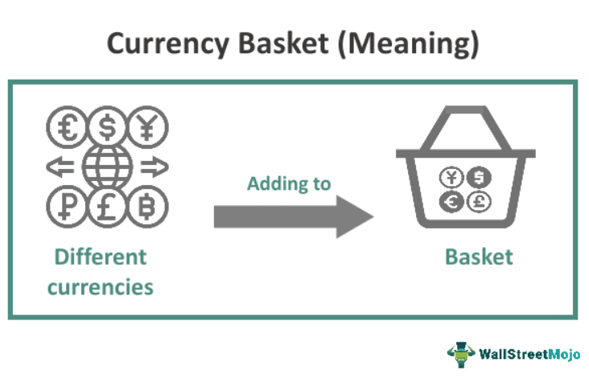

## Table of Contents

## What is a currency basket?

A currency basket is a collection of different currencies that are grouped together. People or organizations use it to measure the value of money or to reduce the risk of using just one currency. Imagine you have a basket of fruits with apples, bananas, and oranges. If the price of apples goes up, it won't affect the whole basket as much because you also have bananas and oranges. It's the same idea with a currency basket.

For example, the International Monetary Fund (IMF) uses a currency basket called the Special Drawing Rights (SDR). The SDR includes the US dollar, the euro, the Chinese yuan, the Japanese yen, and the British pound. By using this basket, the IMF can have a more stable way to help countries that need financial support. It's like having a safety net made of different currencies, which can be more reliable than relying on just one.

## Why are currency baskets used?

Currency baskets are used to make money more stable and safe. When you use just one currency, its value can go up and down a lot because of things like what's happening in that country's economy or politics. But when you mix different currencies together in a basket, the ups and downs of one currency can be balanced out by the others. It's like having a team of currencies working together to keep things steady.

People and big organizations, like the International Monetary Fund, use currency baskets to help countries that need financial help. Instead of giving money in just one currency, which might lose value quickly, they can give money in a mix of currencies. This makes it easier for countries to plan and use the money they get. It's a way to share the risk and make sure the help is more reliable.

## How does a currency basket differ from a single currency?

A currency basket is like a group of different money types put together, while a single currency is just one type of money. Think of a currency basket like a fruit salad with different fruits, and a single currency like just eating apples. If the price of apples goes up or down a lot, it affects you a lot if you only have apples. But in a fruit salad, if the price of apples changes, it doesn't affect the whole salad as much because you also have other fruits.

Using a currency basket helps make money more stable because it spreads out the risk. If one currency in the basket loses value, the others can help balance it out. This is helpful for big organizations like the International Monetary Fund when they want to help countries. They can give money in a mix of currencies, which is safer and more reliable than giving money in just one currency that might lose value quickly.

## What are some common currencies included in a currency basket?

A currency basket usually has a mix of the world's most important money types. Some common ones are the US dollar, the euro, the Chinese yuan, the Japanese yen, and the British pound. These are often used because they are from big and strong economies, and many people around the world use them for buying and selling things.

The International Monetary Fund (IMF) uses a special currency basket called Special Drawing Rights (SDR). It includes the US dollar, the euro, the Chinese yuan, the Japanese yen, and the British pound. By using this mix, the IMF can help countries in a more stable way, because if one of these currencies goes up or down a lot, the others can help balance it out.

## How is the value of a currency basket determined?

The value of a currency basket is figured out by looking at how much each currency in the basket is worth and then putting them all together. Each currency has a certain weight, which is like how important it is in the basket. For example, if the US dollar is more important than the Japanese yen in the basket, it will have a bigger weight. The total value of the basket is then calculated by adding up the value of each currency times its weight.

This way of figuring out the value helps make the basket stable because it uses a mix of different currencies. If one currency goes up or down a lot, the others can help balance it out. Big organizations like the International Monetary Fund use this method to help countries with money. By using a basket instead of just one currency, they can give money that is more reliable and less likely to lose value quickly.

## What are the advantages of using a currency basket?

Using a currency basket can help make money more stable. When you use just one type of money, its value can go up and down a lot because of things like what's happening in that country's economy or politics. But if you mix different types of money together in a basket, the ups and downs of one type can be balanced out by the others. It's like having a team of money types working together to keep things steady. This is really helpful for big organizations like the International Monetary Fund when they want to help countries. They can give money in a mix of currencies, which is safer and more reliable than giving money in just one type that might lose value quickly.

Another advantage of using a currency basket is that it helps spread out the risk. If one currency in the basket loses value, the others can help balance it out. This means that if you're using a currency basket, you're less likely to be affected by big changes in the value of just one type of money. It's like having a safety net made of different currencies, which can be more reliable than relying on just one. This makes it easier for countries to plan and use the money they get, because they know it's less likely to lose value suddenly.

## What are the potential disadvantages of a currency basket?

Using a currency basket can be tricky because it's more complicated than using just one type of money. You have to keep track of how much each currency in the basket is worth and how important each one is. This can be hard work and might need special tools or experts to help. Also, if you're using a currency basket, you might have to change the mix of currencies sometimes. This can be a lot of work and might cost more money.

Another problem with currency baskets is that they might not always work the way you want them to. Even though they're meant to make money more stable, sometimes all the currencies in the basket can go down in value at the same time. This can happen if there's a big problem in the world economy that affects many countries. So, even with a basket, you might still face big changes in the value of your money.

## How do central banks manage currency baskets?

Central banks manage currency baskets by keeping a close eye on the value of each currency in the basket and how important each one is. They use special tools and experts to do this. Sometimes, they might need to change the mix of currencies in the basket. This can happen if one currency starts to lose value a lot, or if a new currency becomes more important. Central banks have to be careful and smart about these changes because they can affect the whole basket.

Even though managing a currency basket can be hard, central banks do it to help make money more stable. If one currency in the basket goes down in value, the others can help balance it out. This is important for big organizations like the International Monetary Fund when they want to help countries. By using a basket instead of just one currency, central banks can give money that is more reliable and less likely to lose value quickly.

## Can you explain the mechanism of rebalancing in a currency basket?

Rebalancing a currency basket is like making sure all the fruits in your fruit salad are in the right amounts. Sometimes, one fruit might get too big or too small compared to the others. When this happens, you need to take some out or add more to keep the salad balanced. In a currency basket, if one currency starts to lose or gain a lot of value compared to the others, the people in charge might need to change how much of that currency is in the basket. They do this to make sure the basket stays stable and works the way it's supposed to.

The people who manage the basket, like central banks or big organizations, use special tools and experts to figure out when and how to rebalance. They look at things like how much each currency is worth and how important it is in the basket. If they decide to rebalance, they might take some of one currency out and add more of another. This can be a lot of work and might cost money, but it's important to keep the basket working well. By doing this, they can help make sure the money in the basket stays reliable and doesn't lose value suddenly.

## What role do currency baskets play in international trade?

Currency baskets help make international trade easier and safer. When countries trade with each other, they often use different types of money. If they use just one type of money, its value can go up and down a lot because of things like what's happening in that country's economy or politics. But if they use a mix of different types of money in a basket, the ups and downs of one type can be balanced out by the others. This makes it easier for countries to plan and do business because they know the money they're using is more stable.

For example, big organizations like the International Monetary Fund use currency baskets to help countries that need money. Instead of giving money in just one type, which might lose value quickly, they can give money in a mix of types. This makes it easier for countries to use the money they get because it's less likely to lose value suddenly. By using a currency basket, countries can trade with each other more confidently, knowing that the money they're using is more reliable.

## How do currency baskets affect exchange rate volatility?

Currency baskets help lower the ups and downs of exchange rates. When you use just one type of money, its value can change a lot because of things like what's happening in that country's economy or politics. But if you mix different types of money together in a basket, the big changes in one type can be balanced out by the others. This makes the value of the basket more stable, which means less wild swings in exchange rates.

Even though currency baskets can help make exchange rates more stable, they don't always work perfectly. Sometimes, all the currencies in the basket can go down in value at the same time, especially if there's a big problem in the world economy that affects many countries. But overall, using a currency basket can still make exchange rates less bumpy and help countries and big organizations plan better.

## What are some historical examples of currency baskets and their impacts?

One famous example of a currency basket is the Special Drawing Rights (SDR) used by the International Monetary Fund (IMF). The SDR was created in 1969 to help countries that needed money. It started with just the US dollar, the British pound, the French franc, and the German mark. Later, it changed to include the US dollar, the euro, the Chinese yuan, the Japanese yen, and the British pound. The SDR helped make the money the IMF gave out more stable because it used a mix of currencies. This made it easier for countries to use the money they got without worrying too much about big changes in value.

Another example is the European Currency Unit (ECU), which was used before the euro. The ECU was a basket of different European currencies, like the German mark, the French franc, and the Italian lira. It was used from 1979 to 1999 to help make trade between European countries easier and more stable. The ECU helped countries plan better because it made exchange rates between them less bumpy. When the euro was introduced in 1999, it replaced the ECU and made trade even easier because now all these countries used the same money.

## What are Currency Baskets and How Do They Work?

A currency basket is a financial instrument comprised of multiple currencies, each with a specific weight, utilized by countries and monetary authorities to stabilize the market value of their own currencies. By distributing exposure across different currencies, a currency basket serves to mitigate the impact of [volatility](/wiki/volatility-trading-strategies) and protect against exchange rate fluctuations. This diversification is crucial for maintaining economic stability and helps nations regulate their monetary policies.

The primary function of a currency basket is to provide a benchmark or reference point to peg the value of a specific currency. In doing so, it acts as a safeguard against erratic changes in currency values, offering a stabilizing buffer that disperses risk across several currencies. This is particularly beneficial in environments susceptible to rapid exchange rate changes, allowing countries to maintain more consistent and reliable economic conditions.

Countries and corporations employ different strategies to leverage currency baskets, either for pegging a currency or reducing risks in international contracts. The choice of currencies included in a basket and their respective weights depends on the specific economic and trade relationships each country maintains, alongside strategic economic goals. This versatility in application signifies the broad utility of currency baskets in international finance, where they are used to hedge against multi-directional market risks and ensure more predictable fiscal outcomes.

Prominent examples of currency baskets include the U.S. Dollar Index (USDX) and the European Currency Unit (ECU). The U.S. Dollar Index, for instance, tracks the performance of the U.S. dollar against a basket of six major currencies: the euro (EUR), Japanese yen (JPY), British pound (GBP), Canadian dollar (CAD), Swedish krona (SEK), and Swiss franc (CHF). These currencies were selected based on the United States' significant trading partners and the weights assigned to each are reflective of trade relationships. The formula to calculate the USDX is given by: 

$$
\text{USDX} = 50.14348112 \times (\text{EUR/USD})^{0.576} \times (\text{USD/JPY})^{0.136} \times (\text{GBP/USD})^{0.119} \times (\text{USD/CAD})^{0.091} \times (\text{USD/SEK})^{0.042} \times (\text{USD/CHF})^{0.036}
$$

This index serves as a crucial tool in [forex](/wiki/forex-system) trading, allowing investors to gauge the relative strength or weakness of the U.S. dollar against other major currencies. Similarly, the European Currency Unit served as a precursor to the euro, representing a weighted average of EU member currencies before the euro was introduced.

In forex trading, currency baskets offer traders a means to evaluate currency value with greater reliability by minimizing single currency risk. They enable more strategic and informed trading activities, allowing for improved assessment and execution of trades across diverse currency pairs. The construction and application of these baskets highlight their integral role in global financial markets, where they continue to facilitate effective monetary policy implementation and strategic trading initiatives.

## References & Further Reading

[1]: Bergstra, J., Bardenet, R., Bengio, Y., & Kégl, B. (2011). ["Algorithms for Hyper-Parameter Optimization."](https://dl.acm.org/doi/10.5555/2986459.2986743) Advances in Neural Information Processing Systems 24.

[2]: ["Advances in Financial Machine Learning"](https://www.amazon.com/Advances-Financial-Machine-Learning-Marcos/dp/1119482089) by Marcos Lopez de Prado

[3]: ["Evidence-Based Technical Analysis: Applying the Scientific Method and Statistical Inference to Trading Signals"](https://www.amazon.com/Evidence-Based-Technical-Analysis-Scientific-Statistical/dp/0470008741) by David Aronson

[4]: ["Machine Learning for Algorithmic Trading"](https://github.com/stefan-jansen/machine-learning-for-trading) by Stefan Jansen

[5]: ["Quantitative Trading: How to Build Your Own Algorithmic Trading Business"](https://www.amazon.com/Quantitative-Trading-Build-Algorithmic-Business/dp/1119800064) by Ernest P. Chan