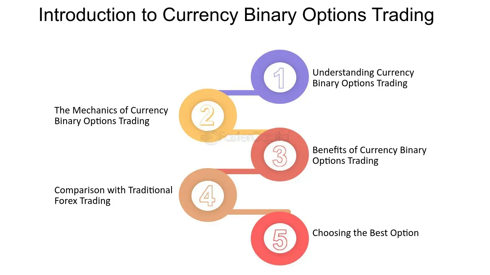

## Table of Contents

## What is currency binary?

Currency binary, also known as binary options trading, is a type of financial trading where you predict if the price of a currency will go up or down within a certain time. You only have two choices: the price will go up or the price will go down. If you predict correctly, you earn a fixed amount of money. If you predict wrongly, you lose your investment.

It's called "binary" because there are only two possible outcomes. This makes it simple but also risky. People use currency binary trading to try and make money from changes in currency values. It's important to understand that it can be very risky, and you should be careful and learn about it before you start trading.

## How does currency binary trading work?

Currency binary trading is a type of financial trading where you guess if a currency's price will go up or down in a set time. You choose a currency pair, like USD/EUR, and decide if you think the price of the first currency (USD) will be higher or lower than the second currency (EUR) at the end of the time you picked. If you think it will go up, you buy a "call" option. If you think it will go down, you buy a "put" option. You pay a certain amount of money to make your guess, and if you're right, you get a fixed amount of money back. If you're wrong, you lose the money you paid.

The time you choose can be short, like a few minutes, or longer, like a few hours or days. When the time is up, the trading platform checks the price of the currency. If the price is where you guessed it would be, you win. If not, you lose. It's simple to understand, but it can be risky because you can lose your money quickly. That's why it's important to learn about it and be careful before you start trading.

## What are the basic terms used in currency binary trading?

In currency binary trading, you'll hear a few basic terms that help explain how it works. One key term is "currency pair," which is two different currencies you're trading, like USD/EUR. You're guessing if the first currency (USD) will go up or down compared to the second currency (EUR). Another term is "expiration time," which is when your guess is checked to see if you were right. You can pick a short time, like a few minutes, or a longer time, like a few hours or days.

There are also terms for the two choices you can make. If you think the first currency will go up, you buy a "call" option. If you think it will go down, you buy a "put" option. When you make your guess, you pay a certain amount of money, which is called the "investment" or "premium." If your guess is right at the expiration time, you get a fixed amount of money, called the "payout." If you're wrong, you lose the money you paid. These terms help you understand what's happening when you trade.

## What are the common types of currency binary options?

There are a few common types of currency binary options that traders use. The first one is the "High/Low" option, which is also called "Call/Put." With this option, you guess if the price of a currency will be higher or lower than it is now when the time is up. If you think it will go up, you buy a "call" option. If you think it will go down, you buy a "put" option. It's simple and the most popular type of binary option.

Another type is the "Touch/No Touch" option. Here, you guess if the price of a currency will touch a certain price before the time is up. If you think it will touch that price, you buy a "touch" option. If you think it won't, you buy a "no touch" option. This type can be more exciting because it gives you a chance to win even if the price doesn't stay above or below your guess at the end. The last common type is the "Range" or "Boundary" option. With this, you guess if the price of a currency will stay within a certain range or go outside of it by the time the option expires. If you think it will stay inside the range, you buy an "in-range" option. If you think it will go outside, you buy an "out-range" option. These types of options give you different ways to trade based on what you think will happen to the currency price.

## How can someone start trading currency binary options?

To start trading currency binary options, you first need to find a reliable trading platform or broker. You can search online for popular platforms that offer binary options trading. Once you choose a platform, you'll need to sign up for an account. This usually involves filling out a form with your personal information and verifying your identity. After your account is set up, you'll need to deposit money into it. Most platforms have a minimum deposit amount, so make sure you know what that is before you start.

Once your account is funded, you can start trading. You'll need to pick a currency pair, like USD/EUR, and decide if you think the first currency (USD) will go up or down compared to the second currency (EUR) by the time your option expires. You can choose the expiration time, which can be as short as a few minutes or as long as a few days. Then, you decide if you want to buy a "call" option (if you think the price will go up) or a "put" option (if you think the price will go down). You'll need to decide how much money to invest in your guess. If you're right when the time is up, you get a fixed amount of money. If you're wrong, you lose the money you invested. It's important to learn about trading and be careful because it can be risky.

## What platforms are available for currency binary trading?

There are several platforms where you can trade currency binary options. Some popular ones include IQ Option, Olymp Trade, and Binary.com. These platforms offer easy-to-use websites and mobile apps where you can sign up for an account, deposit money, and start trading. They often have tutorials and demo accounts to help you learn how to trade without risking real money at first.

Each platform might have different features and rules. For example, some might offer more types of binary options, like High/Low, Touch/No Touch, or Range options. Others might have different minimum deposit amounts or payout rates. It's a good idea to compare a few platforms to see which one fits your needs best. Remember to check if the platform is regulated and has good reviews from other users to make sure it's safe and reliable.

## What are the risks involved in currency binary trading?

Currency binary trading can be very risky. One big risk is that you can lose all the money you put into a trade if your guess is wrong. This is because binary options only have two outcomes: you win a fixed amount or you lose your whole investment. It's like betting on whether a coin will land on heads or tails, but with real money. This means you need to be ready to lose the money you're using to trade.

Another risk is that binary options can be hard to predict. The price of a currency can change quickly because of things like news, politics, or the economy. Even if you study a lot and try to make good guesses, you might still get it wrong a lot. This can make trading stressful and lead to big losses if you're not careful. It's important to only use money you can afford to lose and to learn as much as you can before you start trading.

## How can one manage risk in currency binary trading?

Managing risk in currency binary trading is important because it can help you avoid losing a lot of money. One way to manage risk is by only using money you can afford to lose. This means you should not use money you need for important things like bills or rent. Another way to manage risk is by starting with a small amount of money. If you're new to trading, it's a good idea to begin with a small investment so you can learn without risking too much. You can also use a demo account on some trading platforms to practice trading without using real money.

Another way to manage risk is by setting limits on how much you're willing to lose in a day or a week. This is called setting a "stop-loss" limit. If you reach this limit, you stop trading for that period. This can help you avoid losing more money if things are not going well. It's also a good idea to learn about the currency pairs you're trading and to keep up with news that might affect their prices. The more you know, the better your guesses might be. Remember, even with these steps, trading can still be risky, so always be careful and think before you trade.

## What strategies can be used to increase success in currency binary trading?

One way to increase your success in currency binary trading is by learning a lot about the currency pairs you want to trade. You should study things like how the economy is doing in the countries of the currencies you're trading, and keep up with news that might affect their prices. For example, if a country's economy is doing well, its currency might go up in value. Also, try using a demo account on a trading platform to practice without risking real money. This can help you get better at making guesses without losing anything.

Another strategy is to use technical analysis. This means looking at charts and patterns to try and predict what the price of a currency might do next. Many traders use tools like moving averages, support and resistance levels, and trend lines to help them make better guesses. It's also a good idea to set rules for yourself, like how much money you're willing to lose in a day or a week. This can help you stop trading if things are not going well, which can save you from losing more money. Remember, even with these strategies, trading can still be risky, so always be careful and think before you trade.

## How does currency binary trading compare to other forms of trading?

Currency binary trading is different from other forms of trading like forex or stock trading because it's simpler. In binary options, you only guess if a currency's price will go up or down by a certain time. If you guess right, you get a fixed amount of money. If you guess wrong, you lose what you paid. This is easier to understand than forex trading, where you buy and sell currencies and the amount you make or lose can change a lot. Stock trading is also different because you buy shares in a company and hope the price goes up over time. Binary options are quicker and simpler but also riskier because you can lose all your money on one guess.

Another difference is that binary options have a set time for your guess, called the expiration time. This can be short, like a few minutes, or longer, like a few hours or days. In forex and stock trading, you can hold onto your trades for as long as you want. Binary options are also usually cheaper to start with, so you can begin trading with less money. But because you can lose everything on one trade, it's important to be very careful and only use money you can afford to lose.

## What are the regulatory considerations for currency binary trading?

When you trade currency binary options, it's important to know about the rules that different countries have. Some countries have strict rules to make sure trading is fair and safe. For example, in the United States, the Commodity Futures Trading Commission (CFTC) and the Securities and Exchange Commission (SEC) watch over binary options trading. They make sure that trading platforms follow the rules and don't cheat people. In Europe, the European Securities and Markets Authority (ESMA) has rules to protect traders, like limits on how much you can lose. It's a good idea to check the rules in your country before you start trading so you know you're doing it the right way.

Not all countries allow binary options trading. Some places, like Canada and Australia, have banned it because they think it's too risky. If you live in a country where it's not allowed, you might not be able to use some trading platforms. Also, even if it's allowed in your country, make sure the platform you choose is regulated. A regulated platform has to follow the rules and is checked by the government to make sure it's safe. This can help you avoid scams and make sure your money is protected. Always do your research and be careful when you start trading.

## What advanced tools and indicators are used by expert traders in currency binary trading?

Expert traders in currency binary trading often use advanced tools and indicators to help them make better guesses about currency prices. One common tool is the moving average, which helps traders see the overall trend of a currency's price over time. They might use different types of moving averages, like simple moving averages (SMA) or exponential moving averages (EMA), to get a clearer picture. Another important tool is the Relative Strength Index (RSI), which shows if a currency is overbought or oversold. This can help traders decide if it's a good time to buy a call or put option. Bollinger Bands are also popular because they show how much a currency's price is moving around its average, which can help predict if the price will go up or down soon.

In addition to these tools, many expert traders use chart patterns to spot trends and make better guesses. For example, they might look for patterns like head and shoulders, double tops, or triangles to predict what the price might do next. Some traders also use more complex indicators like the MACD (Moving Average Convergence Divergence), which can show when a trend is about to change. Fibonacci retracement levels are another tool that helps traders find key levels where the price might change direction. By using these advanced tools and indicators together, expert traders can make more informed decisions and increase their chances of success in currency binary trading.

## References & Further Reading

[1]: ["Binary Options: Strategies for Directional and Volatility Trading"](https://books.google.com/books/about/Binary_Options.html?id=1YIsMcb990YC) by Alex Nekritin

[2]: ["Options, Futures, and Other Derivatives"](https://www.amazon.com/Options-Futures-Other-Derivatives-9th/dp/0133456315) by John C. Hull

[3]: ["Algorithmic and High-Frequency Trading"](https://www.amazon.com/Algorithmic-High-Frequency-Trading-Mathematics-Finance/dp/1107091144) by Álvaro Cartea, Sebastian Jaimungal, and José Penalva

[4]: Halperin, I., and Shkolnik, A. (2018). ["Teaching Neural Networks to Trade: The Case of the Flash Crash Algorithm,"](https://www.researchgate.net/profile/Igor-Halperin-2) cited in Columbia University Zuckerman Institute Publications.

[5]: [Mit Soft, B. "An Overview of Algorithmic Trading."](https://www.semanticscholar.org/paper/An-Overview-of-Algorithmic-Trading-in-Foreign-and/ae76655f6f954cd9b60809586d138c2f219b2d08) Algorithmic Trading with Interactive Brokers: Edition 2