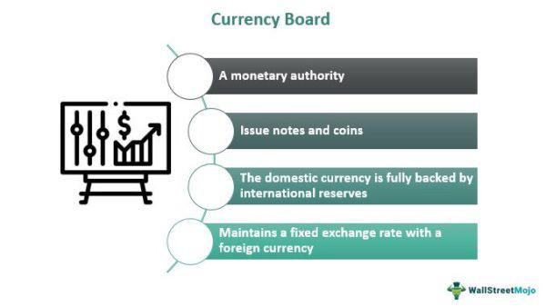

In an increasingly interconnected global economy, understanding the complexities of exchange rates, monetary policies, currency boards, and algorithmic trading is essential for market participants. Exchange rates, which determine the relative value of currencies, are primarily influenced by economic factors such as inflation, interest rates, and government policies. The fluctuations in exchange rates have direct implications for international trade, affecting the competitiveness of exports and the cost of imports for nations.

Monetary policy, typically managed by central banks, plays a pivotal role in stabilizing or influencing currency values. Central banks can adjust interest rates and control the money supply in their respective economies, impacting economic stability and currency valuations. These policy tools are used to curb inflation, encourage economic growth, or deal with economic shocks. For instance, lowering interest rates generally stimulates borrowing and investment, potentially weakening the domestic currency as a side effect due to increased supply.



Currency boards offer a distinct approach to managing a country's currency value by pegging the local currency to another, more stable foreign currency. This system can provide exchange rate stability, a key factor beneficial for fostering international trade and investment. However, a currency board limits a country's ability to conduct independent monetary policy since its interest rates must align with those of the anchor currency to maintain the peg. To sustain this system, countries often need substantial foreign currency reserves, making it economically demanding but potentially rewarding in terms of economic predictability.

Algorithmic trading represents the intersection of technology and financial markets, where automated systems execute trades based on pre-defined criteria. This approach leverages technological advancements to increase trade execution efficiency in currency markets, utilizing speed and data analytics. By capitalizing on short-lived fluctuations and trading opportunities, algorithmic trading can optimize financial outcomes. The use of algorithms also allows for high-frequency trading, where trades can be executed in fractions of a second, and for the adaptation of strategies as market conditions evolve. As technology continues to progress, its integration into financial markets grows more pronounced, underscoring the need for participants to understand and adapt to these advanced trading methodologies.

Understanding these elements—exchange rates, monetary policy, currency boards, and algorithmic trading—is crucial for traders, policymakers, and investors who aim to navigate the complexities of today’s financial markets effectively.

## Table of Contents

## Exchange Rate and Monetary Policy

Exchange rates signify the comparative value of one currency against another, governed by various economic indicators, inflation rates, and monetary policies. These rates are pivotal in international trade and investment as they dictate the cost of exchanging one currency for another. A key player in this dynamic is the central bank, which employs monetary policy tools to influence economic stability and currency valuation. 

Monetary policy, particularly [interest rate](/wiki/interest-rate-trading-strategies) adjustments, acts as a lever for central banks to manage the economy. By increasing interest rates, a central bank can make its currency more attractive to foreign investors, as higher rates promise better returns on investments denominated in that currency. This increased demand can lead to an appreciation of the currency. Conversely, reducing interest rates can stimulate economic activity by making borrowing cheaper, potentially leading to a depreciation of the currency as investors seek more lucrative opportunities elsewhere.

Central banks' decisions regarding interest rates are critical in ensuring currency stability. A stable currency fosters an environment conducive to international trade competitiveness, as it reduces the uncertainty associated with currency fluctuations. For instance, if the value of a currency remains stable or increases, it can impact export competitiveness by making exported goods more expensive for foreign buyers. Conversely, a stable or depreciating currency can make imports more expensive, potentially benefiting domestic industries by encouraging consumption of locally produced goods.

In sum, the interplay between monetary policy and exchange rates underscores the importance of carefully calibrated economic strategies to sustain market confidence and economic growth. These strategies not only manage inflation and unemployment domestically but also wield influence over a country's standing in the global economic landscape.

## Understanding Currency Pegging

Currency pegging, also known as a fixed exchange rate system, is a mechanism where a country stabilizes its currency by tying its value to that of a more stable or strong currency, such as the US dollar or the euro. The primary objective of this approach is to mitigate the effects of exchange rate [volatility](/wiki/volatility-trading-strategies), which can have profound implications for international trade and economic planning.

A pegging system helps create a stable environment for international trade and investment by providing predictability in currency valuation. Traders and investors can thus forecast costs and revenues with greater accuracy, reducing the risk associated with unpredictable currency fluctuations. For emerging and small economies, currency pegging can help reduce inflation rates by anchoring to a more stable currency, fostering a climate conducive to economic growth.

However, while currency pegging offers stability, it also imposes significant constraints on a country's monetary policy. When a currency is pegged, the domestic central bank must align its interest rate policies with those of the anchor currency to maintain the exchange rate. This lack of autonomy means that domestic monetary policy cannot be effectively employed to respond to local economic conditions, potentially leading to adverse outcomes like inflation or recession if the economic situation diverges from that of the anchor country.

To maintain the fixed exchange rate, countries are required to hold substantial reserves of foreign currency. These reserves serve as a buffer to intervene in the foreign exchange markets to buy or sell their own currency to maintain the pegged rate. The economic demand of maintaining these reserves can be significant, often requiring fiscal austerity or adjustments in public expenditures to ensure that sufficient funds are available. 

In summary, while currency pegging can safeguard a nation against exchange rate volatility and foster a stable trade environment, it demands a careful balance of maintaining monetary reserves and entails potential economic sacrifices due to the loss of independent monetary policy.

## Pros and Cons of Pegged Exchange Rates

Pegged exchange rates, where a country's currency value is fixed relative to another, generally more stable, currency, offer several benefits along with notable drawbacks. One of the primary advantages of such a system is the trade stability it ensures. By maintaining a stable exchange rate, countries can significantly reduce the risks associated with currency fluctuations, thereby providing exporters and importers with a predictable environment for conducting international trade. This stability is particularly beneficial for businesses engaging in long-term contracts and strategic planning.

Moreover, the predictable currency environment fostered by pegged exchange rates can attract foreign investment. Investors often seek stability and seek to minimize exchange rate risks, thus favoring environments where currency values do not fluctuate erratically. This can result in increased foreign direct investment and can stimulate economic growth.

However, the effectiveness of pegged exchange rate systems can be constrained by their inability to absorb domestic economic shocks. When an economy experiences a sudden downturn or requires monetary intervention, a pegged system may prevent the implementation of independent monetary policies, such as adjusting interest rates or devaluing the currency to boost domestic economic activity. This limitation can hinder economic recovery in times of financial crises or economic disruptions.

Maintaining a currency peg also entails significant financial commitments. A country must hold substantial foreign currency reserves to defend the peg against market pressures. These reserves act as a financial buffer to maintain the fixed exchange rate, but acquiring and holding them can strain national financial resources, especially during periods of economic uncertainty or speculative attacks.

Real-world examples of pegged exchange rate systems highlight both their strengths and challenges. Hong Kong's currency board is frequently cited as a successful implementation, providing long-term stability and enhancing its position as a financial hub. Conversely, the European Exchange Rate Mechanism (ERM) offered insight into the hurdles associated with maintaining a fixed exchange rate system, as exemplified by the 1992 crisis when the UK had to withdraw from the ERM due to unsustainable economic conditions and speculative pressures. These examples illustrate that while pegged exchange rates can provide significant benefits, they are not devoid of risks and challenges.

## Algorithmic Trading and Currency Markets

Algorithmic trading, often abbreviated as algo trading, leverages computer algorithms to automate trade execution in various financial markets, including the Foreign Exchange (Forex) market. This practice involves applying complex mathematical models and high-speed computational techniques to forecast currency price movements and optimize trade execution.

The primary advantage of [algorithmic trading](/wiki/algorithmic-trading) lies in its ability to perform complex calculations at high speeds, enabling traders to analyze vast amounts of market data swiftly and execute trades with precision. The algorithms use a variety of data sources to determine trends, identify [arbitrage](/wiki/arbitrage) opportunities, and assess risk factors in real-time. This ensures that traders can react almost instantaneously to market changes, which is crucial in the fast-paced Forex environment where millions of transactions occur every second.

AI and [machine learning](/wiki/machine-learning) significantly enhance these strategies by enabling algorithms to adapt to continually changing market conditions. Machine learning algorithms, particularly those involving neural networks, have the capacity to uncover patterns in large datasets that may not be immediately apparent to human analysts. This capability allows algorithms to improve their trade predictions over time by learning from new data and past trading outcomes.

For instance, consider a simplistic Python implementation of a moving average crossover strategy using historical data. The strategy is based on the premise that the crossing of short-term and long-term moving averages indicates potential buy or sell signals.

```python
import pandas as pd
import numpy as np

def moving_average_strategy(prices, short_window=40, long_window=100):
    signals = pd.DataFrame(index=prices.index)
    signals['signal'] = 0.0

    # Short simple moving average
    signals['short_mavg'] = prices.rolling(window=short_window, min_periods=1, center=False).mean()

    # Long simple moving average
    signals['long_mavg'] = prices.rolling(window=long_window, min_periods=1, center=False).mean()

    # Create signals
    signals['signal'][short_window:] = np.where(signals['short_mavg'][short_window:] > signals['long_mavg'][short_window:], 1.0, 0.0)

    # Generate trading orders
    signals['positions'] = signals['signal'].diff()

    return signals

```

Python and its ecosystem of libraries such as Pandas, NumPy, and Scikit-learn provide robust frameworks for developing sophisticated trading models. These tools enable traders to conduct [backtesting](/wiki/backtesting) using historical data, thereby refining their trading strategies to enhance predictive accuracy and reduce risk.

In essence, algorithmic trading has revolutionized the Forex market by offering unprecedented levels of speed, accuracy, and adaptability. By leveraging machine learning and [artificial intelligence](/wiki/ai-artificial-intelligence), traders can process unstructured data sources, such as social media sentiment or macroeconomic news, to obtain a more comprehensive view of market movements. This integration of advanced technologies with traditional trading techniques empowers traders to devise more sophisticated and resilient trading strategies in the dynamically evolving Forex landscape.

## The Interplay of Currency Pegging and Algo Trading

Currency pegging influences algorithmic trading strategies primarily through the reduction of currency volatility. When a country's currency is pegged to a more stable or dominant currency, the exchange rate fluctuations are minimized, allowing algorithmic traders to design simpler trading algorithms. These algorithms benefit from consistency in exchange rates and are particularly suitable for [carry](/wiki/carry-trading) trades, which exploit interest rate differentials between two currencies. In a pegged system, where exchange rate changes are anticipated to be minimal, traders can more reliably predict returns from such trades.

Algorithmic traders, however, must be vigilant and adaptable to potential policy shifts enacted by central banks that oversee pegged currencies. These shifts can significantly affect exchange rate stability, sometimes resulting in sudden impacts on the pegged currency. A historical example is the abrupt end of the Swiss franc's peg to the euro in 2015, which led to massive market turmoil and substantial losses for many traders. Thus, algorithmic strategies must include risk management protocols that account for unexpected policy changes, ensuring that positions can be adjusted or closed quickly in response to breaking news.

Advanced machine learning and AI techniques further enhance the efficacy of algorithmic trading in currency markets, especially under a pegged regime. These technologies allow algorithms to parse and analyze vast amounts of data, including central bank announcements and macroeconomic indicators. By incorporating unstructured data sources such as news articles, social media sentiment, and even speeches from central bank officials, traders can train models to anticipate policy changes and potential alterations to a peg. The use of natural language processing (NLP) techniques can assist algorithms in interpreting qualitative data and gauging market sentiment, thus improving forecasting capability.

A simple example of using Python for this purpose involves leveraging libraries like Scikit-learn and TensorFlow for building predictive models:

```python
import pandas as pd
from sklearn.model_selection import train_test_split
from sklearn.ensemble import RandomForestClassifier
from sklearn.metrics import accuracy_score
import numpy as np

# Example data preprocessing
data = pd.read_csv('central_bank_announcements.csv')
features = data[['interest_rate', 'inflation_rate', 'market_sentiment']]
targets = data['policy_shift']

# Train-test split
X_train, X_test, y_train, y_test = train_test_split(features, targets, test_size=0.2, random_state=42)

# Model development using RandomForest
model = RandomForestClassifier(n_estimators=100, random_state=42)
model.fit(X_train, y_train)

# Prediction and accuracy evaluation
predictions = model.predict(X_test)
accuracy = accuracy_score(y_test, predictions)

print(f"Model Accuracy: {accuracy:.2f}")
```

This model could be enhanced with real-time data feeds and combined with [reinforcement learning](/wiki/reinforcement-learning) techniques to dynamically update strategies based on market feedback. Effective integration of AI into trading practices offers significant advantages, enabling traders to respond with agility to the complexities posed by currency pegs and central bank decisions. Understanding the interplay between pegged currencies and algorithmic trading, therefore, provides essential insights for optimizing trade execution and minimizing risk exposure in foreign exchange markets.

## Conclusion

In the modern financial landscape, the interconnections between exchange rates, monetary policy, and algorithmic trading play a crucial role in shaping market dynamics. Exchange rates determine the value of one currency against another and are influenced by fluctuations in economic conditions. Monetary policy, predominantly governed by central banks, acts as a stabilizing force by managing interest rates and regulating the money supply, which directly affects currency valuation. By adjusting interest rates, central banks can maintain economic stability, attract foreign investment, or deter speculative attacks, thereby influencing exchange rates and economic growth.

Algorithmic trading, leveraging advancements in technology, has revolutionized the way currency markets operate. It facilitates high-speed, data-driven trading, offering unparalleled efficiency and accuracy in managing exchange rate fluctuations. Through sophisticated algorithms and machine learning models, algorithmic trading systems can predict market movements and optimize execution, providing a competitive edge in a rapidly evolving market.

For traders, policymakers, and investors, grasping the intricacies of these elements is essential for crafting effective strategies and managing risks. Understanding how monetary policy shifts can alter currency valuations and how algorithmic trading can be harnessed to navigate the complexities of foreign exchange markets enables stakeholders to optimize their financial outcomes. As financial markets continue to advance, the synergy between these critical components becomes increasingly pivotal for sustaining economic equilibrium and maximizing strategic opportunities.

## FAQs

### What is a currency peg and why do countries adopt it?

A currency peg, also known as a fixed exchange rate, is a policy where a country maintains its currency's value at a certain level relative to another currency or a basket of currencies. This involves a government or central bank intervening in the foreign exchange market to stabilize the currency's value.

Countries adopt currency pegs to achieve several objectives:

1. **Stability and Predictability**: By pegging their currency, countries can reduce exchange rate volatility, creating a stable environment for international trade and investment. This predictability helps businesses plan for the future and reduces the risk of currency fluctuations on cross-border transactions.

2. **Inflation Control**: For economies with a history of high inflation, pegging to a stable currency can help anchor inflation expectations and impose monetary discipline. The necessity to maintain the peg often requires adhering to the monetary policies of the anchor country, effectively importing its inflation rate.

3. **Economic Integration**: Currency pegs are often used to facilitate stronger economic integration with the anchor currency's nation or region, enhancing trade and economic cooperation.

However, maintaining a currency peg can be costly as it requires a significant amount of foreign reserves to defend the peg against market pressures.

### How does monetary policy influence exchange rates?

Monetary policy, primarily through the manipulation of interest rates and control of the money supply, significantly impacts exchange rates. Here's how:

1. **Interest Rate Differentials**: Central banks adjust interest rates to control economic activity. Higher interest rates offer investors greater returns on investments denominated in that currency, attracting foreign capital and increasing currency demand. Conversely, lower interest rates may result in capital outflow and reduced demand for the currency, depreciating its value.
$$
   \text{Exchange Rate} \approx \text{Interest Rate Differential} + \text{Expected Exchange Rate}

$$

2. **Monetary Supply**: An increase in money supply typically leads to inflationary pressures, reducing a currency's value. Conversely, reducing the money supply can enhance the currency's strength by stifling inflation.

3. **Expectations and Speculation**: Market perceptions about future monetary policy decisions, such as anticipated rate hikes or cuts, can lead to speculative movements in exchange rates. Traders often react to guidance from central banks, adjusting their positions based on expected economic outcomes.

### What are some risks associated with algorithmic trading in Forex markets?

Algorithmic trading in the Forex markets offers many advantages but also involves certain risks:

1. **Market Volatility**: Algorithms can respond at high speeds to market changes, but in highly volatile conditions, they may exacerbate price swings, leading to flash crashes or unexpected losses.

2. **System Failures**: Algorithmic trading depends heavily on technology frameworks. Hardware malfunctions, software bugs, or connectivity issues can lead to unintended trades or execution delays.

3. **Overfitting**: There's a risk that algorithms, particularly those using machine learning models, might be overfitted to historical data, making them ineffective in adapting to new market conditions. 

4. **Regulatory Risks**: The regulatory environment for algorithmic trading is evolving, and compliance with rules in different jurisdictions can be complex and costly.

5. **Liquidity Risks**: During times of low market liquidity, algorithms may struggle to execute trades at anticipated prices, resulting in slippage and increased transaction costs.

Understanding these risks is essential for developing robust trading strategies and ensuring that algorithmic systems operate effectively under various market conditions.

## References & Further Reading

Bergstra, J., Bardenet, R., Bengio, Y., & Kégl, B. (2011). "Algorithms for Hyper-Parameter Optimization." Advances in Neural Information Processing Systems 24. This paper presents methodologies for optimizing hyper-parameters in machine learning algorithms, critical for developing robust algorithmic trading models.

"Advances in Financial Machine Learning" by Marcos Lopez de Prado explores modern techniques and methodologies leveraging machine learning in financial markets. It offers insights that can enhance algorithmic trading strategies by focusing on data handling, feature engineering, and model validation techniques.

"Evidence-Based Technical Analysis: Applying the Scientific Method and Statistical Inference to Trading Signals" by David Aronson emphasizes the importance of applying scientific methodology to trading, underpinning strategies with statistical validation. This approach enhances reliability in generating trading signals, crucial for algorithmic strategies that rely heavily on technical indicators.

"Machine Learning for Algorithmic Trading" by Stefan Jansen provides a comprehensive guide on using machine learning to develop trading strategies by harnessing large datasets. This book covers implementing algorithms with Python, offering practical techniques for feature engineering, model evaluation, and real-time applications.

"Quantitative Trading: How to Build Your Own Algorithmic Trading Business" by Ernest P. Chan discusses the foundations of starting an algorithmic trading business, integrating quantitative methods into trading strategies. The book includes implementing strategies in a live trading environment, which is invaluable for traders aiming to bridge the gap between theory and practice.