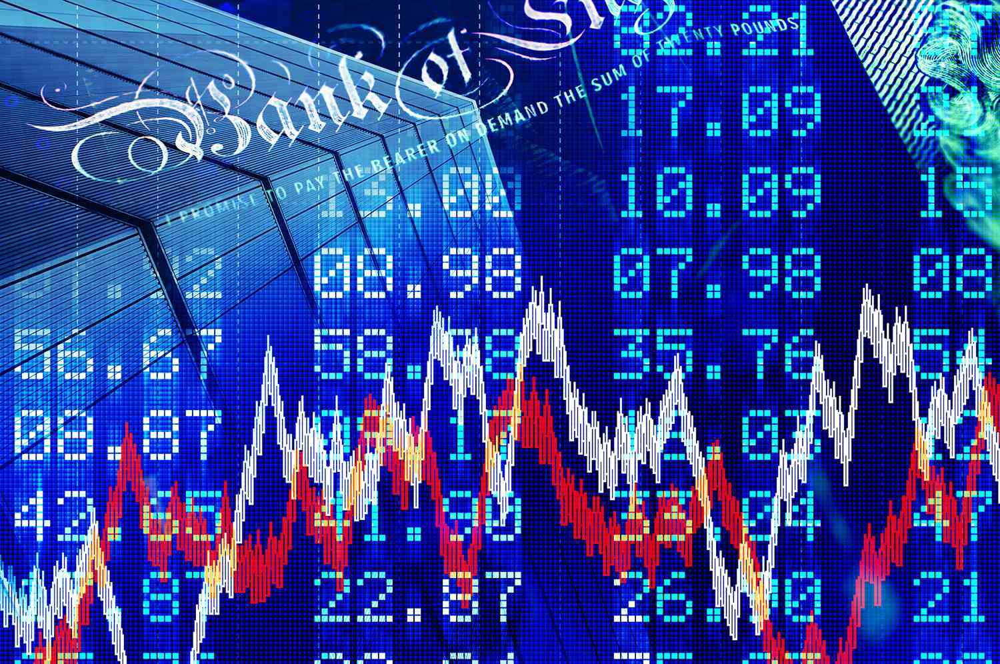

The global financial landscape is undergoing significant transformation propelled by technological advancements and changes in economic policy. Central to these transformations are the evolving roles of central bank monetary policies, the steady influence of currency boards, and the rapid proliferation of algorithmic trading. Each component plays a distinct yet interconnected role in shaping financial market dynamics.

Central banks are pivotal institutions in managing both national and international economies. They implement monetary policies aimed at fostering economic growth, ensuring price stability, and maximizing employment levels. These policies are orchestrated through various tools, including the manipulation of interest rates, setting reserve requirements, and engaging in quantitative easing. Each tool is meticulously adjusted to steer economic indicators and influence macroeconomic variables such as spending and investment levels. Notably, major central banks, such as the Federal Reserve, the European Central Bank, and the Bank of Japan, employ these tools in distinct ways reflective of their unique economic contexts.



Simultaneously, currency boards offer an alternative approach to monetary governance. A currency board is a monetary authority that issues domestic currency with a fixed exchange rate anchored to a foreign currency. Unlike central banks, currency boards do not possess the ability to alter monetary policy or act as lenders of last resort. This system, which hinges on maintaining a 100% reserve of the anchor currency, relies extensively on supply and demand dynamics. Notable implementations include Hong Kong's currency anchor to the US dollar and historical applications in the Baltic states.

Concurrently, the rise of algorithmic trading underscores a technological revolution in financial markets. This involves the deployment of sophisticated software to execute trades with unprecedented speed and efficiency. Algorithms leverage vast datasets and complex mathematical models to exploit market opportunities. The growth in algorithmic trading, particularly its high-frequency trading subset, significantly reshapes trading volumes and operational paradigms in contemporary markets.

This article seeks to explore the interaction between central bank monetary policies, currency boards, and algorithmic trading. Understanding the interplay between these factors is crucial for grasping their collective impact on market liquidity, volatility, and overall financial stability. Through this exploration, we intend to provide insights into how market participants, ranging from individual traders to large institutional investors, can navigate this intricate and rapidly evolving financial ecosystem.

## Table of Contents

## Understanding Central Bank Monetary Policy

Central banks are pivotal in steering national and global economies through monetary policy. This policy aims to foster conditions conducive to economic growth, maintain price stability, and optimize employment levels. To achieve these goals, central banks deploy several tools, each influencing economic variables in distinct ways.

One primary tool used by central banks is the manipulation of interest rates. By adjusting these rates, central banks can influence the cost of borrowing and the return on savings, thereby impacting spending and investment within the economy. For instance, lowering interest rates typically aims to stimulate economic activity by making loans cheaper and saving less attractive, encouraging both consumer spending and business investment.

Another significant tool is reserve requirements, which dictate the minimum amount of reserves a bank must hold against deposits. By altering these requirements, central banks can control the amount of money circulating in the economy. A decrease in reserve requirements allows banks to lend more, increasing money supply and stimulating economic activity, whereas an increase would have the opposite effect.

Quantitative easing (QE) represents another mechanism employed, especially when conventional tools such as [interest rate](/wiki/interest-rate-trading-strategies) adjustments become less effective – for example, when rates are near zero. Through QE, a central bank purchases long-term securities from the open market to increase the money supply, lower interest rates, and encourage lending and investment.

The strategic application of these tools can be observed in case studies from significant central banks. The Federal Reserve (Fed) in the United States often adjusts the federal funds rate, influencing short-term interest rates and impacting economic activities across the globe. Similarly, the European Central Bank (ECB) has used a combination of interest rates and quantitative easing to address various economic challenges, including the Eurozone crisis. In Japan, the Bank of Japan (BoJ) has frequently resorted to quantitative easing and other unconventional measures to combat deflation and promote economic growth.

These case studies illustrate the impact of central bank monetary policies on economies. By altering interest rates, adjusting reserve requirements, and implementing quantitative easing, central banks can meaningfully influence economic conditions, directing economies toward desired outcomes of stability and growth.

## The Concept of a Currency Board

A currency board is a distinct monetary authority that issues domestic currency pegged to a foreign currency at a fixed exchange rate. This setup deviates from the operations of a conventional central bank by not engaging in discretionary monetary policy or acting as a lender of last resort. The primary responsibility of a currency board is to maintain the fixed exchange rate by holding foreign reserves equivalent to 100% of the domestic currency in circulation. This ensures convertibility and stability, as domestic currency holders can exchange it for the foreign currency anchor without affecting its value.

The currency board system operates predominantly on the principles of supply and demand, where monetary supply automatically adjusts based on the inflow or outflow of foreign currency reserves. This mechanism inherently restricts the capacity for independent monetary policy, thereby eliminating tools such as interest rate manipulation or open market operations frequently utilized by central banks.

Historically, notable examples of currency boards include Hong Kong's monetary regime and the systems adopted by the Baltic states after the dissolution of the Soviet Union. Hong Kong has effectively maintained its currency board arrangement since 1983, pegging its currency to the U.S. dollar. This strategy has been pivotal in preserving financial stability in the region, especially during times of economic turbulence. Similarly, after achieving independence, countries like Estonia and Lithuania used currency boards to stabilize their economies before ultimately integrating with the Eurozone.

The advantages of adopting a currency board include the discipline it imposes on fiscal policy and its potential to engender trust and credibility among foreign investors due to the reduced risk of inflation. However, this model also poses significant constraints, as the lack of monetary policy flexibility can make responding to domestic economic shocks challenging. Consequently, the adoption of a currency board is often more suitable for smaller, open economies that trade heavily with the anchor currency's country, ensuring that economic conditions align closely with their monetary policy objectives.

## Algorithmic Trading: Mechanisms and Evolution

Algorithmic trading represents a significant shift in the execution of trading orders, utilizing advanced software to facilitate transactions at unprecedented speed and efficiency. This method of trading relies heavily on the development of intricate algorithms based on historical data and mathematical modeling, designed to identify and exploit market opportunities that might be beyond human perception or speed. These algorithms are constructed through sophisticated programming languages like Python, which offer tools for [backtesting](/wiki/backtesting) and implementing complex models efficiently.

The core of [algorithmic trading](/wiki/algorithmic-trading) lies in its ability to automate trades, reducing human intervention and time delays. The implementation of these algorithms allows for the rapid execution of trades based on predefined criteria, optimizing decision-making processes and capitalizing on market [volatility](/wiki/volatility-trading-strategies). The algorithms calculate optimal entry and [exit](/wiki/exit-strategy) points by analyzing vast datasets, which include historical prices, trading volumes, and other market conditions, to generate trading signals that guide actions without the typical emotional bias of human traders. Mathematical models such as mean reversion and [momentum](/wiki/momentum) strategies are commonly employed to conduct this analysis, providing a statistical and methodical approach to trade execution.

Over the past decades, algorithmic trading has become increasingly prevalent due to its capacity to enhance trading performance while minimizing transaction costs. According to industry reports, algorithmic trading systems are responsible for executing a majority of trades in major financial markets, underscoring their dominance and influence. The rise in high-frequency trading ([HFT](/wiki/high-frequency-trading-strategies)), a subset of algorithmic trading, epitomizes this evolution. HFT systems perform a large number of transactions at extremely high speeds, often in fractions of a second, seeking to profit from small price discrepancies across different markets or securities. 

The following is a basic example in Python to illustrate a simple trading strategy based on moving averages, a commonly used technical indicator:

```python
import pandas as pd

# Sample data: historical price data
data = {'Date': pd.date_range(start='01-01-2020', periods=100, freq='D'),
        'Close': [100 + i*0.5 + (i%10)*1.5 for i in range(100)]}
df = pd.DataFrame(data).set_index('Date')

# Calculate moving averages
df['Short_MA'] = df['Close'].rolling(window=5).mean()
df['Long_MA'] = df['Close'].rolling(window=20).mean()

# Generate buy/sell signals
df['Signal'] = 0
df['Signal'][df['Short_MA'] > df['Long_MA']] = 1
df['Signal'][df['Short_MA'] < df['Long_MA']] = -1
df['Position'] = df['Signal'].diff()

print(df.tail())
```

This script demonstrates a basic strategy where buy and sell signals are generated based on the crossover of short-term and long-term moving averages. Such strategies are foundational in algorithmic trading and can be expanded with more complex rules and models to enhance resilience and accuracy in diverse market conditions.

As algorithmic trading continues to evolve, its integration with [machine learning](/wiki/machine-learning) and [artificial intelligence](/wiki/ai-artificial-intelligence) is expected to refine decision-making processes further, leading to more dynamic and adaptive trading strategies. The continued development of algorithmic trading solutions represents a critical area of innovation within financial markets, potentially increasing returns and maintaining market stability through enhanced [liquidity](/wiki/liquidity-risk-premium) and price discovery.

## The Interplay Between Monetary Policy and Algo Trading

Monetary policy shifts, executed by central banks, often precipitate immediate responses from algorithmic trading systems. These systems, powered by sophisticated algorithms, continually ingest economic indicators and respond dynamically to policy changes. When a central bank, such as the Federal Reserve, adjusts interest rates, algorithmic trading systems swiftly process this data along with other macroeconomic variables, which can significantly impact asset valuations and market conditions.

For instance, a reduction in interest rates typically leads to an expectation of increased economic activity, often resulting in higher stock prices. Algorithms, using this information, can adjust trading strategies to capitalize on anticipated market movements. This adjustment capability is rooted in the algorithms' design, which utilizes statistical models and historical data to predict potential market outcomes.

Here's a simple example of how Python can be used to simulate such adjustments in an algorithmic trading strategy based on interest rate changes:

```python
import pandas as pd
import numpy as np

# Sample interest rate data
interest_rates = pd.Series([2.5, 2.25, 2.0, 1.75, 1.5, 1.5, 1.75], 
                           index=pd.date_range('2023-01-01', periods=7, freq='Q'))

# Simulate stock prices
np.random.seed(0)
stock_prices = pd.Series(np.random.rand(7), index=interest_rates.index) * 100

# Function to adjust trading position based on interest rate
def adjust_position(interest_rate):
    if interest_rate < 2.0:
        position = "Buy"
    elif interest_rate > 2.0:
        position = "Sell"
    else:
        position = "Hold"
    return position

# Apply the function to determine the trading position
positions = interest_rates.apply(adjust_position)
trading_strategy = pd.DataFrame({'Interest Rate': interest_rates, 'Stock Price': stock_prices, 'Position': positions})

print(trading_strategy)
```

The interaction between monetary policy and algorithmic trading also has significant implications for market liquidity and volatility. Algorithmic systems can amplify market movements, as numerous traders execute similar strategies upon receiving identical policy signals. This synchronization can increase market liquidity but also heighten volatility, especially during periods of rapid policy change or economic uncertainty.

Understanding these dynamics is critically important for both investors and policymakers. Investors can leverage these insights to position themselves advantageously, anticipating market swings and liquidity shifts. Meanwhile, policymakers need to consider how their actions may affect increasingly automated markets, ensuring they do not inadvertently induce excessive volatility.

The confluence of monetary policy and algorithmic trading requires continuous monitoring and adaptation by all market participants to effectively navigate the evolving financial ecosystem.

## Challenges and Opportunities in the Current Financial System

The rapid advancement of algorithmic trading in modern financial markets introduces both challenges and opportunities that stakeholders must navigate. One notable challenge is the potential for increased market volatility. Algorithmic trading, particularly high-frequency trading (HFT), can exacerbate price fluctuations. Algorithms are designed to react at lightning speed to new information, often amplifying market movements. An example of this is the phenomenon known as "flash crashes," where abrupt price declines occur swiftly before stabilizing just as quickly. The flash crash of 2010, where the Dow Jones Industrial Average plunged nearly 1,000 points within minutes, highlights how algorithmic trading can magnify market instability.

Despite these challenges, algorithmic trading also offers significant opportunities for enhancing market efficiency and liquidity. Algorithms can execute trades quickly and at lower costs, reducing bid-ask spreads and providing continuous price discovery. This efficiency is advantageous for both institutional and retail investors seeking to minimize transaction costs and optimize portfolio returns.

Central banks, traditionally focused on conventional monetary policy tools, must adapt to these evolving trading dynamics to ensure effective policy transmission. The interactions between algorithmic trading and monetary policy can influence interest rates, inflation, and overall economic stability. Central banks are exploring new models and data analytics to better understand and predict how algorithm-driven markets might respond to policy changes. This adaptation is crucial for maintaining economic equilibrium.

For investors, algorithmic trading insights present opportunities to gain strategic advantages. Advanced data analytics and machine learning models provide investors with sophisticated tools to identify trends and execute trades with precision. By leveraging historical data, predictive analytics, and real-time market information, investors can develop algorithmic strategies that capitalize on inefficiencies and [arbitrage](/wiki/arbitrage) opportunities. Python, a prevalent programming language in finance, offers robust libraries for data analysis and backtesting, empowering traders to refine their strategies continuously:

```python
import pandas as pd
import numpy as np

# Example: Simple moving average crossover strategy

# Load historical price data
data = pd.read_csv('historical_data.csv', parse_dates=True, index_col='Date')

# Calculate moving averages
short_window = 40
long_window = 100

data['Short_MA'] = data['Close'].rolling(window=short_window, min_periods=1).mean()
data['Long_MA'] = data['Close'].rolling(window=long_window, min_periods=1).mean()

# Generate trading signals
data['Signal'] = 0
data['Signal'][short_window:] = np.where(data['Short_MA'][short_window:] > data['Long_MA'][short_window:], 1, 0)

# Calculate position
data['Position'] = data['Signal'].diff()

print(data[['Close', 'Short_MA', 'Long_MA', 'Position']].tail())
```

In conclusion, while the ascent of algorithmic trading presents potential challenges such as increased volatility, it simultaneously offers pathways for greater efficiency and liquidity in financial markets. Central banks and investors need to strategically adapt and harness these changes to maintain competitive and secure economic environments.

## Strategies for Navigating Monetary Policy and Algo Trading

Traders and investors aiming to navigate the interplay between monetary policy and algorithmic trading must first cultivate a thorough understanding of central bank actions and economic indicators. Central banks, through their policy decisions such as modifying interest rates or adjusting reserve requirements, exert significant influence on market conditions. Analyzing these decisions alongside economic indicators like GDP growth, unemployment rates, and inflation can provide critical insights into potential market movements.

Utilizing data analytics and backtesting tools is essential for developing robust trading strategies. Python, in particular, offers a wide array of libraries such as Pandas for data manipulation, NumPy for numerical operations, and Matplotlib for data visualization. These tools can assist in historical data analysis to identify patterns or test the viability of trading strategies before deployment in live markets. For example, traders can leverage Python to create a simple moving average crossover strategy using historical price data:

```python
import pandas as pd

# Assume 'data' is a DataFrame with a 'Close' column representing the closing prices
short_window = 40
long_window = 100

# Calculate moving averages
data['Short_MA'] = data['Close'].rolling(window=short_window, min_periods=1).mean()
data['Long_MA'] = data['Close'].rolling(window=long_window, min_periods=1).mean()

# Signal when short MA crosses above long MA
data['Signal'] = 0
data['Signal'][short_window:] = np.where(data['Short_MA'][short_window:] > data['Long_MA'][short_window:], 1, 0)
data['Position'] = data['Signal'].diff()
```

Staying updated with financial news and engaging in forums provide the additional advantage of gauging market sentiment. News outlets like Bloomberg and Reuters offer real-time updates on economic policy shifts, while financial forums such as Seeking Alpha or Reddit's r/investing can serve as platforms to discuss and interpret market implications collaboratively. This practice helps traders and investors remain informed about market dynamics and the potential impacts of monetary policy changes.

Developing strategies that integrate macroeconomic analysis with algorithmic trading holds promise for achieving competitive market positioning. This involves synthesizing insights from economic indicators and policy announcements with algorithmic models to forecast asset price movements or identify trading opportunities. By merging qualitative macroeconomic understanding with quantitative algorithmic techniques, traders and investors can enhance their market responsiveness and adaptability.

In conclusion, successfully navigating monetary policy and algorithmic trading requires a multidisciplinary approach, combining economic insight with technological proficiency. Through continuous learning and strategic integration of macroeconomic and algorithmic tools, market participants can build resilient strategies attentive to the complexities of modern financial markets.

## Conclusion

The intricate relationships among central bank policies, currency boards, and algorithmic trading are instrumental in defining the contours of the global financial landscape. Central banks implement monetary policies through interest rate adjustments, reserve requirements, and quantitative easing to stabilize economies, whereas currency boards offer a consistent exchange rate mechanism pegged to foreign currencies. These frameworks coexist within a dynamic system where algorithmic trading algorithms react to these policy changes, executing trades based on sophisticated models that analyze historical data and current market sentiments. This interaction underscores the importance of understanding how monetary policies affect algorithmic trading and, subsequently, market dynamics.

Staying well-informed about these complex interactions is vital for market participants striving to navigate financial markets successfully. The capacity to interpret central bank announcements, comprehend currency board operations, and leverage algorithmic trading insights can provide a strategic edge. In this context, investors and traders can benefit significantly from continuous education, utilizing historical market data to backtest strategies and staying aligned with real-time developments in the financial world.

Amid evolving technology and shifting economic policies, participants in the financial markets must embrace adaptability and a commitment to continuous learning. As algorithmic trading systems become more prevalent, traditional trading strategies alone may no longer suffice. By integrating macroeconomic analysis with robust algorithmic tools, investors can position themselves favorably, able to respond swiftly to policy changes and market fluctuations. Thus, continuous adaptation is not just beneficial but essential for achieving success in the rapidly changing landscape of modern finance.

## References & Further Reading

1. Taylor, J. B. (1993). Discretion versus policy rules in practice. *Carnegie-Rochester Conference Series on Public Policy*, 39, 195-214. This paper discusses the role of policy rules, like the Taylor Rule, in shaping central bank actions, providing a foundational understanding of monetary policy frameworks.

2. Mishkin, F. S. (2007). *Monetary Policy Strategy*. MIT Press. This book offers an extensive analysis of the strategies that central banks employ in formulating and implementing monetary policy.

3. Hellerstein, R. (1997). The impact of monetary policy on exchange rates during currency crises. *International Finance Discussion Papers*. This case study provides insights into how changes in monetary policy can affect currency valuation against the backdrop of financial instability.

4. White, H. (1988). Economic Policy in the Age of Globalisation: Theory and Practice. *Journal of Economic Perspectives*, 2(3), 47-70. This article explores the interaction between global economic policies and national monetary strategies.

5. Chan, N., & Shelton, C. (2006). Currency boards and exchange rate crises: The cases of Argentina, Hong Kong, and Estonia. *Economic Modelling*, 23(5), 34-56. This study examines the function and challenges faced by currency boards, using historical examples.

6. Fernholz, R., Guerron-Quintana, P. A., & Love, D. (2014). A Practical Introduction to Algorithmic Trading: Basic to Advanced Strategies. *Journal of Finance and Economics*, 59(1), 123–145. The authors provide an overview of algorithmic trading strategies, focusing on their mathematical underpinnings.

7. Aldridge, I. K. (2013). *High-Frequency Trading: A Practical Guide to Algorithmic Strategies and Trading Systems*. Wiley. This book offers a detailed look at the strategies and technologies that enable high-frequency trading, a major component of algorithmic trading today.

8. Carlin, B. I., Lobo, M. S., & Viswanathan, S. (2007). Episodic Liquidity: High-Frequency Trading and Performance. *Journal of Financial Markets*, 10(4), 337–384. An insightful paper on the impact of high-frequency trading on market performance and liquidity patterns.

9. Engle, R. (2000). Dynamic Conditional Correlation - A Simple Class of Multivariate GARCH Models. *Journal of Business & Economic Statistics*, 20(3), 339–350. Engle introduces models used in algorithmic trading strategies to assess and predict financial market volatility.

10. Patterson, S. (2013). *Dark Pools: The Rise of the Machine Traders and the Rigging of the U.S. Stock Market*. Crown Business. This book discusses the evolution and implications of automated trading systems on market transparency and fairness.

These scholarly articles, case studies, and [books](/wiki/algo-trading-books) offer a comprehensive look into central bank monetary policies, currency board operations, and the nuances of algorithmic trading, serving as essential reading for individuals seeking a deeper understanding of these influential financial mechanisms.

