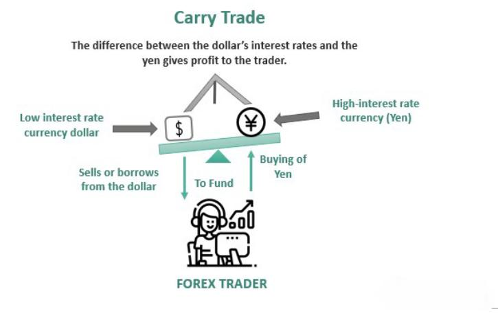

The foreign exchange market, commonly referred to as forex, is a dynamic and intricate global trading platform where currencies are exchanged. Currency trading is driven by various economic, political, and market factors, making it one of the most traded and liquid financial markets in the world. Among the diverse strategies employed by forex traders, the carry trade strategy is prominent due to its potential for delivering consistent returns. This strategy involves borrowing in a currency with a lower interest rate and investing in another currency with a higher interest rate, allowing traders to profit from the differential.

The focus of this article is on the currency carry trade strategy and its integration with algorithmic trading. Algorithmic trading, which is becoming increasingly prevalent in forex, relies on computer programs to execute trades based on predetermined criteria. This method offers traders the benefits of speed and precision, which are critical in the fast-paced forex environment. By combining the carry trade strategy with algorithmic trading, traders can optimize their results and effectively manage the inherent risks associated with forex trading.



This discussion highlights how understanding and implementing these strategies can equip traders with a robust framework for maximizing their investment returns. We will examine the essentials of currency carry trade, explore how algorithmic trading enhances this strategy, and delve into the risk management practices necessary for safeguarding investments. As technology continues to evolve, staying informed and adaptable is crucial for traders aiming to capitalize on emerging opportunities in the forex market.

## Table of Contents

## Understanding Currency Carry Trade

A currency carry trade is a strategy that involves borrowing and selling a currency with a lower interest rate to purchase a currency with a higher interest rate. The key motivation behind this strategy is to exploit the interest rate differential between the two currencies, thereby generating profit. This difference in interest rates can be expressed mathematically as:

$$
\text{Profit} = \left( i_{\text{high}} - i_{\text{low}} \right) \times \text{Principal}
$$

where $i_{\text{high}}$ is the interest rate of the higher-yielding currency, $i_{\text{low}}$ is the interest rate of the lower-yielding currency, and Principal is the notional value of the trade.

Carry trades often utilize leverage to amplify potential returns. Leverage allows traders to borrow funds to increase the size of their position, magnifying both possible gains and losses. For instance, using a leverage ratio of 10:1 means that with $1,000 of capital, a trader could control $10,000 worth of currency. While leverage has the potential to enhance profits, it also heightens risk, making effective risk management crucial.

Exchange rate fluctuations are a significant risk [factor](/wiki/factor-investing) in [carry](/wiki/carry-trading) trades. A currency's value can change rapidly due to economic events, market sentiment, or geopolitical developments, potentially offsetting the gains from [interest rate](/wiki/interest-rate-trading-strategies) differentials. Therefore, managing this risk is important. Traders often use hedging strategies or set stop-loss orders to mitigate adverse movements in exchange rates.

To illustrate carry trade mechanics, consider the Japanese yen (JPY) as the low-yielding currency and the Australian dollar (AUD) as the high-yielding currency. A trader borrows JPY at a low interest rate, converts it into AUD, and then invests the AUD in an asset offering higher returns. Provided the AUD/JPY exchange rate remains stable or appreciates, the trader earns the interest rate spread.

The effectiveness of carry trading is closely tied to several macroeconomic factors, including monetary policy, inflation rates, and geopolitical stability. Traders must continuously monitor these factors to optimize their carry trade strategies and adjust positions accordingly. By understanding and managing the intricacies of currency carry trade, traders can aim to benefit from both interest rate differentials and favorable currency movements.

## Algorithmic Trading in Forex

Algorithmic trading, often referred to as algo trading, employs automated systems to execute trade orders based on pre-set criteria programmed into computers. This approach is particularly advantageous in the foreign exchange ([forex](/wiki/forex-system)) market due to its high [liquidity](/wiki/liquidity-risk-premium) and round-the-clock trading environment. By utilizing sophisticated algorithms, traders can achieve high speed and precision, efficiently executing carry trades and other strategies.

One of the primary advantages of [algorithmic trading](/wiki/algorithmic-trading) in forex is the ability to monitor interest rate changes and currency fluctuations in real-time. This capability is crucial for optimizing the carry trade strategy, which relies on exploiting interest rate differentials between currency pairs. Algorithms can instantly react to these changes, adjusting positions to capitalize on favorable spreads.

The integration of [machine learning](/wiki/machine-learning) and [artificial intelligence](/wiki/ai-artificial-intelligence) (AI) into algorithmic trading further enhances its effectiveness. Machine learning models can be designed to analyze historical data and identify patterns or trends that may not be immediately apparent to human traders. By training these models on large datasets, algorithms can improve their predictive capabilities, particularly for forecasting interest rate movements and currency valuations.

For example, consider a simple algorithm designed for executing carry trades. It may involve:

1. Identifying currency pairs with significant interest rate differentials.
2. Continuously monitoring these pairs for fluctuations using live market data.
3. Executing trades automatically when certain thresholds or patterns are detected.

Here is a basic snippet in Python illustrating how an algorithm might be structured to initiate a carry trade:

```python
import pandas as pd
from forex_python.converter import CurrencyRates

# Sample function to calculate interest rate differential
def calculate_differential(base_currency, quote_currency):
    interest_rates = {'USD': 0.25, 'JPY': -0.10}
    return interest_rates.get(base_currency, 0) - interest_rates.get(quote_currency, 0)

# Sample algorithm logic
def carry_trade_algorithm(base_currency, quote_currency):
    c = CurrencyRates()
    current_rate = c.get_rate(base_currency, quote_currency)
    differential = calculate_differential(base_currency, quote_currency)

    # Criteria for trade execution
    if differential > 0.5:  # Hypothetical threshold
        print(f"Executing trade on {base_currency}/{quote_currency} at rate {current_rate}")
    else:
        print("No advantageous trade conditions met.")

carry_trade_algorithm('USD', 'JPY')
```

However, while algo trading provides numerous benefits, such as enhanced execution speed and minimized costs due to reduced human intervention, it also carries inherent risks. System failures, incorrect algorithms, and unforeseen market moves can all lead to significant losses. As a result, it is crucial to incorporate robust risk management strategies and conduct thorough [backtesting](/wiki/backtesting) of algorithms before deployment in live trading environments.

In summary, algorithmic trading is revolutionizing the forex market by offering traders the tools for more efficient and effective execution of strategies like carry trades. With the ongoing advancements in AI and machine learning, these algorithms are becoming ever more sophisticated, offering increased potential for optimizing returns while managing risk.

## Designing Algorithms for Carry Trading

Effective algorithm design for carry trading necessitates a thorough understanding of interest rate forecasts and economic indicators. These elements are crucial for predicting future currency movements and optimizing trading decisions. Incorporating machine learning models, such as regression analysis and neural networks, can significantly improve the accuracy of these predictions. Machine learning algorithms can be trained on historical data to recognize patterns and relationships between economic indicators and currency value changes.

One practical approach involves using regression models to forecast interest rate movements. By analyzing historical interest rate data and other relevant economic factors, such models can estimate future rates. For instance, a linear regression model could be deployed to predict interest rate changes based on variables like inflation rates, unemployment figures, and geopolitical events:

```python
import numpy as np
from sklearn.linear_model import LinearRegression

# Sample data for interest rates and economic indicators
X = np.array([[2.5, 3.0, 1.5], [2.7, 3.1, 1.6], [2.9, 3.2, 1.7]])  # Example economic indicators
y = np.array([0.25, 0.30, 0.28])  # Corresponding interest rate changes

# Create and train the regression model
model = LinearRegression()
model.fit(X, y)

# Predict future interest rate change
future_indicators = np.array([[3.0, 3.5, 1.8]])
predicted_change = model.predict(future_indicators)
print(f"Predicted interest rate change: {predicted_change}")
```

To manage risks effectively, integrating stop-loss mechanisms and strategic use of leverage is essential. A stop-loss order automatically sells a security when it reaches a certain price, preventing further losses. Implementing such mechanisms in algorithmic trading helps mitigate the impact of unfavorable market movements. Leveraging, while amplifying potential gains, can also increase risks; careful calibration is required to balance return and risk.

Building algorithms for carry trading follows a cycle of design, testing, and refinement. After developing the initial model using historical data, backtesting is performed to evaluate performance under historical market conditions. Backtesting tools and platforms, such as MetaTrader or QuantConnect, can simulate trades to provide insights into how strategies would have performed. 

Here is an example of a basic algorithmic logic for executing carry trades using Python:

```python
def execute_carry_trade(interest_rate_borrow, interest_rate_invest, leverage=1, stop_loss_threshold=0.05):
    # Calculate potential profit from interest rate differential
    rate_diff = interest_rate_invest - interest_rate_borrow
    potential_profit = leverage * rate_diff

    # Implement stop-loss mechanism
    current_market_value = simulate_market_value()
    if potential_profit < stop_loss_threshold * current_market_value:
        print("Stop-loss triggered. Exiting trade.")
    else:
        print(f"Executing carry trade with expected profit: {potential_profit}")

def simulate_market_value():
    # Placeholder for market value simulation
    return 1.0

# Example trade execution
execute_carry_trade(0.02, 0.05, leverage=10)
```

In this example, the algorithm evaluates whether the expected profit from the interest rate differential justifies the execution of a trade, with a stop-loss mechanism in place to limit potential losses. Continuous refinement of these algorithms is necessary, as market conditions and economic indicators evolve, influencing interest rate dynamics and currency behaviors.

## Risk Management in Algo Carry Trading

In the complex landscape of forex trading, risk management is a cornerstone for ensuring stability and profitability, especially when combining carry trading with algorithmic strategies. Central to this approach are dynamic stop-loss orders and leverage limits, which provide essential safeguards against the ever-present challenges of market [volatility](/wiki/volatility-trading-strategies) and abrupt price fluctuations.

**Dynamic Stop-loss Orders and Leverage Limits**

Dynamic stop-loss orders are designed to mitigate risk by automatically exiting a trade if it reaches a predefined level of loss. They are particularly valuable in the fast-paced forex market where algorithms execute trades based on real-time data. By setting a moving stop-loss threshold, traders can protect profits while limiting losses. For example, a simple Python script can illustrate a basic stop-loss mechanism:

```python
def dynamic_stop_loss(current_price, stop_loss_percent, entry_price):
    stop_loss_price = entry_price * (1 - stop_loss_percent / 100)
    if current_price <= stop_loss_price:
        return "Sell"
    else:
        return "Hold"
```

In terms of leverage, prudent use is critical in carry trading due to its inherent risk of large positional exposure. Establishing leverage caps ensures that even if the market moves unfavorably, the potential losses are kept within manageable boundaries.

**Adjusting Positions Based on Economic Indicators**

Algorithms can be configured to adjust trading positions using various economic indicators such as interest rates, inflation data, and employment [statistics](/wiki/bayesian-statistics). These factors often influence currency valuations significantly and can indicate potential shifts in market trends. By integrating these data points, algorithms can make informed decisions about entering or exiting positions, optimizing returns while minimizing risk exposure.

**Advanced Risk Management Techniques**

Several advanced techniques enhance risk management in algorithmic carry trading. For instance, volatility-based position sizing dynamically adjusts the size of a trade based on the current volatility in the forex market. This approach involves reducing trade size during high volatility, which naturally limits risk, and increasing it during calmer periods to capitalize on stable trends.

Moreover, correlation analysis allows traders to understand how different currency pairs interact with each other. By analyzing the correlation matrix, traders can diversify or consolidate their positions to balance their portfolios against external shocks.

**Hedging Strategies for Additional Protection**

Hedging is a crucial strategy for protecting investments against adverse market movements in carry trading. Options allow traders to establish positions that gain value when the underlying trade incurs losses, thus providing a safety net. For example, purchasing a put option on a currency pair provides the right to sell it at a specific price, thus securing against potential declines.

In summary, effective risk management in algorithmic carry trading necessitates a multifaceted approach encompassing dynamic stop-loss orders, leverage controls, economic indicator analysis, advanced techniques like volatility-based sizing, and strategic hedging applications such as options. Employing these mechanisms enhances the resilience of carry trade investments against the volatility inherent in forex markets.

## The Future of Carry and Algo Trading

The integration of artificial intelligence (AI) and machine learning (ML) in carry and algorithmic trading strategies is poised to significantly enhance their effectiveness and efficiency. AI and ML algorithms can process vast amounts of data in real-time and uncover patterns that would be imperceptible to human traders. These advancements are particularly useful in the carry trade, where interest rate differentials can be exploited with greater precision and lower risk.

Traders are increasingly broadening the scope of carry trade strategies to include other asset classes, such as commodities and equities. These assets often offer distinct interest rate environments or return potentials, making them attractive targets for carry trade strategies. By applying machine learning techniques, traders can evaluate these diverse markets with sophisticated models capable of handling complex, nonlinear relationships between economic indicators, market sentiment, and price movements. 

Predictive analytics and sentiment analysis are becoming essential tools in designing advanced trading algorithms. Predictive models can forecast economic trends and interest rate movements, while sentiment analysis leverages data from news sources and social media to assess market sentiment, potentially predicting price movement. For example, leveraging natural language processing (NLP), traders can gauge sentiments correlated with currency value changes, incorporating these insights into their trading algorithms.

Technological advancements in computing power and data processing are enabling the creation of more complex and adaptive trading algorithms. These systems can automatically adjust trading strategies in response to new information or changing market conditions. Such adaptability is crucial in the fast-paced forex market, where conditions can shift rapidly.

One practical implementation might involve structuring algorithms to assess the Sharpe Ratio continually, a common measure of risk-adjusted return:

$$
\text{Sharpe Ratio} = \frac{E[R_p] - R_f}{\sigma_p}
$$

Where $E[R_p]$ is the expected portfolio return, $R_f$ the risk-free rate, and $\sigma_p$ the standard deviation of the portfolio's excess return.

In a Python environment, traders can leverage libraries such as scikit-learn for machine learning tasks or Natural Language Toolkit (NLTK) for NLP. Here's a simple example using Python to calculate and update a trading strategy based on the Sharpe Ratio:

```python
import numpy as np

# Example portfolio returns and risk-free rate
portfolio_returns = np.array([0.01, 0.02, 0.03, -0.01, 0.02])
risk_free_rate = 0.005

# Calculate excess returns
excess_returns = portfolio_returns - risk_free_rate

# Calculate Sharpe Ratio
sharpe_ratio = np.mean(excess_returns) / np.std(excess_returns)
print("Sharpe Ratio:", sharpe_ratio)
```

In summary, the future of carry and algorithmic trading is characterized by the integration of AI and ML, expansion to various asset classes, and the utilization of predictive analytics. By harnessing these technological advancements, traders can develop more informed, adaptive, and successful trading strategies, potentially gaining a significant competitive edge in the market.

## Conclusion

Combining carry trade strategies with algorithmic trading presents a powerful methodology within the forex trading sector. This hybrid approach capitalizes on the strengths of both strategies, marrying the interest rate differentials exploited in carry trades with the precision and speed offered by algorithmic systems. Automation stands out in this context, as it significantly enhances the execution speed and accuracy of trades. Algorithms can execute trades at lightning-fast speeds, far surpassing human capabilities, which is crucial when market movements can happen in fractions of a second. This precise execution, paired with comprehensive risk management strategies, helps ensure the stability of trades even amidst the sometimes volatile nature of forex markets.

As technological advances continue at a rapid pace, traders must be agile, adapting their strategies to harness new opportunities that arise. The continuous evolution of technology, particularly in the domains of machine learning and artificial intelligence, promises even more sophisticated tools for forex trading. Algorithms will increasingly include features like predictive analytics and sentiment analysis, providing deeper insights and more effective trading strategies. For successful implementation, investors should engage with professional trading platforms, which offer robust infrastructures and advanced tools designed for both carry trades and algorithmic execution.

Staying informed about market developments is crucial for traders who wish to remain competitive. The forex market is dynamic, influenced by numerous economic and geopolitical factors. Therefore, traders must remain vigilant, constantly updating their strategies to reflect current market conditions. By gaining a deep understanding of these strategies and utilizing the best available tools, traders can effectively maximize their returns in the forex market, turning the potential of carry trades and algorithmic execution into realized financial gains.

## References & Further Reading

[1]: Bergstra, J., Bardenet, R., Bengio, Y., & Kégl, B. (2011). ["Algorithms for Hyper-Parameter Optimization."](https://dl.acm.org/doi/10.5555/2986459.2986743) Advances in Neural Information Processing Systems 24.

[2]: ["Advances in Financial Machine Learning"](https://www.amazon.com/Advances-Financial-Machine-Learning-Marcos/dp/1119482089) by Marcos Lopez de Prado

[3]: ["Evidence-Based Technical Analysis: Applying the Scientific Method and Statistical Inference to Trading Signals"](https://www.amazon.com/Evidence-Based-Technical-Analysis-Scientific-Statistical/dp/0470008741) by David Aronson

[4]: ["Machine Learning for Algorithmic Trading"](https://github.com/PacktPublishing/Machine-Learning-for-Algorithmic-Trading-Second-Edition) by Stefan Jansen

[5]: ["Quantitative Trading: How to Build Your Own Algorithmic Trading Business"](https://books.google.com/books/about/Quantitative_Trading.html?id=j70yEAAAQBAJ) by Ernest P. Chan