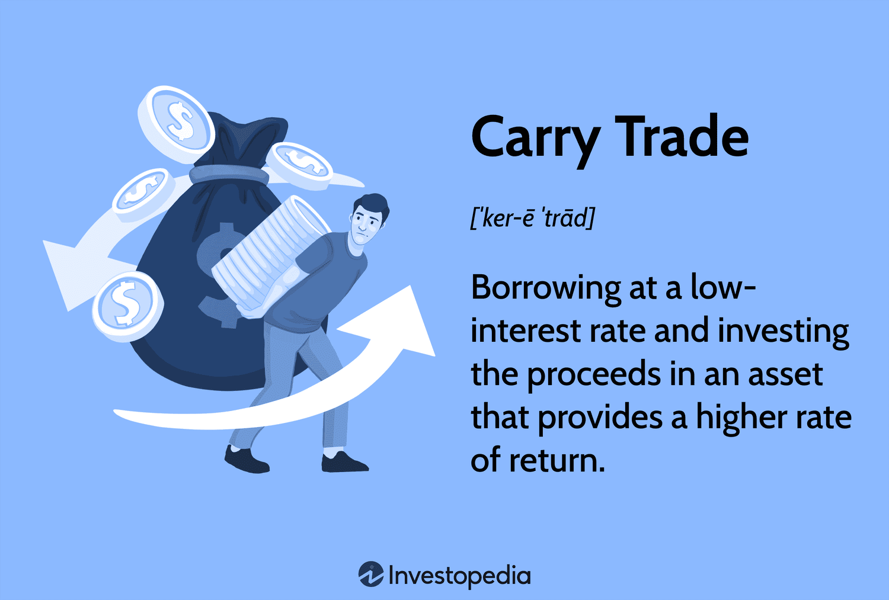

The foreign exchange market, commonly referred to as Forex, represents one of the most profitable yet intricate avenues for investors worldwide. As the largest financial market, Forex operates 24 hours a day, five days a week, offering unparalleled liquidity and opportunities for profit due to continuous fluctuations in currency values. Within this dynamic environment, traders deploy a myriad of strategies to maximize their returns, two of the most notable being the carry trade and algorithmic trading.

Carry trade involves borrowing in a currency with a low interest rate and investing in one with a higher rate, capitalizing on the interest rate differential. This approach can generate significant profits, particularly in stable market conditions where currency fluctuations are predictable. Conversely, algorithmic trading utilizes computer algorithms to execute trades at high speeds, leveraging predefined conditions to exploit market inefficiencies and reduce human error.

The complexities of Forex trading demand a thorough understanding of various strategies to successfully navigate market conditions. This article explores how carry trade and algorithmic trading operate, examining their roles and contributions to the Forex market. Mastering these strategies can empower traders and investors with the necessary tools to make informed decisions, enhancing their potential for success in this fast-paced financial landscape.

## Table of Contents

## Understanding Foreign Exchange and Currency Trading

The foreign exchange market, commonly known as Forex, serves as the global platform where national currencies are bought and sold against each other. This market is one of the largest and most liquid in the world, characterized by a substantial trading [volume](/wiki/volume-trading-strategy) that flows continuously, 24 hours a day, five days a week. With an average daily turnover of over $6 trillion, as reported by the Bank for International Settlements, Forex provides ample opportunities for traders to profit from the frequent fluctuations in currency pairs.

Currency pairs are the backbone of Forex trading. They consist of a base currency and a quote currency, representing the amount of the quote currency required to purchase one unit of the base currency. For example, in the EUR/USD pair, the euro (EUR) is the base currency, and the US dollar (USD) is the quote currency. Traders buy or sell currency pairs based on their predictions of future movements. Success in Forex relies heavily on understanding exchange rates, which represent the value of one currency in terms of another. These rates are influenced by various factors including interest rates, economic indicators, and geopolitical events.

Market volatility plays a significant role in Forex trading. It refers to the extent and rate at which currency prices fluctuate. High volatility typically indicates a greater potential for profit, but it also entails higher risk. Traders employ a range of strategies to manage this volatility, relying on technical analysis tools to forecast price movements and determine entry and [exit](/wiki/exit-strategy) points.

Participants in the Forex market range widely from large financial institutions, central banks, hedge funds, and multinational corporations to individual retail traders. Each participant type influences the market dynamics differently. Institutions and central banks often trade to fulfill business needs or influence the value of their currency, while speculators and retail traders seek to capitalize on price movements for profit.

Understanding Forex encompasses more than just the mechanics of trades; it requires a grasp of the integral components such as currency pairs, exchange rates, and market [volatility](/wiki/volatility-trading-strategies). By mastering these elements, traders can navigate the complexities of the Forex market more effectively, making informed decisions that leverage the dynamic nature of currency trading to their advantage.

## The Carry Trade Strategy Explained

The [carry](/wiki/carry-trading) trade strategy is a popular approach in the [forex](/wiki/forex-system) market, where traders seek to profit from differences in interest rates between two currencies. This strategy involves borrowing funds in a currency that has a lower [interest rate](/wiki/interest-rate-trading-strategies) and converting those funds into a currency with a higher interest rate. The primary goal is to benefit from the interest rate differential, which can be significant, particularly in a low-interest-rate environment.

Traders looking to execute a carry trade must first understand the mechanics of [earning](/wiki/earning-announcement) interest. The fundamental equation for calculating the profit from a carry trade is:

$$
\text{Profit} = \left( R_{\text{high}} - R_{\text{low}} \right) - \Delta E
$$

where $R_{\text{high}}$ is the interest rate of the currency with the higher rate, $R_{\text{low}}$ is the interest rate of the currency with the lower rate, and $\Delta E$ represents any losses or gains from exchange rate fluctuations. While $R_{\text{high}} - R_{\text{low}}$ typically yields a positive return, changes in the exchange rate ($\Delta E$) can either augment or reduce the profit.

When selecting currency pairs for a carry trade, traders often prefer pairs where the interest rate differential is substantial. Commonly used currency pairs include the AUD/JPY and NZD/JPY. These pairs are favored due to Australia's and New Zealand's historically higher interest rates compared to Japan's low rates.

Carry trades are most attractive in low-volatility market conditions. In such an environment, stable interest rates suggest predictable returns from the interest rate differential, reducing the risk of significant fluctuations in the exchange rate. Additionally, periods of economic stability and growth, without unexpected geopolitical events, can contribute to a favorable environment for carry trades.

Moreover, traders leverage market trends by anticipating future movements in interest rates and exchange rates. By analyzing economic indicators and monetary policy developments, they can position themselves to take advantage of shifting yield curves and currency movements.

It's crucial, however, for traders engaging in carry trades to employ sound risk management techniques, as these trades are not without risk. Significant changes in exchange rates, often driven by unforeseen market events, can lead to substantial losses. Therefore, it is essential to monitor market conditions closely and adjust positions as necessary.

Overall, the carry trade strategy provides opportunities for profit through interest rate differentials, particularly in predictable and stable market environments. By carefully selecting currency pairs and managing market trends, traders can enhance their potential for success while navigating the inherent risks of the forex market.

## Algorithmic Trading in Forex

Algorithmic trading in the foreign exchange (Forex) market utilizes computer systems to execute orders at high speeds, guided by a set of predefined rules and criteria. This automated approach is designed to capitalize on minute price discrepancies in currency pairs, aiming to profit from short-term market inefficiencies while reducing human error and emotional decision-making.

### Features of Forex Algorithmic Trading

Algorithmic trading systems in Forex are capable of managing complex transactions and monitoring multiple currency pairs simultaneously. By leveraging sophisticated algorithms, traders can exploit market inefficiencies that might not be immediately apparent to human traders. The precision and speed offered by these systems enable traders to implement strategies that might otherwise be impractical if executed manually.

### Types of Algorithmic Strategies

1. **Auto-Hedging**:
   - Auto-hedging algorithms are designed to mitigate risk by automatically executing trades that counterbalance existing positions. For example, if a trader holds a position in a currency pair that is exposed to significant risk from exchange rate changes, the algorithm can instantly execute an opposing trade in a correlated currency pair to offset potential losses.

2. **Statistical Arbitrage**:
   - This strategy involves exploiting price discrepancies between theoretically correlated currency pairs. Algorithms scan the market for deviations from historical price relationships, executing trades to capture profits when prices revert to their mean. The effectiveness of statistical arbitrage relies heavily on sophisticated statistical models and access to real-time data.

3. **Algorithmic Execution**:
   - These algorithms focus on the optimal execution of large orders with minimal market impact. By breaking down large orders into smaller ones and strategically placing them over time, algorithmic execution minimizes slippage and footprint in the market. The aim is to achieve the best possible average price.

### Advantages of Algorithmic Forex Trading

Algorithmic strategies enhance the speed and efficiency of trading operations significantly. They enable rapid-order execution, critical in the fast-paced Forex environment, where currency prices can change in fractions of a second. Additionally, by employing [algorithmic trading](/wiki/algorithmic-trading), investors can backtest strategies against historical data to evaluate effectiveness before deploying them in live markets.

The reduction in human intervention also minimizes emotional influences on trading decisions. Such emotions can lead to inconsistent trading practices, often detrimental to trading performance. Furthermore, the ability to process and analyze vast datasets in real-time allows algorithms to swiftly adapt to changing market conditions, providing a competitive edge to those using them.

In summary, algorithmic trading in Forex offers robust advantages over traditional trading methods, primarily through enhanced speed, precision, and the ability to systematically manage complex strategies. While it demands significant upfront investment in technology and expertise, its potential to significantly improve trading outcomes cannot be understated.

## Risks and Challenges in Carry Trade and Algorithmic Trading

Both carry trade and algorithmic trading strategies in the foreign exchange (Forex) market present substantial risks that traders must carefully manage to avoid significant financial loss.

Carry trade involves borrowing a currency with a low interest rate to invest in another currency with a higher interest rate. The primary risk in this strategy is tied to market volatility and currency fluctuations. When market conditions suddenly shift, exchange rates may move unfavorably, resulting in potential losses. The use of leverage, which is common in carry trades, can amplify these losses. For example, leveraging at a 10:1 ratio means that even small changes in exchange rates can lead to proportionally larger losses or gains. Risk management strategies are essential, such as setting stop-loss orders or using options to hedge potential downsides.

Algorithmic trading, on the other hand, leverages computer algorithms to execute trades based on predefined criteria, aiming for speed and precision. While this method reduces human error and operational latency, it is not free from risks. Algorithmic trading systems can experience technical failures such as connectivity issues or software bugs which can disrupt trading operations. Moreover, algorithms may behave unpredictively during unexpected market events or "flash crashes," leading to substantial financial repercussions.

Both strategies require traders to remain vigilant and adaptable to evolving market conditions. Implementing robust risk mitigation strategies is essential. Traders should regularly update algorithmic models to reflect current market conditions and incorporate risk assessment methods such as Value at Risk (VaR) or stress testing. A diversification approach can also mitigate risks by spreading exposure across different currency pairs or trading strategies.

In summary, while both carry trade and algorithmic trading offer opportunities for profit in the Forex market, they demand a thorough understanding of the associated risks and comprehensive strategies to manage potential pitfalls effectively.

## FAQs

How do investors profit from carry trades?

Investors profit from carry trades by exploiting the interest rate differential between two currencies. The strategy involves borrowing a currency with a lower interest rate (funding currency) and investing in a currency with a higher interest rate (target currency). The profit comes from the difference in interest rates, known as the "carry," and any potential appreciation of the target currency. For example, if an investor borrows in Japanese yen, which traditionally has low interest rates, to purchase an Australian dollar asset that offers higher returns, the profit would be derived from the interest rate difference and any gain in the Australian dollar's value. 

What are the best currencies for carry trades?

The best currencies for carry trades typically involve stable economic conditions with a significant interest rate differential. Historically, popular pairs include the Japanese yen (JPY) and the Swiss franc (CHF) as funding currencies due to their low-interest rates. Target currencies often include those from countries with higher interest rates like the Australian dollar (AUD) or the New Zealand dollar (NZD). When selecting currency pairs, investors should consider factors such as economic stability, monetary policy, and geopolitical conditions that might influence interest rates and currency values.

Is algorithmic trading suitable for beginners?

Algorithmic trading can be complex and may not be ideal for absolute beginners due to its technical nature and the requirement for programming skills, typically in Python or similar languages. However, beginners with a strong interest in developing technical analysis skills and understanding computer-based trading can consider starting with simpler algorithms or pre-set trading bots. Many platforms offer algorithmic trading tools with user-friendly interfaces, allowing new traders to experiment without needing in-depth programming knowledge. Beginners are advised to practice extensively using demo accounts and start with small investments to understand the nuances and risks associated with algorithmic trading.

How can traders mitigate risks in forex trading?

Risk mitigation in forex trading involves several strategies:

1. **Diversification**: Avoid putting all capital in a single currency pair. Diversifying reduces the impact of adverse currency movements.

2. **Using Stop-Loss Orders**: Set stop-loss limits to automatically close trades at predefined loss levels to prevent excessive losses.

3. **Leverage Management**: Use leverage cautiously. High leverage can magnify gains but also increases the potential for significant losses.

4. **Understanding Market Conditions**: Keep informed about economic indicators, news events, and geopolitical developments that may affect currency movements.

5. **Risk-Reward Analysis**: Evaluate the potential reward against the risk before entering a trade. A common approach is to use a risk-reward ratio that favors higher potential rewards compared to risks.

6. **Algorithmic Tools**: Utilize software tools that assist in analyzing market trends and automate parts of the trading strategy to reduce emotional decision-making.

By employing these strategies, traders can better manage their exposure to market volatility and enhance the stability of their trading outcomes.

## The Bottom Line

Forex trading offers significant opportunities for investors utilizing strategies such as carry trade and algorithmic trading. These approaches can be profitable if employed with a deep understanding of market dynamics and a disciplined methodology. Success in these strategies hinges upon staying informed about economic trends, market news, and factors influencing currency fluctuations. Traders should leverage tools such as economic calendars and financial news services to stay updated.

Practicing with demo accounts is pivotal in developing and honing trading skills. These accounts allow traders to simulate real market conditions without the risk of financial loss, providing an environment to test various strategies and refine decision-making processes. This practice builds confidence and prepares traders for live trading, where real capital is at stake.

Continuous education is essential in the ever-evolving forex market. Engaging with educational resources, such as webinars, online courses, and reading materials, will enhance a trader's knowledge and skill set. Understanding advanced concepts and keeping abreast of market developments can significantly boost a trader's ability to make informed decisions.

Partnering with experienced forex brokers can be invaluable. These professionals offer insights into market trends, assist in strategy development, and provide tools that facilitate efficient trading. Brokers also help non-experienced traders navigate the complexities of the market and understand the nuances of different trading strategies.

Ultimately, forex trading's potential for profitability necessitates a strategic, well-informed approach. By maintaining discipline, continuously learning, and seeking expertise, traders can navigate the forex landscape more effectively, capitalizing on the opportunities it presents.

## References & Further Reading

[1]: Alexander, C. (2008). ["Market Risk Analysis Volume IV: Value at Risk Models"](https://www.wiley.com/en-us/Market+Risk+Analysis%2C+Volume+IV%2C+Value+at+Risk+Models-p-9780470997888). Wiley.

[2]: ["The Little Book of Currency Trading"](https://www.amazon.com/Little-Book-Currency-Trading-Profits/dp/047077035X) by Kathy Lien

[3]: ["Advances in Financial Machine Learning"](https://www.amazon.com/Advances-Financial-Machine-Learning-Marcos/dp/1119482089) by Marcos Lopez de Prado

[4]: ["Algorithmic Trading & DMA: An introduction to direct access trading strategies"](https://www.amazon.com/Algorithmic-Trading-DMA-introduction-strategies/dp/0956399207) by Barry Johnson

[5]: ["Quantitative Trading: How to Build Your Own Algorithmic Trading Business"](https://books.google.com/books/about/Quantitative_Trading.html?id=j70yEAAAQBAJ) by Ernest P. Chan

[6]: Gomber, P., Gsell, M., & Lutat, M. (2011). ["Algorithmic Trading Engines Versus Human Traders – A Literature Review"](https://papers.ssrn.com/sol3/papers.cfm?abstract_id=1476271). Business & Information Systems Engineering.