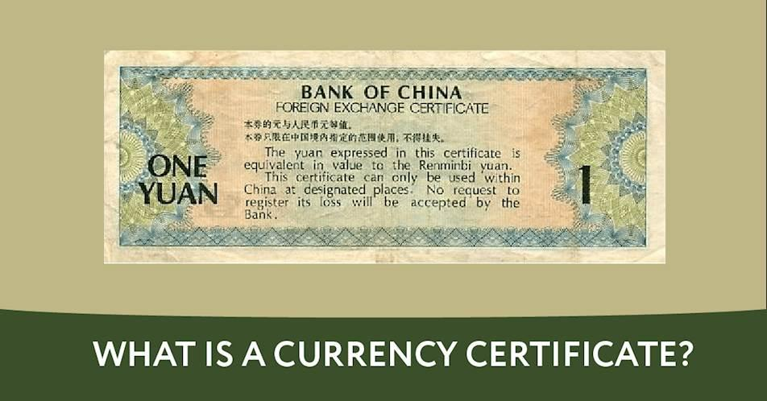

## Table of Contents

## What is a currency certificate?

A currency certificate is a document that proves you own a certain amount of money in a specific currency. It's like a receipt that shows you have money in a bank or with a financial institution. People use currency certificates when they need to show proof of their money for things like buying a house, moving to another country, or doing business in a different place.

These certificates are important because they help build trust between people and organizations. When you show a currency certificate, others can be sure that you really have the money you say you have. This is especially useful in international dealings where different countries have different currencies and rules about money. By using a currency certificate, you can make transactions smoother and more reliable.

## How does a currency certificate differ from physical currency?

A currency certificate is different from physical currency because it's not the actual money you can spend right away. Physical currency is the money you can touch, like coins and banknotes. You can use it to buy things directly. On the other hand, a currency certificate is just a paper or digital document that says you have a certain amount of money in a bank or financial institution. It's like a promise that you own that money, but you can't use it to buy things until you get the actual money from the bank.

Currency certificates are useful when you need to show proof of your money without carrying around cash. For example, if you're moving to another country, you might need to show a currency certificate to prove you have enough money to live there. Physical currency, however, is what you use every day for buying things like groceries or paying for services. While currency certificates help in specific situations where proof of funds is needed, physical currency is what you use for everyday transactions.

## What are the primary functions of a currency certificate?

A currency certificate's main job is to prove that you have money in a bank or financial institution. It's like a paper or digital receipt that shows you own a certain amount of money in a specific currency. This is useful when you need to show proof of your money without carrying cash around. For example, if you want to buy a house, the seller might ask for a currency certificate to make sure you can pay for it.

Another important function of a currency certificate is to help with trust and safety in big transactions, especially when dealing with people or businesses in different countries. By showing a currency certificate, you can prove that you have the money you say you have, which makes others feel more confident about doing business with you. This is especially helpful in international trade where different currencies and rules about money can make things complicated.

## Who issues currency certificates and what are the criteria for issuance?

Currency certificates are usually issued by banks or other financial institutions. When you want a currency certificate, you go to your bank and ask for one. The bank will then check your account to make sure you have the money you say you have. If everything is okay, they will give you a certificate that shows how much money you have in your account.

To get a currency certificate, you need to meet certain criteria set by the bank or financial institution. First, you need to have enough money in your account to cover the amount you want on the certificate. Second, the bank might ask you to fill out some forms or provide identification to make sure you are who you say you are. Finally, the bank will check that the money in your account is not from anything illegal or suspicious. Once all these things are checked, the bank will issue the currency certificate to you.

## How can one acquire a currency certificate?

To get a currency certificate, you need to go to your bank or financial institution. You'll ask them for a currency certificate and tell them how much money you want it to show. The bank will then look at your account to make sure you have that much money. If you do, they will give you the certificate. It's like a special paper or digital document that proves you have the money in your account.

When you ask for a currency certificate, the bank will also ask you to fill out some forms. They need to make sure you are who you say you are, so they might ask for your ID. The bank will also check that the money in your account is from legal sources and not from anything suspicious. Once everything is checked and okay, the bank will issue the currency certificate to you. It's a simple process, but it helps prove you have the money when you need to show it for things like buying a house or moving to another country.

## What are the security features typically included in currency certificates?

Currency certificates have special security features to make sure they are real and not fake. These features help keep the certificate safe and trusted. Common security features include watermarks, which are pictures or patterns you can see when you hold the certificate up to the light. Another feature is microprinting, which are tiny letters or numbers that are hard to copy. Also, there might be holograms, which are shiny images that change when you move the certificate around.

These security features are important because they stop people from making fake certificates. If someone tries to copy a currency certificate, the security features will show that it's not real. Banks and other organizations check these features to make sure the certificate is genuine. This helps keep trust in the system and makes sure that the money shown on the certificate is real.

## How are currency certificates used in international trade?

Currency certificates are very helpful in international trade. They are used to show proof of money when businesses from different countries want to do deals with each other. For example, if a company in one country wants to buy goods from a company in another country, they might need to show a currency certificate to prove they have enough money to pay for the goods. This makes the other company feel more confident about doing business with them because they know the money is there.

These certificates also help with trust and safety in international trade. Different countries have different currencies and rules about money, which can make things complicated. By using a currency certificate, businesses can show that they have the money they say they have, even if it's in a different currency. This makes it easier to do business across borders and helps keep transactions smooth and reliable.

## What role do currency certificates play in financial markets?

Currency certificates play an important role in financial markets by helping to show proof of money. When people or businesses want to do big deals, like buying stocks or bonds, they might need to show a currency certificate to prove they have the money to pay for it. This makes other people and businesses feel more confident about doing deals with them because they know the money is real and available.

In the financial markets, currency certificates also help with trust and safety. Since different countries have different currencies and rules about money, it can be hard to make sure everyone is honest. By using a currency certificate, people can show that they have the money they say they have, even if it's in a different currency. This makes it easier to do business across borders and helps keep the financial markets running smoothly and reliably.

## How does the value of a currency certificate fluctuate and what factors influence this?

The value of a currency certificate can change because it depends on the value of the money it represents. If the currency itself goes up or down in value compared to other currencies, the certificate's value will change too. For example, if you have a certificate that shows you have 100 dollars, and the dollar becomes worth more compared to the euro, the value of your certificate in euros goes up. This is important in international trade and financial markets where people often need to deal with different currencies.

Many things can affect the value of the currency on the certificate. Things like the economy of the country that uses the currency, interest rates set by the central bank, and even big news events can make the currency's value go up or down. If a country's economy is doing well, its currency might become more valuable. But if there's bad news or the economy is struggling, the currency might lose value. All these factors together can make the value of a currency certificate change over time.

## What are the risks associated with holding currency certificates?

Holding currency certificates can be risky because their value can change. If the currency on the certificate goes down in value compared to other currencies, the certificate becomes worth less. This can be a problem if you need to use the money in a different currency or if you're trying to do business in another country. For example, if you have a certificate in dollars and the dollar loses value against the euro, you'll get fewer euros when you convert it.

Another risk is that the bank or financial institution that issued the certificate could have problems. If the bank goes bankrupt or faces financial trouble, the money shown on the certificate might not be safe. This could mean you lose some or all of the money you thought you had. It's important to choose a reliable bank to reduce this risk.

## How are currency certificates regulated and what compliance measures are in place?

Currency certificates are regulated by banks and financial institutions, as well as by government agencies that make rules about money. These rules help make sure that the certificates are real and that the money they show is safe. Banks have to follow these rules when they issue currency certificates, which means they need to check that the money in your account is real and from legal sources. They also need to make sure that the certificates have special security features to stop people from making fake ones.

To make sure everyone follows the rules, there are compliance measures in place. Banks have to keep good records of who they give currency certificates to and how much money is on each certificate. They also need to report any suspicious activity to the government. If a bank doesn't follow the rules, they can get in trouble and might have to pay fines or face other punishments. This helps keep the system honest and makes sure that currency certificates are trusted and reliable.

## What advanced technologies are being integrated into currency certificates to enhance their functionality and security?

New technologies are making currency certificates even better and safer. One big change is the use of blockchain technology. Blockchain is like a special computer system that keeps track of money in a very safe way. When banks use blockchain for currency certificates, it makes it almost impossible for anyone to change or fake the certificates. This helps everyone trust that the money shown on the certificate is real and safe.

Another cool technology being used is digital signatures. These are like special codes that only the bank can put on the certificate. Digital signatures make it easy to check if the certificate is real without having to go to the bank. They also help keep the certificate safe from being copied or changed. By using these new technologies, currency certificates are becoming more secure and easier to use, which is great for people and businesses around the world.

## References & Further Reading

[1]: Lopez de Prado, M. (2018). ["Advances in Financial Machine Learning."](https://www.amazon.com/Advances-Financial-Machine-Learning-Marcos/dp/1119482089) Wiley.

[2]: Aronson, D. (2007). ["Evidence-Based Technical Analysis: Applying the Scientific Method and Statistical Inference to Trading Signals."](https://www.amazon.com/Evidence-Based-Technical-Analysis-Scientific-Statistical/dp/0470008741) Wiley.

[3]: Jansen, S. (2020). ["Machine Learning for Algorithmic Trading."](https://github.com/stefan-jansen/machine-learning-for-trading) Packt Publishing.

[4]: Chan, E. P. (2009). ["Quantitative Trading: How to Build Your Own Algorithmic Trading Business."](https://github.com/egorpe/EPChan-QuantitativeTrading/blob/master/example7_6.m) Wiley.

[5]: Murphy, J. J. (1999). ["Technical Analysis of the Financial Markets."](https://archive.org/details/technicalanalysi0000murp) New York Institute of Finance.

[6]: Aldridge, I. (2013). ["High-Frequency Trading: A Practical Guide to Algorithmic Strategies and Trading Systems."](https://books.google.com/books/about/High_Frequency_Trading.html?id=6l0DDQAAQBAJ) Wiley.

[7]: Tsay, R. S. (2010). ["Analysis of Financial Time Series."](https://onlinelibrary.wiley.com/doi/book/10.1002/9780470644560) Wiley.