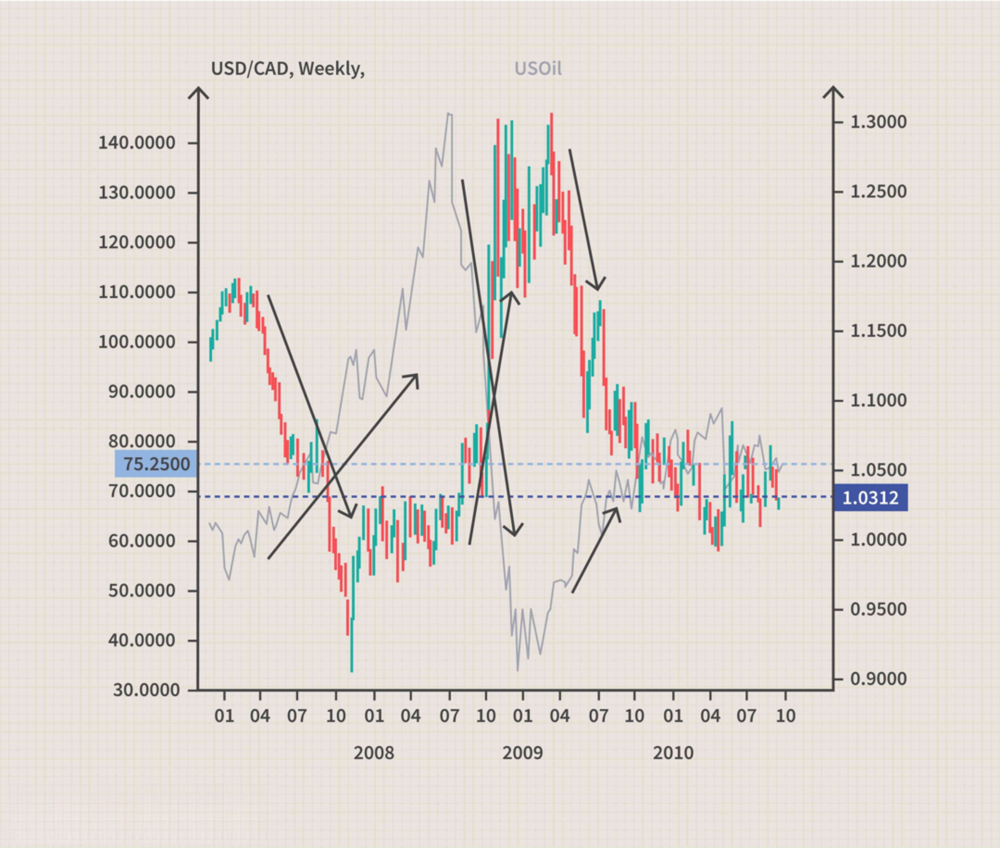

In the world of financial markets, understanding the dynamics between currencies and commodities is crucial for traders. Currency correlations refer to how certain currencies move in relation to commodity prices. These relationships can be vital, affecting pricing, valuation, and strategic decision-making in trading domains, particularly within commodity and algorithmic trading. Various economic factors, geopolitical events, and market perceptions drive these correlations. Consequently, traders need to be well-versed in the unique dynamics and characteristics that govern these interactions to devise effective trading strategies.

Currency correlations can manifest in several ways: positively, negatively, or neutrally. A positive correlation implies that a rise in a commodity's price is likely to lead to an appreciation in the linked currency. Conversely, a negative correlation indicates that an increase in commodity prices could lead to a depreciation of the associated currency. Neutral correlations exhibit no consistent directional relationship. Understanding these distinctions aids traders in predicting market movements and capitalizing on the resultant opportunities.



In this article, we will explore how currencies and commodities are correlated, scrutinize their impact on trading regimes, and elucidate strategies for leveraging these correlations for optimal gains. By analyzing specific currency-commodity linkages, such as the connection between the Canadian Dollar and oil markets or the Australian Dollar and gold prices, traders can optimize their portfolios and refine algorithmic trading methodologies. This comprehensive analysis will equip traders with the insights needed to manage risks effectively and exploit profitable setups in the ever-evolving landscape of financial markets.

## Table of Contents

## What Are Financial Markets and Currency Correlations?

Financial markets are platforms that facilitate the exchange of various types of assets, including currencies, commodities, stocks, and bonds. These markets are crucial for the efficient allocation of resources by providing a venue where buyers and sellers can transact. One of the key components of financial markets is the foreign exchange market (forex), where currencies are traded. In this context, understanding currency correlations plays a significant role in informing trading strategies.

Currency correlation is a statistical measure that assesses the degree to which two currency pairs move in relation to each other. This correlation can be expressed using the correlation coefficient, a value that ranges from -1 to 1. A correlation coefficient close to 1 implies a strong positive correlation, indicating that the currency pairs tend to move in the same direction. Conversely, a coefficient close to -1 suggests a strong negative correlation, where currency pairs typically move in opposite directions. A coefficient near zero implies no significant correlation, meaning the movements of the currency pairs are largely independent of one another.

In mathematical terms, the correlation coefficient $\rho$ between two currency pairs $X$ and $Y$ can be calculated using the formula:

$$
\rho(X, Y) = \frac{\text{cov}(X, Y)}{\sigma_X \sigma_Y}
$$

where $\text{cov}(X, Y)$ is the covariance between the two pairs, and $\sigma_X$ and $\sigma_Y$ are the standard deviations of $X$ and $Y$, respectively. 

In the [forex](/wiki/forex-system) and commodity markets, these currency correlations are particularly important as they can influence trading decisions. For instance, traders might use positive correlations to hedge their positions, while negative correlations might be used to diversify portfolios. Understanding these relationships helps traders assess risk and develop strategies that align with market trends. The impact of currency correlations extends to commodity trading as well, where the value of currencies may be influenced by the international demand and supply dynamics of various commodities. Thus, currency correlations are an essential tool for traders seeking to maximize their profits and minimize risks.

## How Currencies and Commodities Are Correlated

Certain currencies exhibit noteworthy correlations with specific commodities due to underlying economic factors and market dynamics. This relationship can often be attributed to the role these commodities play in a nation's export economy. For instance, the Canadian Dollar (CAD) is prominently linked to oil prices. Canada is a significant exporter of oil, and fluctuations in oil prices can influence Canada's trade balance, impacting the strength of the CAD. When oil prices rise, it generally leads to an increase in oil revenue for Canada, bolstering the CAD due to improved economic outlook and balance of trade surplus. Conversely, a drop in oil prices may weaken the CAD as export revenues fall and the trade balance deteriorates.

Similarly, the Australian Dollar (AUD) shows a strong correlation with gold prices, reflecting Australia's substantial gold reserves and its position as one of the world's leading gold exporters. An increase in gold prices typically enhances the Australian economy by increasing the value of gold exports, which can strengthen the AUD. Conversely, when gold prices drop, the AUD might weaken, reflecting lower export revenues and potential trade deficits.

These correlations are not merely coincidental but are rooted in the economic dependencies and trade compositions of these countries. As commodities form a significant part of these nations' exports, changes in commodity prices have direct repercussions on their currencies. Traders and analysts often monitor these relationships to inform currency trading strategies, leveraging the predictable movements of currencies in tandem with commodity price shifts.

To assess these correlations quantitatively, statistical measures such as the correlation coefficient can be employed. The correlation coefficient $r$ is calculated as:

$$

r = \frac{\sum{(X_i - \overline{X})(Y_i - \overline{Y})}}{\sqrt{\sum{(X_i - \overline{X})^2} \cdot \sum{(Y_i - \overline{Y})^2}}}
$$

where $X_i$ and $Y_i$ represent the observed commodity prices and currency exchange rates, respectively, and $\overline{X}$ and $\overline{Y}$ are their respective mean values. A positive $r$ close to 1 indicates a strong positive correlation, meaning the currency tends to rise when the commodity price increases, while a negative $r$ suggests an inverse relationship. 

Recognizing these correlations enables traders to make informed predictions about currency movements based on commodity price trends, aiding in the development of effective trading strategies. However, while these relationships historically provide valuable insights, they are influenced by various factors including geopolitical events, shifts in global demand, and changes in central bank policies. Therefore, ongoing analysis and adaptability are crucial in utilizing these correlations effectively in financial trading.

## The Role of Commodity Trading in Financial Markets

Commodity trading encompasses the buying and selling of natural resources such as oil, gold, and agricultural products. These commodities play a vital role in the global economy, influencing the financial markets significantly. The pricing of these commodities can notably affect the currencies of countries that are primary importers or exporters of these goods.

For instance, the value of the Canadian Dollar (CAD) is often closely tied to oil prices due to Canada's position as a major oil exporter. Similarly, Australia's economy benefits greatly from its gold reserves, impacting the Australian Dollar (AUD) whenever gold prices fluctuate. Changes in commodity prices directly influence these currencies’ exchange rates, affecting overall economic conditions.

Traders actively monitor these relationships to make informed trading decisions and capitalize on potential profit opportunities. A significant price increase in a commodity like oil could lead to an appreciation of the CAD, prompting traders to adjust their positions in forex markets accordingly. The reverse is true for countries heavily reliant on imports of such commodities, where rising prices can lead to currency depreciation due to increased trade deficits.

Using such correlations, traders can develop strategies to exploit these price movements. This approach often involves a combination of [fundamental analysis](/wiki/fundamental-analysis)—understanding how different economic factors influence commodity prices—and technical analysis, where traders use historical price data to forecast future movements. By understanding these dynamics, traders can enhance their decision-making process, potentially improving profitability and reducing exposure to adverse market movements.

In summary, the role of commodity trading in financial markets is profound. Understanding how commodity prices impact currencies and utilizing this knowledge enables traders to navigate complex market scenarios effectively, ensuring that their trades align with underlying economic trends and improving their prospects for profit.

## Algo Trading: Navigating Currency and Commodity Correlations

Algorithmic trading, often referred to as algo trading, involves executing trades based on pre-set rules and statistical models. These systems use algorithms to analyze large sets of financial data rapidly, allowing traders to capitalize on market inefficiencies. The integration of currency and commodity correlation data further enhances the effectiveness of these algorithms by offering deeper insights into market dynamics.

Incorporating correlation data between currencies and commodities in algo trading systems can significantly boost prediction accuracy. For instance, a currency like the Canadian Dollar (CAD), which is heavily influenced by oil prices, can provide a predictive edge if oil price fluctuations are accurately monitored and integrated into trading algorithms. By identifying patterns in how the CAD and oil move in relation to each other, algorithms can fine-tune trading strategies to anticipate market movements more accurately.

Python, a widely used language in [algorithmic trading](/wiki/algorithmic-trading), offers several tools to implement correlation analysis. Here's a simple example to calculate correlation coefficients using Python and pandas:

```python
import pandas as pd

# Sample data for currency (CAD) and commodity (Oil)
data = {'CAD': [1.30, 1.28, 1.29, 1.31, 1.30],
        'Oil': [50, 52, 51, 53, 54]}

df = pd.DataFrame(data)

correlation = df['CAD'].corr(df['Oil'])
print("Correlation between CAD and Oil:", correlation)
```

By utilizing such data, algo trading systems can create more responsive trading strategies, adjusting for shifts in correlation over time. These strategies not only predict currency movements more effectively but also adapt quickly to market changes, thereby enhancing returns.

Furthermore, algorithms equipped with real-time correlation tracking can adjust trading rules and stop-loss settings dynamically. This adaptability ensures that trading strategies remain efficient even when market conditions change, such as during economic news releases or geopolitical events that might disrupt existing correlations.

In conclusion, leveraging currency and commodity correlation data in algorithmic trading provides a robust framework for making informed trading decisions. By refining algorithms to account for these correlations, traders can better predict market trends and execute trades that optimize profitability.

## Strategies for Exploiting Currency and Commodity Correlations

Successful trading strategies in financial markets harness the power of correlation data between currencies and commodities. Monitoring real-time correlation data enables traders to capitalize on profitable trading opportunities. Here's how this can be accomplished.

### Utilizing Correlation Indicators

Traders employ correlation indicators available on trading platforms to discern relationships between assets. These indicators, typically expressed as correlation coefficients, measure the degree to which two assets move in relation to each other. The correlation coefficient $r$ ranges from -1 to 1, where:
- $r = 1$ indicates a perfect positive correlation; as one asset moves in a given direction, the other asset moves in the same direction.
- $r = -1$ signals a perfect negative correlation; as one asset moves in one direction, the other moves in the opposite direction.
- $r = 0$ implies no correlation; the movements of the assets are independent of each other.

A basic Python script might look as follows to calculate these correlations for historical data:

```python
import numpy as np
import pandas as pd
from scipy.stats import pearsonr

# Sample data for currency and commodity price indices
data = {'Currency_A': [1.12, 1.15, 1.14, 1.19, 1.18],
        'Commodity_B': [70, 72, 71, 73, 74]}

df = pd.DataFrame(data)

# Calculate Pearson correlation coefficient
correlation_coefficient, _ = pearsonr(df['Currency_A'], df['Commodity_B'])
print(f'Correlation Coefficient: {correlation_coefficient:.2f}')
```

This model assists traders in identifying pairs of currencies and commodities that have historically moved together, enabling them to forecast potential future shifts.

### Portfolio Diversification with Negative Correlations

Diversifying portfolios with negatively correlated assets can mitigate potential losses. In a portfolio, negatively correlated assets exhibit offsetting price movements, reducing overall [volatility](/wiki/volatility-trading-strategies). This means when the value of one asset decreases, the other tends to increase, helping to cushion the impact of market downturns. A well-diversified portfolio therefore aims for combinations of assets that balance risks and returns effectively.

Calculating an optimal mix of assets demands a robust understanding of covariance and correlation among portfolio constituents. The portfolio's overall risk can be quantified using the formula for portfolio variance:

$$
\sigma_p^2 = \sum_{i=1}^{n} w_i^2 \sigma_i^2 + \sum_{i=1}^{n} \sum_{j=1,j \neq i}^{n} w_i w_j \sigma_i \sigma_j \rho_{i,j}
$$

Where:
- $\sigma_p^2$ is the variance of the portfolio,
- $w_i$ and $w_j$ are the weights of assets $i$ and $j$ in the portfolio,
- $\sigma_i$ and $\sigma_j$ represent the standard deviations of assets $i$ and $j$,
- $\rho_{i,j}$ is the correlation coefficient between the returns of assets $i$ and $j$.

Strategically employing these techniques, traders can leverage currency and commodity correlations to maximize their trading efficacy, balancing risk and reward for better investment outcomes. It involves not only understanding past movements but also anticipating future shifts towards making informed decisions.

## Challenges and Risks in Correlation Trading

Currency and commodity correlations in trading are susceptible to various challenges and risks. One significant [factor](/wiki/factor-investing) is their inherent instability, which can be influenced by economic events and changes in policy. These correlations might fluctuate dramatically due to unexpected geopolitical events, [interest rate](/wiki/interest-rate-trading-strategies) announcements, or shifts in trade agreements. For instance, a sudden change in OPEC's oil production policy can impact oil prices, thereby altering the correlation between the Canadian Dollar and oil. 

Traders must also be wary of the risk associated with sudden decoupling. This phenomenon occurs when assets that were previously correlated become independent or even inversely related, potentially causing substantial losses if not anticipated. For example, if a currency and a commodity that were moving in tandem suddenly cease to do so, positions based on their correlation might incur significant losses.

To mitigate these risks, continuous monitoring and strategy adjustments are essential. Traders can use real-time data and analytics tools to keep their strategies aligned with market conditions. Moreover, sophisticated risk management techniques, such as setting stop-loss orders and diversifying portfolios, can help manage potential losses from correlation shifts. Incorporating advanced algorithms capable of adapting to changing correlations can also enhance trading outcomes. Overall, vigilance and adaptability are vital for navigating the complexities of correlation-based trading.

## Conclusion

Currency and commodity correlations present traders with compelling opportunities within financial markets. By understanding these relationships, traders can refine their strategies and enhance profit potential. Such insights are crucial for making informed decisions regarding market entry and [exit](/wiki/exit-strategy) points.

To effectively manage risk in correlation-based trading, vigilance is essential. Constantly monitoring correlation dynamics ensures traders can swiftly adapt to evolving market conditions. For instance, shifts in global economic policies or geopolitical tensions can disrupt previously stable correlations, posing potential risks. Therefore, staying alert to these changes helps mitigate unforeseen losses.

Adaptability also plays a vital role in successful trading. Strategies must be flexible to accommodate sudden changes in market behavior or asset relationships. Employing a dynamic approach enables traders to adjust their strategies in response to new information, optimizing performance and maintaining a competitive edge in the market.

In conclusion, understanding the interplay between currencies and commodities can provide significant advantages in trading. By prioritizing vigilance and adaptability, traders can effectively leverage these correlations, maximizing their profit margins while minimizing risks. Embracing these principles can aid in navigating the complex landscape of financial markets, contributing to sustained trading success.

## References & Further Reading

[1]: ["Algorithmic Trading & DMA: An introduction to direct access trading strategies"](https://www.amazon.com/Algorithmic-Trading-DMA-introduction-strategies/dp/0956399207) by Barry Johnson

[2]: ["The Black Swan: The Impact of the Highly Improbable"](https://en.wikipedia.org/wiki/The_Black_Swan:_The_Impact_of_the_Highly_Improbable) by Nassim Nicholas Taleb

[3]: Geman, H. (2005). ["Commodities and Commodity Derivatives: Modeling and Pricing for Agriculturals, Metals and Energy."](https://download.e-bookshelf.de/download/0000/5675/90/L-G-0000567590-0015270354.pdf) John Wiley & Sons.

[4]: Hull, J. C. (2015). ["Options, Futures, and Other Derivatives."](https://books.google.com/books/about/Options_Futures_and_Other_Derivatives.html?id=t6CSAgAAQBAJ) Pearson.

[5]: Roncoroni, A. (2018). ["Handbook of Multi-Commodity Markets and Products: Structuring, Trading and Risk Management."](https://onlinelibrary.wiley.com/doi/book/10.1002/9781119011590) Wiley Finance Series.