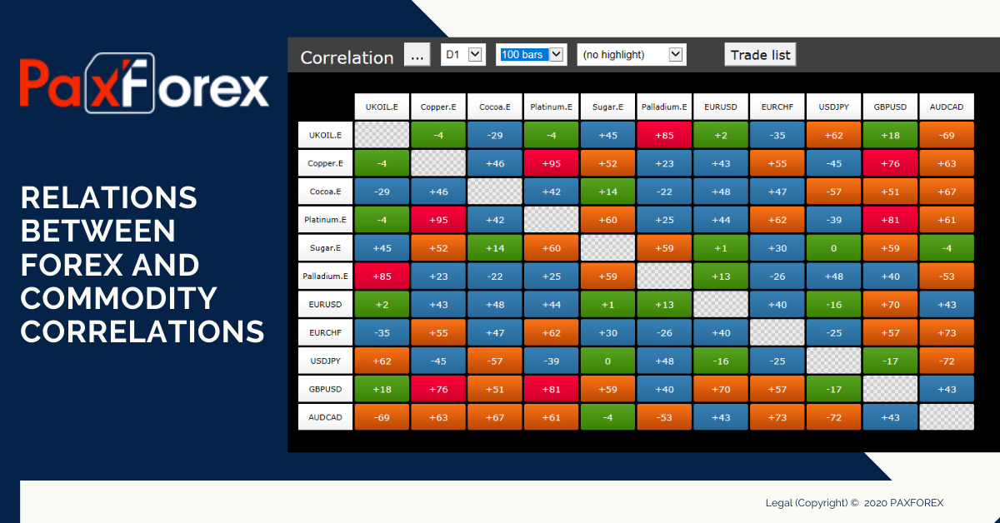

## Table of Contents

## What is currency and commodity correlation trading?

Currency and commodity correlation trading is a strategy where traders look at how currencies and commodities move together. For example, if the price of oil goes up, the value of the Canadian dollar might also go up because Canada exports a lot of oil. Traders use this information to make decisions about buying or selling currencies based on what is happening with commodity prices.

This type of trading can be useful because it helps traders predict how one market might affect another. If a trader knows that gold prices usually go up when the US dollar goes down, they might buy gold when they see the dollar weakening. By understanding these connections, traders can make smarter choices and possibly make more money. However, it's important to remember that these correlations can change, so traders need to keep watching the markets closely.

## How do currencies and commodities correlate with each other?

Currencies and commodities often move together because of how countries trade with each other. For example, if a country exports a lot of oil, like Canada, the value of its currency, the Canadian dollar, can go up when oil prices rise. This happens because when oil prices are high, other countries need to buy more Canadian dollars to pay for the oil. So, the demand for the Canadian dollar increases, making it stronger. On the other hand, if oil prices fall, the Canadian dollar might weaken because there's less demand for it.

Another example is gold and the US dollar. When the US dollar gets weaker, gold prices often go up. This is because gold is seen as a safe investment, and when the dollar is weak, people might want to buy more gold to protect their money. So, if a trader sees the US dollar starting to weaken, they might decide to buy gold, expecting its price to rise. These connections between currencies and commodities can help traders make better decisions, but they need to keep an eye on the markets because these relationships can change over time.

## What are the most common currency-commodity pairs traders focus on?

Traders often focus on the relationship between the US dollar and gold. When the US dollar weakens, gold prices tend to go up. This is because people see gold as a safe place to put their money when the dollar isn't doing well. So, if traders see the US dollar starting to drop, they might buy gold, hoping to make money as its price goes up.

Another common pair is the Canadian dollar and oil. Canada exports a lot of oil, so when oil prices rise, the Canadian dollar usually gets stronger. This happens because other countries need to buy more Canadian dollars to pay for the oil. On the flip side, if oil prices fall, the Canadian dollar might weaken because there's less demand for it. Traders watch these two closely to decide when to buy or sell the Canadian dollar based on oil prices.

## What basic strategies can beginners use to trade based on currency and commodity correlations?

One basic strategy for beginners is to watch the relationship between the US dollar and gold. When the US dollar goes down, gold prices usually go up. So, if you see the US dollar starting to weaken, you might want to buy gold. This can be a good way to make money because people often buy gold when they think the dollar isn't doing well. It's a simple way to use what you know about how these two things move together to make trading decisions.

Another strategy is to pay attention to the Canadian dollar and oil prices. Canada sells a lot of oil, so when oil prices go up, the Canadian dollar usually gets stronger. If you see oil prices starting to rise, you might decide to buy the Canadian dollar because its value will likely go up too. This can help you make money as the Canadian dollar becomes worth more. Just remember to keep an eye on the markets because these relationships can change over time.

## How can one identify and analyze correlation strengths between currencies and commodities?

To identify and analyze the correlation strengths between currencies and commodities, you can start by looking at historical data. This means checking how the prices of a currency and a commodity have moved together over time. For example, you might look at a chart that shows how the US dollar and gold prices have changed over the past year. If you see that when the US dollar goes down, gold prices usually go up, that's a sign of a strong negative correlation. You can use tools like correlation coefficients, which give you a number to show how strong the relationship is. A number close to 1 means a strong positive correlation, while a number close to -1 means a strong negative correlation.

Once you have the data, you can use simple graphs and charts to help you see the patterns more clearly. For instance, you might use a scatter plot to see how the Canadian dollar and oil prices move together. Each dot on the scatter plot represents a point in time, showing where the Canadian dollar and oil prices were at that moment. If the dots form a clear line going up, it means that when oil prices go up, the Canadian dollar usually goes up too. This visual can make it easier to understand the strength of the correlation. Remember, though, that correlations can change, so it's important to keep checking the data regularly to see if the relationship is still the same.

## What economic indicators should traders monitor to understand currency and commodity movements?

Traders should keep an eye on a few key economic indicators to understand how currencies and commodities might move. One important indicator is the Gross Domestic Product (GDP), which shows how well a country's economy is doing. If a country's GDP is growing, its currency might get stronger because people might want to invest in that country. Another useful indicator is the Consumer Price Index (CPI), which measures inflation. If inflation is high, a country's central bank might raise interest rates to control it, which can make the currency stronger. Also, employment numbers like the unemployment rate can affect currency values. If more people have jobs, they're spending more money, which can help the economy and the currency.

Another set of indicators to watch are commodity-specific reports. For example, oil inventory reports can give traders a good idea of what's happening with oil prices. If oil inventories are low, it might mean that oil prices will go up, which can affect currencies of countries that export a lot of oil, like the Canadian dollar. Also, agricultural reports like crop yield forecasts can impact commodity prices like wheat or corn, which in turn can affect currencies of countries that rely on these exports. By keeping an eye on these indicators, traders can get a better sense of how currencies and commodities might move and make more informed trading decisions.

## How do geopolitical events impact currency and commodity correlations?

Geopolitical events can have a big impact on how currencies and commodities move together. For example, if there's a war or political tension in a country that produces a lot of oil, like in the Middle East, it can make oil prices go up. When oil prices go up, the value of the Canadian dollar might also go up because Canada exports a lot of oil. But if the geopolitical event makes people worried about the world economy, they might start selling their Canadian dollars, which can make it go down even if oil prices are high. So, these events can change how strong the connection is between a currency and a commodity.

Another way geopolitical events can affect these correlations is by changing how people see a country's economy. If there's a lot of political trouble in a country, it might make investors think that country's currency is risky. For example, if there's a big election or a change in government that makes people unsure about the future, they might start selling that country's currency. This can weaken the currency, even if the prices of commodities that the country exports are going up. So, traders need to watch the news and understand how geopolitical events might change the way currencies and commodities move together.

## What are the risks involved in currency and commodity correlation trading?

Trading based on how currencies and commodities move together can be risky because these relationships can change. For example, if you think the Canadian dollar will go up because oil prices are rising, but then something unexpected happens like a big drop in oil demand, your trade might not work out. Also, things like political events or natural disasters can mess up the usual connections between currencies and commodities. So, it's important to always be ready for surprises and not just rely on what has happened in the past.

Another risk is that you might not know enough about all the things that can affect currency and commodity prices. For instance, if you don't keep up with economic news or understand how different countries' economies work, you might miss important signs that could change your trading plan. Plus, using borrowed money to trade, which is called leverage, can make your wins bigger but also your losses. So, it's a good idea to start small and learn as much as you can before you start trading with a lot of money.

## How can advanced traders use statistical tools to predict correlation shifts?

Advanced traders can use statistical tools like regression analysis to predict how the connections between currencies and commodities might change. Regression analysis helps them see how strong the relationship is between two things, like the US dollar and gold. By looking at past data, they can find patterns and use them to guess what might happen next. For example, if they see that the US dollar and gold usually move in opposite directions, they can use regression to see if this pattern is getting stronger or weaker over time. This can help them decide when to buy or sell based on these changing relationships.

Another useful tool is time series analysis, which looks at how prices change over time. Traders can use this to spot trends and cycles in the data, which can help them predict when a correlation might shift. For instance, if they notice that the Canadian dollar and oil prices have a strong connection during certain times of the year, they can use this information to make better trading decisions. By understanding these patterns, traders can be ready for changes in the market and adjust their strategies accordingly.

## What role does algorithmic trading play in exploiting currency and commodity correlations?

Algorithmic trading helps traders take advantage of how currencies and commodities move together by using computers to make trades quickly and automatically. Traders can set up rules in their algorithms that tell the computer to buy or sell based on certain patterns they see in the data. For example, if an algorithm notices that the Canadian dollar usually goes up when oil prices rise, it can automatically buy the Canadian dollar when it sees oil prices starting to increase. This way, traders don't have to watch the markets all the time and can make trades faster than they could by hand.

Using algorithms also lets traders test their ideas on old data to see if they work before using real money. This is called [backtesting](/wiki/backtesting). If a trader thinks that the US dollar and gold have a certain pattern, they can use an algorithm to check if this pattern would have made money in the past. If it looks good, they can then use the algorithm to trade in real time, hoping to make money from the same patterns in the future. This can make trading based on currency and commodity correlations more reliable and less risky.

## How can traders hedge their positions in currency and commodity correlation trading?

Traders can hedge their positions in currency and commodity correlation trading by using other financial instruments to protect themselves from losses. For example, if a trader buys the Canadian dollar because they think oil prices will go up, they might also buy an option that lets them sell the Canadian dollar at a certain price. This way, if oil prices go down and the Canadian dollar weakens, the trader can use the option to limit their losses. Hedging helps traders manage risk by giving them a way to protect their money if things don't go as planned.

Another way to hedge is by trading in opposite directions. If a trader thinks that the US dollar and gold move in opposite ways, they might buy gold and at the same time sell the US dollar. If the US dollar goes down and gold goes up, the trader can make money on both trades. But if the US dollar goes up instead, the loss on the gold trade can be balanced out by the gain on the US dollar trade. This strategy can help traders reduce the risk of losing a lot of money if their predictions about currency and commodity correlations turn out to be wrong.

## What are some case studies of successful and failed trades based on currency and commodity correlations?

One successful case study involves a trader who noticed the strong correlation between the Australian dollar (AUD) and iron ore prices. Australia exports a lot of iron ore, so when iron ore prices went up, the AUD usually got stronger. The trader bought AUD when they saw iron ore prices starting to rise. As expected, iron ore prices kept going up, and the AUD followed suit. The trader made a good profit by selling the AUD at a higher price later on. This trade worked well because the trader understood the correlation and acted on it at the right time.

On the other hand, a failed trade happened when a trader thought the correlation between the US dollar and gold would stay the same. The trader saw the US dollar weakening and bought gold, expecting its price to go up. However, a sudden geopolitical event caused investors to move their money into the US dollar as a safe haven, making it stronger instead of weaker. As a result, gold prices dropped, and the trader lost money. This case shows how quickly correlations can change due to unexpected events, and why it's important to be ready for surprises in the market.

Another example of a successful trade involved a trader who used the correlation between the Canadian dollar and oil prices. The trader noticed that oil prices were starting to rise due to increased global demand. They bought the Canadian dollar, expecting it to strengthen. As oil prices continued to climb, the Canadian dollar did indeed get stronger, and the trader sold it at a profit. This trade was successful because the trader paid close attention to the economic indicators and acted on the correlation at the right moment.

## What are financial markets and how do currency correlations work?

Financial markets are platforms that facilitate the exchange of various types of assets, including currencies, commodities, stocks, and bonds. These markets are crucial for the efficient allocation of resources by providing a venue where buyers and sellers can transact. One of the key components of financial markets is the foreign exchange market (forex), where currencies are traded. In this context, understanding currency correlations plays a significant role in informing trading strategies.

Currency correlation is a statistical measure that assesses the degree to which two currency pairs move in relation to each other. This correlation can be expressed using the correlation coefficient, a value that ranges from -1 to 1. A correlation coefficient close to 1 implies a strong positive correlation, indicating that the currency pairs tend to move in the same direction. Conversely, a coefficient close to -1 suggests a strong negative correlation, where currency pairs typically move in opposite directions. A coefficient near zero implies no significant correlation, meaning the movements of the currency pairs are largely independent of one another.

In mathematical terms, the correlation coefficient $\rho$ between two currency pairs $X$ and $Y$ can be calculated using the formula:

$$
\rho(X, Y) = \frac{\text{cov}(X, Y)}{\sigma_X \sigma_Y}
$$

where $\text{cov}(X, Y)$ is the covariance between the two pairs, and $\sigma_X$ and $\sigma_Y$ are the standard deviations of $X$ and $Y$, respectively. 

In the [forex](/wiki/forex-system) and commodity markets, these currency correlations are particularly important as they can influence trading decisions. For instance, traders might use positive correlations to hedge their positions, while negative correlations might be used to diversify portfolios. Understanding these relationships helps traders assess risk and develop strategies that align with market trends. The impact of currency correlations extends to commodity trading as well, where the value of currencies may be influenced by the international demand and supply dynamics of various commodities. Thus, currency correlations are an essential tool for traders seeking to maximize their profits and minimize risks.

## How are currencies and commodities correlated?

Certain currencies exhibit noteworthy correlations with specific commodities due to underlying economic factors and market dynamics. This relationship can often be attributed to the role these commodities play in a nation's export economy. For instance, the Canadian Dollar (CAD) is prominently linked to oil prices. Canada is a significant exporter of oil, and fluctuations in oil prices can influence Canada's trade balance, impacting the strength of the CAD. When oil prices rise, it generally leads to an increase in oil revenue for Canada, bolstering the CAD due to improved economic outlook and balance of trade surplus. Conversely, a drop in oil prices may weaken the CAD as export revenues fall and the trade balance deteriorates.

Similarly, the Australian Dollar (AUD) shows a strong correlation with gold prices, reflecting Australia's substantial gold reserves and its position as one of the world's leading gold exporters. An increase in gold prices typically enhances the Australian economy by increasing the value of gold exports, which can strengthen the AUD. Conversely, when gold prices drop, the AUD might weaken, reflecting lower export revenues and potential trade deficits.

These correlations are not merely coincidental but are rooted in the economic dependencies and trade compositions of these countries. As commodities form a significant part of these nations' exports, changes in commodity prices have direct repercussions on their currencies. Traders and analysts often monitor these relationships to inform currency trading strategies, leveraging the predictable movements of currencies in tandem with commodity price shifts.

To assess these correlations quantitatively, statistical measures such as the correlation coefficient can be employed. The correlation coefficient $r$ is calculated as:

$$

r = \frac{\sum{(X_i - \overline{X})(Y_i - \overline{Y})}}{\sqrt{\sum{(X_i - \overline{X})^2} \cdot \sum{(Y_i - \overline{Y})^2}}}
$$

where $X_i$ and $Y_i$ represent the observed commodity prices and currency exchange rates, respectively, and $\overline{X}$ and $\overline{Y}$ are their respective mean values. A positive $r$ close to 1 indicates a strong positive correlation, meaning the currency tends to rise when the commodity price increases, while a negative $r$ suggests an inverse relationship. 

Recognizing these correlations enables traders to make informed predictions about currency movements based on commodity price trends, aiding in the development of effective trading strategies. However, while these relationships historically provide valuable insights, they are influenced by various factors including geopolitical events, shifts in global demand, and changes in central bank policies. Therefore, ongoing analysis and adaptability are crucial in utilizing these correlations effectively in financial trading.

## What are the strategies for exploiting currency and commodity correlations?

Successful trading strategies in financial markets harness the power of correlation data between currencies and commodities. Monitoring real-time correlation data enables traders to capitalize on profitable trading opportunities. Here's how this can be accomplished.

### Utilizing Correlation Indicators

Traders employ correlation indicators available on trading platforms to discern relationships between assets. These indicators, typically expressed as correlation coefficients, measure the degree to which two assets move in relation to each other. The correlation coefficient $r$ ranges from -1 to 1, where:
- $r = 1$ indicates a perfect positive correlation; as one asset moves in a given direction, the other asset moves in the same direction.
- $r = -1$ signals a perfect negative correlation; as one asset moves in one direction, the other moves in the opposite direction.
- $r = 0$ implies no correlation; the movements of the assets are independent of each other.

A basic Python script might look as follows to calculate these correlations for historical data:

```python
import numpy as np
import pandas as pd
from scipy.stats import pearsonr

# Sample data for currency and commodity price indices
data = {'Currency_A': [1.12, 1.15, 1.14, 1.19, 1.18],
        'Commodity_B': [70, 72, 71, 73, 74]}

df = pd.DataFrame(data)

# Calculate Pearson correlation coefficient
correlation_coefficient, _ = pearsonr(df['Currency_A'], df['Commodity_B'])
print(f'Correlation Coefficient: {correlation_coefficient:.2f}')
```

This model assists traders in identifying pairs of currencies and commodities that have historically moved together, enabling them to forecast potential future shifts.

### Portfolio Diversification with Negative Correlations

Diversifying portfolios with negatively correlated assets can mitigate potential losses. In a portfolio, negatively correlated assets exhibit offsetting price movements, reducing overall [volatility](/wiki/volatility-trading-strategies). This means when the value of one asset decreases, the other tends to increase, helping to cushion the impact of market downturns. A well-diversified portfolio therefore aims for combinations of assets that balance risks and returns effectively.

Calculating an optimal mix of assets demands a robust understanding of covariance and correlation among portfolio constituents. The portfolio's overall risk can be quantified using the formula for portfolio variance:

$$
\sigma_p^2 = \sum_{i=1}^{n} w_i^2 \sigma_i^2 + \sum_{i=1}^{n} \sum_{j=1,j \neq i}^{n} w_i w_j \sigma_i \sigma_j \rho_{i,j}
$$

Where:
- $\sigma_p^2$ is the variance of the portfolio,
- $w_i$ and $w_j$ are the weights of assets $i$ and $j$ in the portfolio,
- $\sigma_i$ and $\sigma_j$ represent the standard deviations of assets $i$ and $j$,
- $\rho_{i,j}$ is the correlation coefficient between the returns of assets $i$ and $j$.

Strategically employing these techniques, traders can leverage currency and commodity correlations to maximize their trading efficacy, balancing risk and reward for better investment outcomes. It involves not only understanding past movements but also anticipating future shifts towards making informed decisions.

## References & Further Reading

[1]: ["Algorithmic Trading & DMA: An introduction to direct access trading strategies"](https://www.amazon.com/Algorithmic-Trading-DMA-introduction-strategies/dp/0956399207) by Barry Johnson

[2]: ["The Black Swan: The Impact of the Highly Improbable"](https://en.wikipedia.org/wiki/The_Black_Swan:_The_Impact_of_the_Highly_Improbable) by Nassim Nicholas Taleb

[3]: Geman, H. (2005). ["Commodities and Commodity Derivatives: Modeling and Pricing for Agriculturals, Metals and Energy."](https://download.e-bookshelf.de/download/0000/5675/90/L-G-0000567590-0015270354.pdf) John Wiley & Sons.

[4]: Hull, J. C. (2015). ["Options, Futures, and Other Derivatives."](https://books.google.com/books/about/Options_Futures_and_Other_Derivatives.html?id=t6CSAgAAQBAJ) Pearson.

[5]: Roncoroni, A. (2018). ["Handbook of Multi-Commodity Markets and Products: Structuring, Trading and Risk Management."](https://onlinelibrary.wiley.com/doi/book/10.1002/9781119011590) Wiley Finance Series.