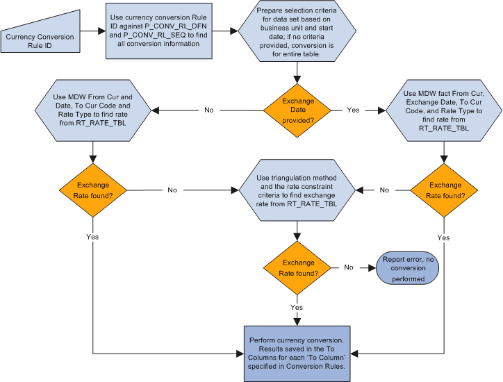

## Table of Contents

## What is currency conversion?

Currency conversion is when you change money from one country's currency to another country's currency. For example, if you have US dollars and you want to buy something in Europe, you need to convert your dollars to euros. This is important for people who travel to different countries or for businesses that work in many countries.

The conversion rate tells you how much of one currency you get for another currency. This rate changes every day because of things like the economy, politics, and how much people want to buy or sell a currency. You can convert currency at a bank, a currency exchange office, or online. It's a good idea to check the rates at different places to get the best deal.

## Why is currency conversion important?

Currency conversion is important because it helps people and businesses use money in different countries. If you travel to another country, you need to change your money into the local currency to buy things like food, souvenirs, or to pay for a hotel. Without currency conversion, you wouldn't be able to spend your money in places that use a different currency than your own.

For businesses, currency conversion is key when they buy or sell things in other countries. If a company in the United States wants to buy materials from Japan, it needs to convert its dollars into yen. This helps the business keep working and making money. Also, knowing how to convert currency helps businesses understand if they are making a profit or not when they deal with other countries.

## What are the basic methods of currency conversion?

One basic method of currency conversion is using a bank or a currency exchange office. When you go to a bank or an exchange office, you can give them your money in one currency, and they will give you money in another currency. They will use the current exchange rate to figure out how much money to give you. This method is easy because you can talk to someone who can help you, but sometimes the fees can be high.

Another way to convert currency is by using an online service or an app. Many websites and apps let you convert money online. You can enter how much money you want to convert and choose the currencies. The service will then tell you how much money you will get after the conversion. This method is good because it's fast and you can do it from home, but you need to be careful to use a trusted service to keep your money safe.

A third method is using an ATM when you are in another country. If you have a bank card, you can use it at an ATM to get money in the local currency. The ATM will convert your money automatically using the exchange rate. This is handy when you are traveling because you don't need to [carry](/wiki/carry-trading) a lot of cash. Just remember that there might be fees from your bank and the ATM for using this service.

## How does the exchange rate affect currency conversion?

The exchange rate is like a price tag that tells you how much of one currency you can get for another. It changes all the time because of things like the economy, politics, and how much people want to buy or sell a currency. When the exchange rate is good, you get more of the other currency for your money. But if the exchange rate is bad, you get less. So, the exchange rate can make a big difference in how much money you have after converting it.

For example, if you want to convert US dollars to euros and the exchange rate is high, you will get more euros for your dollars. This is good if you are traveling to Europe because you can buy more things. But if the exchange rate is low, you will get fewer euros, and your money won't go as far. That's why it's smart to check the exchange rate before you convert your money, so you know if it's a good time to do it.

## What is the difference between a fixed and floating exchange rate?

A fixed exchange rate is when a country decides to keep its currency's value the same compared to another currency or a basket of currencies. The government or the central bank will step in to make sure the exchange rate stays at the set level. They might buy or sell their own currency to keep it steady. This can make it easier for businesses to plan because they know how much their money is worth in other countries. But it can be hard to keep the rate fixed, especially if the economy changes a lot.

A floating exchange rate is when a country lets the value of its currency change based on what people want to buy or sell it. The exchange rate goes up and down because of things like the economy, politics, and how much people want the currency. This means the value of the currency can change a lot from day to day. It can be good because it lets the market decide the value, but it can also make it harder for businesses to plan because they don't know how much their money will be worth in the future.

## What are the fees associated with currency conversion?

When you convert currency, you often have to pay fees. These fees can come from different places. Banks and currency exchange offices might charge you a fee for each transaction. This fee can be a flat amount, like $5 or $10, or it can be a percentage of the money you are converting, like 1% or 2%. Online services and apps might also charge fees, sometimes less than banks, but you need to check because fees can be different for each service.

Another kind of fee is the spread, which is the difference between the rate at which the bank or service buys the currency and the rate at which they sell it to you. This spread can make the exchange rate you get worse than the rate you see online. When you use an ATM in another country, you might have to pay fees from your bank and the ATM. These fees can add up, so it's a good idea to check all the fees before you convert your money to make sure you get the best deal.

## How can one use online currency converters?

Using an online currency converter is easy and can help you see how much money you will get when you change one currency to another. First, you go to a website or open an app that has a currency converter. Then, you pick the currency you have and the currency you want to change it to. Next, you type in how much money you want to convert. The converter will show you how much money you will get in the new currency, using the exchange rate at that moment.

It's a good idea to use online currency converters to compare different services and see which one gives you the best deal. Some converters might also show you the fees they charge, so you can see the total cost of converting your money. Remember, the exchange rate can change all the time, so if you need to convert a lot of money, it's smart to check the rate often and convert your money when the rate is good for you.

## What are the risks involved in currency conversion?

When you convert money from one currency to another, there are some risks you should know about. One big risk is that the exchange rate can change quickly. If you convert your money and then the rate gets better, you might wish you had waited. On the other hand, if the rate gets worse, you might be happy you converted when you did. But it's hard to predict what will happen, and this can make it tricky to decide when to convert your money.

Another risk is that you might lose money because of fees. Banks, currency exchange offices, and online services often charge fees for converting money. These fees can add up and make your money worth less than you expected. It's important to check the fees before you convert your money so you know how much it will really cost you. If you don't pay attention to the fees, you might end up with less money than you planned.

## How do financial institutions handle large-scale currency conversions?

Financial institutions like banks and big companies handle large-scale currency conversions by using special services and tools. They often work with big currency markets where they can trade a lot of money at once. This helps them get better exchange rates than what regular people might get. They also use something called hedging, which is like a safety net to protect them from big changes in the exchange rate. By doing this, they can make sure they don't lose too much money if the rate changes suddenly.

When a bank or a company needs to convert a lot of money, they plan carefully. They watch the exchange rates all the time and try to convert the money when the rate is good for them. They also have to think about the fees they will have to pay for the conversion. Sometimes, they use special accounts or services that let them convert money without paying high fees. This way, they can save money and make sure they get the best deal possible when they convert large amounts of currency.

## What are the advanced tools used for predicting exchange rate movements?

To predict how exchange rates will move, people use special tools that help them understand what might happen next. One common tool is called technical analysis, which looks at past prices and trading patterns to guess future movements. Traders use charts and graphs to find patterns that might repeat. Another tool is [fundamental analysis](/wiki/fundamental-analysis), which looks at things like a country's economy, interest rates, and political news to predict how the currency might change. By understanding these big factors, people can make better guesses about where the exchange rate is headed.

There are also more advanced tools like econometric models and [machine learning](/wiki/machine-learning) algorithms. Econometric models use math to predict exchange rates based on lots of different data, like economic reports and market trends. Machine learning algorithms can learn from past data to find patterns that humans might miss. These tools can be very helpful, but they're not perfect. Exchange rates can be hard to predict because they can change quickly because of things like unexpected news or sudden changes in the market. So, even with these advanced tools, predicting exchange rates is still a bit like trying to guess the future.

## How does currency conversion impact international trade and investment?

Currency conversion plays a big role in international trade and investment. When businesses buy or sell things in other countries, they need to convert their money into the local currency. If the exchange rate is good, they can buy more with their money, which can make their products cheaper and help them sell more. But if the exchange rate is bad, their products might become more expensive, and it could be harder to make a profit. This is why businesses watch exchange rates closely and plan their conversions carefully to keep their costs down and stay competitive.

For investors, currency conversion is also important. When they invest in another country, they need to convert their money into the local currency. If the exchange rate changes a lot, it can affect how much money they make from their investments. A good exchange rate can increase their returns, but a bad one can lower them. Investors often use strategies like hedging to protect themselves from big changes in exchange rates. By managing currency conversion well, they can make better investment decisions and try to get the best results from their money.

## What are the regulatory considerations in currency conversion across different countries?

When you convert money from one country to another, there are rules you need to follow. Different countries have their own laws about currency conversion. Some countries have strict rules to control how much money can be moved in and out. This is to stop people from doing things like money laundering, which is when someone tries to hide where their money came from by moving it around. Governments might also keep an eye on big currency movements to make sure they don't hurt the country's economy.

Another thing to think about is taxes. Some countries might tax the money you make from converting currency, especially if you do it a lot. You need to know about these tax rules so you don't get in trouble. Also, banks and other places that help with currency conversion have to follow special rules too. They need to report big transactions and make sure they're not helping anyone break the law. So, it's important to understand the rules in each country before you convert your money.

## What is the process of currency conversion?

Currency conversion involves determining the value of one currency in relation to another, which is fundamental in international finance and commerce. The conversion process is contingent upon current exchange rates, which are influenced by multiple economic factors. There are several methods to convert currencies, from manual calculations to digital tools that offer real-time conversion rates.

**Manual Currency Conversion Steps:**

1. **Identify the Exchange Rate:** To convert currency manually, identify the current exchange rate. Exchange rates can be found through financial news websites, banks, or forex trading platforms. Suppose the exchange rate from USD to EUR is 0.85.

2. **Calculation:** If you want to convert 100 USD to EUR, multiply the USD amount by the exchange rate.
$$
   \text{EUR} = \text{USD} \times \text{Exchange Rate} 

$$
$$
   \text{EUR} = 100 \times 0.85 = 85

$$

3. **Reverse Conversion:** For converting back from EUR to USD, divide the EUR amount by the exchange rate.
$$
   \text{USD} = \frac{\text{EUR}}{\text{Exchange Rate}} 

$$

**Digital Tools for Currency Conversion:**

Digital platforms provide the convenience of automating the currency conversion process. Online conversion tools and mobile apps apply real-time exchange rates, enhancing accuracy and efficiency. Additionally, Application Programming Interfaces (APIs) enable developers to integrate currency conversion features into their applications. Below is a simple Python script example using an online API for real-time conversion:

```python
import requests

def convert_currency(amount, from_currency, to_currency):
    url = f"https://api.exchangerate-api.com/v4/latest/{from_currency}"
    response = requests.get(url)
    data = response.json()
    rate = data['rates'][to_currency]
    return amount * rate

amount_in_usd = 100
converted_amount = convert_currency(amount_in_usd, 'USD', 'EUR')
print(f"{amount_in_usd} USD is {converted_amount:.2f} EUR")
```

**Interpreting Currency Conversion Rates:**

Currency conversion rates reflect the current market conditions and can fluctuate due to changes in economic events, market speculation, and geopolitical dynamics. Understanding these rates is crucial for making informed financial decisions, especially when they appear with additional costs such as conversion fees or spreads charged by financial institutions.

**Fintech Innovations:**

Fintech advancements have significantly enhanced the accuracy and ease of currency conversion. Platforms now provide instant conversions and insights into historical rates, aiding users in predicting currency trends. Technologies such as blockchain are being explored to potentially eliminate intermediaries, thereby reducing costs and increasing transparency in currency conversions.

**Real-time Currency Conversion in International Trade and Travel:**

Real-time currency conversion is vital for global trade and travel, ensuring businesses and travelers transact accurately without incurring unexpected costs due to rate changes. It allows for precise budgeting and financial planning, mitigating risks associated with currency value fluctuations.

In summary, whether manually or through digital tools, understanding the process of currency conversion can help manage financial transactions effectively in an interconnected world.

## References & Further Reading

[1]: Brooks, K., & Dolan, B. (2015). ["Currency Trading for Dummies"](https://books.google.com/books/about/Currency_Trading_For_Dummies.html?id=M5C9BQAAQBAJ). John Wiley & Sons.

[2]: Douglas, M. (2000). ["Trading in the Zone: Master the Market with Confidence, Discipline, and a Winning Attitude."](https://drive.google.com/file/d/1swifXNzKy_AXh8X44M0JlrdkUGlM-bLa/view) Prentice Hall Press.

[3]: Chan, E. (2013). ["Algorithmic Trading: Winning Strategies and Their Rationale."](https://github.com/ftvision/quant_trading_echan_book) John Wiley & Sons.

[4]: ["Forex.com"](https://www.forex.com/en-us/trading-platforms/metatrader-4/) - Offers comprehensive currency exchange services and tools for forex trading.

[5]: ["Interactive Brokers"](http://interactivebrokers.com/) - Provides a wide range of currency pairs and advanced trading features.

[6]: ["OANDA"](https://www.oanda.com/) - Features real-time exchange rates and a demo platform for practicing trades.

[7]: ["XE Currency Converter"](https://www.xe.com/currencyconverter/) - Provides quick and easy conversion of currencies with live updates.

[8]: ["Babypips School of Pipsology"](https://www.babypips.com/learn/forex) - Offers a comprehensive tutorial series on forex trading, from basics to advanced strategies.

[9]: Lo, A. W. (2019). ["Advances in Financial Machine Learning."](https://www.tandfonline.com/doi/full/10.1080/14697688.2019.1703030) Wiley.