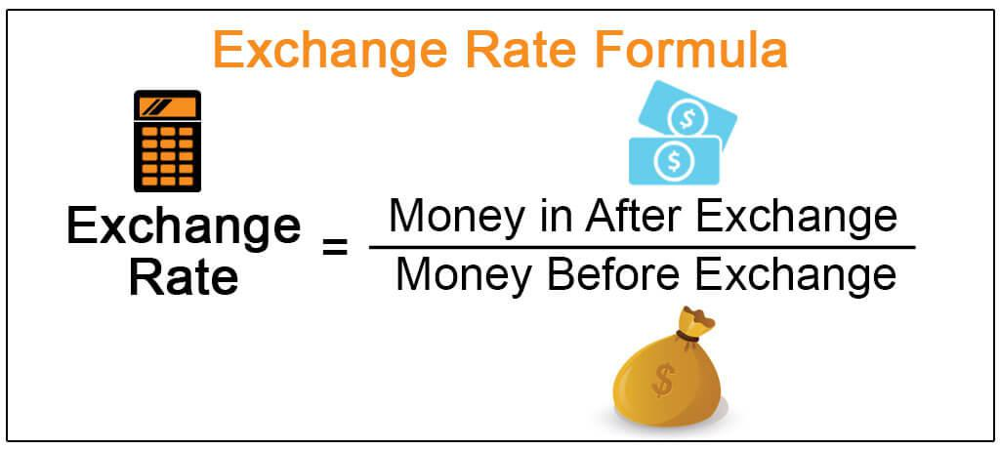

In today's interconnected world, understanding exchange rates and currency conversion is essential for both businesses and individuals. Exchange rates represent the value of one currency in terms of another and are pivotal in international trade and finance. These rates are influenced by various factors such as economic indicators, market sentiments, and geopolitical events, making their understanding crucial for informed decision-making.

This article will provide a comprehensive exploration of exchange rates, currency exchange, and currency conversion. We will examine how these elements interact and their significance in the global economy. The article will also highlight the increasing role of algorithmic trading in optimizing currency exchange by leveraging automated strategies to execute trades at optimal prices.



Whether you are a forex trader aiming to capitalize on market fluctuations or someone preparing for international travel, this guide offers valuable insights into navigating the complex landscape of currency exchange. Understanding the importance and mechanics of exchange rates can empower you to make better financial decisions and potentially secure more favorable exchange outcomes. Let's begin with a foundational understanding of what exchange rates are and their importance in global economic dynamics.

## Table of Contents

## Understanding Exchange Rates

Exchange rates are pivotal for determining how much one currency is worth in relation to another. They are a cornerstone of international finance, influencing global trade, investment, and travel. The rate at which currencies are exchanged is dynamic, influenced by multiple factors that continuously shape and reshape these values.

One primary factor affecting exchange rates is economic indicators. Indicators such as inflation rates, interest rates, and Gross Domestic Product (GDP) growth play crucial roles. For example, if a country's inflation rate is lower than that of other countries, its currency will usually appreciate because lower inflation often leads to higher purchasing power and increased demand for that currency. Conversely, a nominal interest rate adjustment can attract foreign investment, strengthening the currency.

Market speculation is another force impacting exchange rates. Traders' perceptions about future economic conditions can result in currency value fluctuations. For instance, if market participants expect a country's economy to improve, they will likely buy that currency in anticipation of a future increase in value, thus driving up its current exchange rate.

Geopolitical events also contribute significantly to exchange rate [volatility](/wiki/volatility-trading-strategies). Political stability or instability, changes in government policy, and international conflicts can all alter currency values. For example, political unrest in a country might lead to depreciation of its currency as uncertainty decreases investor confidence.

Exchange rates can be categorized as either fixed or floating. A fixed exchange rate is pegged to a major currency, such as the U.S. dollar, and does not change based on market forces. Countries with fixed rates use significant amounts of foreign reserves to maintain their currency's value. In contrast, floating exchange rates fluctuate freely according to supply and demand dynamics in the [forex](/wiki/forex-system) market. The impact of these different systems on the global economy is substantial. Fixed rates provide stability in trade, reducing the risk of exchange rate fluctuations, which can benefit countries with volatile economies. On the other hand, floating rates offer more flexibility and are self-correcting, helping to reflect a country's real economic conditions.

Central banks and financial institutions are key players in the currency market. Central banks, such as the European Central Bank or the Federal Reserve in the United States, implement monetary policies that can impact exchange rates. By adjusting interest rates or conducting foreign exchange interventions, these entities influence currency supply and demand. Additionally, financial institutions, including commercial banks and investment firms, facilitate currency trading, actively engaging in buy and sell operations that contribute to the currency's market price.

Understanding how exchange rates are determined and the factors influencing them can help individuals and businesses make informed financial decisions. Whether engaging in international trade, investment, or travel, knowledge of exchange rate dynamics is critical for effective financial planning.

## Currency Exchange: The Basics

Currency exchange is the process of converting one currency into another, a necessity for international trade, travel, and commerce. It plays a critical role in enabling global transactions and is a foundational element of the global financial system.

To facilitate this conversion, various entities like banks, online platforms, and exchange bureaus act as intermediaries. Traditional banks have long been a cornerstone for currency exchange, offering services that cater to both individual and corporate clients. They provide not only currency conversion but also various related financial services. Online platforms, such as forex trading platforms and fintech companies, have gained prominence in recent years due to their convenience and often lower fees. These platforms allow individuals to exchange currencies at any time, capitalizing on real-time exchange rate fluctuations. Exchange bureaus, commonly found in airports and tourist areas, provide immediate access to different currencies, making them convenient for travelers who need cash quickly.

When exchanging currency, understanding fees and exchange rate spreads is crucial to optimizing the value received. Fees can vary significantly between service providers. Banks may charge a fixed fee or a percentage of the transaction, whereas online platforms might offer more competitive rates but with hidden costs embedded in suboptimal exchange rates. The exchange rate spread, the difference between the buying and selling price of a currency pair, can also impact the cost. A narrower spread generally indicates a better deal for the customer.

For international travelers, safety is a priority when exchanging currency. It's advisable to plan currency exchanges in advance to avoid high fees in tourist-heavy locations. Utilizing credit cards with no foreign transaction fees can be a safer alternative to carrying large amounts of cash. When cash is necessary, use secure ATMs preferably within bank branches, as they offer better rates and enhanced security over standalone ATMs or kiosks. Always be alert to potential scams and avoid sharing personal information unnecessarily. 

In summary, currency exchange is a fundamental economic activity enabling cross-border financial transactions. By understanding the roles of different exchange facilitators and the cost structures involved, individuals and businesses can make informed decisions, ensuring they maximize value and maintain security during currency exchanges.

## The Process of Currency Conversion

Currency conversion involves determining the value of one currency in relation to another, which is fundamental in international finance and commerce. The conversion process is contingent upon current exchange rates, which are influenced by multiple economic factors. There are several methods to convert currencies, from manual calculations to digital tools that offer real-time conversion rates.

**Manual Currency Conversion Steps:**

1. **Identify the Exchange Rate:** To convert currency manually, identify the current exchange rate. Exchange rates can be found through financial news websites, banks, or forex trading platforms. Suppose the exchange rate from USD to EUR is 0.85.

2. **Calculation:** If you want to convert 100 USD to EUR, multiply the USD amount by the exchange rate.
$$
   \text{EUR} = \text{USD} \times \text{Exchange Rate} 

$$
$$
   \text{EUR} = 100 \times 0.85 = 85

$$

3. **Reverse Conversion:** For converting back from EUR to USD, divide the EUR amount by the exchange rate.
$$
   \text{USD} = \frac{\text{EUR}}{\text{Exchange Rate}} 

$$

**Digital Tools for Currency Conversion:**

Digital platforms provide the convenience of automating the currency conversion process. Online conversion tools and mobile apps apply real-time exchange rates, enhancing accuracy and efficiency. Additionally, Application Programming Interfaces (APIs) enable developers to integrate currency conversion features into their applications. Below is a simple Python script example using an online API for real-time conversion:

```python
import requests

def convert_currency(amount, from_currency, to_currency):
    url = f"https://api.exchangerate-api.com/v4/latest/{from_currency}"
    response = requests.get(url)
    data = response.json()
    rate = data['rates'][to_currency]
    return amount * rate

amount_in_usd = 100
converted_amount = convert_currency(amount_in_usd, 'USD', 'EUR')
print(f"{amount_in_usd} USD is {converted_amount:.2f} EUR")
```

**Interpreting Currency Conversion Rates:**

Currency conversion rates reflect the current market conditions and can fluctuate due to changes in economic events, market speculation, and geopolitical dynamics. Understanding these rates is crucial for making informed financial decisions, especially when they appear with additional costs such as conversion fees or spreads charged by financial institutions.

**Fintech Innovations:**

Fintech advancements have significantly enhanced the accuracy and ease of currency conversion. Platforms now provide instant conversions and insights into historical rates, aiding users in predicting currency trends. Technologies such as blockchain are being explored to potentially eliminate intermediaries, thereby reducing costs and increasing transparency in currency conversions.

**Real-time Currency Conversion in International Trade and Travel:**

Real-time currency conversion is vital for global trade and travel, ensuring businesses and travelers transact accurately without incurring unexpected costs due to rate changes. It allows for precise budgeting and financial planning, mitigating risks associated with currency value fluctuations.

In summary, whether manually or through digital tools, understanding the process of currency conversion can help manage financial transactions effectively in an interconnected world.

## Algorithmic Trading in Currency Exchange

Algorithmic trading has revolutionized the landscape of currency exchange by implementing automated strategies to achieve optimal pricing and improved efficiency. This approach relies on complex algorithms to analyze vast amounts of market data, identify trading opportunities, and execute trades at high speeds, often without human intervention. 

In the foreign exchange (forex) market, algorithms are designed to forecast currency movements by assessing numerous variables such as historical price patterns, interest rates, market volatility, and economic indicators. The ability of these algorithms to process and react to information far exceeds human capabilities, allowing traders to capitalize on short-term pricing discrepancies and market inefficiencies.

One of the primary advantages of [algorithmic trading](/wiki/algorithmic-trading) in forex markets is its ability to minimize the impact of emotional decision-making, thus enhancing the consistency and reliability of trading performance. It offers traders the benefit of executing large orders without causing significant market disruption through tactics like slicing orders into smaller, less conspicuous parts. Additionally, algorithmic trading enables 24/7 market participation, taking advantage of trading opportunities across different time zones.

However, algorithmic trading also presents several challenges. The development and maintenance of sophisticated trading algorithms require substantial technical expertise and financial resources. Moreover, these systems must be continuously updated to adapt to changing market conditions and to remain competitive. There is also the risk of algorithmic failures, which can result in significant financial losses if not properly managed. Flash crashes, caused by algorithms reacting to a cascade of market events, are an example of such risks.

The future of algorithmic trading in currency exchange points towards greater integration of [artificial intelligence](/wiki/ai-artificial-intelligence) and [machine learning](/wiki/machine-learning). These technologies promise to further refine predictive models, enabling even higher levels of precision in forecasting currency movements. Enhanced data analysis and improved pattern recognition capabilities will likely lead to more adaptive and self-learning trading systems.

As algorithmic trading evolves, issues regarding market regulation and ethical considerations about transparency and fairness will require attention. Ensuring that these sophisticated systems do not compromise market integrity will be crucial for their sustainable growth.

In summary, algorithmic trading is reshaping currency exchange by increasing trading efficiency, speed, and precision. While it presents opportunities for significant gains, it also requires careful management and oversight to mitigate associated risks and ensure a fair trading environment.

## Conclusion

Understanding exchange rates and currency conversion is a fundamental aspect of participating in today's interconnected global economy. These processes are not only crucial for international traders and businesses but have a significant impact on individual financial decisions as well. As globalization continues to accelerate, the ability to accurately interpret and engage with currency markets becomes increasingly vital.

Technological advancements, particularly in algorithmic trading, have revolutionized the way currency exchanges happen. Algorithmic trading utilizes complex algorithms to analyze market data and execute trades at optimal moments, greatly increasing the efficiency and accuracy of currency conversions. This innovative approach minimizes human error, enhances speed, and often results in more favorable exchange rates, which can be a major advantage in the fast-paced world of foreign exchange markets.

For both personal travel and international business operations, being well-informed about currency exchange processes can lead to more advantageous financial outcomes. Familiarity with exchange rates and conversion tools allows individuals and businesses to make proactive decisions that can minimize costs and maximize value. For instance, understanding concepts such as exchange rate spreads and the timing of conversions can reduce expenses associated with international transfers and transactions.

Continuous learning and utilization of digital tools can facilitate smoother currency exchange and conversion experiences. Online calculators, trading platforms, and educational resources can provide real-time data and analytics, helping users stay informed and make strategic decisions. Additionally, learning about algorithmic strategies can empower users to leverage these tools effectively, further optimizing their financial activities.

As the intersection of technology and finance continues to evolve, staying up-to-date with current trends and innovations in currency exchange is beneficial. Embracing these advances not only empowers individuals and businesses but also contributes to a more seamless and efficient global economic environment. By harnessing the power of technology, one can navigate the complexities of currency markets with confidence and precision.

## Additional Resources

### Additional Resources

For individuals and businesses looking to gain a deeper understanding of currency exchange and forex trading, several resources are available to facilitate learning and practical application. Here are some useful resources:

**Links to Forex Trading Platforms:**
1. **Forex.com** - Known for its comprehensive currency exchange services, Forex.com offers platforms with competitive exchange rates and tools for technical analysis. [Visit Forex.com](https://www.forex.com)
2. **Interactive Brokers** - Offers a wide range of currency pairs and advanced trading features. [Visit Interactive Brokers](https://www.interactivebrokers.com)
3. **OANDA** - Features real-time exchange rates and a demo platform for practicing trades without risk. [Visit OANDA](https://www.oanda.com/)

**Recommended Reading:**
1. **"Currency Trading for Dummies" by Kathleen Brooks and Brian Dolan** - Provides insights into forex trading strategies and the dynamics of the forex market.
2. **"Trading in the Zone" by Mark Douglas** - Focuses on the psychological aspects of trading, essential for developing a winning mindset.
3. **"Algorithmic Trading: Winning Strategies and Their Rationale" by Ernie Chan** - Offers strategies and methodologies for implementing algorithmic trading successfully.

**Online Calculators for Currency Conversion:**
1. **XE Currency Converter** - Provides quick and easy conversion of currencies with live updates. [Use XE Converter](https://www.xe.com)
2. **OANDA Currency Converter** - Offers historical exchange rates and a simple user interface. [Use OANDA Converter](https://www.oanda.com/currency-converter)

For Python enthusiasts, here is a simple script using the `forex-python` library to perform currency conversion:

```python
from forex_python.converter import CurrencyRates

currency_rates = CurrencyRates()
amount = 100  # value in original currency
from_currency = 'USD'
to_currency = 'EUR'

converted_amount = currency_rates.convert(from_currency, to_currency, amount)
print(f"{amount} {from_currency} is equivalent to {converted_amount:.2f} {to_currency}")
```

**Tutorials and Webinars:**
1. **Babypips School of Pipsology** - Offers a comprehensive tutorial series on forex trading, from basics to advanced strategies. [Visit Babypips](https://www.babypips.com/learn/forex)
2. **Forex Webinar Series by FXCM** - Provides interactive sessions on various trading topics and market analysis. [Visit FXCM Webinars](https://www.fxcm.com/markets/insights/webinars/)

**Online Communities and Forums:**
1. **Forex Factory** - A popular forum for traders to discuss strategies, share insights, and exchange market news. [Join Forex Factory](https://www.forexfactory.com)
2. **Reddit Forex Trading** - A community of traders discussing forex trends, strategies, and experiences. [Visit Reddit Forex](https://www.reddit.com/r/Forex/)

These resources are valuable for both beginners and experienced traders seeking to enhance their understanding and skills in currency exchange and trading strategies.

## References & Further Reading

[1]: Brooks, K., & Dolan, B. (2015). ["Currency Trading for Dummies"](https://books.google.com/books/about/Currency_Trading_For_Dummies.html?id=M5C9BQAAQBAJ). John Wiley & Sons.

[2]: Douglas, M. (2000). ["Trading in the Zone: Master the Market with Confidence, Discipline, and a Winning Attitude."](https://drive.google.com/file/d/1swifXNzKy_AXh8X44M0JlrdkUGlM-bLa/view) Prentice Hall Press.

[3]: Chan, E. (2013). ["Algorithmic Trading: Winning Strategies and Their Rationale."](https://github.com/ftvision/quant_trading_echan_book) John Wiley & Sons.

[4]: ["Forex.com"](https://www.forex.com/en-us/trading-platforms/metatrader-4/) - Offers comprehensive currency exchange services and tools for forex trading.

[5]: ["Interactive Brokers"](http://interactivebrokers.com/) - Provides a wide range of currency pairs and advanced trading features.

[6]: ["OANDA"](https://www.oanda.com/) - Features real-time exchange rates and a demo platform for practicing trades.

[7]: ["XE Currency Converter"](https://www.xe.com/currencyconverter/) - Provides quick and easy conversion of currencies with live updates.

[8]: ["Babypips School of Pipsology"](https://www.babypips.com/learn/forex) - Offers a comprehensive tutorial series on forex trading, from basics to advanced strategies.

[9]: Lo, A. W. (2019). ["Advances in Financial Machine Learning."](https://www.tandfonline.com/doi/full/10.1080/14697688.2019.1703030) Wiley.