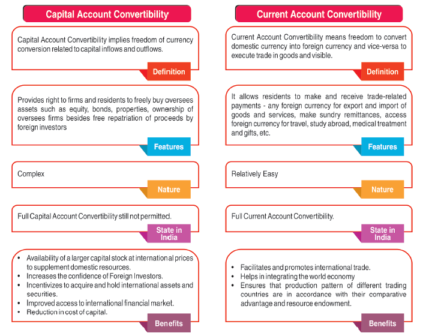

The global financial system functions as a vast, intricate network bringing together diverse participants — governments, financial institutions, investors, and traders — all engaging in complex transactions essential for facilitating international trade and investment. Central to this ecosystem are the mechanisms of currency exchange and convertibility. These mechanisms ensure that transactions across borders can occur smoothly, enabling the fluid movement of money and capital and forming the backbone of global commerce and investment.

Currency exchange mechanisms allow for the transfer of ownership of financial assets, including currencies themselves, fostering the liquidity needed for international economic activities. Currency convertibility, on the other hand, determines how easily these exchanges can occur, directly influencing a country's ability to participate in global markets. When currencies are fully convertible, they can be traded without restriction, enhancing a nation’s attractiveness for international investment and trade by providing assurance and flexibility to foreign investors.



In recent years, algorithmic trading has introduced significant transformations in financial markets. By utilizing advanced computer algorithms, traders can execute orders at speeds and accuracies far surpassing human capabilities. This technology allows for more rapid and efficient trading operations, essential for managing the vast volumes of trades in today’s financial markets. Algorithmic trading enhances the traditional trading framework, offering improved liquidity and price discovery along with reduced transaction costs.

The interaction between these elements—financial systems, exchange mechanisms, currency convertibility, and algorithmic trading—represents a fundamental dynamic influencing modern economic activities. The convergence of these factors is pivotal to understanding how they collectively support and sustain global financial stability. As we examine these interconnected components, we draw attentio to the opportunities they present and the challenges that need addressing to continue benefiting from the advancements in financial technology.

## Table of Contents

## Understanding Financial Systems and Exchange Mechanisms

Financial systems are dynamic structures that enable the smooth operation of economies globally. They comprise financial institutions, markets, and instruments that facilitate the flow of funds from savers to borrowers. These systems are essential for capital mobilization, which is fundamental to driving economic growth and investment. Through efficient allocation of resources, financial systems help in optimizing economic outputs and managing risks associated with financial activities.

Exchange mechanisms are integral processes within financial systems. These mechanisms encompass the methods through which the ownership of financial instruments, such as securities and currencies, is transferred between parties. Essential components of exchange mechanisms include spot transactions, futures contracts, and derivatives markets. Spot transactions provide immediate exchange of financial instruments, whereas futures and derivatives markets are used for hedging against risks and speculation. These markets are crucial in enhancing the adaptability of financial systems by providing tools for price volatility management and future price discovery.

A pivotal part of exchange mechanisms is the foreign exchange (Forex) market, which is the largest and most liquid financial market worldwide. In Forex markets, currencies are traded in pairs, and their exchange rates are determined by various factors, including interest rates, economic indicators, and geopolitical events. Forex markets enable the necessary [liquidity](/wiki/liquidity-risk-premium) for international trade and investment, allowing businesses and governments to conduct cross-border activities efficiently.

The liquidity provided by exchange mechanisms ensures that entities can move funds and financial instruments seamlessly across borders, facilitating economic interactions and collaborations. This liquidity is vital in minimizing transaction costs and enhancing market efficiency. By supporting the transfer and trading of financial resources, exchange mechanisms contribute significantly to the stability and growth of financial systems.

## Currency Convertibility and Its Impact

Currency convertibility is a fundamental aspect of the international monetary system, determining how readily a country's currency can be exchanged for another currency or for gold. It plays a critical role in facilitating international trade, investment, and broader economic interactions among nations. Convertibility is essential for businesses operating in global markets as it affects their ability to engage in cross-border transactions with ease.

Currencies can be categorized based on their level of convertibility. Fully convertible currencies, such as the U.S. Dollar (USD) and the Euro (EUR), face no restrictions on their exchange and can be traded freely in the foreign exchange markets. These currencies are highly desirable in international transactions due to the flexibility they offer in converting to other currencies. The freedom from exchange controls allows these currencies to be used easily for imports, exports, and investments, contributing to their widespread adoption in global commerce.

In contrast, non-convertible or partially convertible currencies face various restrictions and limitations imposed by national authorities. These restrictions are usually set to protect a country's foreign exchange reserves and manage economic stability. Non-convertible currencies are typically used purely for domestic purposes, limiting their utility in international trade and investment. Nations with such currencies may require official approval for currency exchange, which can hamper their participation in the global market.

The convertibility status of a currency significantly affects a country's economic dynamics. Fully convertible currencies enhance a nation's trade competitiveness by simplifying transaction processes and reducing currency conversion costs. This, in turn, makes the country more attractive to foreign investors seeking ease of access and minimal friction in their financial operations. By providing a stable and predictable economic environment, convertible currencies encourage foreign direct investments (FDIs), crucial for economic growth and development.

Moreover, currency convertibility influences a nation's balance of payments, affecting trade balances and capital flows. When currencies are easily convertible, barriers to the movement of capital are minimized, allowing countries to better integrate into the global economy. This integration can lead to increased economic collaboration, improved resource allocation, and shared economic growth opportunities.

Overall, currency convertibility is pivotal to a nation's trade relations, investment landscape, and financial integration with the world. As global economic activities become increasingly interconnected, the need for currencies that facilitate smooth and efficient exchange becomes ever more pronounced. Understanding the nuances and implications of currency convertibility is crucial for policymakers and businesses alike as they navigate the complexities of international economic exchange.

## Algorithmic Trading: Revolutionizing Financial Markets

Algorithmic trading utilizes computer algorithms to automate the process of trading decisions and execution, fundamentally transforming the operation of modern financial markets. At its core, [algorithmic trading](/wiki/algorithmic-trading) leverages computational power to achieve a level of speed and precision that surpasses human capabilities. This technological advancement allows for the processing of substantial volumes of market data, enabling the rapid identification of lucrative trading opportunities and the execution of trades without significant delays.

The efficiency of algorithmic trading lies in its ability to process multiple data inputs simultaneously, employing sophisticated algorithms to discern patterns and potential market moves. This could involve statistical [arbitrage](/wiki/arbitrage), [trend following](/wiki/trend-following), or mean reversion strategies, each relying on intricate mathematical models to forecast market behavior. For instance, an algorithm might utilize a moving average crossover strategy, deciding to buy or sell based on the intersection of short-term and long-term moving average lines. 

```python
def moving_average_cross_strategy(prices, short_window, long_window):
    short_ma = prices.rolling(window=short_window, min_periods=1).mean()
    long_ma = prices.rolling(window=long_window, min_periods=1).mean()

    buy_signals = (short_ma > long_ma) & (short_ma.shift(1) <= long_ma.shift(1))
    sell_signals = (short_ma < long_ma) & (short_ma.shift(1) >= long_ma.shift(1))

    return buy_signals, sell_signals
```

Algorithmic trading not only enhances trading efficiency by reducing decision-making time but also minimizes human error and emotional biases in trading, contributing to a more systematic approach. By leveraging the rapid nature of computers, algorithms can execute numerous trades within milliseconds, capturing short-lived trading opportunities that would be difficult for human traders to exploit.

The growing prevalence of algorithmic trading highlights its vital role in modern finance. One of its primary advantages is the significant reduction of trading costs. Automated systems can operate with minimal manpower, thereby lowering operational expenses and increasing the profitability of trading operations. Additionally, algorithmic trading contributes significantly to market liquidity. By facilitating continuous buying and selling activities, algorithms ensure that markets function more smoothly, with tighter spreads and increased depth.

Furthermore, the implementation of algorithmic trading systems has revolutionized market liquidity and price discovery processes, as these algorithms can react almost instantaneously to new information and market changes. This capability aids in the dissemination and assimilation of information into asset prices, enhancing the overall efficiency of financial markets globally.

In conclusion, as financial markets continue to evolve, algorithmic trading stands as a testament to the transformative power of technology in finance, promising ongoing advancements in trading operations and market efficiency.

## The Convergence of Currency Convertibility and Algorithmic Trading

The convergence of currency convertibility and algorithmic trading underscores a significant transformation in the financial landscape. The interaction between these two components highlights the necessity for smooth currency exchanges within automated trading systems. In algorithmic trading, where speed and accuracy are critical, currency convertibility plays a vital role. Fully convertible currencies facilitate efficient transactions by minimizing the friction associated with foreign exchange, allowing algorithms to exploit market opportunities with precision. As such, the convertibility of a currency can be pivotal, influencing the ability of algorithmic traders to execute orders across global markets seamlessly.

Fully or highly convertible currencies, such as the US Dollar (USD) or the Euro (EUR), are more conducive to automated trading environments because they offer fewer restrictions. This ease of exchange becomes critically important in high-frequency trading ([HFT](/wiki/high-frequency-trading-strategies)), where milliseconds count. In these scenarios, any delay in currency conversion can translate into financial losses or missed opportunities. By ensuring that currency exchange processes are swift and dependable, convertibility enhances the efficacy of algorithmic strategies.

Moreover, convertibility supports the broader functions of algorithmic trading, specifically in terms of enhancing market liquidity and facilitating price discovery. When large trading volumes can be exchanged effortlessly due to high currency convertibility, it increases the liquidity of financial markets. High liquidity benefits traders by allowing large transactions to be executed with minimal impact on market prices, thus maintaining price stability. This feature is crucial not only for traders but also for the overall stability and integrity of financial markets.

The automated nature of algorithmic trading, combined with high currency convertibility, also aids in improving the processes of price discovery. When algorithms can instantly react to changes in the market, they contribute to the continual adjustment of prices to reflect new information. This responsiveness ensures that prices are more aligned with the actual market conditions, leading to more efficient markets.

The integration and interaction between currency convertibility and algorithmic trading stand as a vivid example of how advancements in financial technology can leverage existing economic principles to create even more streamlined and robust trading ecosystems. As the financial markets continue to grow more complex and interconnected, the symbiotic relationship between these elements will likely become even more critical, influencing both strategic trading decisions and broader economic patterns.

## Challenges and Opportunities in the Modern Financial Landscape

The integration of currency convertibility and algorithmic trading within the global financial landscape presents both significant challenges and opportunities. These elements collectively enhance the efficiency and reach of financial markets, yet they introduce complexities that must be carefully managed to maintain stability.

One of the primary challenges associated with this integration is increased market [volatility](/wiki/volatility-trading-strategies). Algorithmic trading, with its capacity for high-frequency transactions, can exacerbate market fluctuations, particularly during periods of heightened uncertainty or stress. For instance, algorithms capable of executing trades in milliseconds may contribute to flash crashes, where markets can drop precipitously in a very short time. This volatility, while sometimes beneficial for market liquidity, can also result in substantial losses for investors and institutional traders alike.

Systemic risk represents another concern. The global interconnectedness enabled by currency convertibility means that financial disturbances in one region can quickly propagate throughout the entire system. Algorithmic trading, if not properly monitored, may amplify these disturbances by facilitating rapid and widespread trading actions based on erroneous or malicious inputs. This necessitates robust monitoring systems and rapid response protocols to safeguard against potential cascading effects that could threaten the stability of global financial markets. 

On the regulatory front, harmonizing the activities of algorithmic trading across multiple jurisdictions poses a challenge. Financial regulators must balance innovation-driven efficiency with the need for market oversight to prevent manipulation and ensure fair practices. This involves establishing comprehensive frameworks that address the speed and complexity of algorithmic trades while also accommodating the diverse convertibility regimes of different currencies.

Conversely, the opportunities afforded by this convergence are substantial. The adoption of advanced algorithms and enhanced currency convertibility can lead to significant improvements in trading systems. Technology-driven enhancements can increase transparency, allowing for better-informed trading decisions and more accessible information flows. This transparency facilitates equitable access to financial markets, enabling a broader range of participants to engage effectively.

Furthermore, technological advancements can streamline regulatory processes. By employing [machine learning](/wiki/machine-learning) and [artificial intelligence](/wiki/ai-artificial-intelligence), regulators can more efficiently analyze market data to identify irregularities, predict potential risks, and formulate proactive strategies. This harmonization between technology and regulation ensures that financial markets remain secure and resilient, even as they evolve.

In conclusion, embracing the dual forces of currency convertibility and algorithmic trading demands careful navigation of the challenges and opportunities presented. Successfully harnessing technology to augment these financial systems promises to enhance market operations and stability, supporting sustainable economic growth in an increasingly interconnected global economy.

## Conclusion

The convergence of financial systems, exchange mechanisms, currency convertibility, and algorithmic trading signifies a pivotal evolution in global financial markets. These elements collectively enhance the efficiency and reach of international trade and investments, contributing significantly to economic globalization. The integration of technology, particularly algorithmic trading, has ushered in unprecedented trading speed and accuracy, significantly narrowing the margins for human error and bringing enhanced liquidity to financial markets.

However, as these technologies advance, they pose intricate challenges, particularly concerning financial stability. The rapid pace of algorithmic transactions can contribute to market volatility, sometimes magnifying systemic risks if not adequately managed. Additionally, the balance between a currency's convertibility ease and its macroeconomic implications remains critical for national economies. For instance, while high currency convertibility facilitates international transactions, it can also expose economies to volatile capital inflows and outflows, affecting monetary policy's efficacy.

Policymakers and market participants must thus navigate these challenges carefully. Regulatory frameworks must be agile enough to manage risks associated with high-frequency trading and cross-border financial flows without stifling innovation or efficiency gains. As financial systems continue to evolve, the collaboration between regulatory bodies and market innovators will be crucial in crafting policies that accommodate growth while safeguarding economic stability.

In conclusion, understanding and adapting to the dynamic interplay between financial systems, exchange mechanisms, currency convertibility, and algorithmic trading will be central to promoting sustainable economic growth and resilience. Embracing technological advancements while ensuring robust regulatory oversight will likely determine the future trajectory of global financial markets.

## References & Further Reading

[1]: ["Exchange Rates and the International Field of Currency."](https://www.xe.com/currencyconverter/) by Benjamin J. Cohen, International Studies Quarterly, 2010.

[2]: Gourinchas, P. O., & Rey, H. (2007). ["From World Banker to World Venture Capitalist: The US External Adjustment and The Exorbitant Privilege."](https://users.nber.org/~confer/2005/cas05/rey.pdf) Journal of the European Economic Association.

[3]: King, M. R., & Rime, D. (2010). ["The $4 trillion question: what explains FX growth since the 2007 survey?"](https://www.bis.org/publ/qtrpdf/r_qt1012e.pdf) BIS Quarterly Review.

[4]: Froot, K. A., & Thaler, R. H. (1990). ["Anomalies: Foreign Exchange."](https://www.aeaweb.org/articles?id=10.1257/jep.4.3.179) The Journal of Economic Perspectives.

[5]: Menkhoff, L., Sarno, L., Schmeling, M., & Schrimpf, A. (2012). ["Currency Momentum Strategies."](https://papers.ssrn.com/sol3/papers.cfm?abstract_id=1809776) The Review of Financial Studies.

[6]: Harris, L. (2003). ["Trading and Exchanges: Market Microstructure for Practitioners."](https://www.amazon.com/Trading-Exchanges-Market-Microstructure-Practitioners/dp/0195144708) Oxford University Press.

[7]: Aldridge, I. (2013). ["High-Frequency Trading: A Practical Guide to Algorithmic Strategies and Trading Systems."](https://www.amazon.com/High-Frequency-Trading-Practical-Algorithmic-Strategies/dp/1118343506) Wiley.