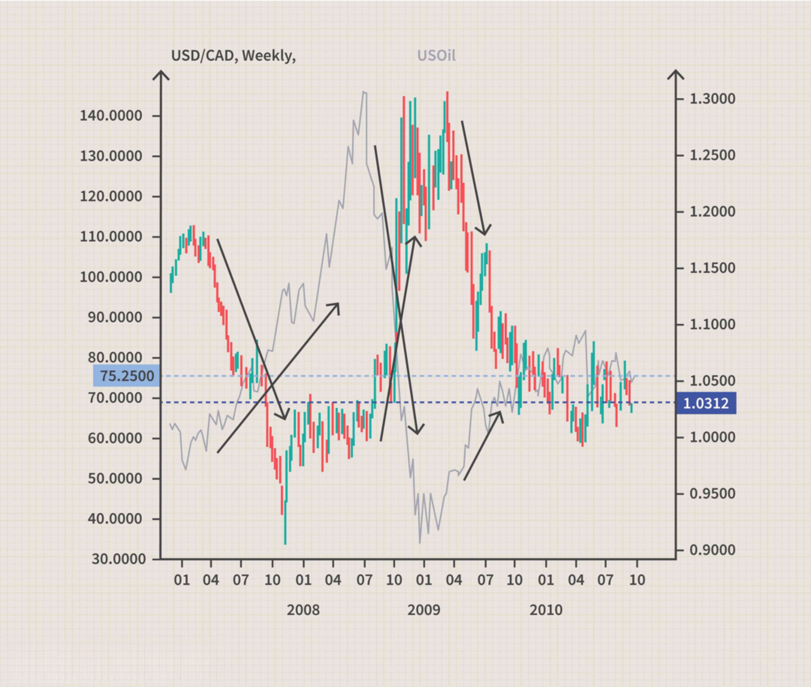

Forex trading is an expansive and ever-evolving domain. It is significantly influenced by a myriad of factors that affect currency values, including economic indicators, geopolitical events, interest rates, and market sentiment. Among these, understanding the correlations between foreign exchange currencies and commodities stands out as a valuable strategy for traders seeking to anticipate market movements and optimize their trading decisions.

Currency correlations refer to the extent to which two currency pairs move in sync with each other. These correlations can be positive, meaning that two currencies tend to move in the same direction, or negative, indicating they move in opposite directions. Recognizing these relationships can provide traders with opportunities to diversify their portfolios, manage risk, and exploit potential market inefficiencies.



In parallel, the introduction of algorithmic trading (or algo trading) has transformed the forex landscape, providing traders with enhanced capabilities to capitalize on these correlations. Algo trading employs sophisticated computer algorithms to execute trades based on predefined criteria and market analysis. By processing vast quantities of data at high speed, algorithmic systems can identify and respond to market trends and correlations more efficiently than manual trading. This technological advancement allows traders to implement strategies that are more precise and timely.

This article examines how the interplay between foreign exchange currency correlations, commodity pairs, and algo trading can be leveraged for optimal trading outcomes. It aims to provide insights into the mechanisms of these correlations and how algorithmic strategies can enhance trading efficiency and accuracy, ultimately helping traders in navigating the intricacies of forex markets for better returns.

## Table of Contents

## Understanding Currency Correlations

Currency correlations are essential to understanding the intricate movements within the foreign exchange (forex) market. These correlations represent the relationship between two currency pairs, indicating how they move in relation to one another. By identifying these correlations, traders can make informed decisions to diversify their portfolios or amplify potential gains from market movements.

A positive correlation between two currency pairs means that they tend to move in the same direction. For instance, if the EUR/USD pair and the GBP/USD pair have a strong positive correlation, when the value of the euro strengthens against the dollar, the British pound is also likely to appreciate against the dollar. A high positive correlation suggests that buying or selling both currency pairs simultaneously might lead to similar outcomes.

Conversely, a negative correlation indicates that two currency pairs move in opposite directions. An example of this would be the USD/JPY pair and the USD/CHF pair. If these pairs show a strong negative correlation, a movement in the value of the USD against the yen might lead to an opposite movement against the Swiss franc. Traders can exploit this relationship by taking offsetting positions to hedge against potential losses.

Mathematically, correlation is quantified by the correlation coefficient, often denoted as ρ (rho). The correlation coefficient ranges from -1 to +1, where:
- ρ = +1 suggests a perfect positive correlation
- ρ = -1 indicates a perfect negative correlation
- ρ = 0 means no correlation

Traders often calculate these coefficients using historical price data to assess the strength of correlations between currency pairs. In Python, one can use libraries like Pandas and NumPy to compute the correlation coefficient. Here is a simple example:

```python
import pandas as pd

# Sample historical price data for two currency pairs
data = {'EUR/USD': [1.1, 1.12, 1.13, 1.15, 1.14],
        'GBP/USD': [1.3, 1.32, 1.33, 1.36, 1.35]}

# Create a DataFrame
df = pd.DataFrame(data)

# Calculate the correlation coefficient
correlation_matrix = df.corr()
correlation_coefficient = correlation_matrix.loc['EUR/USD', 'GBP/USD']
print(f"Correlation Coefficient: {correlation_coefficient}")
```

By leveraging currency correlations, traders can design strategies that either capitalize on the positive relationship between currency pairs or mitigate risk through hedged positions based on negative correlations. This understanding allows for more balanced and risk-averse approaches in the dynamic [forex](/wiki/forex-system) market.

 to Commodity Pairs

Commodity pairs refer to foreign exchange currency pairs in which one of the currencies belongs to a country that is a significant exporter of a particular commodity. These currencies are heavily influenced by the price movements of these commodities, making them subject to unique trading dynamics. This relationship creates both opportunities and challenges for traders seeking to capitalize on these movements.

Countries with abundant natural resources often have currencies that are closely linked to the price of their predominant exports. For instance, Canada is a major exporter of [crude oil](/wiki/crude-oil). Consequently, the Canadian Dollar (CAD), particularly in relation to the U.S. Dollar in the currency pair CAD/USD, is sensitive to changes in oil prices. As oil prices rise, the CAD usually strengthens relative to the USD, reflecting the increased revenue from oil exports, which boosts Canada's economic outlook.

Similarly, Australia is a leading exporter of gold. Therefore, the Australian Dollar (AUD) often exhibits correlations with gold prices, especially in the AUD/USD pair. When gold prices rise, the Australian Dollar tends to appreciate, given the increased income from gold exports, which in turn positively impacts Australia's trade balance.

The influence of commodity prices on these currency pairs can be quantified using correlations. A high positive correlation between a commodity’s price and its corresponding commodity currency suggests that price movements in the commodity will likely be mirrored by the currency. For traders, understanding these correlations is key in predicting and capitalizing on exchange rate movements.

Traders often monitor commodity prices closely to anticipate potential fluctuations in these currency pairs. For example, significant shifts in oil inventories reported by organizations such as the Energy Information Administration (EIA) can dramatically impact the CAD/USD exchange rate. Similarly, global gold demand reports can provide insights into the future direction of the AUD/USD pair.

Hence, by understanding the economic fundamentals and monitoring the commodity markets, traders can develop strategies aimed at exploiting the movements in commodity pairs, enhancing their ability to predict and respond to changes in the forex market.

## The Role of Algo Trading in Currency and Commodity Markets

Algo trading, short for [algorithmic trading](/wiki/algorithmic-trading), refers to the utilization of computer algorithms to execute trades based on predefined strategies. This approach revolutionizes trading in the currency and commodity markets by significantly optimizing efficiency and accuracy.

### Speed and Efficiency

The chief advantage of algo trading is its ability to process vast volumes of market data at speeds far surpassing human capabilities. This rapid data processing allows traders to identify and capitalize on correlations and trends within the market in real-time. For instance, an algorithm can be programmed to monitor fluctuations in the foreign exchange rates and commodity prices, placing trades instantly when specific market conditions are met. This high-speed decision-making process eliminates the latency involved with human analysis and execution.

In mathematical terms, the efficiency of algorithmic trading can be showcased by its ability to compute complex statistical models and optimization problems instantaneously. Consider the simple linear regression model often used to identify trends, expressed as:

$$

y = \beta_0 + \beta_1 x + \epsilon 
$$

where $y$ is the dependent variable (e.g., price of a currency), $x$ is the independent variable (e.g., time), $\beta_0$ and $\beta_1$ are coefficients, and $\epsilon$ is the error term. An algorithm can swiftly compute these coefficients using a dataset in real-time, allowing decisions to be made with updated parameters as new data becomes available.

### Advanced Analytical Capabilities

Algo trading is not just about speed; it also leverages sophisticated analytical techniques such as [machine learning](/wiki/machine-learning) and statistical analysis to enhance trading strategies. Algorithms can be trained to recognize and predict patterns and relationships in the currency and commodity markets that might be missed by human traders. These systems are continuously refined using historical data, improving predictive accuracy over time.

For example, a Python-based algo trading system might use libraries like pandas for data manipulation, scikit-learn for machine learning, and numpy for numerical operations. Below is a simplified example of how one might set up a basic trading algorithm using Python:

```python
import pandas as pd
from sklearn.linear_model import LinearRegression
import numpy as np

# Load market data
data = pd.read_csv('market_data.csv')

# Prepare independent and dependent variables
X = data[['time', 'commodity_price']].values
y = data['currency_price'].values

# Fit the model
model = LinearRegression().fit(X, y)

# Predict future prices based on model
predictions = model.predict(data[['future_time', 'future_commodity_price']].values)

# Place trades based on predictions
def place_trade(predicted_price):
    if predicted_price > threshold:
        # Execute buy order
        pass
    elif predicted_price < threshold:
        # Execute sell order
        pass

place_trade(predictions[-1])
```

### Enhancing Market Accuracy

By integrating algo trading into currency and commodity markets, traders can achieve a level of precision that is unattainable by manual trading methods. Algorithms minimize human error and emotional bias, ensuring trades are executed according to the logic specified in the strategic code. Furthermore, algorithms can continuously adjust to market [volatility](/wiki/volatility-trading-strategies), maintaining a trader’s edge by responding to new information faster and more accurately.

Overall, algo trading represents a paradigm shift in modern financial markets by embedding speed, precision, and advanced analytics within trading operations, thereby enhancing both the efficiency and accuracy of transactions in currency and commodity markets.

## Leveraging Correlations for Trading Strategies

Traders can significantly enhance their trading strategies by leveraging the correlations between currency pairs and commodities. These correlations help in predicting market movements, creating opportunities for hedging and speculation. To benefit from these relationships, traders often study historical data to identify consistent patterns in how currency pairs and commodities interact.

One key strategy involves using these correlations to hedge trading positions. For instance, if a trader holds a significant position in a commodity-sensitive currency pair like CAD/USD, aware of its positive correlation with crude oil prices, they may hedge by placing opposing positions in crude oil futures. This can protect against adverse movements in the currency pair caused by fluctuations in oil prices, thereby stabilizing the trader's portfolio.

Understanding correlation breakdowns is equally crucial. Correlation coefficients, which range from -1 to 1, measure the strength and direction of the relationship between two variables. A value close to 1 signifies a strong positive correlation, while a value near -1 indicates a strong negative correlation. When these correlations change unexpectedly, traders must quickly adapt their strategies. For instance, a sudden divergence between the expected movement of a commodity and its correlated currency might signal a market anomaly or an upcoming economic shift, prompting traders to reassess their positions.

Timing correlation trades accurately requires constant monitoring of market data. Traders can utilize statistical software and algorithms to detect changes and predict future movements. Python, with libraries such as pandas and numpy, is a popular tool for such analysis. Here's an example of how one might calculate a rolling correlation between a currency pair and a commodity:

```python
import pandas as pd
import numpy as np

# Assuming df is a DataFrame containing historical data for both the currency and commodity
df['Currency_Returns'] = df['Currency_Pair'].pct_change()
df['Commodity_Returns'] = df['Commodity'].pct_change()

# Calculate a rolling correlation over a 30-day window
rolling_corr = df['Currency_Returns'].rolling(window=30).corr(df['Commodity_Returns'])

# Plotting the rolling correlation can help visualize correlations over time
rolling_corr.plot(title='Rolling Correlation: Currency Pair vs Commodity')
```

By identifying high-percentage correlations and potential correlation breakdowns through tools and methods such as these, traders can maximize profits and minimize risks. Embracing a data-driven approach allows for more informed decision-making, helping traders stay proactive rather than reactive in dynamic market contexts.

## Monitoring and Analyzing Correlations

Effective trading relies on continuous monitoring of currency and commodity correlations. Traders often utilize modern trading platforms like TradingView, which provide tools to analyze these correlations in real-time. Utilizing such platforms, traders can monitor price movements and identify patterns that can influence trading decisions.

One critical statistical measure used in the analysis of correlations is the correlation coefficient, typically denoted as "r". This coefficient quantifies the strength and direction of a linear relationship between two variables, ranging from -1 to 1. A correlation coefficient of 1 indicates a perfect positive linear relationship, while a coefficient of -1 signifies a perfect negative linear relationship. A correlation coefficient near 0 suggests no linear relationship between the variables.

To calculate the correlation coefficient in a Python environment, one can use libraries such as NumPy and pandas, which streamline the computation of correlations from historical data. Below is an example code snippet demonstrating how to calculate the correlation coefficient between two currency pairs using pandas:

```python
import pandas as pd

# Sample data: create a DataFrame with two currency pairs
data = {
    'Currency_Pair_1': [1.0, 1.2, 1.3, 1.5, 1.7],
    'Currency_Pair_2': [0.8, 0.82, 0.78, 0.75, 0.74]
}

df = pd.DataFrame(data)

# Calculate the correlation coefficient
correlation_coefficient = df['Currency_Pair_1'].corr(df['Currency_Pair_2'])

print(f"The correlation coefficient between the two currency pairs is: {correlation_coefficient}")
```

In trading practice, understanding the correlation coefficient assists in gauging how changes in one currency pair might predict movements in another. This can be especially pertinent when diversifying portfolios, constructing [arbitrage](/wiki/arbitrage) strategies, or optimizing hedging tactics.

Real-time monitoring is further supplemented by statistical approaches such as rolling correlation analyses. A rolling correlation gives a dynamic view of correlations over a specified window, offering insights into shifts and trends in market relationships over time. This adaptability allows traders to adjust strategies in response to evolving market conditions promptly.

In summary, expertly monitoring and analyzing correlations through modern trading platforms and statistical methodologies is fundamental for traders aiming to harness the potential of currency and commodity markets for profitable outcomes.

## Conclusion

Foreign exchange currency correlations and commodity pairs present significant opportunities for traders who pay close attention to these dynamics. By understanding how these elements interact, traders can position themselves to exploit favorable market conditions. Currency correlations, which measure how two currencies move in relation to each other, allow traders to either hedge their positions by selecting negatively correlated pairs or amplify potential gains by focusing on positively correlated pairs. Commodity pairs, representing currencies from major exporting countries, provide additional layers of complexity and opportunity, as these currencies often fluctuate in response to commodity price changes.

Combining these insights with sophisticated algorithmic trading strategies enhances the potential for improved returns. Algorithmic trading leverages computer algorithms to execute trades at speeds and efficiencies beyond human capabilities, making it particularly effective in identifying and acting on correlations within currency and commodity markets. Algorithms can rapidly process large volumes of data to spot and exploit short-term market inefficiencies, ensuring that traders can capitalize on both macroeconomic and microeconomic trends.

Keeping abreast of market dynamics and leveraging the latest technological advancements are essential for success in the currency and commodity markets. Modern trading platforms and analytical tools provide traders with real-time insights and statistical measures like correlation coefficients, which are instrumental in assessing the strength of correlations. Regularly updating trading strategies based on evolving market conditions and technological innovations will ensure that traders maintain a competitive edge. Embracing these strategies and technologies enables traders to navigate complex markets more effectively and optimize their trading outcomes.

## References & Further Reading

[1]: ["Currency Correlations in the Forex Market: What is Currency Correlation and How to Measure It"](https://www.forex.com/en-us/trading-academy/courses/advanced-risk-management/currency-correlation-in-forex/) — An informative article on currency correlations by Investopedia.

[2]: ["Quantitative Trading: How to Build Your Own Algorithmic Trading Business"](https://www.amazon.com/Quantitative-Trading-Build-Algorithmic-Business/dp/1119800064) by Ernest P. Chan — A comprehensive guide on algorithmic trading strategies and business establishment.

[3]: ["Machine Learning for Algorithmic Trading](https://github.com/stefan-jansen/machine-learning-for-trading) by Stefan Jansen — Details on using machine learning techniques for trading.

[4]: ["Algorithmic Trading and DMA: An Introduction to Direct Access Trading Strategies"](https://www.amazon.com/Algorithmic-Trading-DMA-introduction-strategies/dp/0956399207) by Barry Johnson — A deep dive into algorithmic trading and direct market access.

[5]: ["Advances in Financial Machine Learning"](https://www.amazon.com/Advances-Financial-Machine-Learning-Marcos/dp/1119482089) by Marcos Lopez de Prado — Discusses machine learning advancements for financial trading.

[6]: ["Evidence-Based Technical Analysis: Applying the Scientific Method and Statistical Inference to Trading Signals"](https://www.amazon.com/Evidence-Based-Technical-Analysis-Scientific-Statistical/dp/0470008741) by David Aronson — Focuses on the statistical analysis of trading signals.