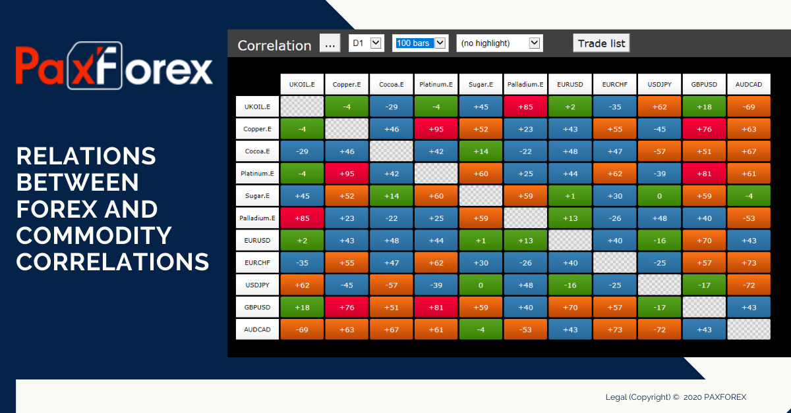

## Table of Contents

## What is currency correlation and why is it important in forex trading?

Currency correlation refers to the relationship between the movements of different currency pairs in the forex market. When two currency pairs move in the same direction, they are said to be positively correlated. On the other hand, if they move in opposite directions, they are negatively correlated. Understanding these relationships can help traders predict how one currency pair might move based on the movements of another.

Knowing currency correlations is important in forex trading because it can help traders manage their risk and make more informed trading decisions. For example, if a trader knows that two currency pairs are highly correlated, they might avoid taking positions in both pairs at the same time to prevent doubling their risk. Additionally, understanding correlations can help traders diversify their portfolios by choosing pairs that move independently of each other, which can potentially lead to more stable returns.

## How do commodity currencies differ from other currencies?

Commodity currencies are different from other currencies because they are closely linked to the prices of certain raw materials or commodities. Countries that have a lot of these commodities, like oil, gold, or copper, often have their currencies called commodity currencies. Examples include the Canadian dollar, the Australian dollar, and the New Zealand dollar. When the prices of these commodities go up, the value of these currencies usually goes up too. This is because these countries export a lot of these commodities, so when they earn more money from selling them, their currency becomes stronger.

Other currencies, often called major currencies, are not as directly tied to commodity prices. These include currencies like the US dollar, the Euro, and the Japanese yen. Their values are more influenced by things like interest rates, economic growth, and political stability in their home countries. While commodity prices can still affect these currencies, the connection is not as strong as it is with commodity currencies. Traders and investors need to understand these differences to make smart decisions about which currencies to trade or invest in.

## What are some common commodity currency pairs?

Commodity currency pairs are trading pairs that include at least one currency from a country that relies heavily on exporting commodities like oil, gold, or copper. Some common commodity currency pairs are the Australian dollar (AUD) against the US dollar (USD), written as AUD/USD, and the Canadian dollar (CAD) against the US dollar, written as CAD/USD. These pairs are popular because the economies of Australia and Canada are closely tied to commodity prices, so their currencies often move based on changes in those prices.

Another common commodity currency pair is the New Zealand dollar (NZD) against the US dollar, written as NZD/USD. New Zealand is known for its exports of dairy products, meat, and other agricultural commodities, which can affect the value of the NZD. Traders watch these pairs closely because they can provide opportunities to profit from movements in commodity markets.

## How does the price of commodities like oil and gold affect commodity currency pairs?

When the price of commodities like oil and gold goes up, it usually makes commodity currencies stronger. For example, if oil prices increase, countries like Canada that export a lot of oil will earn more money. This makes the Canadian dollar, or CAD, more valuable compared to other currencies like the US dollar. So, the CAD/USD pair might go up because the Canadian dollar is worth more. The same thing happens with gold; if the price of gold goes up, countries like Australia that export a lot of gold might see their currency, the AUD, become stronger against the US dollar, making the AUD/USD pair go up.

On the other hand, if the price of commodities goes down, commodity currencies can become weaker. If oil prices drop, Canada might earn less money from its oil exports, making the CAD less valuable. This could cause the CAD/USD pair to go down because the Canadian dollar is worth less. Similarly, if gold prices fall, the Australian dollar might weaken, causing the AUD/USD pair to decrease. Traders watch these commodity prices closely because they can predict how commodity currency pairs might move based on these changes.

## Can you explain the concept of positive and negative correlation in currency pairs?

Positive correlation in currency pairs means that two pairs move in the same direction most of the time. For example, if one pair goes up, the other pair usually goes up too. This happens because the currencies in these pairs might be affected by similar things, like economic news or interest rates. If a trader knows that two pairs are positively correlated, they can expect that if one pair starts to go up, the other pair might do the same. This can help them make better trading choices.

Negative correlation means that two currency pairs move in opposite directions. When one pair goes up, the other pair usually goes down. This can happen because the currencies in these pairs might be affected by different things or might have opposite economic situations. For example, if one country's economy is doing well and its currency goes up, another country's economy might be doing poorly and its currency goes down. Knowing about negative correlations can help traders manage their risk. They might choose to trade pairs that move in opposite directions to balance out their gains and losses.

## How can traders use currency correlation to diversify their forex portfolio?

Traders can use currency correlation to diversify their [forex](/wiki/forex-system) portfolio by choosing currency pairs that do not move in the same way. If two currency pairs are positively correlated, they move in the same direction. So, if a trader has a lot of money in one pair, and they add another pair that moves the same way, they are not really spreading out their risk. Instead, they should look for pairs that have a low or negative correlation. This means that when one pair goes up, the other pair might go down. By doing this, traders can balance out their gains and losses, making their portfolio more stable.

For example, if a trader has a lot of money in the EUR/USD pair, which is often influenced by European and US economic news, they might want to add a pair like AUD/JPY to their portfolio. The Australian dollar (AUD) is a commodity currency affected by commodity prices, and the Japanese yen (JPY) can be influenced by different economic factors than the euro or the US dollar. Because these pairs might not move in the same way, adding AUD/JPY can help the trader diversify their risk. By understanding and using currency correlations, traders can make smarter choices about which pairs to trade and build a more balanced portfolio.

## What are the key economic indicators that traders should watch for commodity currency movements?

Traders should keep an eye on a few important economic indicators to understand how commodity currencies might move. One key indicator is the price of commodities like oil, gold, and copper. When these prices go up, commodity currencies like the Canadian dollar, Australian dollar, and New Zealand dollar often get stronger. This is because countries like Canada, Australia, and New Zealand export a lot of these commodities, so when they earn more money from selling them, their currencies become more valuable. Traders also watch economic reports like the Gross Domestic Product (GDP) of these countries, because a strong economy can make their currency stronger too.

Another important indicator is the [interest rate](/wiki/interest-rate-trading-strategies) set by the central banks of these countries. If the central bank raises interest rates, it can make the currency more attractive to investors, causing it to go up in value. On the other hand, if the central bank lowers interest rates, it can make the currency less attractive, causing it to go down. Traders also pay attention to employment data, like the unemployment rate, because a low unemployment rate can mean a strong economy, which can help the currency. By watching these indicators, traders can make better guesses about how commodity currencies will move and make smarter trading choices.

## How does geopolitical risk influence commodity prices and, in turn, commodity currency pairs?

Geopolitical risk can have a big effect on commodity prices. When there is a lot of uncertainty or tension between countries, it can make people worried about the supply of commodities like oil and gold. For example, if there is a conflict in an oil-producing country, people might think that oil will be harder to get, so the price of oil goes up. The same thing can happen with other commodities. If there is a problem in a country that produces a lot of gold, the price of gold might go up because people think there will be less gold available.

These changes in commodity prices can then affect commodity currency pairs. If the price of oil goes up because of geopolitical risk, the Canadian dollar, which is linked to oil, might become stronger. This would make the CAD/USD pair go up because the Canadian dollar is worth more compared to the US dollar. On the other hand, if geopolitical risk makes commodity prices go down, the currencies of countries that rely on those commodities might become weaker. Traders need to watch geopolitical news closely because it can help them predict how commodity currency pairs will move and make better trading decisions.

## What advanced statistical tools can be used to analyze currency correlations?

Traders can use advanced statistical tools like correlation coefficients to understand how different currency pairs move together. A correlation coefficient is a number between -1 and 1 that shows how strong the relationship is between two pairs. If the number is close to 1, it means the pairs move in the same direction a lot, which is a positive correlation. If the number is close to -1, it means the pairs move in opposite directions a lot, which is a negative correlation. A number close to 0 means there is not much of a relationship between the pairs. Traders can use software like Excel or specialized trading platforms to calculate these coefficients and see how currency pairs are related.

Another useful tool is regression analysis, which helps traders predict how one currency pair might move based on another pair. Regression analysis looks at past data to find patterns and then uses those patterns to make predictions. For example, if a trader knows that the AUD/USD pair often moves in a certain way when the price of gold changes, they can use regression analysis to guess how the AUD/USD pair might move in the future based on gold prices. This can help traders make better decisions about when to buy or sell currency pairs. Both correlation coefficients and regression analysis are important tools that can help traders understand and predict currency movements more accurately.

## How can understanding seasonal patterns in commodities help in trading commodity currency pairs?

Understanding seasonal patterns in commodities can help traders make better choices when trading commodity currency pairs. Many commodities, like oil and agricultural products, have times of the year when their prices go up or down because of things like weather, holidays, or planting and harvesting seasons. For example, oil prices might go up in the summer because more people are driving, and natural gas prices might go up in the winter because more people are using it to heat their homes. If traders know these patterns, they can guess when the prices of commodities like oil and gold might go up or down. This can help them decide when to buy or sell commodity currency pairs like AUD/USD or CAD/USD.

By watching these seasonal patterns, traders can plan their trades better. For instance, if a trader knows that gold prices usually go up around the end of the year because of holiday buying, they might buy the AUD/USD pair before the price goes up, hoping to make a profit when the Australian dollar gets stronger. On the other hand, if they know that oil prices often drop in the spring, they might sell the CAD/USD pair before the price goes down, expecting to make money when the Canadian dollar gets weaker. Understanding these seasonal changes can help traders time their trades to take advantage of the ups and downs in commodity prices, which can lead to better results in their trading.

## What are the risks associated with trading highly correlated currency pairs?

Trading highly correlated currency pairs can be risky because it can make your trades less diverse. When you trade pairs that move in the same direction, you are not spreading out your risk. If something bad happens to one pair, like a sudden drop in value, it can also affect the other pair you are trading. This means you could lose more money than if you had traded pairs that move differently. For example, if you have a lot of money in both the EUR/USD and GBP/USD pairs, and the US dollar gets stronger, both pairs could go down at the same time, which would hurt your trading account a lot.

Another risk is that you might miss out on other trading opportunities. When you focus on highly correlated pairs, you might not pay attention to other pairs that could be good to trade. These other pairs might move in different ways and give you chances to make money that you would miss if you only traded correlated pairs. Also, if you are not careful, you might end up taking the same trade twice without realizing it, which can make your risk even bigger. It's important for traders to understand these risks and think about how to manage them when they trade highly correlated currency pairs.

## How can machine learning models enhance the prediction of currency correlations and commodity pair movements?

Machine learning models can help traders predict how currency pairs will move by looking at a lot of data and finding patterns that people might miss. These models can learn from past information about currency prices, economic news, and even things like social media posts to guess how currencies will move in the future. For example, a machine learning model can look at how the Australian dollar and the US dollar have moved together in the past and use that information to predict how the AUD/USD pair might move next. This can help traders make better decisions about when to buy or sell.

When it comes to commodity pairs, machine learning can also be very useful. These models can take into account the prices of commodities like oil and gold, along with other data like weather reports or geopolitical events, to predict how commodity currencies like the Canadian dollar or the Australian dollar will change. By using machine learning, traders can get a more accurate picture of how commodity prices might affect currency pairs, helping them plan their trades more effectively. This can lead to better trading results and help traders manage their risks better.

## What is the role of algo trading in currency and commodity markets?

Algo trading, short for [algorithmic trading](/wiki/algorithmic-trading), refers to the utilization of computer algorithms to execute trades based on predefined strategies. This approach revolutionizes trading in the currency and commodity markets by significantly optimizing efficiency and accuracy.

### Speed and Efficiency

The chief advantage of algo trading is its ability to process vast volumes of market data at speeds far surpassing human capabilities. This rapid data processing allows traders to identify and capitalize on correlations and trends within the market in real-time. For instance, an algorithm can be programmed to monitor fluctuations in the foreign exchange rates and commodity prices, placing trades instantly when specific market conditions are met. This high-speed decision-making process eliminates the latency involved with human analysis and execution.

In mathematical terms, the efficiency of algorithmic trading can be showcased by its ability to compute complex statistical models and optimization problems instantaneously. Consider the simple linear regression model often used to identify trends, expressed as:

$$

y = \beta_0 + \beta_1 x + \epsilon 
$$

where $y$ is the dependent variable (e.g., price of a currency), $x$ is the independent variable (e.g., time), $\beta_0$ and $\beta_1$ are coefficients, and $\epsilon$ is the error term. An algorithm can swiftly compute these coefficients using a dataset in real-time, allowing decisions to be made with updated parameters as new data becomes available.

### Advanced Analytical Capabilities

Algo trading is not just about speed; it also leverages sophisticated analytical techniques such as [machine learning](/wiki/machine-learning) and statistical analysis to enhance trading strategies. Algorithms can be trained to recognize and predict patterns and relationships in the currency and commodity markets that might be missed by human traders. These systems are continuously refined using historical data, improving predictive accuracy over time.

For example, a Python-based algo trading system might use libraries like pandas for data manipulation, scikit-learn for machine learning, and numpy for numerical operations. Below is a simplified example of how one might set up a basic trading algorithm using Python:

```python
import pandas as pd
from sklearn.linear_model import LinearRegression
import numpy as np

# Load market data
data = pd.read_csv('market_data.csv')

# Prepare independent and dependent variables
X = data[['time', 'commodity_price']].values
y = data['currency_price'].values

# Fit the model
model = LinearRegression().fit(X, y)

# Predict future prices based on model
predictions = model.predict(data[['future_time', 'future_commodity_price']].values)

# Place trades based on predictions
def place_trade(predicted_price):
    if predicted_price > threshold:
        # Execute buy order
        pass
    elif predicted_price < threshold:
        # Execute sell order
        pass

place_trade(predictions[-1])
```

### Enhancing Market Accuracy

By integrating algo trading into currency and commodity markets, traders can achieve a level of precision that is unattainable by manual trading methods. Algorithms minimize human error and emotional bias, ensuring trades are executed according to the logic specified in the strategic code. Furthermore, algorithms can continuously adjust to market [volatility](/wiki/volatility-trading-strategies), maintaining a trader’s edge by responding to new information faster and more accurately.

Overall, algo trading represents a paradigm shift in modern financial markets by embedding speed, precision, and advanced analytics within trading operations, thereby enhancing both the efficiency and accuracy of transactions in currency and commodity markets.

## References & Further Reading

[1]: ["Currency Correlations in the Forex Market: What is Currency Correlation and How to Measure It"](https://www.forex.com/en-us/trading-academy/courses/advanced-risk-management/currency-correlation-in-forex/) — An informative article on currency correlations by Investopedia.

[2]: ["Quantitative Trading: How to Build Your Own Algorithmic Trading Business"](https://www.amazon.com/Quantitative-Trading-Build-Algorithmic-Business/dp/1119800064) by Ernest P. Chan — A comprehensive guide on algorithmic trading strategies and business establishment.

[3]: ["Machine Learning for Algorithmic Trading](https://github.com/stefan-jansen/machine-learning-for-trading) by Stefan Jansen — Details on using machine learning techniques for trading.

[4]: ["Algorithmic Trading and DMA: An Introduction to Direct Access Trading Strategies"](https://www.amazon.com/Algorithmic-Trading-DMA-introduction-strategies/dp/0956399207) by Barry Johnson — A deep dive into algorithmic trading and direct market access.

[5]: ["Advances in Financial Machine Learning"](https://www.amazon.com/Advances-Financial-Machine-Learning-Marcos/dp/1119482089) by Marcos Lopez de Prado — Discusses machine learning advancements for financial trading.

[6]: ["Evidence-Based Technical Analysis: Applying the Scientific Method and Statistical Inference to Trading Signals"](https://www.amazon.com/Evidence-Based-Technical-Analysis-Scientific-Statistical/dp/0470008741) by David Aronson — Focuses on the statistical analysis of trading signals.