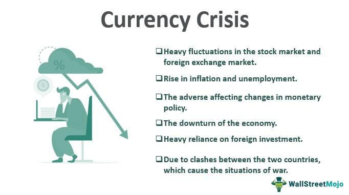

The global economy has become increasingly intertwined, with foreign exchange (forex) markets playing a fundamental role in facilitating international trade and finance. These markets enable the seamless exchange of currencies between nations, thus supporting global economic activities that range from tourism to international investments. However, currency crises present significant challenges, manifesting as severe devaluations of national currencies that can lead to economic instability. Such crises disrupt these exchange processes, affecting not only local economies but also the broader international financial system.

Understanding the economic impacts of currency crises is crucial, particularly as they influence both the forex markets and the strategic approaches traders adopt to navigate these turbulent times. During a currency crisis, the forex market can become highly volatile, which poses risks and opportunities for investors and traders. Traditionally, traders relied on manual strategies to mitigate risks, but, in recent years, there has been a growing interest in the role of algorithmic trading during such crises. Algorithmic trading, which employs complex algorithms and high-speed programs to execute trading orders, offers a modern, adaptive approach to managing the risks associated with currency crises. This technological advancement allows for rapid responses to market changes, potentially mitigating economic losses and facilitating quicker market stabilization.



This article aims to explore the multifaceted economic impacts of currency crises, examine the critical role of forex markets, and assess how algorithmic trading can serve as an invaluable tool for investors during such periods of economic uncertainty. By analyzing real-world examples, we will identify the causes and effects of currency crises and discuss possible solutions to manage these challenges effectively. The insights drawn from historical and contemporary instances underscore the importance of understanding the dynamics of currency fluctuations and the strategic measures that can be implemented to protect and stabilize affected economies.

## Table of Contents

## Understanding Currency Crises

Currency crises manifest as precipitous declines in the value of a nation's currency, precipitating extensive economic repercussions. Such crises can be triggered by a confluence of factors, including unsound economic policies, investor panic, and the instability of government regimes. Deficiencies in policy, such as excessive monetary expansion or unsustainable fiscal deficits, can undermine confidence in a currency, leading to speculative attacks and capital flight. Investor panic often exacerbates these issues, as the sudden withdrawal of investments can create a self-reinforcing cycle of devaluation and loss of confidence.

Historical examples illustrate the rapid destabilizing effects of currency crises on economies. During the 1990s, both Asia and Latin America experienced severe turbulence in their foreign exchange markets. For instance, the Asian Financial Crisis of 1997 began in Thailand after the devaluation of the Thai baht and quickly spread across neighboring countries, resulting in severe economic contractions and a significant loss in market confidence. Similarly, the Tequila Crisis in Mexico in 1994 was triggered by the sudden devaluation of the Mexican peso, leading to a sharp economic downturn and necessitating a substantial international financial bailout.

These crises are often preceded by identifiable symptoms, which may serve as warning signs for investors and policymakers. Common precursors include a persistent current account deficit, excessive borrowing in foreign currencies, and overvalued exchange rates. When these vulnerabilities become apparent, they can prompt speculative attacks by investors seeking to profit from anticipated currency devaluations.

The repercussions of a currency crisis can have a domino effect on a nation's economy. Initially, the sharp devaluation leads to inflationary pressures as import costs rise. This inflation erodes the purchasing power of consumers and destabilizes economic structures. Concurrently, the government may struggle to service foreign debt, leading to a broader fiscal crisis. The combined effect is a contraction in economic activity, often accompanied by rising unemployment and a decline in consumer and business confidence.

Overall, currency crises underscore the importance of maintaining robust economic policies and stable governmental conditions to prevent the onset of such destabilizing events. Understanding the dynamics and precursors of these crises is crucial for implementing strategies that can mitigate their economic impact.

## Economic Impact of Currency Crises

Currency crises have profound economic impacts, with hyperinflation being one of the most immediate and visible effects. Hyperinflation significantly reduces purchasing power as the cost of goods and services escalates rapidly, eroding consumer wealth and disrupting everyday transactions. This economic instability often leads to a vicious cycle that weakens financial structures and diminishes trust in the currency's value.

**Capital Loss and GDP Reduction**

A currency crisis often results in substantial capital loss. Investors, both domestic and international, tend to withdraw their investments due to declining confidence, leading to a sharp decrease in capital inflows. This withdrawal exacerbates the [liquidity](/wiki/liquidity-risk-premium) crisis, making it harder for businesses to finance operations, invest in growth, or even maintain current employment levels.

The Gross Domestic Product (GDP) suffers as a result of these dynamics. With reduced investments and consumer spending due to hyperinflation, overall economic activity contracts, leading to negative growth rates. The reduction in GDP reflects the diminished economic productivity and the challenges faced by industry sectors heavily reliant on stable financial conditions.

**Unemployment and Consumer Confidence**

The economic contraction during a currency crisis invariably impacts employment. Companies facing increased costs and reduced revenue streams are often forced to downsize their workforce, leading to rising unemployment rates. This increase in unemployment further reduces consumer spending, which contributes to a downward spiral by decreasing demand for goods and services, thereby putting additional pressure on businesses.

Moreover, consumer confidence takes a hit during such crises. When individuals lose faith in the stability of the currency and the broader economy, they are less likely to engage in economic activities like spending and investing. This caution, while rational, contributes to the economic slowdown.

**Government Intervention and Its Challenges**

In response to currency crises, governments often intervene in an attempt to stabilize the economy. Common strategies include tightening monetary policies, implementing austerity measures, or securing financial aid from international organizations such as the International Monetary Fund (IMF). However, these interventions can sometimes deepen the crisis if not carefully calibrated. For example, harsh austerity measures might lead to public unrest and further economic contraction, whereas excessive monetary tightening can stifle economic growth by restricting credit availability.

**Case Studies: Latin American Crisis of 1994 and Asian Crisis of 1997**

The Latin American crisis of 1994, often referred to as the "Tequila Crisis," was triggered by the sudden devaluation of the Mexican peso. This crisis highlighted the vulnerabilities of economies heavily reliant on foreign capital and short-term borrowing. The resultant capital flight led to significant GDP contraction and increased unemployment across the region, demonstrating the wide-reaching effects of currency devaluation.

Similarly, the Asian financial crisis of 1997 underscored how quickly a currency crisis could spread across borders, impacting Thailand, Indonesia, South Korea, and other countries. The crisis began with the devaluation of the Thai baht and propagated through contagion, devastating affected economies by depleting their foreign reserves and necessitating large-scale interventions by the IMF. The economic disruptions included soaring inflation, massive capital outflows, and severe contractions in GDP, coupled with widespread unemployment.

Overall, the economic impacts of currency crises are multifaceted, affecting capital, GDP, employment, and consumer confidence. The interventions necessary to address these crises must be carefully managed to avoid exacerbating existing problems. Historical examples from Latin America and Asia emphasize the scale of disruption currency crises can cause, providing valuable lessons for managing and mitigating future financial disruptions.

## Role of Foreign Exchange Markets

Foreign exchange markets, often referred to as [forex](/wiki/forex-system) or [FX](/wiki/fx-anomaly) markets, are essential in determining the value and stability of currencies on a global scale. Given their vast size and significant liquidity, they play a crucial role in facilitating international trade and finance. During currency crises, these markets exhibit heightened [volatility](/wiki/volatility-trading-strategies), which can have far-reaching implications for global trade and investment flows.

In a currency crisis, rapid fluctuations in exchange rates become commonplace as a result of both speculative actions and shifts in investor confidence. This volatility complicates forecasting exchange rates, heightening risks for businesses engaged in international trade. For instance, a depreciating currency can make exports cheaper and imports more expensive, thus altering trade balances. Conversely, appreciation may have the opposite effect. The real-time nature of forex trading means that price adjustments to new information are nearly instantaneous, intensifying turbulence during crises.

One example of how foreign exchange markets react to a currency crisis is the Asian financial crisis of 1997. During this period, several Asian currencies experienced rapid devaluation against the U.S. dollar. The immediate response in the forex markets was a sharp increase in trading [volume](/wiki/volume-trading-strategy) as traders sought to capitalize on or hedge against these shifts, amplifying the already volatile environment. The ripple effects of this market reaction were observed across global trade dynamics, leading countries to face deteriorating terms of trade and impacting their economic performances.

Central banks and governments frequently intervene in forex markets to stabilize currency values during crises. Such interventions often involve the use of foreign exchange reserves or altering [interest rate](/wiki/interest-rate-trading-strategies) policies to influence exchange rates. However, these strategies [carry](/wiki/carry-trading) inherent risks and challenges. For example, using foreign reserves to buy the domestic currency may provide temporary relief but can deplete a nation's reserves, leaving it vulnerable to further speculative attacks. On the other hand, raising interest rates to attract foreign capital and bolster the currency may stifle domestic economic growth by increasing borrowing costs.

Despite these efforts, interventions are not always successful. The 1992 crisis in the European Exchange Rate Mechanism (ERM) saw the British government attempt to prop up the pound sterling through rate hikes and currency purchases. Ultimately, these measures failed, leading to a forced devaluation, exemplifying the precarious nature of such interventions.

Foreign exchange markets, with their ability to react swiftly and influence cross-border economic interactions, serve as both barometers and shock absorbers during currency crises. Their dynamics underscore the complex interplay between national economic policies, market speculation, and international economic relationships. Understanding their role during such events is vital for policymakers and investors aiming to navigate and mitigate the adverse impacts of currency crises effectively.

## Algorithmic Trading in Currency Crisis Scenarios

Algorithmic trading utilizes sophisticated computer programs that automatically execute trading strategies based on pre-defined criteria. In a currency crisis scenario, characterized by heightened volatility and unpredictability, these algorithms can offer significant advantages by swiftly responding to market changes and potentially mitigating losses.

During a currency crisis, the rapid fluctuations in exchange rates can create opportunities and risks that are challenging for human traders to navigate in real-time. Algorithmic trading systems, however, can process and analyze market data instantly, executing trades at speeds and volumes beyond human capability. For instance, [momentum](/wiki/momentum)-based algorithms can identify and capitalize on short-term trends by executing trades when predefined momentum metrics are met.

Consider a hypothetical scenario where a currency is sharply devalued due to geopolitical tensions. An [algorithmic trading](/wiki/algorithmic-trading) system designed with a volatility [breakout](/wiki/breakout-trading) strategy might identify the increased volatility and execute trades to benefit from subsequent price movements. This strategy would involve setting thresholds for volatility indicators; when these thresholds are exceeded, the algorithm enters a buy or sell position to capture potential profit from the rapid price changes.

Python, often used in implementing such strategies, can efficiently handle algorithmic trading tasks. Here is a simple example of a volatility breakout strategy in Python:

```python
import numpy as np

def volatility_breakout(data, volatility_threshold):
    buy_signals = []
    sell_signals = []
    for i in range(1, len(data)):
        if data[i] > np.mean(data[:i]) + volatility_threshold * np.std(data[:i]):
            buy_signals.append(data[i])
            sell_signals.append(None)
        elif data[i] < np.mean(data[:i]) - volatility_threshold * np.std(data[:i]):
            buy_signals.append(None)
            sell_signals.append(data[i])
        else:
            buy_signals.append(None)
            sell_signals.append(None)
    return buy_signals, sell_signals
```

Algorithmic trading also enables the execution of hedge strategies to limit exposure to adverse market movements. In 2015, when the Swiss National Bank removed its cap on the Swiss franc's exchange rate against the euro, resulting in a sharp appreciation of the franc, many algorithms employing hedge strategies successfully navigated the turmoil by automatically adjusting their positions to minimize losses.

Additionally, [machine learning](/wiki/machine-learning) algorithms further enhance the adaptability of trading systems during currency crises. These systems can learn from historical data patterns and real-time market conditions to improve decision-making processes. In 2019, during the Turkish lira crisis, certain hedge funds utilized machine learning algorithms that adapted to the crisis by adjusting their trading rules based on evolving market trends, effectively reducing the risk exposure.

In conclusion, algorithmic trading offers significant advantages during currency crises by enabling rapid, data-driven decisions that can capitalize on volatile conditions or mitigate losses. As financial markets become more reliant on technology, algorithmic systems will likely continue to be a crucial tool for managing the complexities of currency crises.

## Lessons Learned from Past Currency Crises

Past currency crises have underscored critical lessons that serve as guiding principles for investors, policymakers, and governments in managing future economic challenges. These lessons emphasize the necessity of sound economic policies, robust financial systems, and maintaining investor confidence.

One of the fundamental lessons learned is the significance of implementing and maintaining prudent economic policies. Poor fiscal management, such as excessive borrowing and lax monetary controls, can often precipitate currency crises. For example, during the Latin American debt crisis of the early 1980s, several countries faced economic turmoil when unsustainable fiscal practices led to severe devaluations. Governments must prioritize balanced budgets, controlled inflation, and sustainable debt levels to avert such crises.

Robustness in financial systems is another crucial takeaway from past crises. A well-regulated banking sector, adequate foreign currency reserves, and coherent regulatory frameworks are vital in mitigating the impacts of a currency crisis. The Asian financial crisis of 1997 highlighted vulnerabilities within financial institutions due to inadequate regulation and over-leveraging. Strengthening financial infrastructures can enhance resilience against external shocks, thus preventing currency destabilization.

Investor confidence plays a pivotal role in maintaining economic stability. Perceptions of political instability, erratic policy shifts, or inefficient governance can erode confidence and contribute to capital flight. During crises, transparent communication and consistent policy measures are essential in calming market anxieties and restoring faith among investors. For instance, during the European debt crisis, countries that managed to regain investor trust through systematic reforms and credible fiscal strategies saw quicker economic recoveries.

To mitigate future currency crises, strategies must be informed by these historical lessons. Adopting comprehensive macroeconomic frameworks that incorporate diversified economic activities and stable fiscal policies can create a buffer against potential shocks. Moreover, fostering international cooperation through multilateral institutions such as the International Monetary Fund can provide countries with the necessary support mechanisms in crisis scenarios.

Investments in technology and data analytics can further aid in crisis prediction and management. Predictive models built using machine learning can analyze economic indicators and market signals to forecast potential crises, enabling proactive interventions. For instance, Python's libraries such as TensorFlow or scikit-learn can be leveraged to build such predictive models. Policymakers can use this data-driven approach to enhance decision-making and swiftly address vulnerabilities.

In conclusion, the insights gleaned from past currency crises emphasize the need for sound economic policies, robust financial systems, and strong investor confidence as cornerstones of economic stability. By integrating historical lessons with modern analytical tools, authorities can develop more resilient economies, minimizing the likelihood of future currency turmoil.

## Conclusion

Currency crises significantly reshape economic landscapes, inflicting lasting impacts on global markets and the lives of millions. Despite their unpredictability, gaining a profound understanding of their dynamics is essential for developing effective mitigation strategies. Such knowledge empowers policymakers and investors to anticipate potential issues, allowing for preemptive actions to minimize adverse outcomes.

Foreign exchange markets are central to the unfolding of these crises, instantly reflecting shifts in economic sentiment and investor confidence. The volatility during such events poses remarkable challenges but also opportunities for strategic management. Algorithmic trading, utilizing advanced computer algorithms to automate trading decisions, has emerged as a powerful tool in navigating these complexities. Its relatively instantaneous response capabilities allow traders to manage risk more efficiently than conventional methods, making it invaluable during periods of intense market fluctuations.

Lessons from past currency crises provide critical insights that can inform future strategies. The experiences of previous decades demonstrate the necessity of sound economic policies, robust regulatory frameworks, and maintaining investor confidence. By applying these lessons, governments, financial institutions, and individual investors can enhance their preparedness for future occurrences, thereby minimizing economic disruptions and fostering long-term stability.

Overall, while the challenge of currency crises remains formidable, through careful analysis and strategic application of past learnings, entities can bolster their resilience against such economic shocks, safeguarding their economic futures.

## References & Further Reading

[1]: Bergstra, J., Bardenet, R., Bengio, Y., & Kégl, B. (2011). ["Algorithms for Hyper-Parameter Optimization."](https://dl.acm.org/doi/10.5555/2986459.2986743) Advances in Neural Information Processing Systems 24.

[2]: ["Advances in Financial Machine Learning"](https://www.amazon.com/Advances-Financial-Machine-Learning-Marcos/dp/1119482089) by Marcos Lopez de Prado

[3]: ["Evidence-Based Technical Analysis: Applying the Scientific Method and Statistical Inference to Trading Signals"](https://www.amazon.com/Evidence-Based-Technical-Analysis-Scientific-Statistical/dp/0470008741) by David Aronson

[4]: ["Machine Learning for Algorithmic Trading"](https://github.com/stefan-jansen/machine-learning-for-trading) by Stefan Jansen

[5]: ["Quantitative Trading: How to Build Your Own Algorithmic Trading Business"](https://books.google.com/books/about/Quantitative_Trading.html?id=j70yEAAAQBAJ) by Ernest P. Chan