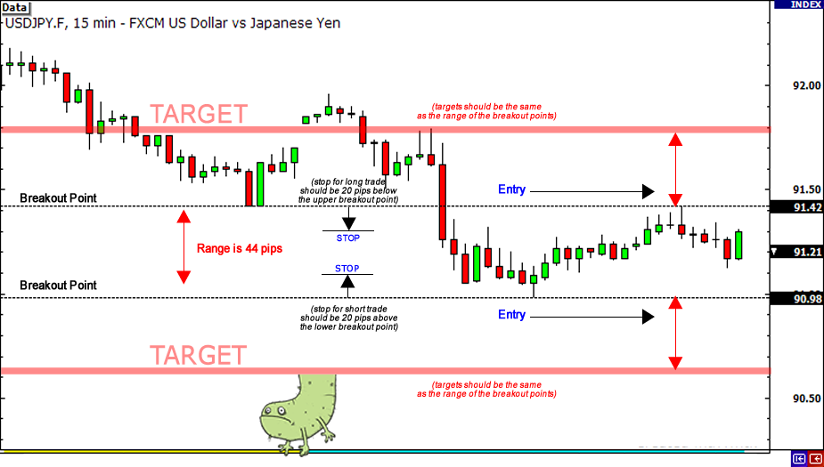

## Table of Contents

## What is currency day trading and how does it differ from other trading types?

Currency day trading, also known as forex day trading, is when people buy and sell different currencies within the same day. The goal is to make money from small changes in the value of one currency compared to another. Traders watch the market closely and try to predict which way the currency prices will move. They might use charts, news, and other tools to help them decide when to buy and sell.

This type of trading is different from other types like swing trading or long-term investing. In swing trading, people hold onto their trades for a few days or weeks, hoping to catch bigger price moves. Long-term investing means holding onto investments for months or years. Day trading is faster and more active, with traders making many decisions each day. It can be exciting but also risky because the market can change quickly.

## What are the basic requirements to start currency day trading?

To start currency day trading, you need a few basic things. First, you need a computer or a smartphone with a good internet connection. This is important because you need to be able to watch the market and make trades quickly. You also need to open an account with a forex broker. A broker is like a middleman who helps you buy and sell currencies. Make sure to choose a broker that is reliable and has good tools for trading.

Next, you need some money to start trading. This is called your trading capital. You don't need a lot of money to start, but you should only use money that you can afford to lose. It's also a good idea to learn about the [forex](/wiki/forex-system) market before you start trading. There are many free resources online, like videos and articles, that can teach you the basics. Finally, it's helpful to practice with a demo account before using real money. A demo account lets you trade with fake money so you can get a feel for how the market works without risking any real money.

## How can beginners identify the best times to trade currencies?

For beginners, figuring out the best times to trade currencies can be a bit tricky, but it's important to know when the market is most active. The forex market is open 24 hours a day from Monday to Friday, but the best times to trade are usually when the market is most active. This happens when the trading sessions of major financial centers overlap. For example, the overlap between the London and New York sessions, which happens from 8 AM to 12 PM Eastern Time, is a very busy time with lots of trading happening. This means more chances to make money, but also more risk because the market can move quickly.

Another good time to trade is during the Asian session, which includes major markets like Tokyo and Sydney. This session overlaps with the European session, specifically London, from 3 AM to 4 AM Eastern Time. While this time might not be as busy as the London-New York overlap, it can still be a good time to trade because there is enough activity to see price movements. Beginners should start by focusing on these high-activity periods and use tools like economic calendars to keep track of important news events that can affect currency prices. By watching the market during these times and learning from what happens, beginners can slowly get better at knowing when to trade.

## What are the most common currency pairs traded in day trading?

In currency [day trading](/wiki/day-trading-spy), the most common pairs that people trade are called the "major pairs." These pairs always have the US dollar on one side. The most popular one is the EUR/USD, which is the Euro against the US dollar. Other major pairs include GBP/USD (British pound against the US dollar), USD/JPY (US dollar against the Japanese yen), and USD/CHF (US dollar against the Swiss franc). These pairs are traded a lot because they are from big economies, and there is a lot of money moving around in them every day.

Besides the major pairs, there are also "minor pairs" or "cross pairs" that don't include the US dollar. These are less common but still important. Examples include EUR/GBP (Euro against the British pound), EUR/JPY (Euro against the Japanese yen), and GBP/JPY (British pound against the Japanese yen). These pairs can be good for trading too, but they usually have less trading [volume](/wiki/volume-trading-strategy) than the major pairs. So, if you are starting with currency day trading, it's a good idea to focus on the major pairs first because they are more active and easier to trade.

## What technical analysis tools are essential for currency day trading?

For currency day trading, some important technical analysis tools to know about are moving averages, the Relative Strength Index (RSI), and support and resistance levels. Moving averages help traders see the general direction of a currency pair's price over time. There are simple moving averages, which just take the average price over a certain number of periods, and exponential moving averages, which give more weight to recent prices. Traders often look at where the price is compared to these moving averages to decide if they should buy or sell. The RSI is another useful tool. It measures how fast and how much a currency pair's price is changing. If the RSI is above 70, it might mean the currency is overbought and could go down soon. If it's below 30, it might mean the currency is oversold and could go up.

Support and resistance levels are also key. These are like invisible lines on a chart where the price often stops and turns around. Support is a price level where the currency tends to find a floor and bounce back up. Resistance is a price level where the currency often hits a ceiling and falls back down. Traders use these levels to guess where the price might go next. By combining these tools, traders can make better guesses about when to buy or sell a currency pair. It's like having a set of clues that help you make smarter trading choices.

## How do fundamental analysis and economic indicators affect currency day trading?

Fundamental analysis and economic indicators play a big role in currency day trading. They help traders understand what's happening in the world that might change the value of currencies. For example, if a country's economy is doing well, its currency might get stronger. Traders look at things like interest rates, employment numbers, and how much stuff a country is buying and selling with other countries. These things can make a currency go up or down. So, traders use this information to guess where the currency prices might go next and decide when to buy or sell.

Economic indicators, like the ones mentioned before, are numbers that tell us how an economy is doing. When these numbers come out, they can make the forex market move a lot. For example, if the US reports that more people are working than expected, the US dollar might go up because a strong job market is good for the economy. Traders keep an eye on when these reports are coming out and what they might mean. This helps them be ready for big price changes and make trades at the right time. By understanding these indicators, traders can make better decisions and maybe make more money in currency day trading.

## What risk management strategies should be employed in currency day trading?

In currency day trading, using risk management strategies is really important to keep your money safe. One key strategy is to set stop-loss orders. A stop-loss order is like a safety net that automatically sells your currency if the price goes down too much. This helps you lose less money if things don't go the way you planned. Another strategy is to only risk a small part of your money on each trade, usually no more than 1-2%. This means if you have $1,000, you would only risk $10 to $20 on a single trade. By doing this, you can keep trading even if you have some losses.

Another important thing is to use leverage carefully. Leverage lets you trade with more money than you actually have, but it can also make you lose more money if the market moves against you. So, it's smart to use less leverage and keep your trades small. Also, always have a plan for how much you want to make and how much you're okay with losing. This is called setting your profit targets and stop-loss levels before you start trading. By sticking to your plan, you can make better choices and protect your money while trying to make more of it.

## How can a trader develop and test a currency day trading system?

To develop a currency day trading system, a trader first needs to decide on a strategy. This could be based on technical analysis, like using moving averages or RSI, or it could include [fundamental analysis](/wiki/fundamental-analysis) by looking at economic indicators. The trader should write down clear rules for when to buy and sell, how much money to risk on each trade, and what their goals are for making money. It's helpful to keep the strategy simple at first, so it's easier to understand and follow. Once the strategy is set, the trader can use a demo account to practice. A demo account lets you trade with fake money, so you can see how your strategy works without losing real money.

After practicing with a demo account, the next step is to test the system more carefully. This is called [backtesting](/wiki/backtesting), where the trader looks at old market data to see how their strategy would have worked in the past. There are special software tools that can help with backtesting. It's important to test the strategy over a long time and in different market conditions to make sure it works well. If the backtesting shows that the strategy is good, the trader can start using real money but should start with small trades. It's also a good idea to keep a trading journal to write down what works and what doesn't, so the trader can keep improving their system over time.

## What are the psychological aspects of currency day trading and how to manage them?

Currency day trading can be really exciting but also stressful. One big psychological aspect is dealing with fear and greed. When the market is moving fast, traders might feel scared that they'll lose money, and this fear can make them sell too soon or not take good trades. On the other hand, when they're making money, greed can make them want to keep trading and take bigger risks, which can lead to big losses. Another thing is the need for discipline. Traders need to stick to their trading plan and not let emotions like excitement or disappointment make them do things they hadn't planned. It's hard to stay calm and follow the rules when the market is going crazy, but it's really important.

To manage these psychological aspects, traders can use a few strategies. One is to take breaks and not trade all the time. It's easy to get tired and make bad decisions when you're trading too much. Taking time away from the screen can help you stay fresh and think clearly. Another strategy is to practice mindfulness or meditation. These can help you stay calm and not let your emotions control your trading. It's also good to talk to other traders or a mentor about your feelings and experiences. They can give you advice and help you stay on track. By working on these psychological aspects, traders can make better choices and have a better chance of success in currency day trading.

## How do advanced traders use algorithmic trading in currency day trading?

Advanced traders use [algorithmic trading](/wiki/algorithmic-trading) in currency day trading to make their trades faster and more accurate. They write computer programs, called algorithms, that can watch the market and make trades automatically. These algorithms can look at lots of information very quickly, like price changes, news, and other data. They can find patterns and make trading decisions based on rules that the trader sets up. This means the trader doesn't have to sit and watch the market all day. The computer can do it for them, making trades at the best times and helping the trader make more money.

Using algorithmic trading can also help advanced traders manage their risks better. They can set up their algorithms to use stop-loss orders and take-profit levels automatically. This means if the market moves against them, the computer can sell the currency to stop the loss from getting too big. And if the market moves in their favor, the computer can sell at the right time to make a profit. By letting the computer do a lot of the work, advanced traders can focus on making their strategies better and finding new ways to trade. This can help them be more successful in the fast-moving world of currency day trading.

## What are the latest trends and technologies impacting currency day trading?

The world of currency day trading is always changing, and new trends and technologies are making a big difference. One big trend is the use of [artificial intelligence](/wiki/ai-artificial-intelligence) (AI) and [machine learning](/wiki/machine-learning). These technologies help traders by looking at huge amounts of data to find patterns and make predictions about what might happen next in the market. AI can help traders make better decisions by suggesting when to buy or sell based on what it learns. Another trend is the growing use of mobile trading apps. These apps let traders watch the market and make trades from their phones, no matter where they are. This makes trading easier and more convenient, especially for people who are always on the go.

Another important technology is blockchain and cryptocurrencies. More and more traders are interested in trading digital currencies like Bitcoin and Ethereum. Blockchain technology makes these trades safer and more transparent. It also opens up new ways to trade and invest that weren't possible before. Finally, social trading platforms are becoming popular. These platforms let traders see what other successful traders are doing and copy their trades. This can help new traders learn from the pros and make better trades. All these trends and technologies are changing how people trade currencies and making the market more exciting and accessible.

## How can expert traders optimize their currency day trading system for maximum profitability?

Expert traders can optimize their currency day trading system for maximum profitability by constantly refining their strategies and staying updated with market trends. They often use backtesting to see how their strategies would have worked in the past and make changes based on what they learn. This helps them find the best times to trade and the best currency pairs to focus on. They also use advanced tools like AI and machine learning to make their trading decisions more accurate. By analyzing lots of data, these tools can find patterns and predict market movements better than humans can. This means the traders can make more money by buying and selling at the right times.

Another way expert traders optimize their systems is by managing their risks carefully. They set strict rules for how much money they're willing to lose on each trade and use stop-loss orders to protect their money. They also keep a close eye on their emotions and make sure they stick to their trading plan, even when the market gets crazy. By using a mix of technology, careful planning, and good risk management, expert traders can make their currency day trading system work as well as possible and earn more profit.

## References & Further Reading

[1]: ["Advances in Financial Machine Learning"](https://www.amazon.com/Advances-Financial-Machine-Learning-Marcos/dp/1119482089) by Marcos Lopez de Prado

[2]: ["Evidence-Based Technical Analysis: Applying the Scientific Method and Statistical Inference to Trading Signals"](https://www.amazon.com/Evidence-Based-Technical-Analysis-Scientific-Statistical/dp/0470008741) by David Aronson

[3]: ["Machine Learning for Algorithmic Trading"](https://github.com/stefan-jansen/machine-learning-for-trading) by Stefan Jansen

[4]: ["Quantitative Trading: How to Build Your Own Algorithmic Trading Business"](https://www.amazon.com/Quantitative-Trading-Build-Algorithmic-Business/dp/1119800064) by Ernest P. Chan

[5]: Bergstra, J., Bardenet, R., Bengio, Y., & Kégl, B. (2011). ["Algorithms for Hyper-Parameter Optimization."](https://dl.acm.org/doi/10.5555/2986459.2986743) Advances in Neural Information Processing Systems 24.