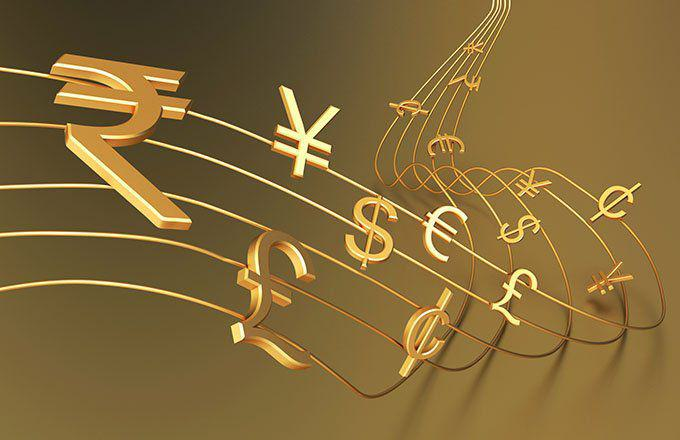

In recent years, trading systems have gained considerable prominence in the financial markets, becoming indispensable tools for investors and traders. These systems are particularly impactful in currency trading, day trading, and algorithmic (algo) trading, each playing a crucial role. Currency trading involves the exchange of one currency for another, and it forms the foundation of the global financial network, with over $6 trillion traded daily. Day trading, focusing on buying and selling financial instruments within the same trading day, is characterized by swift decision-making and market analysis. Algorithmic trading automates trading decisions using complex algorithms, enhancing precision and execution speed.

The objective of this exploration is to understand how these trading styles can be integrated with technology for improved trading outcomes. A firm grasp of trading systems is essential for enhancing performance, reducing risks, and capitalizing on opportunities. By comprehending the intricacies of trading systems, traders can develop strategies that harness the strengths of each style while mitigating potential downsides.



This article will provide insights into the landscape of currency trading and its systems, examine various strategies employed in day trading, explore the technological advancements within algo trading, and analyze the synergies arising from their integration. To conclude, it will encourage readers to adopt innovative trading systems and adapt to evolving market conditions for sustained success.

## Table of Contents

## Understanding Currency Trading and Its Systems

Currency trading, also known as foreign exchange or forex trading, involves the buying and selling of currencies on the global foreign exchange market. It plays a critical role in the financial markets by facilitating international trade and investment, allowing businesses to convert their profits from sales overseas, and enabling investors to speculate on currency price movements.

Currency day trading is a subset of forex trading characterized by the buying and selling of currency pairs within the same trading day. The main objective of day trading is to profit from short-term price fluctuations. This type of trading is distinguished by its fast-paced nature, requiring traders to make quick decisions as they aim to take advantage of small gains multiple times throughout the day. Currency day traders often employ leverage to amplify their trading results, which can increase both potential returns and risks.

Currency day trading systems are frameworks consisting of strategies, tools, and rules designed to guide traders' decisions. These systems typically incorporate various components, such as technical indicators, chart patterns, and risk management techniques. Technical indicators like moving averages or the Relative Strength Index (RSI) are utilized to identify potential entry and exit points, while risk management rules help control the amount of capital at risk in any given trade.

Currency trading systems can be categorized into manual and automated systems. Manual trading systems require the trader to actively monitor the market and execute trades based on their analysis and decisions. In contrast, automated trading systems use algorithms to analyze market data and execute trades automatically, based on predefined criteria. Automated systems can process vast amounts of data quickly and without human emotion, potentially increasing efficiency and reducing errors.

The benefits of currency trading include high [liquidity](/wiki/liquidity-risk-premium), allowing traders to enter and [exit](/wiki/exit-strategy) positions with ease, as well as the availability of leverage, which can enhance potential returns. However, these benefits are counterbalanced by challenges such as market [volatility](/wiki/volatility-trading-strategies), which can lead to significant losses, and the complexities of understanding various economic and geopolitical factors that influence currency prices. Additionally, the use of leverage can amplify losses, making risk management crucial for successful trading.

Understanding and leveraging currency trading systems is essential for traders aiming to improve their performance in the [forex](/wiki/forex-system) market. By effectively integrating strategies, tools, and technologies, traders can navigate the complexities of currency trading and better manage the associated risks.

## Day Trading Systems: Strategies and Approaches

Day trading represents a dynamic segment of the financial markets characterized by the buying and selling of financial instruments within the same trading day. This approach to trading aims to capitalize on short-term market fluctuations, often executing multiple trades to exploit volatility in asset prices. Day trading’s significance stems from its potential for rapid returns and reliance on market movements that unfold over the [course](/wiki/best-algorithmic-trading-courses) of a single day.

### Strategies Employed in Day Trading Systems

Day trading encompasses a variety of strategies that cater to different risk appetites and market conditions. Two prevalent strategies include [scalping](/wiki/gamma-scalping) and fading:

1. **Scalping**: This strategy focuses on profiting from minor price changes, typically holding positions for seconds or minutes. The objective is to "scalp" small profits repeatedly, accumulating gains over numerous trades within a day. Traders may use technical indicators like moving averages to pinpoint opportune moments to enter and exit positions.

2. **Fading**: Contrary to scalping, fading involves trading against the prevailing trend. Traders using this strategy sell during an upward trend and buy during a downward trend, assuming the market will retrace. This high-risk strategy is based on the assumption that price movements are overextended and likely to correct.

### Tools and Techniques in Day Trading

Successful [day trading](/wiki/day-trading-spy) relies heavily on various tools and techniques, most notably technical analysis and charting. Technical analysis involves the study of price movements and patterns using historical data to forecast future price movements. Common tools include:

- **Charts**: Utilize various chart types (e.g., candlestick, bar) to visualize price movements and trends.
- **Indicators**: Employ technical indicators like Relative Strength Index (RSI), Moving Averages (MA), and Bollinger Bands to identify entry and exit points.
- **Volume Analysis**: Consider volume changes, as they often precede price movements, providing insights into the potential strength of a price trend.

### Pros and Cons of Day Trading Systems

Day trading systems are not without their advantages and drawbacks. Among the benefits are the potential for quick returns and the avoidance of overnight risk, as all positions are closed by the end of the trading day. Additionally, day trading can be highly engaging and offers independence from longer-term market trends.

However, the cons include the necessity for intense concentration and the potential for significant financial losses, especially for those who fail to manage risk properly. Moreover, day trading requires a solid understanding of market behavior and the discipline to adhere to predetermined strategies amidst rapid price changes.

### Role of Technology in Enhancing Day Trading Efficiency

Technology is a cornerstone of modern day trading, enhancing efficiency and accessibility across different trading platforms. Trading software can execute complex algorithms, automate trade execution, and provide real-time data analysis. Advanced charting tools allow traders to customize visual representations of market data, while high-speed internet connections enable swift trade execution and quick market updates, minimizing latency issues.

Furthermore, [algorithmic trading](/wiki/algorithmic-trading) and [machine learning](/wiki/machine-learning) are increasingly incorporated into day trading systems, allowing for the automation of trading strategies that can learn from historical data to optimize decision-making processes. Python is a commonly used programming language in this area, prized for its simplicity and extensive libraries, like Pandas for data analysis and Matplotlib for charting.

```python
import pandas as pd
import matplotlib.pyplot as plt

# Simple example of a moving average crossover strategy
data = pd.read_csv('market_data.csv')
data['MA20'] = data['Close'].rolling(window=20).mean()
data['MA50'] = data['Close'].rolling(window=50).mean()

# Plotting the moving averages
plt.figure(figsize=(12,6))
plt.plot(data['Close'], label='Close Price')
plt.plot(data['MA20'], label='20-Day MA')
plt.plot(data['MA50'], label='50-Day MA')
plt.legend()
plt.show()
```

This snippet demonstrates how a trader might analyze moving averages to identify potential buy or sell signals. The intersection points between the 20-day and 50-day moving averages serve as indicators for trading decisions.

Day trading systems, when understood and applied effectively, offer significant opportunities in financial markets. However, they demand a disciplined approach, a thorough understanding of strategies and tools, and the wise use of technology to mitigate risks and optimize performance.

## Algo Trading: The Intersection of Technology and Trading

Algorithmic trading, often referred to as algo trading, utilizes computer programs to execute trades at speeds and frequencies impossible for a human trader. This approach to trading has witnessed significant development over the decades, evolving from simple rule-based systems to complex algorithms capable of adapting to changing market conditions.

Initially, algorithmic trading emerged in the early 1970s with the advent of electronic exchanges. As technology advanced, the use of algorithms expanded throughout the 1980s and 1990s with the increase in computational power and data availability. Today, algo trading represents a substantial share of market transactions, particularly in high-frequency trading ([HFT](/wiki/high-frequency-trading-strategies)).

Algo trading systems are characterized by their ability to process large volumes of data rapidly, execute trades at optimal prices, and minimize human errors. These systems function by following specific instructions, such as timing, price, and [volume](/wiki/volume-trading-strategy). Algorithms can employ a variety of trading strategies, which include price action and technical analysis.

**Price Action Strategy:**
This strategy involves making trading decisions based on historical prices. Algorithms analyze patterns and trends to predict future price movements, executing trades accordingly. For instance, the strategy might involve buying a currency pair when its price surpasses a moving average and selling when it falls below.

**Technical Analysis:**
Technical analysis relies on statistical indicators derived from past trading data. Common indicators include moving averages, relative strength index (RSI), and Bollinger Bands. An algo trading system might be programmed to execute trades based on these indicators crossing particular thresholds.

The primary benefits of using algorithmic trading include speed and accuracy. Algorithms can execute trades within milliseconds, significantly faster than a human trader. Additionally, they can process vast datasets to identify trends and opportunities, executing trades at the precise moment to maximize profit or minimize loss.

However, algo trading presents several challenges and risks. Over-optimization is a notable issue, where an algorithm is excessively fine-tuned to historical data, leading to poor performance in live trading environments. This problem, often termed "curve fitting," can cause significant financial loss when market conditions change.

Furthermore, algorithmic trading systems are vulnerable to technical failures and require robust monitoring to ensure their proper functioning. Market volatility caused by algorithmic errors, sometimes resulting in flash crashes, highlights the need for effective risk management strategies.

In conclusion, while algorithmic trading leverages technology to enhance trading efficiency and accuracy, it demands a careful balance between strategy development and risk management to avoid potential pitfalls. As technology continues to advance, the landscape of algo trading is likely to evolve, offering new opportunities and challenges for traders and financial markets alike.

## Integrating Currency, Day, and Algo Trading Systems

Currency trading systems, when enhanced with day and algorithmic trading techniques, offer a comprehensive approach to navigating the financial markets. By leveraging the strengths of these diverse trading styles, traders can potentially optimize their decision-making processes and enhance profitability.

Currency trading systems, incorporating day trading strategies, focus on taking advantage of short-term price movements within the forex market. Day trading, characterized by the rapid opening and closing of positions, benefits from tools such as scalping, which seeks to capture minor price shifts, or fading, which is contrarian by nature and involves trading against prevailing trends post [momentum](/wiki/momentum) spikes. These techniques help traders exploit intraday volatility within currency markets.

Algorithmic trading introduces automated strategies that rely on pre-defined rules for trade execution. This system harnesses the power of technology to identify trading opportunities and execute trades at incredible speeds. A common algorithmic strategy within currency trading is price action analysis, which involves assessing past price movements to make informed decisions. Technical indicators, such as moving averages and oscillators, can also be encoded into algorithms to support trading decisions.

### Case Studies of Successful Integration

Numerous trading houses have successfully merged these trading systems. For instance, quantitative hedge funds often employ algorithmic strategies alongside day trading techniques to enhance their currency trading operations. A notable example is the utilization of machine learning models to predict short-term currency trends and execute trades based on these predictions, enhancing both responsiveness and accuracy.

### Impact of Integrating Technology

Integrating technology into traditional currency trading methods has profoundly enhanced trading efficiency. Automation reduces human error, lowers transaction costs due to high-frequency trading, and allows for the simultaneous monitoring of multiple currency pairs. Moreover, technology enables [backtesting](/wiki/backtesting) strategies over historical data to refine trading systems before deployment.

### Best Practices for Integration

Traders aiming to combine these different systems should consider the following practices:

- **Portfolio Diversification:** Utilize a mix of day and algorithmic trading strategies within your currency trading portfolio to mitigate risk.
- **Continuous Learning:** Stay updated with technological advancements and refine strategies based on market changes and technological trends.
- **Adequate Backtesting:** Ensure all strategies, particularly algo systems, undergo rigorous backtesting to validate their effectiveness under various market conditions.
- **Risk Management:** Implement robust risk management frameworks to limit potential drawbacks from algorithmic malfunction or unforeseen market events.

### Future Trends and Innovations

Looking ahead, the integration of [artificial intelligence](/wiki/ai-artificial-intelligence) and machine learning is anticipated to further revolutionize currency trading. Predictive analytics and sentiment analysis, leveraging vast amounts of unstructured data, are expected to enhance algorithmic strategies' accuracy. Additionally, the growing influence of decentralized finance (DeFi) and blockchain technology might usher in innovations in currency trading, providing new avenues for integrating trading systems.

In summary, the successful integration of currency, day, and algorithmic trading systems holds significant promise for traders. By adopting diverse techniques and embracing technological advancements, traders can remain competitive in the rapidly evolving financial landscape.

## Conclusion

The integration of currency, day, and algorithmic trading systems offers unique advantages while also posing distinct challenges. Currency trading provides liquidity and access to global markets, essential for managing large-scale transactions. Day trading enables traders to capitalize on short-term market movements, requiring quick decision-making and risk management skills. Algorithmic trading enhances these systems with the speed and precision of automated processes, allowing for rapid execution of complex strategies.

Nonetheless, these trading systems present challenges. Currency trading is vulnerable to geopolitical events and economic shifts, while day trading demands constant attention and can be affected by high transaction costs. Algorithmic trading, though highly efficient, risks over-optimization and reliance on technology, which can fail during unpredictable market conditions.

Amidst these benefits and challenges, staying updated with trading technologies is crucial. The fast-paced evolution of the financial market necessitates continuous learning and adaptation. Traders who actively follow advancements in technology and refine their strategies are better positioned to achieve favorable outcomes.

Traders are encouraged to adapt to these evolving systems by broadening their knowledge and being receptive to new tools and techniques. This can involve participating in courses, attending webinars, or engaging with trading communities. Continuous exploration and adoption of innovative practices can lead to improved performance and profitability.

As trading systems and technologies progress, sharing insights and experiences can be immensely beneficial. Readers are invited to contribute their observations and insights on trading systems, fostering a collaborative environment that enhances collective learning and success. Your perspectives can provide valuable lessons and inspire further exploration in this dynamic field.

## References & Further Reading

[1]: ["Advances in Financial Machine Learning"](https://www.amazon.com/Advances-Financial-Machine-Learning-Marcos/dp/1119482089) by Marcos Lopez de Prado

[2]: ["Evidence-Based Technical Analysis: Applying the Scientific Method and Statistical Inference to Trading Signals"](https://www.amazon.com/Evidence-Based-Technical-Analysis-Scientific-Statistical/dp/0470008741) by David Aronson

[3]: ["Machine Learning for Algorithmic Trading"](https://github.com/stefan-jansen/machine-learning-for-trading) by Stefan Jansen

[4]: ["Quantitative Trading: How to Build Your Own Algorithmic Trading Business"](https://www.amazon.com/Quantitative-Trading-Build-Algorithmic-Business/dp/1119800064) by Ernest P. Chan

[5]: Bergstra, J., Bardenet, R., Bengio, Y., & Kégl, B. (2011). ["Algorithms for Hyper-Parameter Optimization."](https://dl.acm.org/doi/10.5555/2986459.2986743) Advances in Neural Information Processing Systems 24.