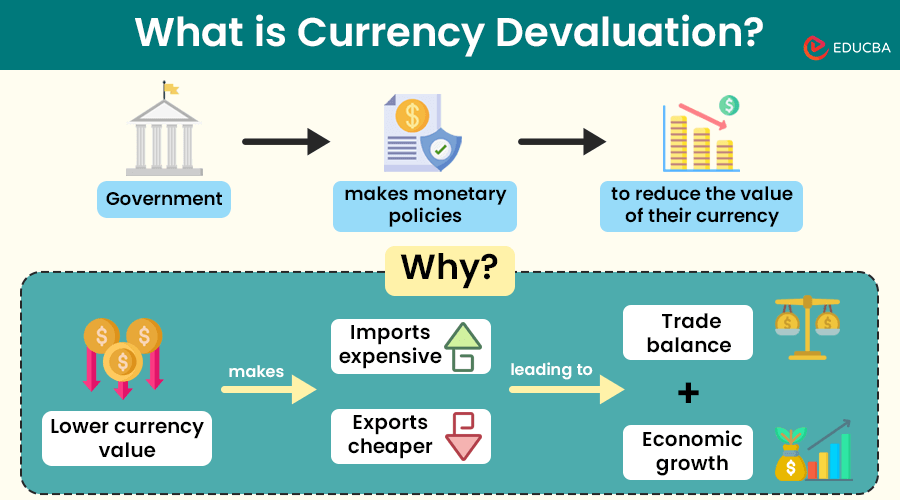

## Table of Contents

## What is currency debasement?

Currency debasement is when a government or authority reduces the value of its money. This can happen in different ways, like printing more money or reducing the amount of valuable metal in coins. When there's more money around, each piece of money becomes worth less. This can make things more expensive, which is called inflation.

Debasement can happen on purpose or by accident. Sometimes, a government might want to print more money to pay for things without raising taxes. But this can lead to problems because people might lose trust in the money. If people think the money will keep losing value, they might spend it quickly or save it in other ways, like buying gold or foreign money. This can make the economy unstable.

## How does currency debasement affect the economy?

When a government debases its currency, it can lead to inflation. This means that the prices of things like food, clothes, and houses go up. People's money doesn't buy as much as it used to. If you have savings, they become worth less over time. This can make life harder for people, especially those who don't have a lot of money to begin with. They might struggle to afford basic things they need.

Debasement can also make the economy unstable. If people think the money will keep losing value, they might not want to keep it. They might spend it quickly on things that will hold their value, like gold or foreign money. This can lead to a cycle where the money loses value even faster. Businesses might find it hard to plan for the future because they don't know what prices will be like. This uncertainty can slow down the economy and make it harder for it to grow.

## Can you provide historical examples of currency debasement?

One famous example of currency debasement happened in ancient Rome. Roman emperors would sometimes mix less valuable metals into their silver coins to make more money. This made the coins worth less. People started to realize this and didn't want to use the new coins. This caused prices to go up and made life harder for people in Rome. It's one reason why the Roman economy got weaker over time.

Another big example is from Germany in the 1920s. After World War I, Germany printed a lot of money to pay for things. This led to hyperinflation, where prices went up really fast. People needed wheelbarrows full of money just to buy a loaf of bread. The German money became almost worthless, and it caused a lot of problems for the country. It's a clear example of how debasing a currency can hurt an economy.

A more recent example is Zimbabwe in the late 2000s. The government printed too much money, which led to hyperinflation. At one point, prices were doubling every day. People's savings became useless, and it was hard to buy even basic things. The Zimbabwean dollar became so worthless that the government had to stop using it and switch to other currencies. This shows how dangerous debasing a currency can be.

## What are the common methods used to debase a currency?

One common way to debase a currency is by printing more money. When a government prints more money, there's more money around, which makes each piece of money worth less. This can happen if a government wants to pay for things without raising taxes. But it can lead to inflation, where prices go up and people's money doesn't buy as much. If too much money is printed, it can even lead to hyperinflation, where prices go up really fast.

Another method is changing the amount of valuable metal in coins. In the past, coins were often made of gold or silver. If a government started using less gold or silver in the coins, they could make more coins with the same amount of metal. This made the coins worth less. People might notice this and not want to use the new coins, which can cause problems in the economy. This method was used a lot in ancient times, like in Rome, where emperors would mix cheaper metals into their silver coins.

## How does inflation relate to currency debasement?

Inflation and currency debasement are closely related. When a government debases its currency, it often leads to inflation. This happens because debasement means there's more money around, and when there's more money, each piece of money becomes worth less. So, people need more money to buy the same things, and prices go up. This is what we call inflation. If a government prints too much money or reduces the value of its coins, it can cause prices to rise a lot, which can make life harder for people.

Inflation caused by currency debasement can also make the economy unstable. If people think the money will keep losing value, they might spend it quickly instead of saving it. They might also try to buy things that will hold their value, like gold or foreign money. This can lead to a cycle where the money loses value even faster. Businesses might find it hard to plan for the future because they don't know what prices will be like. This uncertainty can slow down the economy and make it harder for it to grow.

## What are the short-term benefits of currency debasement for a government?

When a government debases its currency, it can get more money to spend without raising taxes right away. This can help the government pay for things like building roads, schools, or helping people who need it. It can also make it easier for the government to pay off its debts because the money they owe becomes worth less. This can seem like a quick fix for the government's money problems.

But, this short-term benefit can lead to problems later. If people start to think the money will keep losing value, they might not trust it anymore. They might spend it quickly or save it in other ways, like buying gold or foreign money. This can make prices go up a lot and make the economy unstable. So, while debasing the currency might help a government in the short term, it can cause big problems in the long run.

## What are the long-term consequences of currency debasement?

Over time, currency debasement can lead to big problems. When a government keeps making its money worth less, people start to lose trust in it. They might spend their money quickly on things that will keep their value, like gold or foreign money. This can make prices go up a lot, which is called inflation. If inflation gets really bad, it can turn into hyperinflation, where prices go up so fast that money becomes almost worthless. This makes it hard for people to buy the things they need and can cause a lot of suffering.

The economy can also become very unstable because of currency debasement. Businesses might find it hard to plan for the future because they don't know what prices will be like. This uncertainty can make them less likely to invest or grow, which can slow down the whole economy. People might also lose their savings because the money they saved becomes worth less. This can make people feel less secure and can hurt the overall health of the economy. In the end, the short-term benefits of debasing the currency can lead to long-term problems that are much harder to fix.

## How can individuals protect their wealth from currency debasement?

One way individuals can protect their wealth from currency debasement is by investing in assets that tend to keep their value even when money loses value. Things like gold, silver, and other precious metals are often seen as safe places to store wealth. These metals have been valued for a long time and usually go up in price when money loses value. Another option is to invest in real estate, which can also hold its value well during times of inflation. By putting money into these kinds of assets, people can help protect their savings from losing too much value.

Another way to safeguard wealth is by diversifying into foreign currencies or assets. If the money in your country is losing value, holding money from other countries can help protect your wealth. For example, if you have some savings in a currency that's not affected by the debasement, your overall wealth might be safer. Investing in stocks or bonds from other countries can also be a good idea. By spreading your money across different types of investments and different currencies, you can reduce the risk that comes from your home country's money losing value.

## What role does monetary policy play in currency debasement?

Monetary policy is how a country's central bank controls the amount of money in the economy. It can affect currency debasement a lot. If the central bank decides to print more money, it can lead to debasement. This happens because more money means each piece of money is worth less. The central bank might do this to help the economy grow or to make it easier for the government to pay for things. But if they print too much money, it can cause big problems like inflation or even hyperinflation.

The central bank can also use other tools to try to stop currency debasement. They might raise interest rates to make people want to save more and spend less. This can help slow down inflation. But it's a tricky balance. If they don't do enough, the money might keep losing value. If they do too much, it can hurt the economy in other ways. So, the central bank has to be careful with its monetary policy to keep the value of the money stable and avoid the problems that come with debasement.

## How do different economic theories explain currency debasement?

Different economic theories have different ways of explaining currency debasement. Keynesian economists believe that a government might debase its currency on purpose to help the economy. They think that if the government prints more money, people will spend more, which can help the economy grow. But they also know that too much money printing can lead to inflation, so they say the government needs to be careful and use other tools like interest rates to keep things in balance. On the other hand, monetarist economists focus a lot on the amount of money in the economy. They believe that if the government prints too much money, it will always lead to inflation. They say the government should keep the money supply growing at a steady rate to avoid problems.

Austrian economists have a different view. They think that debasing the currency is always a bad idea. They believe it's a way for the government to trick people and that it leads to big problems like hyperinflation. They say the best way to keep money stable is to have it backed by something like gold, so the government can't just print more money whenever it wants. Marxist economists see currency debasement as a sign of deeper problems in the economy. They think it shows that the system is not working well and that it can lead to more inequality and suffering for people. They believe that big changes are needed to fix these problems and make the economy fairer for everyone.

## Can currency debasement lead to hyperinflation, and if so, how?

Yes, currency debasement can lead to hyperinflation. When a government prints too much money or reduces the value of its coins, it makes the money worth less. If this keeps happening, people start to think the money will keep losing value. They might spend their money quickly on things that will hold their value, like gold or foreign money. This can make prices go up a lot, and if it gets out of control, it can turn into hyperinflation. Hyperinflation is when prices go up so fast that money becomes almost worthless.

For example, in Germany in the 1920s, the government printed a lot of money to pay for things after World War I. This led to hyperinflation, where prices were going up so fast that people needed wheelbarrows full of money just to buy a loaf of bread. Another example is Zimbabwe in the late 2000s, where the government printed too much money, and prices were doubling every day. In both cases, the money became almost worthless, and it caused a lot of problems for people. So, currency debasement can lead to hyperinflation if it's not controlled, and it can make life very hard for everyone.

## What international examples best illustrate the effects of currency debasement?

One clear example of currency debasement is what happened in Germany in the 1920s. After World War I, Germany printed a lot of money to pay for things without raising taxes. This made the money worth less and less. Soon, prices started to go up really fast. This is called hyperinflation. People needed wheelbarrows full of money just to buy a loaf of bread. The German money became almost worthless, and it caused a lot of problems for the country. People lost their savings, and it was hard to buy even basic things. This shows how bad things can get when a government debases its currency.

Another example is Zimbabwe in the late 2000s. The government printed too much money, which made the money worth less. Prices started to go up really fast, sometimes doubling every day. This was also hyperinflation. People's savings became useless, and it was hard to buy even basic things like food. The Zimbabwean dollar became so worthless that the government had to stop using it and switch to other currencies. This example shows how dangerous it can be when a government debases its currency. It can cause a lot of suffering and make the economy very unstable.

## What is Understanding Currency Debasement?

Currency debasement refers to the reduction of the intrinsic value of a nation's currency. This process is often achieved through the alteration of physical currency or by inflating the currency supply. Historically, currency debasement was commonly enacted by physically altering coins, often by reducing the precious metal content and substituting it with a less valuable base metal. The effect was an increase in the nominal amount of money, without a corresponding increase in the economy's real value, thus reducing the currency's purchasing power. 

**Historical Practices:**

Historically, governments have used debasement to address various economic challenges. For example, during the Roman Empire, coins were systematically debased under several emperors. Emperor Nero famously reduced the silver content of Roman denarii. Over time, this practice contributed to significant inflation and economic instability, as the Roman economy relied heavily on the perceived value of its silver coins.

**Modern Monetary Policies:**

In contrast, modern instances of debasement are less about physical currency alteration and more about monetary policy decisions. A common modern approach is through "printing" more money, metaphorically, since much money creation today occurs digitally. This often happens without a corresponding increase in economic output, leading to inflation. For example, during economic downturns, central banks may engage in quantitative easing—a process where the money supply is increased to stimulate economic activity. 

The direct consequence of increasing the money supply without matching economic growth is inflation, where the real value of currency declines. Formulaically, if $M$ represents the money supply, $V$ the velocity of money, $P$ the price level, and $Y$ the real output, the equation of exchange is expressed as:

$$
MV = PY
$$

When $M$ increases while $Y$ remains constant, $P$ must increase, a key outcome of inflation.

**Intended Benefits and Economic Consequences:**

The intended benefits of currency debasement, historically and contemporarily, often include debt relief and short-term economic stimulation by increasing [liquidity](/wiki/liquidity-risk-premium). However, the primary risk lies in the deterioration of the currency's value, leading to higher inflation. Inflation erodes purchasing power, meaning consumers and businesses can buy less with the same amount of money, potentially triggering costs of living increases and economic instability.

Other potential economic consequences include loss of confidence in the currency, rising interest rates as investors seek compensation for increased inflation risk, and ultimately, reduced economic growth if left unchecked. The delicate balance between stimulating economic growth and maintaining currency value is a constant challenge for policymakers.

## What are the modern instances and implications?

Contemporary currency debasement primarily manifests through mechanisms such as quantitative easing (QE), a policy extensively utilized following the 2008 financial crisis. Central banks, in response to economic downturns, purchase large-scale financial assets to inject liquidity into the economy, consequently increasing the money supply. This expanded monetary base aims to lower interest rates, stimulate borrowing, and encourage spending. However, without proportional economic growth, such actions can risk heightened inflation and reduced currency value.

The onset of the COVID-19 pandemic amplified these practices. Governments globally, notably the United States, embarked on unprecedented levels of QE to counteract economic stagnation triggered by the pandemic. The U.S. Federal Reserve, for instance, expanded its balance sheet significantly, raising concerns about potential long-term impacts on currency valuation.

These interventions impact inflation, purchasing power, and overall market stability. Increased money supply can lead to inflation, as more money chases the same amount of goods and services. This relationship is often conceptualized by the Quantity Theory of Money, articulated as:

$$
MV = PQ
$$

where $M$ denotes the money supply, $V$ the velocity of money, $P$ the price level, and $Q$ the quantity of goods and services produced. Increment in $M$ without corresponding rise in $Q$ can result in an increased $P$, signifying inflation.

Quantitative easing's influence on purchasing power and market stability is nuanced. While QE can bolster financial markets and lower unemployment in the short term, sustained inflationary pressure may erode consumer purchasing power. Consequently, individuals find their currency buys less, affecting living standards.

Market stability is another consideration. Although QE can stabilize financial markets by encouraging investment into riskier assets, it may also create asset bubbles, with artificially inflated prices collapsing once stimulus subsides.

Thus, understanding the intricacies of monetary policy is crucial in assessing current economic conditions. Policymakers must weigh the immediate benefits of QE against potential risks of currency debasement, with a need for strategic foresight and balanced interventions to maintain economic equilibrium.

## References & Further Reading

[1]: Harl, K. W. (1996). ["Coinage in the Roman Economy, 300 B.C. to A.D. 700."](https://www.jstor.org/stable/714399?read-now=1) Johns Hopkins University Press.

[2]: Ferguson, N. (1999). ["The Pity of War: Explaining World War I."](https://www.amazon.com/Pity-War-Explaining-World/dp/0465057128) Basic Books.

[3]: ["The Ascent of Money: A Financial History of the World"](https://archive.org/details/ascentofmoneyfin0000ferg_l8i7) by Niall Ferguson

[4]: ["Advances in Financial Machine Learning"](https://www.wiley.com/en-us/Advances+in+Financial+Machine+Learning-p-9781119482086) by Marcos Lopez de Prado

[5]: ["Quantitative Trading: How to Build Your Own Algorithmic Trading Business"](https://books.google.com/books/about/Quantitative_Trading.html?id=j70yEAAAQBAJ) by Ernest P. Chan