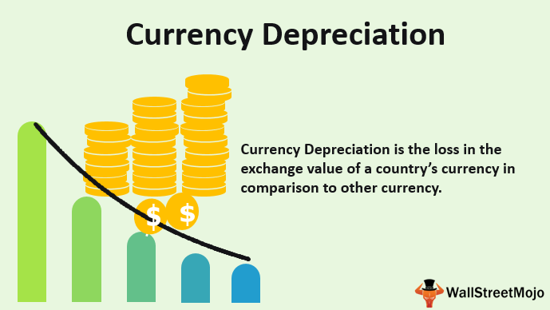

Currency depreciation is a significant phenomenon in the fields of forex and global economics, characterized by a decrease in a currency's value relative to another. This decline is consequential for international trade and investments, affecting the competitiveness of a nation's goods and services, impacting inflation, and influencing capital flows. The dynamics of currency depreciation interplay with exchange rates, which are pivotal in determining the comparative strength of different currencies. Changes in these rates impact how much of a foreign currency is needed to purchase a unit of a domestic currency and can emerge from various economic, political, and speculative factors.

One of the key factors influencing currency value is the exchange rate mechanism, which reflects the relative economic health and stability of nations. This mechanism can be susceptible to alterations by monetary policies, inflation rates, political events, and economic performance. Algorithmic trading further complicates this landscape by utilizing complex algorithms and high-speed computations to execute substantial volumes of currency trades. This technology can magnify market movements and, at times, contribute to volatility.



Understanding these interconnected concepts is crucial for traders who capitalize on forex market movements, policymakers who devise economic strategies, and businesses that rely on international markets. Decisions in these areas are often informed by insights into currency trends and their broader economic implications, thus affecting strategic planning and risk management efforts. As global markets continue evolving, a comprehensive grasp of currency depreciation and related economic variables remains indispensable for engaging effectively with the global economic environment.

## Table of Contents

## Understanding Currency Depreciation

Currency depreciation refers to the decline in value of one currency relative to another within a floating exchange rate system. This phenomenon reflects the dynamic economic forces at play in global markets. Factors contributing to currency depreciation include variations in inflation rates, political instability, and shifts in market demand and supply.

In a scenario where inflation rates rise compared to trading partners, the purchasing power of the currency diminishes, leading to depreciation. For instance, when the domestic inflation rate exceeds that of other countries, the currency value typically declines because each unit of currency buys fewer goods and services, making exports relatively cheaper and imports more expensive.

Political instability also plays a critical role in currency depreciation. Uncertainty arising from political turmoil can drive investors to seek more stable investment environments, reducing demand for the affected currency. For example, political events like Brexit significantly impacted the British pound, causing volatility due to anticipated changes in economic policies and trade agreements.

Shifts in market demand and supply can further influence currency depreciation. A decrease in foreign investment or increased demand for foreign currencies can lead to a surplus of the domestic currency, resulting in lower value. Conversely, a reduction in demand for a country’s currency on international markets can exacerbate depreciation as investors perceive higher risks or lower returns compared to other currencies.

Currency depreciation affects a nation’s economy by altering its trade balance. A weaker currency can bolster exports by making products more competitively priced on the international market. However, this advantage might be offset by the rising costs of imports, as a depreciated currency means more domestic currency is needed to purchase the same amount of foreign goods, potentially leading to a trade deficit if import values significantly surpass export revenues.

Historical instances of currency depreciation illustrate its multifaceted causes and impacts. The Turkish lira, for instance, has experienced sharp declines due to both economic struggles and geopolitical tensions. These fluctuations underscore the intricate linkages between currency values and broader economic and political landscapes, highlighting the importance of strategic economic policies and careful inflation management to mitigate adverse effects.

## Factors Influencing Exchange Rates and Currency Depreciation

Exchange rates, the value of one currency in terms of another, are primarily driven by various economic and political factors. Understanding these influences is key to comprehending how currency depreciation occurs within a floating exchange rate system.

### Economic Conditions

Economic fundamentals are significant contributors to exchange rate fluctuations. A country’s trade balance, which is the difference between its exports and imports, is paramount. A positive balance, where exports exceed imports, may strengthen a currency as demand for the currency increases. Conversely, a negative balance can weaken the currency as the demand diminishes.

Interest rates also play a pivotal role. Generally, higher interest rates offer lenders in an economy a higher return relative to other countries. Therefore, higher interest rates attract foreign capital and cause the exchange rate to rise. However, if inflation rates in a country rise simultaneously, it may negate the positive effects of high interest rates, potentially leading to depreciation. The relationship between interest rates, inflation, and exchange rates can be illustrated by the Fisher Equation:
$$
i \approx r + \pi
$$
where $i$ is the nominal interest rate, $r$ is the real interest rate, and $\pi$ represents inflation. This equation suggests that higher inflation rates can erode the purchasing power of a currency, leading to depreciation unless compensated by an increase in nominal interest rates.

### Political Stability and Speculation

Political stability, or the lack thereof, significantly impacts exchange rates. Countries with stable governments and predictable policies tend to attract more foreign investment, leading to currency appreciation. In contrast, political turmoil and uncertainty can scare off investment, causing depreciation. Historical examples include the British pound’s [volatility](/wiki/volatility-trading-strategies) during the Brexit referendum and the Turkish lira’s fluctuations amid political tension.

Market speculation further influences exchange rates. Traders and investors speculating on future currency movements can heighten demand for certain currencies, impacting their value. If investors expect a currency to appreciate, they buy into it, increasing demand and its value in the short term.

### Government Interventions

Governments often intervene to stabilize or manipulate exchange rates, employing monetary and fiscal tools. Adjusting interest rates is one common method. By raising interest rates, governments can attract foreign investment, leading to currency appreciation. Altering foreign exchange reserves is another strategy, where central banks buy or sell their currency to influence its value directly.

Fiscal policies also play a role, where government spending and taxation can impact economic growth and subsequently, exchange rates. These interventions are part of broader monetary policies that aim to control inflation, stabilize currency fluctuations, and maintain economic growth.

In summary, exchange rates and currency depreciation are products of a complex interplay of economic conditions, political stability, market speculation, and governmental interventions. Understanding this interaction is crucial for anticipating market movements and making informed economic decisions.

## The Role of Algorithmic Trading in Currency Markets

Algorithmic trading, or algo trading, employs sophisticated computer algorithms to automate trading operations based on a set of defined parameters. This method has transformed currency markets by enabling rapid execution of trades and analysis of vast datasets. By implementing complex mathematical models, algorithms can interpret market signals and respond within milliseconds, a feat unachievable by human traders.

The efficiency of algo trading lies in its ability to handle high-frequency trading activities, processing large volumes of data to capitalize on small price movements across various currency pairs. This capability not only enhances [liquidity](/wiki/liquidity-risk-premium) but also sharpens pricing efficiency in foreign exchange markets. An [algorithmic trading](/wiki/algorithmic-trading) strategy may include techniques such as statistical [arbitrage](/wiki/arbitrage), [trend following](/wiki/trend-following), or market-making, each designed to optimize specific trading objectives.

Despite its advantages, algorithmic trading also poses significant risks. The speed and automation of trades can amplify market volatility, especially in periods of market stress or unexpected events. For instance, algorithms might trigger a cascade of buy or sell orders based on programmed thresholds, exacerbating price swings and potentially leading to events like flash crashes. Additionally, the reliance on algorithms introduces systemic risks; if a widely used algorithm contains a flaw, it could propagate adverse effects throughout the financial system.

Moreover, the complexity of these algorithms often makes them opaque, complicating the task of regulatory oversight and hindering the ability to pinpoint the origins of market anomalies. Regulatory bodies have started implementing measures to monitor and regulate algorithmic trading practices to mitigate these systemic risks and protect market integrity.

To illustrate the impact of algorithmic trading, consider a simple Python example where a trading decision is based on moving averages—a common trend-following strategy:

```python
def moving_average(data, window_size):
    return sum(data[-window_size:]) / window_size

def execute_trade(prices, short_window, long_window):
    short_ma = moving_average(prices, short_window)
    long_ma = moving_average(prices, long_window)

    if short_ma > long_ma:
        return "Buy"
    elif short_ma < long_ma:
        return "Sell"
    else:
        return "Hold"

# Example usage
prices = [1.15, 1.16, 1.14, 1.17, 1.19, 1.18, 1.21]
trade_decision = execute_trade(prices, short_window=3, long_window=5)
print(trade_decision)
```

This simple algorithm compares short-term and long-term moving averages to determine a basic trade signal. In practice, modern algo trading systems are far more sophisticated, incorporating a multitude of quantitative techniques and constantly adapting to market conditions through [machine learning](/wiki/machine-learning) models.

In conclusion, while algorithmic trading has reshaped currency markets by enhancing execution speed and efficiency, it also invites challenges that require careful balancing of technological innovation with the need for market stability and regulatory compliance.

## Implications for Traders and Economies

Currency depreciation significantly influences both traders and economies, offering diverse effects and opportunities for strategic positioning. For traders, understanding depreciation patterns enables them to exploit [forex](/wiki/forex-system) market trends by strategically positioning themselves with long or short investment stances, aligned with market predictions. For instance, traders might take a long position by buying a depreciating currency if they anticipate its future appreciation, betting on eventual market recovery or corrective measures by the central bank.

Algorithmic trading amplifies these strategies by allowing traders to program algorithms to exploit price differentials resulting from currency value fluctuations. Such algorithms can swiftly assess and respond to exchange rate changes, making high-frequency trading feasible. An example Python pseudocode snippet for a simple trading bot reacting to currency depreciation might resemble this:

```python
def trading_decision(exchange_rate, threshold):
    if exchange_rate < threshold:
        return "Buy"
    else:
        return "Hold"

exchange_rate = get_current_rate("USD/EUR")
decision = trading_decision(exchange_rate, threshold=1.10)
```

For national economies, currency depreciation can yield a mixed bag of outcomes. On the positive side, when a currency devalues, it can make that country's exports cheaper on the international market, potentially enhancing trade competitiveness. This boost in exports can spur economic growth by driving up domestic production levels. However, the downside involves increased costs for imports, which can provoke inflationary pressures within the domestic market. As critical imports become more expensive, the cost of essential goods and raw materials rises, possibly leading to a higher consumer price index (CPI).

Navigating these complex dynamics necessitates a deep understanding and integration of insights regarding exchange rate fluctuations and currency value. Policymakers need to consider the potential benefits and drawbacks of a depreciating currency when designing economic strategies. For example, targeted monetary policies, such as [interest rate](/wiki/interest-rate-trading-strategies) adjustments, might be implemented to mitigate adverse effects while capitalizing on positive trends in export markets.

In conclusion, both traders and policymakers stand to gain substantially from a sophisticated understanding of how currency depreciation influences global markets. By staying informed of exchange rate movements and leveraging algorithmic tools, they can make informed decisions that optimize economic outcomes and exploit trading opportunities.

## Conclusion

The relationship between currency depreciation, exchange rates, and algorithmic trading is essential to grasp in the landscape of global markets. As digital advancements continue to shape and interconnect financial systems, the ability to adjust strategies to these evolving factors is vital for gaining a competitive edge. 

The intricacies of these interactions demand that traders and economists cultivate a robust understanding. Technological advancements, particularly in algorithmic trading, have transformed the speed and efficiency with which trades are executed, changing the dynamics of how exchange rates respond to market stimuli. For instance, traders can use the speed and data-processing capabilities of algorithms to anticipate or react to currency movements, potentially yielding profits from fluctuations.

An example to illustrate this is a simple Python code snippet that could simulate currency trading based on moving averages:

```python
def moving_average(data, window_size):
    """Calculates moving averages for a given data set and window size."""
    return [sum(data[i:i+window_size])/window_size for i in range(len(data)-window_size+1)]

currency_prices = [1.25, 1.28, 1.3, 1.27, 1.26, 1.29, 1.31]
short_window = 2
long_window = 3

short_avg = moving_average(currency_prices, short_window)
long_avg = moving_average(currency_prices, long_window)

signals = [0] * len(currency_prices)

for i in range(min(len(short_avg), len(long_avg))):
    if short_avg[i] > long_avg[i]:
        signals[i] = 1  # Buy signal
    elif short_avg[i] < long_avg[i]:
        signals[i] = -1  # Sell signal

print("Signals:", signals)
```

This simplicity of the code belies the deeper complexity present in real-world algorithmic trading, where vast datasets and sophisticated models are used to predict market movements.

Staying abreast of global economic trends is no less important than technical prowess. Factors such as geopolitical events, changes in monetary policy, and variations in domestic financial health must be factored into decision-making processes. Therein lies the potential for both considerable risk and opportunity: informed traders and economists are better equipped to foresee pivotal changes and adapt accordingly.

Ultimately, the interplay of currency depreciation and associated phenomena necessitates not only technical skill but also a continuous investment in knowledge-building. As markets keep evolving, those who are vigilant and informed are more likely to successfully navigate the inherent challenges and leverage the opportunities these global financial landscapes offer.

## References & Further Reading

[1]: ["Advances in Financial Machine Learning"](https://books.google.com/books/about/Advances_in_Financial_Machine_Learning.html?id=oU9KDwAAQBAJ) by Marcos Lopez de Prado

[2]: ["Currency Trading For Dummies"](https://www.investing.com/brokers/guides/forex/forex-trading-for-beginners-a-beginners-guide-to-currency-markets/) by Brian Dolan

[3]: ["The Little Book of Currency Trading: How to Make Big Profits in the World of Forex"](https://www.amazon.com/Little-Book-Currency-Trading-Profits/dp/047077035X) by Kathy Lien

[4]: ["Quantitative Trading: How to Build Your Own Algorithmic Trading Business"](https://books.google.com/books/about/Quantitative_Trading.html?id=j70yEAAAQBAJ) by Ernest P. Chan

[5]: ["Exchange Rate Economics: Theories and Evidence"](https://www.taylorfrancis.com/books/mono/10.4324/9780203380185/exchange-rate-economics-ronald-macdonald) by Ronald MacDonald

[6]: ["Algorithmic Trading: Winning Strategies and Their Rationale"](https://resources.caih.jhu.edu/textbooks/browse/download/algorithmic_trading_winning_strategies_and_their_rationale.pdf) by Ernie Chan