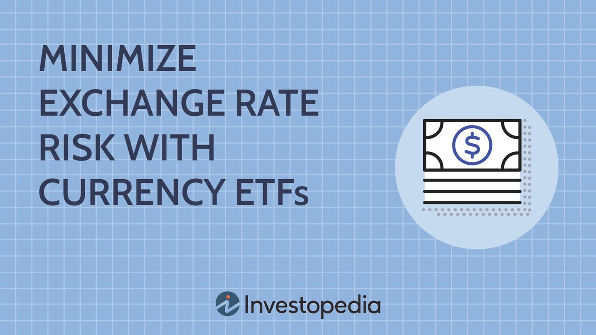

## Table of Contents

## What is a currency ETF?

A currency ETF, or Exchange Traded Fund, is a type of investment that focuses on currencies. It allows people to invest in different currencies without actually buying them directly. For example, if you think the Euro will get stronger compared to the US Dollar, you can buy a currency ETF that tracks the Euro. This way, you can potentially make money if the Euro goes up in value.

Currency ETFs are traded on stock exchanges, just like stocks. This means you can buy and sell them easily during the trading day. They are popular because they offer a simple way to invest in the foreign exchange market without needing to know a lot about trading currencies. However, like all investments, they come with risks, so it's important to do your research before investing.

## How do currency ETFs work?

Currency ETFs work by tracking the performance of a specific currency or a basket of currencies. When you buy shares in a currency ETF, you're essentially betting on how that currency will perform against others. For example, if you invest in a Euro ETF, your investment will go up if the Euro gets stronger compared to other currencies like the US Dollar. The ETF does this by holding assets that reflect the value of the currency it tracks, like holding Euros directly or using financial instruments that mimic the currency's movements.

These ETFs are traded on stock exchanges, which means you can buy and sell them throughout the trading day, just like stocks. This makes it easy to get in and out of your investment. The price of the [ETF](/wiki/etf-trading-strategies) will change based on the currency's value, so if the currency you're tracking goes up, the ETF's price will usually go up too. But remember, if the currency goes down, your investment could lose value. It's a way to invest in currencies without needing to trade them directly, but it still comes with risks, so it's smart to learn as much as you can before you start investing.

## What is exchange rate risk?

Exchange rate risk is the chance that the value of one currency will change compared to another. This can affect people and businesses that deal with different currencies. For example, if you're an American and you have money in Euros, and the Euro gets weaker compared to the US Dollar, your money will be worth less when you change it back to dollars.

This risk can impact investments, like when you buy a currency ETF. If the ETF tracks a currency that loses value against your home currency, your investment will go down. Companies that do business in different countries also face this risk. If they earn money in one currency but have to pay bills in another, a change in exchange rates can make their costs go up or their earnings go down. It's important for anyone dealing with different currencies to understand and manage this risk.

## Why might someone want to hedge against exchange rate risk?

Someone might want to hedge against exchange rate risk to protect their money or business. If you have money in a different currency or if your company does business in other countries, changes in exchange rates can make your money worth less or increase your costs. By hedging, you can use financial tools to reduce the risk that these changes will hurt you. It's like buying insurance for your money, so you can feel safer about dealing with different currencies.

Hedging can be really helpful for businesses that need to plan their budgets and manage their costs. If a company knows it will have to pay for something in another currency in the future, it can use hedging to lock in the current exchange rate. This way, even if the exchange rate changes later, the company's costs won't go up unexpectedly. For individuals, hedging can help protect savings or investments from losing value because of exchange rate changes.

## How can currency ETFs be used as a hedge against exchange rate risk?

Currency ETFs can be used as a hedge against exchange rate risk by allowing people and businesses to protect their money from changes in currency values. If you have money in a different currency, you can buy a currency ETF that tracks that currency. This way, if the currency loses value, the ETF can help make up for the loss. For example, if you're an American with money in Euros and the Euro gets weaker compared to the US Dollar, you can buy a Euro ETF. If the Euro goes down, the ETF might go up, helping to balance out your losses.

Companies that do business in different countries can also use currency ETFs to manage their costs. If a company knows it will have to pay for something in another currency in the future, it can buy a currency ETF to lock in the current exchange rate. This helps the company plan its budget better because it knows what its costs will be, even if the exchange rate changes later. Using currency ETFs as a hedge can give both individuals and businesses more control over their money and help them feel safer about dealing with different currencies.

## What are the benefits of using currency ETFs for hedging?

Using currency ETFs for hedging can help protect your money from changes in exchange rates. If you have money in a different currency, a currency ETF can help balance out any losses if that currency gets weaker. For example, if you're an American with Euros and the Euro loses value compared to the US Dollar, buying a Euro ETF can help you make up for the loss. This way, you can feel safer about keeping money in different currencies without worrying too much about exchange rate changes.

Currency ETFs are also easy to use for hedging because they are traded on stock exchanges, just like stocks. You can buy and sell them easily during the trading day, which gives you more control over your investments. This is especially helpful for businesses that need to plan their budgets and manage costs. If a company knows it will have to pay for something in another currency in the future, it can use a currency ETF to lock in the current exchange rate. This helps the company avoid unexpected costs if the exchange rate changes later.

## What are the potential risks and drawbacks of using currency ETFs for hedging?

Using currency ETFs for hedging can be risky because the value of the ETF can go up and down a lot. If the currency you're trying to hedge against gets weaker, the ETF might not go up enough to cover your losses. This means you could still lose money even if you're trying to protect yourself. Also, currency ETFs can be affected by things like interest rates, political events, and economic news, which can make them hard to predict. If these factors change suddenly, your ETF could lose value quickly, making your hedge less effective.

Another drawback is that currency ETFs can have extra costs. You might have to pay fees to buy and sell the ETFs, and there could be management fees that reduce your returns over time. These costs can add up, making it more expensive to use ETFs for hedging. Plus, if you're not careful, you might end up with too much money in one currency, which could be risky if that currency's value drops a lot. So, while currency ETFs can be a good way to hedge against exchange rate risk, it's important to understand these potential downsides and manage them carefully.

## Can you provide examples of popular currency ETFs used for hedging?

One popular currency ETF for hedging is the Invesco DB US Dollar Index Bullish Fund (UUP). This ETF tracks the US Dollar against a basket of other major currencies like the Euro, Japanese Yen, and British Pound. If you're worried about the US Dollar getting weaker, you can buy shares in UUP to help protect your money. It's easy to buy and sell on the stock exchange, so you can quickly adjust your hedge if needed.

Another commonly used ETF is the Invesco CurrencyShares Euro Currency Trust (FXE). This ETF follows the value of the Euro. If you have money in Euros and want to hedge against the Euro losing value compared to the US Dollar, you can invest in FXE. Like UUP, it's traded on the stock exchange, making it simple to use for hedging purposes. Both of these ETFs can help you manage the risk of changing exchange rates, but remember that they come with their own costs and risks.

## How do the fees and expenses of currency ETFs impact their effectiveness as a hedge?

Fees and expenses can make currency ETFs less effective as a hedge. When you buy a currency ETF, you might have to pay a fee each time you buy or sell shares. There are also management fees that the ETF charges to cover the costs of running the fund. These fees can add up over time and eat into your returns. If the fees are high, they might take away a big part of any gains you make from the ETF, making it harder for the ETF to fully protect you from exchange rate changes.

Even though currency ETFs can help you hedge against exchange rate risk, the costs can make them less useful. If the currency you're trying to hedge against goes down a lot, but the fees are high, the ETF might not be able to cover all your losses. It's important to look at the fees and think about how they might affect your overall investment. Choosing ETFs with lower fees can help make your hedge more effective and keep more of your money safe from exchange rate changes.

## What are the tax implications of investing in currency ETFs for hedging purposes?

When you invest in currency ETFs for hedging, you need to think about taxes. If you make money from the ETF, you might have to pay taxes on those gains. The tax you pay depends on how long you hold the ETF. If you hold it for less than a year, you'll pay short-term capital gains tax, which is usually higher. If you hold it for more than a year, you'll pay long-term capital gains tax, which is often lower. This can affect how much money you keep after hedging.

Also, some currency ETFs might give you dividends, which are like extra payments from the ETF. These dividends can be taxed too, usually at your regular income tax rate. So, when you're using currency ETFs to hedge against exchange rate risk, it's important to think about these taxes. They can take away some of the money you're trying to protect, so it's good to talk to a tax expert to understand how it all works for you.

## How should an investor evaluate the performance of a currency ETF used for hedging?

When an investor wants to see how well a currency ETF is working as a hedge, they should look at how the ETF's value has changed over time compared to the currency they are trying to protect against. For example, if you're using a Euro ETF to hedge against the Euro getting weaker compared to the US Dollar, you should check if the ETF's value went up when the Euro went down. This would show that the ETF helped balance out your losses. It's also important to consider the fees and costs of the ETF, as these can eat into your returns and make the hedge less effective.

Another thing to look at is how the ETF performs during big changes in the currency market. If the ETF can keep your money safe during times when the currency you're hedging against moves a lot, it's a good sign that it's working well. You can also compare the ETF's performance to other ways of hedging, like using options or futures, to see if it's the best choice for you. Remember, the goal of hedging is to protect your money, so the ETF should help reduce the risk from exchange rate changes, even if it doesn't make you a lot of money.

## What advanced strategies can be employed with currency ETFs to optimize hedging against exchange rate risk?

One advanced strategy for optimizing hedging with currency ETFs is to use a combination of ETFs that track different currencies. Instead of just buying one ETF, you could buy several ETFs that follow different currencies. This way, if one currency loses value, the others might help balance out the loss. For example, if you're worried about the Euro getting weaker, you could buy a Euro ETF and also buy ETFs that track the US Dollar and the Japanese Yen. This mix can help spread out your risk and make your hedge more effective.

Another strategy is to use currency ETFs along with other financial tools like options or futures. Options give you the right to buy or sell a currency at a certain price in the future, which can help lock in exchange rates. Futures are similar but they require you to buy or sell at the agreed price. By combining currency ETFs with options or futures, you can create a more complete hedge that protects you from big changes in exchange rates. This approach can be more complex, but it can also be more effective in managing exchange rate risk.

Lastly, you can use a strategy called dynamic hedging, where you adjust your ETF holdings based on how the currency markets are moving. If you see that a currency is starting to lose value, you can buy more of the ETF that tracks that currency to increase your hedge. On the other hand, if the currency starts to gain value, you might sell some of the ETF to reduce your exposure. This active management can help you respond quickly to market changes and keep your hedge working well.

## What are Hedging Strategies Using Currency ETFs?

Currency ETFs offer investors a valuable tool to hedge against potential losses stemming from adverse currency movements. Employing these ETFs in hedging strategies can help mitigate the impact of exchange rate fluctuations on investment portfolios. Various strategies are available to investors seeking to use currency ETFs as a protective measure.

One common hedging strategy involves short selling currency ETFs. Short selling entails borrowing a currency ETF and selling it with the expectation that its value will decline. If the currency associated with the ETF does depreciate, investors can repurchase the ETF at a lower price, return it to the lender, and profit from the difference. This approach effectively serves as a hedge against a long position in the underlying currency because any losses incurred in the event of a currency depreciation are offset by gains from the short selling of the ETF.

Combination trades provide another hedging strategy using currency ETFs. These trades involve simultaneously holding long and short positions in different currency ETFs to cushion the impact of [volatility](/wiki/volatility-trading-strategies). For instance, an investor might hold long positions in ETFs pegged to stable currencies while shorting ETFs associated with currencies expected to weaken. This approach balances potential losses and gains, providing a buffer against unpredictable currency shifts.

Mathematically, the effectiveness of these hedging strategies can be assessed using the hedge ratio, which is computed as:

$$
\text{Hedge Ratio} = \frac{\text{Value of Position Hedged}}{\text{Value of Hedging Instrument}}
$$

This ratio helps determine the proportion of the investment that needs to be hedged to achieve a desired level of risk mitigation.

Incorporating [algorithmic trading](/wiki/algorithmic-trading) can further enhance these hedging strategies. By utilizing algorithms to automate trades, investors can quickly respond to market changes and execute hedges precisely when needed. Algorithms can be programmed to analyze real-time data, assess market conditions, and implement trades that align with predetermined risk management criteria. 

Implementing these strategies requires a comprehensive understanding of market dynamics and careful monitoring of currency trends. Yet, when effectively employed, currency ETFs serve as a powerful tool to safeguard investments against the uncertainties of foreign exchange markets, enabling investors to maintain greater stability in their portfolio returns.

## References & Further Reading

[1]: Ben-David, I., Franzoni, F., & Moussawi, R. (2012). ["Hedge Fund Stock Trading in the Financial Crisis of 2007–2009."](https://www.jstor.org/stable/26656025) The Review of Financial Studies, 25(1), 1-54.

[2]: Blackman, J., & Easton, L. (2012). ["Currency Risk Management and its Impact on Investment Returns."](https://psycnet.apa.org/record/2012-02254-004) CFA Institute Conference Proceedings Quarterly, 29(1), 1-21.

[3]: Johnson, R., & McMillan, D. (2005). ["Effective Currency Hedging Strategies Using Exchange Traded Funds."](https://www.researchgate.net/publication/5124980_Exchange_Rate_Risk_Measurement_and_Management_Issues_and_Approaches_for_Firms) Journal of Asset Management, 6(4), 274-289.

[4]: Lopez de Prado, M. (2018). ["Advances in Financial Machine Learning."](https://www.amazon.com/Advances-Financial-Machine-Learning-Marcos/dp/1119482089) Wiley.

[5]: Narang, R. (2009). ["Inside the Black Box: The Simple Truth About Quantitative Trading."](https://onlinelibrary.wiley.com/doi/book/10.1002/9781118267738) Wiley.

[6]: Pojarliev, M., & Levich, R. (2011). ["A New Look at Currency Investing."](https://rpc.cfainstitute.org/sites/default/files/-/media/documents/book/rf-publication/2012/rf-v2012-n4-1-pdf.pdf) Financial Analysts Journal, 67(2), 58-72.