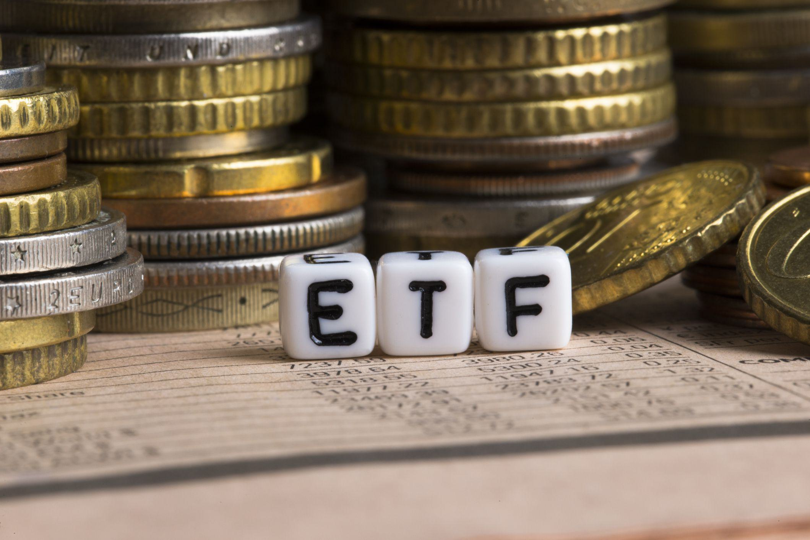

## Table of Contents

## What is a currency ETF?

A currency ETF, or Exchange-Traded Fund, is a type of investment fund that tracks the performance of a specific currency or a basket of currencies. It allows investors to buy and sell shares of the fund on a stock exchange, just like they would with stocks. This makes it easier for people to invest in foreign currencies without having to directly buy and hold the currencies themselves.

Currency ETFs can be used to hedge against currency risk or to speculate on the movements of currency exchange rates. For example, if an investor believes that the U.S. dollar will strengthen against the euro, they might buy shares in a currency ETF that tracks the U.S. dollar. By doing so, they can potentially profit from the rise in the dollar's value relative to the euro. These ETFs provide a convenient way for investors to gain exposure to currency markets without the need for a specialized forex trading account.

## How do currency ETFs work?

Currency ETFs work by tracking the performance of a specific currency or a group of currencies. When you buy shares in a currency ETF, you're essentially investing in that currency without actually owning it. The ETF holds the currency or currencies it tracks, and its value goes up or down based on how those currencies perform in the market. For example, if the ETF tracks the euro and the euro gets stronger compared to the U.S. dollar, the value of the ETF will go up.

These ETFs are traded on stock exchanges, just like regular stocks. This means you can buy and sell shares of the ETF anytime during trading hours. The price of the ETF changes throughout the day, reflecting the real-time value of the currency it tracks. This makes currency ETFs a convenient way for people to invest in foreign currencies without needing to open a special forex trading account. They can be used to bet on currency movements or to protect against currency risks in other investments.

## What are the benefits of investing in currency ETFs?

Investing in currency ETFs can help you make money if you think one currency will become stronger or weaker compared to another. For example, if you believe the U.S. dollar will get stronger against the euro, you can buy a currency ETF that tracks the U.S. dollar. If the dollar does get stronger, the value of your ETF will go up, and you can sell your shares for a profit. This way, you don't need to actually buy and hold the currency yourself, which can be complicated and risky.

Another benefit is that currency ETFs can help you protect your other investments from currency risks. If you have investments in a foreign country, changes in currency values can affect how much money you make. By investing in a currency ETF that tracks that country's currency, you can balance out any losses if the currency weakens. Plus, trading currency ETFs is easy because they are bought and sold on stock exchanges, just like regular stocks, so you don't need special accounts or knowledge to get started.

## What are the risks associated with currency ETFs?

Investing in currency ETFs can be risky because currency values can change a lot and quickly. If you think a currency will get stronger but it gets weaker instead, you could lose money. This is called currency risk. Also, currency ETFs can be affected by things like interest rates, inflation, and big world events, which can be hard to predict and can make the value of the ETF go up and down a lot.

Another risk is that currency ETFs might not track the currency perfectly. This is called tracking error. If the ETF doesn't follow the currency's movements exactly, you might not make as much money as you hoped, or you could lose more than you expected. Plus, like any investment, currency ETFs have fees and costs. These can eat into your profits, so it's important to understand all the costs before you invest.

## How can currency ETFs be used for diversification?

Currency ETFs can help you spread out your investments by adding different currencies to your portfolio. If you only invest in one country's currency, you might be taking a big risk because that currency could lose value. But if you also invest in currency ETFs that track other currencies, you can balance out your risk. For example, if the U.S. dollar goes down, but you also have an ETF that tracks the euro, and the euro goes up, you might not lose as much money overall.

Adding currency ETFs to your investments can also help protect you from big changes in currency values. If you have investments in different countries, the value of those investments can change if the currencies change. By using currency ETFs, you can balance out these changes. For instance, if you have stocks in Europe and the euro starts to fall, you could invest in a U.S. dollar ETF to help offset any losses from the falling euro. This way, your overall investment portfolio can be more stable and less affected by currency swings.

## What are the different types of currency ETFs available?

There are different kinds of currency ETFs that you can invest in. One type is a single-currency ETF, which tracks the value of just one currency, like the U.S. dollar or the euro. These ETFs are good if you want to bet on how one currency will do compared to another. For example, if you think the Japanese yen will get stronger, you can buy an ETF that tracks the yen.

Another type is a basket currency ETF, which tracks a group of currencies instead of just one. This can help spread out your risk because it's not all tied to one currency. For example, an ETF might track a mix of the euro, the British pound, and the Swiss franc. This type of ETF can be good if you want to protect your investments from changes in any one currency.

There are also leveraged and inverse currency ETFs. Leveraged ETFs try to give you bigger gains (or losses) by using borrowed money to invest more in the currency. Inverse ETFs go in the opposite direction of the currency they track, so they can go up in value if the currency goes down. These types of ETFs can be riskier but can also offer bigger rewards if you guess right about how the currency will move.

## How do currency ETFs compare to other currency investment options?

Currency ETFs are different from other ways to invest in currencies, like forex trading or currency futures. With forex trading, you buy and sell currencies directly, which can be complicated and risky because you need a special account and a lot of knowledge. Currency ETFs are easier because you can buy and sell them on a stock exchange, just like stocks. This means you don't need a special account or deep understanding of forex markets. Also, ETFs can help you spread out your risk by tracking a single currency or a group of currencies, while forex trading usually focuses on one currency pair at a time.

Currency futures are another option, where you agree to buy or sell a currency at a set price in the future. Futures can be good for protecting against currency changes, but they are also complex and often require a lot of money to start. Currency ETFs are simpler and more accessible. They can be used to bet on currency movements or to protect other investments from currency risks, but they come with less hassle and lower entry costs than futures. However, ETFs might not give you the same level of direct control over your investments as futures or forex trading, and they can have fees that eat into your profits.

## What factors should be considered when choosing a currency ETF?

When picking a currency ETF, you need to think about what you want to achieve with your investment. If you're looking to bet on one specific currency getting stronger or weaker, you might want a single-currency ETF. But if you want to spread out your risk, a basket currency ETF that tracks several currencies could be a better choice. Also, consider how much risk you're willing to take. Leveraged and inverse ETFs can offer bigger rewards, but they're also riskier because they can lead to bigger losses if the currency doesn't move the way you expect.

Another thing to think about is the costs. Currency ETFs have fees, like management fees and trading costs, which can eat into your profits. Make sure you understand all the costs before you invest. Also, check how well the ETF tracks the currency it's supposed to follow. Some ETFs might not track the currency perfectly, which can affect your returns. Finally, consider how easy it is to buy and sell the ETF. Since they trade on stock exchanges, you want to pick one that has good trading volume so you can buy and sell shares easily when you need to.

## How do currency ETFs perform in different economic conditions?

Currency ETFs can do well or badly depending on what's happening in the economy. If a country's economy is doing great, its currency might get stronger, and a currency ETF that tracks that currency could go up in value. For example, if the U.S. economy is booming and the dollar gets stronger, a U.S. dollar ETF might do well. But if the economy is struggling, the currency might get weaker, and the ETF could lose value. Big events like changes in interest rates, inflation, or even political happenings can also make currencies and ETFs go up and down.

Different types of currency ETFs can react differently to economic conditions. A single-currency ETF might be more affected by what's happening in one country, while a basket currency ETF that tracks several currencies might be more stable because it's spread out. Leveraged and inverse ETFs can have bigger swings because they try to give you bigger gains or losses. So, if you think the economy will be good for a certain currency, a leveraged ETF might help you make more money, but it can also make you lose more if you're wrong. In tough economic times, these riskier ETFs can be more dangerous, but a basket ETF might help protect your money better.

## What are the tax implications of investing in currency ETFs?

When you invest in currency ETFs, you need to think about taxes. If you make money from your ETF by selling it for more than you paid, you'll have to pay capital gains tax. How much tax you pay depends on how long you held the ETF. If you held it for less than a year, it's a short-term capital gain, and you'll pay your regular income tax rate on it. If you held it for more than a year, it's a long-term capital gain, and the tax rate is usually lower.

Some currency ETFs also pay dividends, which are like little payments they give you from the money they make. These dividends can be taxed too. The tax rate on dividends can be different depending on whether they are qualified or non-qualified dividends. Qualified dividends are usually taxed at a lower rate, similar to long-term capital gains. It's a good idea to talk to a tax advisor to understand all the taxes you might have to pay on your currency ETF investments.

## How can one analyze the performance of a currency ETF?

To analyze the performance of a currency ETF, you can start by looking at its price history. This shows how the value of the ETF has changed over time. You can use charts and graphs to see if the ETF has been going up or down. It's also helpful to compare the ETF's performance to the currency it tracks. If the ETF is supposed to follow the euro, for example, you can see if it's doing a good job of matching the euro's movements. Another important thing to check is the ETF's tracking error, which shows how closely it follows the currency. A smaller tracking error means the ETF is doing a better job of tracking the currency.

You should also look at the ETF's returns over different time periods, like one year, three years, or five years. This can help you see how well the ETF has been doing over time. Don't forget to consider the fees and costs, because these can affect how much money you actually make from the ETF. Some websites and financial news sources provide detailed reports and ratings on ETFs, which can give you more information about how the ETF is performing compared to others. By looking at all these factors, you can get a good idea of how well a currency ETF is doing and whether it's a good investment for you.

## What advanced strategies can be employed using currency ETFs?

One advanced strategy you can use with currency ETFs is called currency hedging. This means you buy a currency ETF to protect your other investments from changes in currency values. For example, if you have stocks in Europe and you're worried about the euro getting weaker, you can buy a U.S. dollar ETF. If the euro does get weaker, the value of your U.S. dollar ETF might go up, which can help balance out any losses from your European stocks. This way, you're not just betting on one currency going up or down; you're using the ETF to make your whole investment portfolio more stable.

Another strategy is using leveraged and inverse currency ETFs to make bigger bets on currency movements. Leveraged ETFs try to give you bigger gains (or losses) by using borrowed money to invest more in the currency. If you think the U.S. dollar will get a lot stronger, a leveraged U.S. dollar ETF could help you make more money if you're right. Inverse ETFs go in the opposite direction of the currency they track, so they can go up in value if the currency goes down. These ETFs are riskier, but they can be good if you're sure about how a currency will move and want to make a big bet. Just remember, these strategies can lead to big losses if you guess wrong, so they're not for everyone.

## References & Further Reading

[1]: Peskin, M. (2017). ["Exchange-Traded Funds and the New Dynamics of Investing."](https://academic.oup.com/book/3366) CFA Institute Research Foundation.

[2]: Lopez de Prado, M. (2018). ["Advances in Financial Machine Learning."](https://www.amazon.com/Advances-Financial-Machine-Learning-Marcos/dp/1119482089) Wiley.

[3]: Chan, E. (2009). ["Quantitative Trading: How to Build Your Own Algorithmic Trading Business."](https://github.com/ftvision/quant_trading_echan_book) Wiley.

[4]: Aronson, D. R. (2006). ["Evidence-Based Technical Analysis: Applying the Scientific Method and Statistical Inference to Trading Signals."](https://www.amazon.com/Evidence-Based-Technical-Analysis-Scientific-Statistical/dp/0470008741) John Wiley & Sons.

[5]: Jansen, S. (2020). ["Machine Learning for Algorithmic Trading: Predictive Models to Extract Signals from Market and Alternative Data for Systematic Trading Strategies with Python."](https://www.amazon.com/Machine-Learning-Algorithmic-Trading-alternative/dp/1839217715) Packt Publishing.