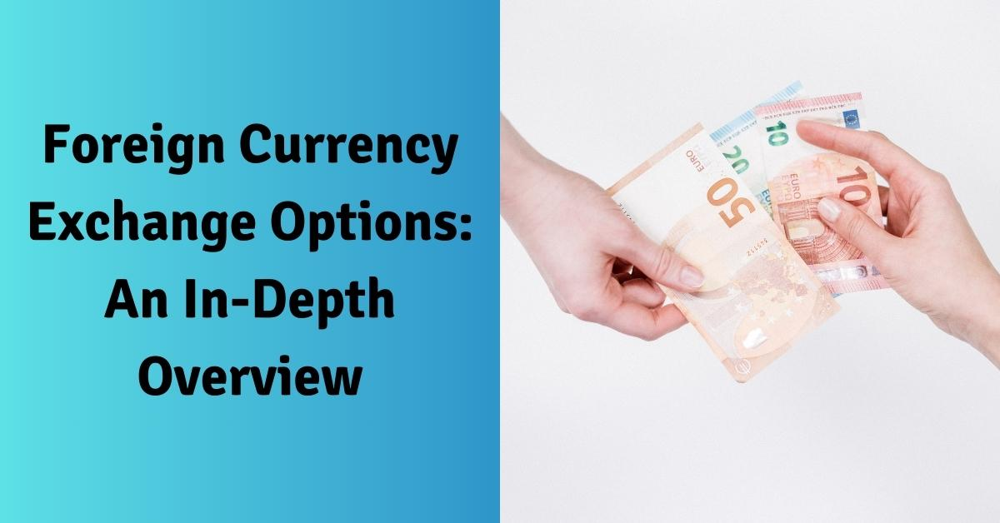

The foreign exchange market, commonly known as Forex or FX, is a formidable component of the global financial landscape. With a daily turnover surpassing $6 trillion, it stands as one of the most dynamic and largest financial markets globally. The market's volatility and volume underscore the significance of understanding key elements such as foreign exchange, currency conversion, and algorithmic trading for both individuals and businesses engaged in international transactions. 

The mechanics of currency exchange are foundational to numerous economic activities and influence international trade, investment, and travel. As such, grasping these concepts enables participants to effectively navigate the complexities of the currency market, which comprise fluctuating exchange rates driven by economic indicators, market speculation, and geopolitical events.



Algorithmic trading has emerged as a critical component of the forex market, offering substantial potential to enhance trading efficiency. By employing algorithms that utilize historical data and predictive analytics, traders can execute transactions automatically and with precision. This fusion of traditional currency exchange methods with cutting-edge trading innovations presents intriguing prospects for market participants, allowing for the optimization of trading strategies and potentially amplifying returns. 

The objective of this article is to elucidate these complexities, providing insights not only into the functional aspects of currency exchange but also into the increasingly significant role played by algorithmic trading. Understanding this duality is vital for anyone seeking to participate effectively in today's fast-evolving financial ecosystems. As technology continues to advance, the synergy of traditional and modern trading methodologies is likely to yield substantial economic benefits, necessitating that traders stay informed and adaptive to these continuous transformations.

## Table of Contents

## Understanding Foreign Exchange and Currency Conversion

The foreign exchange market, often referred to as forex or [FX](/wiki/fx-anomaly), is characterized by the trading of national currencies against each other at agreed-upon prices. This process, known as currency conversion, is vital for facilitating international trade and tourism. The core mechanism involves swapping one currency for another, enabling businesses and individuals to meet their financial obligations across borders.

At the heart of currency conversion lies the ever-changing value of a currency, which is influenced by a myriad of factors including economic indicators, interest rates, political stability, and global events. These elements contribute to the intrinsic demand and supply dynamics of different currencies, impacting their respective exchange rates.

Exchanges occur in multiple forms, both physically and digitally. Traditional physical exchanges often take place in banks and foreign exchange kiosks, where individuals can exchange their cash currencies. Conversely, digital platforms offer a more contemporary approach, allowing users to transact online, often with enhanced convenience and competitive rates. These platforms have revolutionized the market by providing real-time exchange rate information and fostering global connectivity.

A fundamental concept in understanding currency conversion costs is the bid-ask spread. The bid price represents the maximum amount a buyer is willing to pay for a currency, while the ask price is the minimum amount a seller is willing to accept. The spread, which is the difference between these two prices, essentially represents the transaction cost or the broker's compensation for facilitating the exchange. Mathematically, it can be expressed as:

$$
\text{Bid-Ask Spread} = \text{Ask Price} - \text{Bid Price}
$$

For market participants, the spread is a critical [factor](/wiki/factor-investing), as wider spreads can significantly increase the cost of conducting transactions. Conversely, narrower spreads are advantageous, reducing trading costs and enhancing profitability, especially for high-frequency traders and large-[volume](/wiki/volume-trading-strategy) transactions.

In conclusion, the mechanism of foreign exchange and currency conversion is pivotal for global economic interactions. A comprehensive understanding of currency values, the role of banks and digital platforms, and the implications of bid-ask spreads empower businesses and individuals to navigate the [forex](/wiki/forex-system) market effectively, capitalizing on opportunities and mitigating potential risks.

## Role of Currency Exchange in Global Finance

Currency exchanges are fundamental to international commerce and play a crucial role in maintaining financial stability across the globe. These exchanges enable the conversion of one currency into another, a process vital for facilitating global trade and investment. Whether an organization is importing goods, exporting services, or investing in foreign markets, currency exchange provides the essential mechanism for such activities.

There are various forms of currency exchanges, each offering distinct services and operating with different fee structures. Physical currency exchanges, like those found in banks or airports, allow individuals to exchange money on-site, providing immediate currency conversion. These services are invaluable for travelers needing foreign currency for expenses abroad. However, they often come with higher fees due to the convenience and immediacy provided.

On the other hand, digital platforms have revolutionized how currency exchanges occur, offering lower fees and more competitive rates due to lower overhead costs. Online platforms cater to a broader audience, including both individual consumers and large corporations, providing a versatile solution for currency conversion needs. They often feature real-time exchange rate monitoring and automated trading capabilities, which can be beneficial for businesses engaged in continuous international transactions.

Each exchange method's fee structure impacts the total cost of currency conversion. Physical exchanges may include service charges and unfavorable rates compared to the mid-market rate, known as the interbank rate. In contrast, online platforms often boast reduced service fees and more favorable rate margins. Understanding these differences is essential for businesses and individuals aiming to optimize the costs associated with currency exchange.

Efficiency in currency exchange is critical, especially for businesses operating on an international scale. Companies must manage currency risks and conversion costs effectively to maintain profitability. This requires not only selecting the right exchanges but also timing transactions to capitalize on favorable exchange rates. For individuals, efficient currency exchange can significantly impact travel budgets, affecting everything from accommodation costs to dining expenses.

Overall, the role of currency exchange in global finance is indispensable, as it underpins the ability of economies to engage in international trade and investment. With evolving financial technologies and platforms, the methods by which currency exchanges are conducted continue to advance, offering more efficient, transparent, and cost-effective solutions for global financial participants.

## Algorithmic Trading in Currency Markets

Algorithmic trading has established itself as a fundamental component of the foreign exchange market, facilitating the automation of transaction executions. This approach leverages sophisticated mathematical models and computational algorithms to make precise and rapid trading decisions, minimizing human intervention and the potential for emotional bias in trading activities. At its core, [algorithmic trading](/wiki/algorithmic-trading) in currency markets uses historical data and predictive analytics to evaluate potential market movements and execute trades based on predetermined criteria.

Algorithms work by analyzing vast datasets and identifying patterns or trends that may not be immediately visible to human traders. One common method involves using statistical models to forecast price movements based on historical patterns. These models may incorporate various factors, such as economic indicators, interest rates, and geopolitical events, to predict future currency values. 

For example, a simple moving average (SMA) algorithm might track the average price of a currency pair over a specified number of time periods. By comparing the short-term average to a longer-term average, traders can potentially identify bullish or bearish trends. The algorithm would automatically execute buy or sell orders when certain thresholds are crossed. A basic Python implementation of a moving average crossover strategy might look like this:

```python
def moving_average(data, window_size):
    return data.rolling(window=window_size).mean()

# Example usage
prices = pd.Series([1.15, 1.16, 1.15, 1.17, 1.18, 1.19])
short_window = 3
long_window = 5

short_ma = moving_average(prices, short_window)
long_ma = moving_average(prices, long_window)

# Execute trade when short-term moving average crosses long-term moving average
if (short_ma.iloc[-1] > long_ma.iloc[-1]) and (short_ma.iloc[-2] <= long_ma.iloc[-2]):
    print("Execute Buy Order")
elif (short_ma.iloc[-1] < long_ma.iloc[-1]) and (short_ma.iloc[-2] >= long_ma.iloc[-2]):
    print("Execute Sell Order")
```

The benefits of algorithmic trading are substantial. It enhances transaction speed, often enabling trades to be executed in milliseconds, which is vital in the fast-paced forex market. This rapid execution helps capitalize on fleeting opportunities that might be missed by manual trading. Moreover, automation can lead to improved trade accuracy by consistently applying the same conditions without deviation.

However, algorithmic trading is not without its challenges. A significant risk is the over-reliance on automation. Algorithms are designed based on historical data, which may not always predict future market conditions, especially under unprecedented circumstances or during high [volatility](/wiki/volatility-trading-strategies). As such, market anomalies can result in significant losses if algorithms do not adapt quickly. 

Future trends suggest an increasing integration of [artificial intelligence](/wiki/ai-artificial-intelligence) (AI) and [machine learning](/wiki/machine-learning) into trading strategies. AI can enhance the decision-making process by learning from new data patterns and adjusting strategies in real-time. This adaptability can improve the robustness of trading models, making them more versatile in handling unexpected market shifts.

Algorithmic trading is poised to continue evolving, driven by technological advancements and greater access to high-quality data. As AI and machine learning become more embedded in these systems, they promise to further refine the efficiency and effectiveness of automated trading in currency markets.

## Advantages and Challenges of Algo Trading

Algorithmic trading, or algo trading, involves using computer programs to execute trades automatically based on predefined criteria. This modern approach to trading presents several advantages. Firstly, the efficiency of algo trading is notable; it allows for rapid execution of trades, often within milliseconds, reducing the impact of price fluctuations. This speed is not only advantageous for capturing beneficial price points but also for reducing execution costs compared to manual trading processes.

Another significant advantage of algo trading is its ability to mitigate human emotional bias. Traders, regardless of their experience, can be influenced by emotions such as fear and greed, which can lead to suboptimal trading decisions. Algorithmic systems, however, execute trades based on logic and data analysis, thereby promoting a systematic approach that is less prone to impulsive decisions.

Despite these advantages, algo trading is not without challenges. One of the primary obstacles is the technical complexity involved in developing and maintaining robust trading algorithms. Programmers must ensure their algorithms are accurate, efficient, and adaptable to changing market conditions. Continuous updates are often required to optimize performance and maintain competitiveness.

Additionally, the volatile nature of financial markets poses another challenge for algorithmic trading. Sudden market movements can affect algorithm performance, potentially leading to substantial losses if the algorithms are not equipped with effective risk management strategies. This necessitates the incorporation of safeguards and adaptive mechanisms within algorithms to handle unexpected market conditions.

Regulatory issues also pose a challenge. The increasing reliance on algorithmic trading has prompted greater scrutiny from regulatory bodies concerned with market stability and fairness. Ensuring compliance with these regulations can be complex and requires ongoing attention to transparency, particularly regarding the algorithms' decision-making processes and their impact on market dynamics.

In conclusion, while the efficiencies and advantages of algorithmic trading are considerable, the associated challenges require careful management. Successful participation in algo trading demands a combination of technical expertise, risk management, and compliance with regulatory standards.

## Conclusion

Understanding currency exchange and algorithmic trading is crucial for effectively participating in the modern global market. The continuous advancements in technology have opened new avenues for traders, creating opportunities to refine and enhance their trading strategies. For instance, algorithmic trading leverages sophisticated algorithms and historical data analytics to execute trades with greater efficiency and precision. This technological evolution offers substantial economic benefits, such as reduced transaction costs and improved trading consistency.

However, the intersection of technology and trading is not without its challenges. As technology becomes increasingly integrated into trading practices, traders must remain vigilant and adaptable. Continuous learning and adaptation are necessary to navigate the complexities introduced by new technologies. Embracing these advancements can lead to informed financial decision-making and potentially greater economic rewards.

Looking ahead, there is an anticipated growing reliance on technology within the trading landscape. Innovations such as artificial intelligence and machine learning are expected to further transform trading strategies, offering intriguing potential for market participants. By staying informed and embracing these technological advancements, both individual and institutional traders can position themselves advantageously within the global market, capitalizing on the emergent trends and opportunities. These developments suggest a bright future for those willing to engage with and harness the capabilities of modern trading technologies.

## References & Further Reading

[1]: Bergstra, J., Bardenet, R., Bengio, Y., & Kégl, B. (2011). ["Algorithms for Hyper-Parameter Optimization."](https://dl.acm.org/doi/10.5555/2986459.2986743) Advances in Neural Information Processing Systems 24.

[2]: ["Advances in Financial Machine Learning"](https://www.amazon.com/Advances-Financial-Machine-Learning-Marcos/dp/1119482089) by Marcos Lopez de Prado

[3]: ["Evidence-Based Technical Analysis: Applying the Scientific Method and Statistical Inference to Trading Signals"](https://www.amazon.com/Evidence-Based-Technical-Analysis-Scientific-Statistical/dp/0470008741) by David Aronson

[4]: ["Machine Learning for Algorithmic Trading"](https://github.com/stefan-jansen/machine-learning-for-trading) by Stefan Jansen

[5]: ["Quantitative Trading: How to Build Your Own Algorithmic Trading Business"](https://www.amazon.com/Quantitative-Trading-Build-Algorithmic-Business/dp/1119800064) by Ernest P. Chan