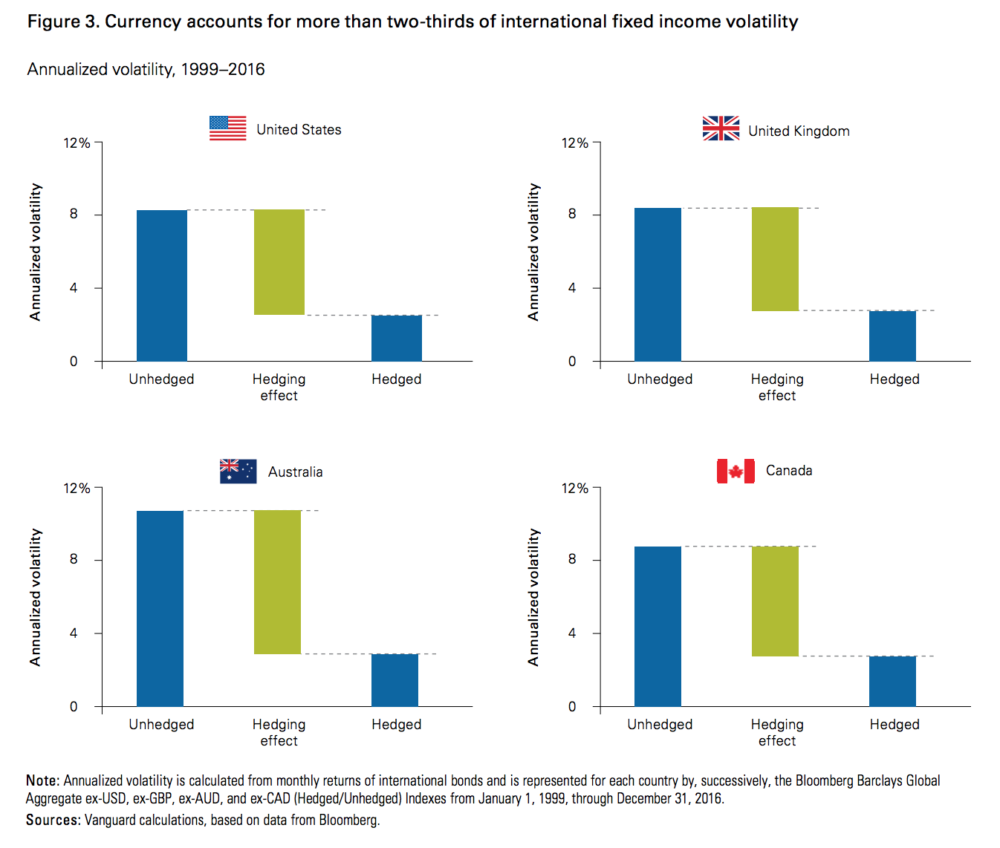

## Table of Contents

## What is currency exposure in investment portfolios?

Currency exposure in investment portfolios refers to the risk that comes from changes in currency exchange rates. When you invest in assets that are in a different currency than your own, the value of your investment can go up or down based on how the currencies change in value compared to each other. For example, if you live in the United States and invest in a company in Japan, the value of your investment will be affected not just by how the company does, but also by how the Japanese yen changes in value compared to the US dollar.

Managing currency exposure is important for investors because it can have a big impact on the overall performance of their portfolio. Some investors choose to hedge their currency exposure, which means they use financial instruments to protect against changes in exchange rates. Others might decide to take on more currency risk if they believe that the currency will move in their favor. Understanding and managing currency exposure can help investors make better decisions and potentially improve their investment returns.

## Why is managing currency exposure important for investors?

Managing currency exposure is important for investors because it can affect how much money they make or lose. When you invest in something from another country, the value of that investment can change because of the currency exchange rates. If the currency of the country you invested in goes down compared to your own currency, you might lose money even if the investment itself is doing well. On the other hand, if the currency goes up, you could make more money than you expected.

To handle this, investors need to think about how currency changes might affect their investments. They can choose to use special financial tools called hedges to protect themselves from big changes in currency values. Or, they might decide to take the risk if they think the currency will move in their favor. By managing currency exposure well, investors can make smarter choices and possibly earn more from their investments.

## What are the basic types of currency exposure?

There are three main types of currency exposure that investors need to know about: transaction exposure, translation exposure, and economic exposure. Transaction exposure happens when you buy or sell something in a different currency. For example, if you buy a stock in euros and you have to pay for it in dollars, changes in the exchange rate between the time you agree to buy and the time you actually pay can affect how much you end up paying.

Translation exposure is about how the value of a company's foreign assets and liabilities changes when you convert them into your home currency. This is important for companies that have operations in different countries. If a company in the U.S. has a factory in Europe, the value of that factory in dollars can go up or down depending on the exchange rate between the dollar and the euro.

Economic exposure is a bit more complicated. It's about how changes in currency values can affect a company's overall business and profits. For example, if a U.S. company sells products in Japan, a stronger yen could mean that Japanese customers have to pay more for those products, which might make them buy less. This can hurt the company's sales and profits, even if the exchange rate changes don't directly affect the company's financial statements.

## How can currency fluctuations impact investment returns?

Currency fluctuations can have a big effect on investment returns. When you invest in something from another country, the value of your investment can change because of the exchange rate between your currency and the foreign currency. If the foreign currency gets stronger compared to your currency, your investment might be worth more when you convert it back. But if the foreign currency gets weaker, you might lose money even if the investment itself does well. This means that even if you pick a great company to invest in, changes in currency values can still make your investment go up or down.

For example, let's say you live in the U.S. and you buy stock in a company in Japan. If the Japanese yen gets stronger against the U.S. dollar, the value of your stock in dollars will go up, even if the stock price in yen stays the same. But if the yen gets weaker, the value of your stock in dollars will go down. This is why investors need to think about currency changes when they make investment decisions. They might use special tools called hedges to protect against big changes in currency values, or they might decide to take the risk if they think the currency will move in their favor.

## What are common strategies for managing currency exposure?

One common way to manage currency exposure is by using a strategy called hedging. Hedging means using financial tools to protect against big changes in currency values. For example, if you invest in a stock in Europe and you want to protect against the euro getting weaker, you might use a financial contract called a forward or a futures contract. These contracts let you lock in the exchange rate for a future date, so you know exactly how much your investment will be worth in your own currency, no matter what happens to the exchange rate.

Another strategy is called currency diversification. This means spreading your investments across different currencies to reduce the risk of any one currency going down a lot. If you invest in stocks, bonds, or other assets in several different countries, changes in any one currency might not affect your overall portfolio as much. This can help smooth out the ups and downs that come from currency changes.

Some investors might also choose to do nothing about currency exposure, which is called an unhedged approach. They might believe that over time, currency changes will even out, or they might think that a certain currency will get stronger and help their investments. This approach can be riskier, but it might also lead to higher returns if their predictions about currency movements are right.

## What is hedging and how can it be used to manage currency risk?

Hedging is a way to protect your investments from big changes in currency values. When you hedge, you use special financial tools to lock in the exchange rate for a future date. This means you can know exactly how much your investment will be worth in your own currency, no matter what happens to the exchange rate. For example, if you live in the U.S. and you invest in a stock in Europe, you might use a forward or a futures contract to hedge. These contracts let you set the exchange rate between the euro and the dollar ahead of time, so even if the euro gets weaker, your investment's value in dollars stays the same.

Hedging can be really helpful for managing currency risk because it takes away some of the uncertainty about how currency changes might affect your investments. By using hedging, you can focus more on the performance of the investment itself, without worrying as much about currency ups and downs. However, hedging isn't perfect. It can cost money to set up these financial tools, and sometimes the cost of hedging might be more than the benefits if the currency doesn't change as much as expected. But for many investors, the peace of mind that comes from knowing their investments are protected from big currency swings makes hedging a valuable strategy.

## How do investors use currency forwards and futures for exposure management?

Investors use currency forwards and futures to manage their currency exposure by locking in exchange rates for future transactions. A currency forward is a custom agreement between two parties to exchange a specific amount of one currency for another at a set rate on a future date. For example, if an investor in the U.S. has bought a stock in Europe, they might use a forward contract to fix the exchange rate between the euro and the dollar. This means they know exactly how many dollars they will get for their euros at a future date, protecting them from any big changes in the exchange rate.

Currency futures are similar to forwards but are standardized contracts traded on an exchange. They also allow investors to set an exchange rate for a future date, but because they are traded on an exchange, they can be more easily bought and sold. For instance, if an investor wants to hedge against the risk of the Japanese yen weakening against the U.S. dollar, they can buy a futures contract that locks in the current exchange rate. This way, even if the yen loses value, the investor's return in dollars will be protected. Both forwards and futures help investors manage the risk of currency fluctuations, but they come with costs and need to be used carefully to be effective.

## What role do currency options play in managing currency exposure?

Currency options give investors a way to manage currency exposure without locking them into a fixed exchange rate like forwards and futures do. An option is like a choice: it lets you buy or sell a certain amount of one currency for another at a set rate, but you don't have to do it if you don't want to. This means if the exchange rate moves in your favor, you can choose not to use the option and just go with the better rate. But if the rate goes against you, you can use the option to protect your investment from losing too much value.

For example, if you're a U.S. investor with stocks in Europe, you might buy a currency option that lets you sell euros for dollars at a fixed rate. If the euro weakens against the dollar, you can use the option to get a better rate than what's available in the market. But if the euro stays strong or gets even stronger, you can ignore the option and just exchange your euros at the better market rate. This flexibility makes currency options a useful tool for managing currency risk, even though they come with a cost that you have to pay upfront when you buy the option.

## How can investors assess their currency risk using value at risk (VaR) models?

Investors can use [value at risk](/wiki/var-value-at-risk) (VaR) models to figure out how much they might lose from changes in currency values. VaR is a way to measure risk by looking at how much an investment might go down over a certain time, like a day or a month, with a certain level of confidence, usually 95% or 99%. For example, if an investor has a portfolio with stocks in different countries, they can use a VaR model to see how much the portfolio's value might drop because of currency changes. This helps them understand the worst-case scenario and plan how to protect their investments.

To use VaR for assessing currency risk, investors need to gather data on how the currencies in their portfolio have moved in the past. They then use this data to run simulations and see how much their portfolio could lose in the future. By looking at these simulations, investors can get a better idea of the risks they are facing and decide if they need to use tools like hedging to reduce those risks. VaR isn't perfect because it can't predict the future, but it gives investors a useful way to think about and manage their currency exposure.

## What are the advanced techniques for dynamic currency hedging?

Dynamic currency hedging is a way to manage currency risk that changes over time based on what's happening in the market. Instead of always using the same amount of hedging, like 50% or 100%, investors can adjust how much they hedge depending on how they think currency values will change. They might use special computer programs and math formulas to figure out the best time to hedge more or less. This can help them get a better balance between protecting their investments and still being able to make money if the currency moves in their favor.

One way to do dynamic hedging is by using something called a "rolling hedge." This means that instead of setting a hedge for a long time, like a year, investors might set it for a shorter time, like a month, and then change it as needed. They look at things like how much the currency has been moving around lately and what they think might happen next. Another way is to use "option-based strategies," where investors buy options that let them choose whether to use the hedge or not. This gives them more flexibility to make the most of good currency changes while still protecting against the bad ones.

## How does currency exposure management differ for institutional versus retail investors?

Institutional investors, like big banks or pension funds, have a lot more money to invest than regular people. Because they have so much money, they can use fancy tools and strategies to manage their currency exposure. They might use things like currency forwards, futures, and options to hedge their investments. They also have teams of experts who can watch the markets all the time and make quick changes to their hedging strategies. This means they can be more flexible and adjust their currency exposure based on what's happening in the world.

Retail investors, on the other hand, are just regular people who invest their own money. They usually don't have as much money to spend on managing currency exposure, so they might not use the same fancy tools that big investors do. Instead, they might choose to invest in funds that already handle currency risk for them, like international mutual funds or ETFs that offer currency hedging. Or, they might decide not to hedge at all and just accept the risk of currency changes. Retail investors often have to rely on simpler strategies and might not be able to adjust their investments as quickly as institutional investors.

## What are the latest trends and innovations in currency exposure management for investment portfolios?

The latest trends in managing currency exposure for investment portfolios are all about using new technology and smarter ways to handle risk. One big trend is using [artificial intelligence](/wiki/ai-artificial-intelligence) (AI) and [machine learning](/wiki/machine-learning) to predict how currencies might change in the future. These tools can look at a lot of data really quickly and find patterns that people might miss. This helps investors make better decisions about when to hedge and how much to hedge. Another trend is using something called "[algorithmic trading](/wiki/algorithmic-trading)" to automatically adjust hedging strategies based on what's happening in the market right away. This can make managing currency exposure a lot more flexible and responsive.

Another innovation is the use of "multi-asset hedging strategies." Instead of just focusing on currencies, these strategies look at how different types of investments, like stocks, bonds, and commodities, are affected by currency changes. By considering all these things together, investors can get a better overall picture of their risk and make more balanced decisions. Also, more investors are using "environmental, social, and governance ([ESG](/wiki/esg-investing)) factors" when managing currency exposure. They want to make sure their investments are not only safe from currency changes but also good for the world. This means they might choose to invest in companies or countries that have strong ESG practices, even if it means taking on a bit more currency risk.

## What is the impact of currency exposure?

Global currency fluctuations have a profound impact on investment values, making currency exposure a critical [factor](/wiki/factor-investing) in portfolio management. Currency exposure arises when investments are held in foreign currencies, leading to an inherent risk associated with exchange rate movements. These fluctuations can lead to unpredictable changes in the value of assets, influencing both their returns and the operational performance of companies with international activities.

The impact of exchange rate movements can be substantial. For instance, if an investor holds assets in a foreign currency and that currency depreciates relative to the investor's home currency, the investment's value decreases when converted back, even if the asset's local price remains unchanged. Conversely, appreciation of the foreign currency can enhance returns.

Mathematically, the return on an investment with currency exposure can be expressed as:

$$
R_{\text{total}} = R_{\text{local}} + R_{\text{[forex](/wiki/forex-system)}}
$$

where $R_{\text{total}}$ denotes the total return, $R_{\text{local}}$ is the return from asset price changes in local currency, and $R_{\text{forex}}$ represents the return due to foreign exchange movements.

Additionally, exchange rate [volatility](/wiki/volatility-trading-strategies) affects companies engaged in international trade. For a company exporting goods, a stronger domestic currency may reduce competitiveness abroad, impacting revenue and profit margins, while a weaker currency can boost exports by making them cheaper in foreign markets. This exchange rate dependency emphasizes the importance for investors to actively manage currency risks to protect their portfolios.

Investors commonly utilize hedging strategies, such as currency futures, options, and swaps, to mitigate these risks. These instruments provide a way to lock in exchange rates or offset potential losses arising from unforeseen currency fluctuations.

In summary, understanding and managing currency exposure is paramount for investors aiming to safeguard their investments amidst global currency volatility. Employing effective strategies to handle this exposure ensures that investors maintain both asset value and portfolio performance in a dynamic international economic landscape.

## References & Further Reading

[1]: ["Algorithmic Trading and DMA: An Introduction to Direct Access Trading Strategies"](https://www.amazon.com/Algorithmic-Trading-DMA-introduction-strategies/dp/0956399207) by Barry Johnson

[2]: ["Algorithmic Trading: Winning Strategies and Their Rationale"](https://www.wiley.com/en-us/Algorithmic+Trading%3A+Winning+Strategies+and+Their+Rationale-p-9781118746912) by Ernie Chan

[3]: ["Managing Currency Risk: Using Financial Derivatives"](https://www.wiley.com/en-us/Managing+Currency+Risk%3A+Using+Financial+Derivatives-p-9780470848081) by David F. DeRosa

[4]: ["Currencies After the Crash: The Uncertain Future of the Global Paper-Based Currency System"](https://www.amazon.com/Currencies-After-Crash-Uncertain-Paper-Based/dp/0071784888) edited by Sara Eisen

[5]: Bartram, S. M., & Bodnar, G. M. (2007). ["The Exchange Rate Exposure Puzzle."](https://www.emerald.com/insight/content/doi/10.1108/03074350710776226/full/html) Managerial Finance, 33(9), 642-666.

[6]: ["Python for Algorithmic Trading: From Idea to Cloud Deployment"](https://github.com/TimBstn/Python-for-Algorithmic-Trading-From-Idea-to-Cloud-Deployment/blob/main/Algo_Trading.ipynb) by Yves Hilpisch