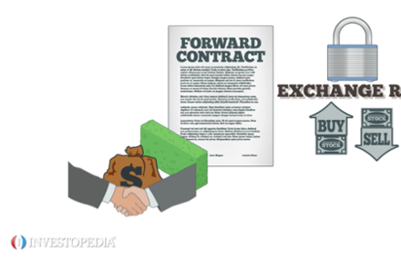

## Table of Contents

## What is a currency forward contract?

A currency forward contract is an agreement between two parties to buy or sell a specific amount of currency at a set price on a future date. It's like making a promise to exchange money at a rate you agree on today, even if the actual exchange happens later. This can be useful if you want to protect yourself from changes in currency values that might affect your business or travel plans.

For example, if a company in the United States knows it will need to pay a supplier in Europe in six months, it might use a currency forward contract to lock in the current exchange rate. This way, if the value of the Euro goes up against the US Dollar in the next six months, the company won't have to pay more than expected. It helps businesses plan their finances better and avoid surprises due to currency fluctuations.

## How does a currency forward contract work?

A currency forward contract is like a special agreement between two people or companies. They decide on a specific amount of money in one currency that will be exchanged for another currency at a set price, but this exchange happens on a future date, not right away. It's like saying, "I'll give you 100 Euros in three months, and you'll give me $110 today's rate." This helps them plan because they know exactly how much money they will get or need to pay, no matter what happens to the exchange rate in the meantime.

For example, imagine a US company that needs to buy things from a supplier in Japan. They know they'll need to pay in Yen in six months. They can use a forward contract to lock in today's exchange rate for the Yen. So, even if the Yen becomes more expensive against the Dollar in the next six months, the US company will still pay the rate they agreed on today. This way, they can budget better and not worry about the currency changing value suddenly.

## What are the main components of a currency forward contract?

A currency forward contract has a few main parts that make it work. First, there are the two parties who agree to the contract. One party wants to buy a certain amount of currency, and the other party wants to sell it. They agree on how much of one currency will be exchanged for another currency. This amount and the currencies involved are important parts of the contract.

The second important part is the exchange rate. This is the price at which the two currencies will be swapped. The parties decide on this rate when they make the contract, and it stays the same no matter what happens to the actual exchange rate in the market later. The third part is the delivery date, which is when the actual exchange of currencies will happen. This date is set in the future, and both parties have to stick to it. Together, these parts help people and businesses plan their money moves without worrying about sudden changes in currency values.

## Who typically uses currency forward contracts?

Currency forward contracts are often used by businesses that do a lot of international trade. For example, if a company in the US buys things from a supplier in Europe, they might use a forward contract to lock in the exchange rate for Euros. This helps them know exactly how much they'll need to pay in the future, even if the Euro's value changes. It's like making a deal today for money you'll need later, which can help businesses plan their budgets better and avoid surprises from currency changes.

Another group that uses currency forward contracts are investors and financial institutions. They might use these contracts to protect their investments from currency fluctuations. For instance, if an investor has money in a foreign stock market, they can use a forward contract to make sure they get a good exchange rate when they bring their money back home. Banks and other financial companies also use forward contracts to manage their risks and help their clients with international money matters.

## What are the benefits of using a currency forward contract?

Using a currency forward contract can help businesses and investors a lot. It lets them know exactly how much money they will get or need to pay in the future, no matter what happens to the exchange rate. This is really helpful for companies that buy or sell things in different countries. They can plan their budgets better and not worry about sudden changes in currency values messing up their plans. For example, if a US company needs to pay a supplier in Europe in six months, they can use a forward contract to lock in today's exchange rate for Euros. This way, even if the Euro gets more expensive, the company won't have to pay more than they expected.

Investors and financial institutions also find currency forward contracts useful. They can use these contracts to protect their investments from currency fluctuations. If an investor has money in a foreign stock market, they can use a forward contract to make sure they get a good exchange rate when they bring their money back home. This helps them avoid losing money just because the currency they're dealing with changes value. Banks and other financial companies use forward contracts to manage their risks and help their clients with international money matters, making it easier for everyone to handle money across borders.

## What are the risks associated with currency forward contracts?

Using a currency forward contract can be risky if the market moves in a way you didn't expect. If the exchange rate changes a lot and goes in your favor, you might end up losing money because you locked in a less favorable rate. For example, if you agreed to buy Euros at a certain rate and the Euro becomes cheaper, you'll still have to pay the higher rate you agreed on. This means you could have saved money if you hadn't used the forward contract.

Another risk is that the other party might not be able to fulfill their part of the deal. If the company or person you made the contract with goes bankrupt or can't pay, you could be left without the currency you were expecting. This is called counterparty risk, and it's something to think about before entering into a forward contract. While these contracts can help you plan and protect against currency changes, they also come with their own set of challenges and potential downsides.

## How is the forward rate determined in a currency forward contract?

The forward rate in a currency forward contract is figured out by looking at the current exchange rate, or spot rate, and adding something called the forward points. The forward points are based on the difference in interest rates between the two currencies involved in the contract. If one country's interest rates are higher than the other's, the forward rate will be adjusted to account for this difference. This means the forward rate might be higher or lower than the spot rate, depending on which currency has the higher interest rate.

For example, if the spot rate between the US Dollar and the Euro is 1 USD = 1.10 EUR, and the interest rates in the US are higher than in Europe, the forward rate might be set at 1 USD = 1.09 EUR for a contract that settles in six months. This adjustment reflects the interest rate differential, making the forward rate a bit different from the spot rate. By using this method, both parties in the contract can agree on a fair exchange rate for the future, based on today's market conditions and expected changes in interest rates.

## What is the difference between a currency forward contract and a futures contract?

A currency forward contract and a futures contract are both ways to agree on exchanging money at a certain rate in the future, but they have some key differences. A forward contract is a private deal between two parties, like two companies or a company and a bank. They decide on the amount of money, the exchange rate, and the date when the exchange will happen. It's like making a special agreement just between the two of them. Because it's private, forward contracts can be customized to fit the needs of the people involved.

On the other hand, a futures contract is a more standardized agreement that is traded on an exchange, like a stock market. Many people can buy and sell these contracts, and they all follow the same rules set by the exchange. The amount of money, the exchange rate, and the date are all fixed and can't be changed. This makes futures contracts less flexible than forward contracts, but they are easier to trade and can be a good option for people who want to manage their risk without making a special deal.

## How can a business hedge against currency risk using forward contracts?

A business can use forward contracts to protect itself from currency risk by locking in today's exchange rate for a future transaction. For example, if a US company knows it will need to pay a supplier in Europe in six months, it can enter into a forward contract to buy Euros at the current rate. This way, even if the value of the Euro goes up against the US Dollar in the next six months, the company will still pay the rate it agreed on today. This helps the business plan its budget better and avoid surprises from currency fluctuations.

Using forward contracts also helps businesses manage their cash flow more effectively. By knowing exactly how much they will need to pay or receive in the future, they can make better financial plans and reduce the uncertainty that comes with dealing in different currencies. For instance, if an exporter in Japan is going to receive payment in US Dollars, they can use a forward contract to lock in the exchange rate for converting those Dollars back to Yen. This way, they protect their profits from any unfavorable changes in the exchange rate, making their financial future more predictable and secure.

## What documentation is required to enter into a currency forward contract?

When a business wants to enter into a currency forward contract, they need to prepare some important documents. The first document is the forward contract agreement itself. This agreement spells out all the details of the deal, like the amount of money, the exchange rate, and the date when the exchange will happen. Both parties need to sign this agreement to make it official. They might also need to provide some identification and proof that they are allowed to enter into such a contract.

In addition to the forward contract agreement, businesses might need to show financial statements or other documents to prove they can fulfill their part of the deal. This could include bank statements or credit reports to show they have enough money to cover the transaction. Sometimes, they might also need to provide collateral, which is something of value that they agree to give up if they can't pay. All these documents help make sure that both parties understand the terms and can trust each other to follow through on the contract.

## How are currency forward contracts settled?

Currency forward contracts can be settled in two main ways: by delivery or by cash settlement. In a delivery settlement, the two parties actually exchange the agreed-upon currencies on the specified date. For example, if a US company agreed to buy Euros from a European company, on the settlement date, the US company would send US Dollars to the European company, and in return, the European company would send Euros to the US company. This type of settlement is common when the parties need the actual currency for their business transactions.

In a cash settlement, no actual currency is exchanged. Instead, the parties calculate the difference between the forward rate agreed upon in the contract and the spot rate on the settlement date. If the forward rate is more favorable than the spot rate, the party that agreed to buy the currency pays the other party the difference. If the spot rate is more favorable, the party that agreed to sell the currency pays the difference. This method is often used by investors and financial institutions who are looking to manage their risk without needing the physical currency.

## What are some advanced strategies involving currency forward contracts?

Businesses and investors can use advanced strategies with currency forward contracts to manage their money better. One strategy is called "layering," where a company sets up several forward contracts at different times instead of one big contract. This helps them spread out their risk and take advantage of different exchange rates over time. For example, a company might set up a forward contract today for some of their future needs and then set up another one in a few months if the exchange rate looks better. This way, they can get a better average rate for their currency needs.

Another strategy is using "currency swaps" along with forward contracts. A currency swap is like a series of forward contracts where two parties agree to exchange currencies at certain times in the future. This can be useful for companies that have ongoing payments in different currencies. They can use forward contracts to lock in rates for specific dates and use currency swaps to manage their cash flow over a longer period. This combination helps them plan their finances more carefully and protect against currency changes over time.

## What is the understanding of Currency Forwards?

Currency forwards are over-the-counter (OTC) derivative instruments prominently utilized within the foreign exchange (forex) market. These instruments, also referred to as 'outright forwards', serve to lock in an exchange rate for a specific currency pair, to be executed at a predetermined future date. Unlike futures contracts, which are standardized and traded on exchanges, currency forwards are customizable and negotiated directly between parties, thereby providing greater flexibility in terms of contract specifications.

A currency forward transaction effectively eliminates exchange rate uncertainty over the contract period. The exchange rate agreed upon in the contract, known as the forward rate, is determined by adjusting the current spot rate for the difference in interest rates between the two currencies involved. The pricing formula for a currency forward can be expressed as follows:

$$
F = S_0 \times \left(1 + i_d \times \frac{N}{360}\right) / \left(1 + i_f \times \frac{N}{360}\right)
$$

Where:
- $F$ is the forward rate.
- $S_0$ is the spot rate (current exchange rate).
- $i_d$ and $i_f$ are the domestic and foreign interest rates, respectively.
- $N$ is the number of days until the contract's maturity.

Currency forwards are predominantly used for hedging purposes, allowing businesses and investors to safeguard against adverse currency movements that could affect the value of international transactions or investments. By securing a fixed exchange rate, organizations can effectively manage financial risk and budget with greater certainty, a crucial aspect in environments exposed to currency [volatility](/wiki/volatility-trading-strategies).

The bespoke nature of currency forwards permits tailoring of the contract terms, including the amount of currency, settlement date, and specific currencies exchanged, to meet the exact needs and risk profiles of the parties involved. This tailored approach provides an added level of customization that is not possible with standardized futures contracts, thus lending greater control over the hedging process. As a result, currency forwards are a vital tool for companies and financial entities looking to precisely manage their foreign exchange exposures in a rapidly changing economic landscape.

## What are the Mechanisms and Benefits of Currency Forward Trading?

Currency forwards are critical in managing foreign exchange risk, providing contractual locks on future exchange rates. Their pricing is influenced by various factors, primarily spot prices, [interest rate](/wiki/interest-rate-trading-strategies) differentials, and the length of the contract. The formula for determining the forward exchange rate (F) based on these variables is:

$$
F = S \times \left( \frac{1 + i_d \times t}{1 + i_f \times t} \right)
$$

where:
- $F$ is the forward rate,
- $S$ is the current spot rate,
- $i_d$ is the domestic interest rate,
- $i_f$ is the foreign interest rate,
- $t$ is the time to maturity (usually expressed as a fraction of a year).

The flexibility offered by currency forwards allows businesses to hedge against the risk of adverse currency movements. By locking in exchange rates, companies can secure the future cost of transactions, allowing for more predictable budgeting and financial planning. This is particularly useful for businesses that engage in international trade, as it provides protection against unforeseen currency fluctuations that could impact revenue or expenses.

Hedging with currency forwards ensures that businesses are not at the mercy of market volatility. For instance, a firm expecting to receive payment in a foreign currency can lock in a favorable exchange rate today to convert those future payments into domestic currency at a predictable rate. This mitigates the risk posed by potential depreciation of that foreign currency.

Moreover, currency forwards are customizable contracts. Unlike standardized futures, they accommodate specific needs related to notional amounts, settlement dates, and currency pairs. This customization makes them appealing to a wide range of market participants, from multinational corporations to financial institutions, aiming to manage exposure to exchange rate risks effectively.

By incorporating currency forwards into their risk management strategy, businesses can benefit from stable financial outcomes despite fluctuating currency values. This stability supports strategic financial decision-making in a globally interconnected economy.

## How can currency forward contracts be integrated with algorithmic trading?

The integration of currency forward contracts with algorithmic trading strategies offers enhanced precision in managing risks and optimizing trading outcomes. This fusion harnesses technology to consistently monitor market fluctuations, allowing for trades to be executed at strategically optimal moments. This not only mitigates risk but also seeks to improve financial returns by capitalizing on favorable conditions in the forex market.

Algorithms play a critical role by providing the capability to quickly and efficiently compute forward rates, which are essential for formulating competitive trading strategies. By utilizing historical data, interest rate differentials, and current spot rates, algorithms can automatically determine appropriate forward rates and adjust hedging strategies accordingly. For example, the forward rate ($F$) can be calculated using the formula:

$$

F = S \times \left(1 + \frac{r_d \times t}{360}\right) \div \left(1 + \frac{r_f \times t}{360}\right) 
$$

where $S$ is the current spot rate, $r_d$ is the domestic interest rate, $r_f$ is the foreign interest rate, and $t$ is the time to maturity in days. This formula highlights the role of interest rate differentials in forward pricing, which algorithms can factor into real-time decision-making.

Additionally, advanced algorithms enable the dynamic management of forward contracts by continuously adjusting positions based on market signals and predictive analytics. These algorithms can automatically re-balance portfolios, anticipate [liquidity](/wiki/liquidity-risk-premium) needs, and execute trades with minimal human intervention, fostering a high level of efficiency and accuracy in executing complex trading strategies.

Python, with its extensive libraries for financial analysis, is particularly suited for implementing such algorithms. By leveraging tools such as NumPy for numerical computations and Pandas for data manipulation, traders can devise sophisticated models that adapt to evolving market conditions. A simple Python code snippet for calculating forward rates might look like this:

```python
import numpy as np

def calculate_forward_rate(spot_rate, domestic_rate, foreign_rate, days_to_maturity):
    return spot_rate * (1 + domestic_rate * days_to_maturity / 360) / (1 + foreign_rate * days_to_maturity / 360)

# Example usage
spot = 1.25  # Example spot rate
r_domestic = 0.02  # 2% domestic interest rate
r_foreign = 0.015  # 1.5% foreign interest rate
days = 180  # 180 days to maturity

forward_rate = calculate_forward_rate(spot, r_domestic, r_foreign, days)
print("Calculated Forward Rate:", forward_rate)
```

Incorporating currency forwards into algorithmic trading strategies facilitates the anticipation of market trends and enhances the ability to respond swiftly, resulting in improved financial health and risk mitigation. This synergy underscores the growing importance of automated trading systems in the dynamic forex marketplace.

## References & Further Reading

[1]: Bank for International Settlements (2019). ["Triennial Central Bank Survey of Foreign Exchange and Over-the-counter (OTC) Derivatives Markets in 2019."](https://www.bis.org/statistics/rpfx19.htm) Bank for International Settlements.

[2]: Hull, J. C. (2018). ["Options, Futures, and Other Derivatives"](https://www.semanticscholar.org/paper/Options%2C-Futures%2C-and-Other-Derivatives-Hull/89bdee500c8623864fc9eb7a471546aa713acc44) (10th Edition). Pearson.

[3]: Lopez de Prado, M. (2018). ["Advances in Financial Machine Learning"](https://www.amazon.com/Advances-Financial-Machine-Learning-Marcos/dp/1119482089) Wiley.

[4]: Chan, E. (2013). ["Algorithmic Trading: Winning Strategies and Their Rationale"](https://github.com/NehrenD/algo_trading_and_quant_strategies) Wiley.

[5]: Narang, R. K. (2013). ["Inside the Black Box: A Simple Guide to Quantitative and High-Frequency Trading"](https://onlinelibrary.wiley.com/doi/book/10.1002/9781118662717) Wiley. 

[6]: Aronson, D. R. (2006). ["Evidence-Based Technical Analysis: Applying the Scientific Method and Statistical Inference to Trading Signals"](https://www.amazon.com/Evidence-Based-Technical-Analysis-Scientific-Statistical/dp/0470008741) Wiley.

[7]: Jansen, S. (2018). ["Machine Learning for Algorithmic Trading: Predictive models to extract signals from market and alternative data for systematic trading strategies with Python"](https://www.amazon.com/Machine-Learning-Algorithmic-Trading-alternative/dp/1839217715) Packt Publishing.