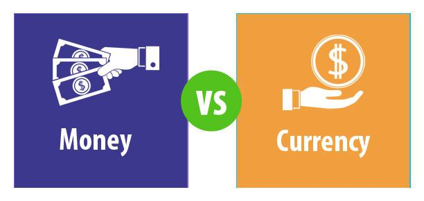

The modern financial landscape is a complex and dynamic environment characterized by its dependence on a multitude of elements, including money, financial systems, currencies, and algorithmic trading. These components not only shape how transactions are conducted but also influence broader economic stability and growth.

At its core, money acts as the central medium of exchange, a unit of account, and a store of value. It facilitates trade by eliminating the inefficiencies of barter systems and supports economic interactions on both individual and international scales. Financial systems, which comprise banks, investment markets, and insurance institutions, are integral to the circulation and management of money. They ensure liquidity, allocate resources efficiently, and manage risks, thereby underpinning economic development and stability.

Currencies, the tangible form of money such as coins and banknotes, are vital for daily transactions and are primarily issued by governmental authorities. They are subject to various economic forces, including inflation and exchange rate changes, which in turn affect global trade dynamics. In recent decades, digital currencies like cryptocurrencies have gained prominence, presenting novel methods for storing and transferring wealth and challenging traditional monetary frameworks.

Algorithmic trading, the employment of computer algorithms to execute trades, represents a significant shift in financial markets. This practice enhances trading efficiency by reducing the need for human intervention, thus increasing speed and accuracy. However, it also introduces complexities and potential risks, such as market volatility and system failures.

Understanding the intricate interplay between money, financial systems, currencies, and algorithmic trading is essential for anyone engaged in finance or investment. These elements collectively influence the global economy, driving innovation while also posing challenges that call for informed navigation and strategic oversight. As the financial landscape continues to evolve, grasping these foundational concepts will be crucial for success in the modern economic environment.

## Table of Contents

## Understanding Money and Financial Systems

Money, in its most fundamental form, serves crucial roles within an economy, acting as a medium of exchange, a unit of account, and a store of value. As a medium of exchange, money facilitates transactions by eliminating the inefficiencies associated with barter systems, where a double coincidence of wants is required. This role simplifies and accelerates trading activities, enabling individuals and businesses to engage in exchanges more freely and efficiently.

As a unit of account, money provides a standard numerical unit for measuring and comparing the value of goods and services, which is essential for making rational economic decisions. By providing a common measure, money helps in assessing the profitability of various business activities and setting prices in markets.

Serving as a store of value, money allows individuals to transfer purchasing power from the present to the future. This capability ensures that money retains value over time, although it may be subject to inflationary pressures which can erode its purchasing power.

Financial systems are the networks that facilitate the flow of money between individuals, businesses, and governments. These systems comprise financial institutions like banks, investment markets, and insurance companies, playing indispensable roles in supporting efficient economic activities. Banks, for example, act as intermediaries between savers and borrowers, allowing capital to flow to where it is most needed, thereby promoting investment and economic growth.

Investment markets enable the buying and selling of financial assets such as stocks and bonds, contributing to capital formation and allowing businesses to expand. These markets provide opportunities for investors to allocate their resources efficiently, based on the risk and return profiles of various investments.

Insurance companies, on the other hand, provide a framework for risk management by allowing individuals and businesses to transfer potential financial losses in exchange for a fee. This mechanism helps stabilize economic activities by reducing the uncertainty and impact of adverse events.

A robust financial system is integral to economic stability and growth. It ensures the efficient allocation of resources, facilitates risk management, and promotes consumer and investor confidence. Efficient financial systems support economic development by reducing transaction costs, improving information dissemination, and providing diversified financial products to meet different needs.

Overall, understanding the functions of money and the roles played by financial systems is quintessential for comprehending how modern economies operate. The symbiosis between these elements is critical to facilitating commerce, enabling investments, and promoting sustained economic development globally.

## The Role of Currency in Modern Economies

Currency serves as a fundamental pillar in modern economies, representing the physical manifestation of money through coins, banknotes, and, increasingly, digital forms. Traditionally, governments issue currencies under a regulatory framework, which helps maintain economic stability and public confidence in the financial system. These currencies facilitate the exchange of goods and services, acting as a standard measure of value and a medium for economic transactions.

### Inflation and Exchange Rate Fluctuations

Currencies are not immune to macroeconomic factors such as inflation and exchange rate fluctuations. Inflation refers to the general increase in prices and decrease in the purchasing value of money over time. It affects the overall stability and can erode consumer purchasing power if not managed appropriately. Governments and central banks typically employ monetary policies to control inflation rates, aiming to achieve economic objectives such as full employment and price stability.

Exchange rates, on the other hand, determine how much one nation's currency is worth in terms of another's. These rates influence international trade and capital flows. Various factors, including interest rates, economic performance, geopolitical stability, and market speculation, contribute to the fluctuation of exchange rates. 

### Emergence of Digital Currencies

Recent years have witnessed the advent of digital currencies, notably cryptocurrencies like Bitcoin and Ethereum, which offer a new paradigm for storing and transferring wealth. Unlike traditional currencies, cryptocurrencies operate on decentralized platforms, primarily leveraging blockchain technology to ensure security and transparency. These digital assets have sparked significant debates regarding their role and regulation in global financial systems. They provide benefits such as lower transaction costs and enhanced privacy but also pose challenges relating to regulatory oversight and potential for illicit activities.

### The Dominance of the U.S. Dollar

The U.S. dollar (USD) continues its legacy as a dominant force in the global financial architecture, functioning as a key reserve currency held by central banks worldwide. It serves as a benchmark in international trade and finance, significantly influencing economic decisions across nations. The dollar's prominence is attributed to the strength and stability of the U.S. economy, its liquid financial markets, and the widespread trust in its value. Despite occasional challenges from other currencies like the Euro or emergent digital currencies, the USD's role as a global standard remains largely unchallenged.

In conclusion, currency is an indispensable element shaping economic activities and global markets. Its evolution from traditional banknotes to digital incarnations reflects the dynamic nature of financial systems and the continuous pursuit of efficiency in economic transactions. The ability to adapt and manage currency-related challenges profoundly impacts national economies and the broader international financial system.

## Algorithmic Trading: A Game Changer in Financial Markets

Algorithmic trading employs sophisticated computer algorithms to automatically execute trades across financial markets based on predefined criteria. This approach facilitates rapid and precise trading, eliminating the emotional biases often inherent in human decision-making. By relying on advanced algorithms, it enhances efficiency, speed, and accuracy, enabling traders to capitalize on market opportunities with minimal delay.

Common [algorithmic trading](/wiki/algorithmic-trading) strategies include trend-following, [arbitrage](/wiki/arbitrage), and index fund rebalancing. Trend-following strategies capitalize on market [momentum](/wiki/momentum), predicting future price movements based on historical trends. Arbitrage strategies exploit price discrepancies in different markets or instruments, executing simultaneous buy and sell orders to secure risk-free profits. Index fund rebalancing involves adjusting the portfolio composition to match an index, typically executed algorithmically to maintain alignment with benchmark indices.

Despite its benefits, algorithmic trading is not without challenges. System failures are a significant concern, as they can lead to substantial financial losses. For instance, technical glitches or poor algorithmic design can cause trades to be executed incorrectly or at unfavorable prices. Additionally, algorithmic trading can contribute to increased market [volatility](/wiki/volatility-trading-strategies). Rapid, high-frequency trades may lead to sudden spikes or drops in asset prices, exacerbating market fluctuations.

Another challenge is market impact. High-frequency trading firms, executing large volumes of trades in seconds, can unintentionally influence market prices. This can distort price discovery, leading to inefficiencies in pricing mechanisms. Moreover, the competitive nature of developing and maintaining cutting-edge algorithms requires significant investment in technology and expertise, adding a barrier to entry for smaller firms.

Furthermore, the complexity of algorithmic trading systems necessitates robust risk management protocols. Ensuring system integrity and adhering to regulatory frameworks are critical for mitigating potential disruptions caused by high-speed trading activities. As the financial landscape evolves, embracing algorithmic trading's intricacies will become essential for market participants seeking to maintain a competitive edge.

## Strategies and Technical Requirements for Successful Algo Trading

Algorithmic trading, characterized by its reliance on complex algorithms and rapid execution, requires meticulous planning and implementation to be successful. Among the popular strategies employed in algorithmic trading are the Volume-Weighted Average Price (VWAP) and Time-Weighted Average Price (TWAP) strategies.

VWAP is an execution strategy that seeks to trade in line with the average price of a security throughout the day based on both [volume](/wiki/volume-trading-strategy) and price. This approach is often used to minimize market impact by executing orders gradually over time, aligning the trade price with the market's [liquidity](/wiki/liquidity-risk-premium). The VWAP formula is as follows:

$$
\text{VWAP} = \frac{\sum_{j=1}^{n} P_j \times Q_j}{\sum_{j=1}^{n} Q_j}
$$

where $P_j$ is the price of the transaction and $Q_j$ is the quantity of the transaction.

TWAP, on the other hand, focuses on executing trades at regular time intervals, regardless of price or volume, to achieve an average price over that period. This method is particularly useful for managing significant trade orders in thinly traded or volatile markets.

### Technical Requirements

Building an algorithmic trading system necessitates a range of technical proficiencies and resources. Primary among these is computer programming expertise. Proficiency in languages such as Python, C++, or Java is crucial for developing robust trading applications. Python is often preferred for its vast ecosystem of financial libraries and frameworks, such as NumPy and Pandas, which simplify data analysis and [backtesting](/wiki/backtesting) operations.

Market data access is another critical component. Successful trading algorithms depend on real-time data feeds and historical data for testing and validation. Traders need access to reliable data vendors to ensure high accuracy and minimal latency.

Advanced backtesting facilities are essential for validating and optimizing trading strategies before live deployment. Backtesting involves applying a strategy to historical market data to assess its potential profitability and risk. This process allows traders to fine-tune parameters and ensure robustness under various market conditions.

### Challenges and Monitoring

Building, deploying, and maintaining an algorithmic trading system can be costly endeavors. Initial development costs include hardware, software, and data services. Ongoing expenses encompass system maintenance, updates, and data subscriptions.

Continuous monitoring is imperative to respond swiftly to changing market dynamics. Traders must regularly update algorithms to adapt to regulatory changes, market evolutions, and systematic inefficiencies. Employing monitoring tools and alerts can aid in promptly identifying system malfunctions or deviations from expected performance.

In summary, mastering the strategies of algo trading, coupled with the technical requirements, enables traders to devise effective trading solutions. As markets continue to evolve, staying adept with technological advancements and market trends will be critical for sustained success in algorithmic trading.

## The Economic Impact and Future of Algo Trading

Algorithmic trading, often referred to as algo trading, plays a significant role in enhancing market liquidity and efficiency. By leveraging algorithms, trading can occur at speeds and volumes that far exceed human capabilities, promoting tighter bid-ask spreads and enabling traders to execute large orders without significantly impacting the market price. Consequently, this liquidity provision contributes positively to overall market efficiency, allowing for more accurate pricing of securities and smoother execution of trades.

However, the rapid execution and inherent complexity of algorithmic trading systems have also introduced potential risks to financial markets. One notable concern is the occurrence of market disruptions, such as flash crashes. These events are characterized by sudden, dramatic price declines followed by swift recoveries. A historic example of this phenomenon is the May 6, 2010 flash crash, where major U.S. stock indices experienced a severe drop within minutes, attributed in part to aggressive selling strategies executed by trading algorithms.

Regulatory bodies have recognized the potential systemic risks posed by automated trading systems and are actively reviewing and updating frameworks to mitigate these dangers. Measures include implementing circuit breakers to pause trading during extreme volatility, requiring trading firms to have robust risk management systems, and enhancing transparency through improved reporting requirements. The goal is to ensure that algorithmic trading continues to benefit markets while minimizing opportunities for disorder.

Looking forward, the future of algorithmic trading is poised to be increasingly intertwined with advancements in [artificial intelligence](/wiki/ai-artificial-intelligence) (AI) and [machine learning](/wiki/machine-learning) (ML). These technologies offer the potential to enhance decision-making processes by developing more sophisticated models that can adapt to complex and fast-changing market environments. For instance, machine learning algorithms can analyze vast datasets to identify patterns and predict future price movements, allowing for more informed trading strategies.

Moreover, AI-driven algorithms can incorporate natural language processing to interpret news events and sentiment data, offering a more comprehensive understanding of market dynamics. As these technologies evolve, they are expected to further revolutionize algorithmic trading by improving accuracy, reducing latency, and enabling more autonomous decision-making in financial markets.

In summary, while algorithmic trading significantly enhances liquidity and efficiency in financial markets, it also presents challenges that require prudent oversight. As regulatory frameworks evolve and technological innovations such as AI and ML become more integrated into algorithmic systems, the future holds the promise of even more agile and informed trading practices, contributing to the resilience and effectiveness of global financial markets.

## Conclusion

Understanding the interplay between money, financial systems, currency, and algorithmic trading is essential for effectively navigating today's complex financial markets. Each of these elements plays a distinct role within the broader economic environment, yet collectively, they contribute to the dynamism and intricacy of global finance. Money, in its basic form, acts as a facilitator for exchange and value measurement, underpinning the very foundation of economic activity. Financial systems, encompassing banks, markets, and insurance companies, serve as the conduits for the movement and utilization of funds, hence promoting economic stability and growth.

In modern economies, currency not only serves transactional purposes but also anchors the monetary policy and economic stability of a nation. As digital currencies continue to evolve, they introduce innovative mechanisms for value storage and transfer, challenging traditional monetary systems and prompting new regulatory considerations.

Algorithmic trading, meanwhile, represents the technological frontier of financial markets, markedly enhancing the execution of trades through precision and speed. Although algorithmic trading offers significant advantages by increasing market liquidity and efficiency, it also presents challenges, such as potential market disruptions and the need for vigilant regulatory oversight.

As technology continues to advance, staying informed about these fundamental financial concepts becomes increasingly imperative. Investors and policymakers who grasp these dynamics are better equipped to adapt to changes and make informed decisions, ensuring they remain ahead in the ever-evolving landscape of global finance. The integration of artificial intelligence and machine learning into financial systems promises further transformation, underscoring the need for ongoing education and adaptation to harness the full potential of these advancements.

## References & Further Reading

[1]: ["Advances in Financial Machine Learning"](https://www.amazon.com/Advances-Financial-Machine-Learning-Marcos/dp/1119482089) by Marcos Lopez de Prado

[2]: ["Evidence-Based Technical Analysis: Applying the Scientific Method and Statistical Inference to Trading Signals"](https://www.amazon.com/Evidence-Based-Technical-Analysis-Scientific-Statistical/dp/0470008741) by David Aronson

[3]: ["Machine Learning for Algorithmic Trading"](https://github.com/PacktPublishing/Machine-Learning-for-Algorithmic-Trading-Second-Edition) by Stefan Jansen

[4]: ["Quantitative Trading: How to Build Your Own Algorithmic Trading Business"](https://www.amazon.com/Quantitative-Trading-Build-Algorithmic-Business/dp/1119800064) by Ernest P. Chan

[5]: Krugman, P. R., & Obstfeld, M. (2014). ["International Economics: Theory and Policy"](https://www.pearson.com/se/Nordics-Higher-Education/subject-catalogue/economics/International-Economics-Theory-and-Policy-Krugman.html) (10th ed.). Pearson. 

[6]: Nakamoto, S. (2008). ["Bitcoin: A Peer-to-Peer Electronic Cash System."](https://nakamotoinstitute.org/library/bitcoin/)

[7]: Hull, J. C. (2018). ["Risk Management and Financial Institutions"](https://books.google.com/books/about/Risk_Management_and_Financial_Institutio.html?id=1J1QDwAAQBAJ) (5th ed.). Wiley.