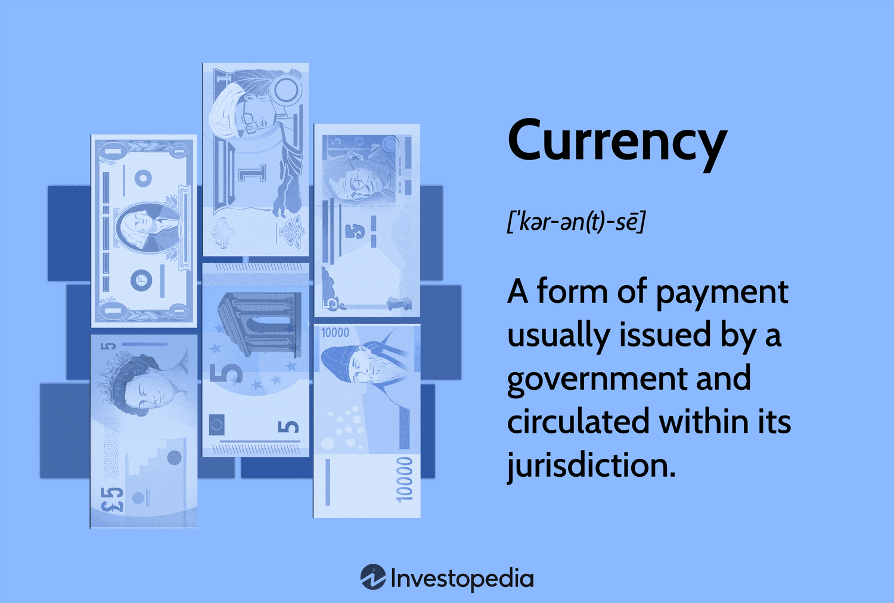

## Table of Contents

## What is currency and how does it differ from money?

Currency is a type of money that is used in a specific country or region. It can be in the form of coins and banknotes, and each country usually has its own currency. For example, the United States uses the dollar, while Japan uses the yen. Currency is physical and you can touch it. It helps people buy things and pay for services within that country.

Money, on the other hand, is a broader term. It includes not just physical currency but also other things that can be used to buy goods and services. This can include digital money, like the money in your bank account that you use with a debit card, or even cryptocurrencies like Bitcoin. Money can be anything that people agree to use as a way to exchange for goods and services. So, all currency is money, but not all money is currency because money can be in forms other than physical coins and banknotes.

## What are the primary functions of currency?

Currency serves as a medium of exchange, which means it's something people use to buy and sell things. Instead of trading goods directly, like swapping apples for oranges, people can use currency to make the exchange easier. For example, if you want to buy a toy, you can give the seller some money, and they will give you the toy. This makes trading much simpler and faster because everyone agrees that currency has value.

Another important function of currency is as a unit of account. This means it helps us measure and compare the value of different things. When everything has a price in currency, it's easy to see how much things cost and decide what you can afford. For instance, if a shirt costs $10 and a pair of shoes costs $50, you can easily understand that the shoes are more expensive than the shirt.

Lastly, currency acts as a store of value. This means you can save it and use it later. If you earn some money today, you can keep it and spend it next week or even next year. This is useful because it lets people plan for the future, save for big purchases, or keep money safe for emergencies. However, the value of currency can change over time due to inflation or other economic factors.

## How does currency serve as a medium of exchange?

Currency serves as a medium of exchange by making it easy for people to trade things. Instead of having to find someone who wants what you have and has what you want, you can use currency to buy what you need. For example, if you have apples and want oranges, you don't need to find someone who has oranges and wants apples. You can sell your apples for money and then use that money to buy oranges from anyone who sells them.

This system makes trading much simpler and faster. Everyone agrees that currency, like dollars or euros, has value. So, when you want to buy something, you just need to have enough currency, and the seller will give you the item. This way, currency helps people get what they need without the hassle of direct bartering.

## In what ways does currency act as a unit of account?

Currency acts as a unit of account by helping people measure and compare the value of different things. When everything has a price in currency, it's easy to see how much things cost. For example, if a toy car costs $5 and a toy truck costs $10, you can quickly understand that the truck is more expensive than the car. This makes it easier to decide what you can afford and helps you plan your spending.

Using currency as a unit of account also helps businesses and governments keep track of their finances. Companies can add up all their costs and revenues in terms of currency, which makes it easier to see if they are making a profit or a loss. Governments use currency to set budgets, calculate taxes, and manage the economy. This common unit of measurement helps everyone understand and manage financial information more clearly.

## Can you explain how currency functions as a store of value?

Currency functions as a store of value because you can save it and use it later. If you earn some money today, you can keep it in your wallet or a bank account and spend it next week, next month, or even next year. This is helpful because it lets you plan for the future, save for big purchases, or keep money safe for emergencies. For example, if you want to buy a new bike that costs more than your weekly allowance, you can save your money over time until you have enough to buy it.

However, the value of currency can change over time due to things like inflation. Inflation means that the prices of things go up, so the same amount of money can buy less in the future than it can now. For instance, if you save $100 and prices go up by 2% each year, in five years, that $100 might only be able to buy what $90 can buy today. Despite this, currency is still a useful way to store value because it's widely accepted and easy to use.

## What is the relationship between currency and inflation?

Inflation is when the prices of things go up over time. This means that the value of currency goes down because you can buy less with the same amount of money. For example, if a candy bar costs $1 today and inflation is 2% per year, next year that same candy bar might cost $1.02. So, the money you have loses some of its buying power. This happens because the supply of money in an economy can grow faster than the supply of goods and services, making each unit of currency worth less.

Governments and central banks try to manage inflation to keep the economy stable. They do this by controlling how much money is in circulation and setting interest rates. If inflation is too high, they might raise interest rates to slow down spending and borrowing, which can help bring prices down. If inflation is too low, they might lower interest rates to encourage more spending and borrowing, which can help the economy grow. So, the relationship between currency and inflation is important because it affects how much your money is worth and what you can buy with it.

## How do different types of currency, like physical and digital, impact their functions?

Physical currency, like coins and banknotes, is easy to use for everyday purchases. You can touch it, give it to someone, and they can use it right away. It's good for small transactions, like buying a snack or paying for a bus ride. Physical currency also works well when you don't have access to technology, like in remote areas or during power outages. However, carrying a lot of physical money can be risky because it can be lost or stolen, and it's not always easy to [carry](/wiki/carry-trading) large amounts.

Digital currency, like the money in your bank account or cryptocurrencies, is convenient because you can use it without needing to carry cash. You can pay for things online, transfer money to friends, or use a card to buy things in stores. Digital currency is also safer because it's harder to lose or steal, and you can keep track of your spending easily. But, you need technology to use it, like a phone or computer, and sometimes there can be fees for using digital payment methods. Also, digital currencies like Bitcoin can be more complicated because their value can change a lot.

## What role do central banks play in managing currency and its relationship with money?

Central banks are like the bosses of a country's money. They control how much money is in the economy and make sure it stays stable. One big thing they do is set interest rates. When they change these rates, it can make borrowing money cheaper or more expensive. If they want people to spend more money, they might lower the rates so it's easier to borrow. If they want to slow down spending, they might raise the rates. This helps them control inflation, which is when prices go up and money loses value.

Central banks also make sure there's enough money in the economy. They do this by printing new money or taking old money out of circulation. They watch the economy closely to see if they need to add more money or take some away. This helps keep the value of the currency stable. If there's too much money, prices might go up too fast. If there's not enough, it can be hard for people to buy things. So, central banks play a big role in making sure the money in your pocket stays useful and keeps its value.

## How does the concept of currency evolve with technological advancements?

The concept of currency has changed a lot because of new technology. In the past, people used physical money like coins and banknotes for everything. But now, with computers and the internet, we have digital currency. This means you can pay for things without using cash. You can use your phone or a card to buy things online or in stores. It's easier and safer because you don't have to carry money around, and it's harder for someone to steal it. Digital currency also lets you send money to people far away quickly.

Technology has also brought us new types of money like cryptocurrencies. These are digital currencies that don't need banks to work. Bitcoin is a famous example. People use special computer programs to buy, sell, and keep track of these cryptocurrencies. They can be used to buy things, but their value can change a lot, which makes them different from regular money. As technology keeps getting better, we might see even more changes in how we use and think about currency.

## What are the international implications of currency valuation and exchange rates?

When countries use different currencies, they need to trade them to buy things from each other. This is where exchange rates come in. Exchange rates tell you how much one currency is worth compared to another. If the exchange rate changes, it can make things more or less expensive for people in different countries. For example, if the US dollar gets stronger compared to the euro, Americans can buy more things from Europe with the same amount of money. But Europeans will find American things more expensive. This can affect how much countries trade with each other and can even change the prices of things like food and gas.

Exchange rates can also impact a country's economy. If a country's currency is weak, it might help them sell more things to other countries because their products become cheaper. But it can also make it more expensive for them to buy things from other countries. Governments and central banks often try to control their currency's value to help their economy. They might do things like change interest rates or buy and sell their own currency. These actions can cause big changes in the world economy because countries are all connected through trade and money.

## How do cryptocurrencies fit into the traditional functions of currency?

Cryptocurrencies, like Bitcoin, can work as a medium of exchange just like regular money. People can use them to buy things online or from stores that accept them. But they are not used as much as regular money because not everyone accepts them yet. Also, the value of cryptocurrencies can change a lot, which makes them tricky to use for everyday buying and selling. Still, they are becoming more popular, and some people think they could be used more in the future.

Cryptocurrencies can also act as a unit of account, but it's not as simple as with regular money. Because their value can go up and down a lot, it's hard to use them to measure the cost of things. For example, if you want to buy a toy with Bitcoin, the price in Bitcoin might change a lot from one day to the next. This makes it hard to plan and budget. As a store of value, cryptocurrencies are also different. You can save them like regular money, but because their value can change so much, they are riskier to save. Some people like them for this reason, hoping the value will go up, but others find them too unpredictable.

## What are the future trends and potential disruptions in the currency and money landscape?

The future of currency and money is likely to see a lot of changes because of technology. One big trend is the growth of digital currencies, like cryptocurrencies. More and more people are using them, and they might become a common way to pay for things. Central banks are also looking into making their own digital currencies, which could change how we use money. Another trend is the use of technology like blockchain, which makes transactions safer and easier to track. These changes could make it easier to send money around the world and might even change how banks work.

Another potential disruption is the rise of new payment methods. For example, using your phone to pay for things is already common, and it's likely to become even more popular. This could make cash less important. Also, as more people use the internet and technology, there might be new ways to pay that we haven't even thought of yet. These changes could make buying things faster and easier, but they might also bring new challenges, like keeping your money safe online. Overall, the future of money looks very different from today, with technology playing a big role in how we use and think about currency.

## What are the strategies and technical requirements for successful algo trading?

Algorithmic trading, characterized by its reliance on complex algorithms and rapid execution, requires meticulous planning and implementation to be successful. Among the popular strategies employed in [algorithmic trading](/wiki/algorithmic-trading) are the Volume-Weighted Average Price (VWAP) and Time-Weighted Average Price (TWAP) strategies.

VWAP is an execution strategy that seeks to trade in line with the average price of a security throughout the day based on both [volume](/wiki/volume-trading-strategy) and price. This approach is often used to minimize market impact by executing orders gradually over time, aligning the trade price with the market's [liquidity](/wiki/liquidity-risk-premium). The VWAP formula is as follows:

$$
\text{VWAP} = \frac{\sum_{j=1}^{n} P_j \times Q_j}{\sum_{j=1}^{n} Q_j}
$$

where $P_j$ is the price of the transaction and $Q_j$ is the quantity of the transaction.

TWAP, on the other hand, focuses on executing trades at regular time intervals, regardless of price or volume, to achieve an average price over that period. This method is particularly useful for managing significant trade orders in thinly traded or volatile markets.

### Technical Requirements

Building an algorithmic trading system necessitates a range of technical proficiencies and resources. Primary among these is computer programming expertise. Proficiency in languages such as Python, C++, or Java is crucial for developing robust trading applications. Python is often preferred for its vast ecosystem of financial libraries and frameworks, such as NumPy and Pandas, which simplify data analysis and [backtesting](/wiki/backtesting) operations.

Market data access is another critical component. Successful trading algorithms depend on real-time data feeds and historical data for testing and validation. Traders need access to reliable data vendors to ensure high accuracy and minimal latency.

Advanced backtesting facilities are essential for validating and optimizing trading strategies before live deployment. Backtesting involves applying a strategy to historical market data to assess its potential profitability and risk. This process allows traders to fine-tune parameters and ensure robustness under various market conditions.

### Challenges and Monitoring

Building, deploying, and maintaining an algorithmic trading system can be costly endeavors. Initial development costs include hardware, software, and data services. Ongoing expenses encompass system maintenance, updates, and data subscriptions.

Continuous monitoring is imperative to respond swiftly to changing market dynamics. Traders must regularly update algorithms to adapt to regulatory changes, market evolutions, and systematic inefficiencies. Employing monitoring tools and alerts can aid in promptly identifying system malfunctions or deviations from expected performance.

In summary, mastering the strategies of algo trading, coupled with the technical requirements, enables traders to devise effective trading solutions. As markets continue to evolve, staying adept with technological advancements and market trends will be critical for sustained success in algorithmic trading.

## References & Further Reading

[1]: ["Advances in Financial Machine Learning"](https://www.amazon.com/Advances-Financial-Machine-Learning-Marcos/dp/1119482089) by Marcos Lopez de Prado

[2]: ["Evidence-Based Technical Analysis: Applying the Scientific Method and Statistical Inference to Trading Signals"](https://www.amazon.com/Evidence-Based-Technical-Analysis-Scientific-Statistical/dp/0470008741) by David Aronson

[3]: ["Machine Learning for Algorithmic Trading"](https://github.com/PacktPublishing/Machine-Learning-for-Algorithmic-Trading-Second-Edition) by Stefan Jansen

[4]: ["Quantitative Trading: How to Build Your Own Algorithmic Trading Business"](https://www.amazon.com/Quantitative-Trading-Build-Algorithmic-Business/dp/1119800064) by Ernest P. Chan

[5]: Krugman, P. R., & Obstfeld, M. (2014). ["International Economics: Theory and Policy"](https://www.pearson.com/se/Nordics-Higher-Education/subject-catalogue/economics/International-Economics-Theory-and-Policy-Krugman.html) (10th ed.). Pearson. 

[6]: Nakamoto, S. (2008). ["Bitcoin: A Peer-to-Peer Electronic Cash System."](https://nakamotoinstitute.org/library/bitcoin/)

[7]: Hull, J. C. (2018). ["Risk Management and Financial Institutions"](https://books.google.com/books/about/Risk_Management_and_Financial_Institutio.html?id=1J1QDwAAQBAJ) (5th ed.). Wiley.