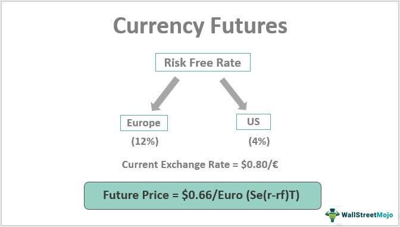

## Table of Contents

## What are currency futures and how do they work?

Currency futures are contracts that allow people to buy or sell a specific amount of a currency at a set price on a future date. They are traded on exchanges, like the Chicago Mercantile Exchange. People use currency futures to protect themselves from changes in currency values or to guess which way a currency's value will go. For example, if you think the value of the Euro will go up compared to the US Dollar, you might buy a Euro futures contract.

When you buy a currency futures contract, you agree to buy the currency at the price set in the contract when it expires. If the currency's value goes up, you can make money because you bought it at a lower price. But if the currency's value goes down, you could lose money. On the other hand, if you sell a currency futures contract, you agree to sell the currency at the set price when the contract expires. If the currency's value goes down, you make money because you sold it at a higher price. But if the currency's value goes up, you could lose money. This way, currency futures help people manage the risk of currency value changes.

## How can currency futures be used in trade and investment?

Currency futures can be a helpful tool for businesses that trade goods or services across borders. Imagine a company in the United States that needs to buy materials from Europe. If the company knows it will need to pay for these materials in Euros in three months, it can use currency futures to lock in today's exchange rate. This way, if the Euro gets stronger against the US Dollar in the next three months, the company won't have to pay more dollars to get the same amount of Euros. This helps the company plan its budget better and avoid surprises from currency changes.

Investors also use currency futures to try to make money or protect their investments. If an investor thinks the value of a currency will go up, they might buy a futures contract for that currency. If they're right and the currency's value does go up, they can sell the contract later at a higher price and make a profit. On the other hand, if an investor has investments in a foreign country and is worried that the currency might lose value, they can sell a futures contract to protect themselves. This way, even if the currency falls, the money they make from the futures contract can help cover their losses.

## What are the benefits of using currency futures for hedging?

Using currency futures for hedging helps businesses and investors manage the risk of currency value changes. When a company knows it will need to pay for something in a different currency in the future, it can use currency futures to lock in the exchange rate today. This means the company won't have to worry if the currency gets more expensive later. It's like buying insurance against currency changes, which makes it easier for the company to plan and budget.

Investors also find currency futures useful for protecting their investments. If an investor has money in a foreign country and is worried that the currency might lose value, they can use currency futures to hedge. By selling a futures contract, they can make money if the currency falls, which can help cover any losses from their investments. This way, currency futures act like a safety net, helping investors feel more secure about their money in different currencies.

## Can you explain the basic mechanics of trading currency futures?

Trading currency futures involves buying or selling contracts that represent a certain amount of a currency at a set price on a future date. These contracts are traded on exchanges, like the Chicago Mercantile Exchange. When you buy a currency futures contract, you agree to buy the currency at the price set in the contract when it expires. If the currency's value goes up before the contract expires, you can sell the contract for more than you paid for it and make a profit. If the currency's value goes down, you might lose money. On the other hand, when you sell a currency futures contract, you agree to sell the currency at the set price when the contract expires. If the currency's value goes down before the contract expires, you can buy the contract back for less than you sold it for and make a profit. If the currency's value goes up, you might lose money.

To start trading currency futures, you need to open an account with a futures broker. You'll need to deposit money into your account as a margin, which is like a security deposit to cover any potential losses. When you decide to trade, you can place an order through your broker to buy or sell a currency futures contract. The price of the contract will change based on what people think the currency's value will be in the future. If you want to close your position before the contract expires, you can do the opposite of your original trade – if you bought a contract, you can sell it, and if you sold a contract, you can buy it back. The difference between the price you bought or sold the contract at and the price you closed the position at will be your profit or loss.

## What are the key differences between currency futures and currency options?

Currency futures and currency options are both ways to trade currencies, but they work a bit differently. When you buy a currency futures contract, you agree to buy or sell a certain amount of a currency at a set price on a future date. You have to do this no matter what happens to the currency's value. This means you can make money if the currency moves in the direction you expect, but you can also lose money if it doesn't. On the other hand, when you buy a currency option, you get the right, but not the obligation, to buy or sell a currency at a set price before a certain date. This means you can choose to use the option if it's good for you, but you don't have to if it's not.

Another difference is how much money you need to start trading. With currency futures, you usually need to put down a smaller amount of money, called margin, to start trading. This can make futures more risky because you can lose more than you put in if the market moves against you. With currency options, you pay a premium upfront to buy the option, and that's the most you can lose. This makes options a bit safer because you know the most you can lose from the start. So, while futures can be good for people who want to take more risk and potentially make more money, options can be better for those who want to limit their risk.

## How do currency futures impact international trade?

Currency futures help businesses that buy and sell things in different countries. When a company knows it will need to pay for something in another country's money later, it can use currency futures to lock in the exchange rate now. This means the company won't have to worry if the other country's money gets more expensive later. It helps the company plan its budget better and avoid surprises from changes in money values. For example, if a U.S. company needs to buy materials from Europe in three months, it can use currency futures to make sure it knows how many dollars it will need to pay for those Euros.

Currency futures also make international trade safer and more predictable. When businesses know they can protect themselves from changes in money values, they might be more willing to do business with companies in other countries. This can lead to more trade between countries and help the global economy grow. For example, if a company in Japan is worried about the value of the U.S. dollar changing, it can use currency futures to feel more secure about doing business with a U.S. company. This way, currency futures help make the world's economy more connected and stable.

## What are the risks associated with trading currency futures?

Trading currency futures can be risky because the value of money can change a lot. If you buy a futures contract and the value of the currency goes down, you might lose money. This is because you agreed to buy the currency at a higher price than what it's worth when the contract ends. Also, trading futures usually involves using something called margin, which means you only need to put down a small amount of money to start trading. This can make the risks bigger because you can lose more money than you put in if the market moves against you.

Another risk is that currency futures are traded on exchanges, and the prices can be affected by many things, like what people think will happen with the economy or politics in different countries. If something unexpected happens, like a big change in interest rates or a political event, the value of the currency can change quickly. This can make it hard to predict what will happen, and you might end up losing money if the market moves in a way you didn't expect. So, it's important to understand these risks and be ready for them when you're trading currency futures.

## How do economic indicators influence currency futures markets?

Economic indicators can really affect the currency futures markets. These indicators are like clues that tell us how well a country's economy is doing. Things like unemployment rates, inflation, and how much people are spending can make a currency's value go up or down. For example, if a country's unemployment rate goes down, it might mean that the economy is getting stronger. This could make people think that the country's currency will be worth more in the future, so they might buy more futures contracts for that currency.

On the other hand, if an economic indicator shows that a country's economy is not doing so well, like if inflation is going up too fast, people might think the currency will be worth less in the future. This could make them sell their futures contracts for that currency. So, when new economic indicators come out, they can cause a lot of buying or selling in the currency futures market. This is because traders are always trying to guess what will happen next based on the latest information about the economy.

## What strategies can be employed to maximize returns from currency futures?

To maximize returns from currency futures, one strategy is to use technical analysis. This means looking at past price movements and patterns to predict what might happen next. Traders often use charts and tools like moving averages and trend lines to find good times to buy or sell. If you see a pattern that often leads to a currency's value going up, you might buy a futures contract to try to make money from that increase. It's like trying to guess where the price is going based on what it did before.

Another strategy is to keep an eye on economic news and events. Things like [interest rate](/wiki/interest-rate-trading-strategies) changes, employment reports, or big political events can affect currency values a lot. If you think a country's economy is going to do well because of good news, you might buy futures contracts for that country's currency. On the other hand, if you think bad news might make a currency's value go down, you could sell futures contracts to try to make money from that drop. Staying informed about what's happening around the world can help you make smarter trades and possibly earn more from currency futures.

## How do margin requirements and leverage affect trading in currency futures?

Margin requirements and leverage are important parts of trading currency futures. Margin is the amount of money you need to put down to start trading. It's like a security deposit that shows you can cover any losses. Because you only need to put down a small amount of money, you can trade more than you would be able to if you had to pay the full price of the contract. This is called leverage. Leverage can help you make more money if the market moves in your favor because you can control a big position with a small amount of money.

But leverage also makes trading riskier. If the market moves against you, your losses can be bigger than the money you put down as margin. This means you could lose more than you expected, and you might need to add more money to your account to keep trading. So, while margin and leverage can help you make more money, they also make it more important to be careful and understand the risks. It's a good idea to start with a small amount of money and learn how to manage the risks before you trade with more.

## What role do currency futures play in portfolio diversification?

Currency futures can help investors spread out their money in different ways, which is called portfolio diversification. When you invest in different things, you're less likely to lose a lot of money if one of your investments does badly. Currency futures let you bet on what will happen with different countries' money. If you have most of your money in one country's investments, adding currency futures from another country can help balance things out. If the value of the first country's money goes down, the currency futures might go up, which can help protect your overall investment.

Using currency futures for diversification can also give you a chance to make more money. If you think one country's money will do better than another, you can buy futures for that country's money. This way, if you're right, you can earn more from the futures than you might lose from other parts of your portfolio. But remember, trading futures can be risky, so it's important to understand how they work and be ready for the possibility of losing money. By adding currency futures to your investments, you can make your portfolio more diverse and possibly safer.

## How can advanced traders use currency futures to speculate on currency movements?

Advanced traders can use currency futures to guess which way a currency's value will go and try to make money from those guesses. They might look at charts and use special tools to find patterns in how the currency has moved before. If they see a pattern that often means the currency will go up, they might buy a futures contract. This means they agree to buy the currency at a set price later. If the currency does go up like they thought, they can sell the contract for more than they paid and make a profit. But if the currency goes down instead, they could lose money.

These traders also pay close attention to news and events that might affect currency values. Things like changes in interest rates, big economic reports, or political happenings can make a currency's value change a lot. If a trader thinks good news will make a currency go up, they might buy futures contracts for that currency. On the other hand, if they think bad news will make a currency go down, they might sell futures contracts to try to make money from that drop. By staying informed and using their knowledge of the market, advanced traders can use currency futures to make smart guesses and possibly earn more money.

## References & Further Reading

[1]: Hull, J. C. (2017). ["Options, Futures, and Other Derivatives"](https://www.semanticscholar.org/paper/Options%2C-Futures%2C-and-Other-Derivatives-Hull/89bdee500c8623864fc9eb7a471546aa713acc44) (10th ed.). Pearson.

[2]: "Algorithmic and High-Frequency Trading" by Álvaro Cartea, Sebastian Jaimungal, and José Penalva (2015). 

[3]: ["Designing Automated Trading Systems: A Trader's Journey From Data Mining to Monte Carlo Simulation to Live Trading"](https://www.amazon.com/Building-Winning-Algorithmic-Trading-Systems-ebook/dp/B00JUUZU2E) by Kevin J. Davey

[4]: "Trading and Exchanges: Market Microstructure for Practitioners" by Larry Harris (2003). 

[5]: ["Machine Trading: Deploying Computer Algorithms to Conquer the Markets"](https://www.amazon.com/Machine-Trading-Deploying-Computer-Algorithms/dp/1119219604) by Ernest P. Chan