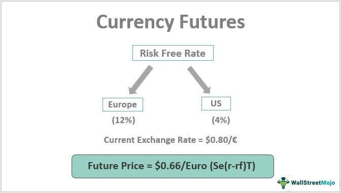

In the ever-evolving world of finance, derivatives are pivotal instruments that enable investors to manage risk and engage in speculative activities centered around future price movements. Among these derivatives, currency futures stand out as a significant type, primarily used for managing the inherent risks associated with foreign exchange (FX) fluctuations. These contracts allow entities to lock in exchange rates for future transactions, providing a mechanism to hedge against currency risk and to take positions based on anticipated movements in currency values.

Currency futures are standardized contracts traded on exchanges, which distinguishes them from over-the-counter derivatives such as currency forwards. Standardization facilitates liquidity and transparency, promoting efficient price discovery and reducing counterparty risk. Currency futures play an essential role, particularly for businesses and investors operating in or exposed to international markets. By securing an exchange rate today for transactions set to occur in the future, these contracts provide a kind of insurance against adverse movements in foreign exchange rates, thereby enabling smoother international trade and investment operations.



With advancements in technology, algorithmic trading has become a transformative force within the currency futures market. Algorithms execute trades with precision and speed that far surpasses human capabilities, enabling investors and traders to capitalize on fleeting market opportunities more effectively. These automated trading strategies are diverse, ranging from market making and trend following to arbitrage, each serving to enhance market efficiency and liquidity.

As markets continue to expand and develop, the integration of currency futures and algorithmic trading technologies is reshaping the landscape of modern finance. Understanding these tools and their applications is crucial for investors and businesses aiming to navigate and thrive in the global economic environment.

## Table of Contents

## Understanding Financial Derivatives

Financial derivatives are financial contracts whose value is dependent on the performance of an underlying asset, which could be stocks, bonds, commodities, or currencies. They are vital tools in modern finance, offering mechanisms for risk management and opportunities for speculation.

Currency futures, a prominent form of financial derivatives, are standardized contracts that obligate the purchase or sale of a specific currency at a predetermined future date and price. These contracts are traded on organized exchanges, which imposes standardization in terms of the contract size and expiration dates. This standardization affords transparency and liquidity, making currency futures highly accessible and relatively low risk compared to other derivatives.

The primary function of currency futures is hedging against the [volatility](/wiki/volatility-trading-strategies) of currency exchange rates. Businesses and investors utilize these contracts to protect themselves from adverse currency movements that could affect their financial positions or the cost of cross-border transactions. For instance, an exporter expecting a payment in a foreign currency can lock in a favorable exchange rate using currency futures, mitigating the risk of currency depreciation.

In addition to hedging, currency futures are commonly employed for speculative purposes. Traders and investors speculate on currency futures when they predict that exchange rates will move in a direction that enables them to profit by buying low and selling high, or vice versa. These speculative strategies can yield significant returns, but they also entail high levels of risk.

Understanding and effectively using currency futures requires a deep comprehension of the market dynamics and underlying economic indicators that influence currency rate movements. Traders must continuously monitor geopolitical events, [interest rate](/wiki/interest-rate-trading-strategies) changes, and economic data releases which could impact currency valuations.

As derivatives, currency futures play a crucial role in the global economic system, providing an efficient and effective means of managing foreign exchange risks while enabling speculative opportunities for those who understand the market intricacies. Both hedgers and speculators contribute to the [liquidity](/wiki/liquidity-risk-premium) and efficiency of currency futures markets, amplifying their importance in international finance.

## Currency Futures and Exchange Rate Contracts

Currency futures are integral financial instruments for businesses and investors dealing in foreign markets, primarily because they offer a strategic mechanism to manage and mitigate foreign exchange risks. These contracts enable parties to lock in exchange rates for future transactions, providing a hedge against volatile currency movements and facilitating smoother trade and investment in international marketplaces.

The functioning of currency futures involves a keen understanding of the difference between spot and futures prices. The spot price refers to the current market price at which a currency can be bought or sold for immediate delivery. In contrast, the futures price is the agreed-upon price for exchanging the currency at a future date. The disparity between these two prices often encapsulates expectations about future interest rates, economic events, and market conditions that could affect currency values.

Currency futures contracts are standardized and traded on exchanges, which distinguish them from over-the-counter forward contracts. This standardization includes specific amounts of currency per contract and fixed settlement dates. The presence of a centralized clearinghouse diminishes counterparty risk, providing participants with a more secure trading environment.

Hedging with currency futures involves taking opposite positions in the futures market to offset potential losses in the spot market. For instance, if a U.S.-based company expects to pay for a European supplier in euros six months from now, it could hedge its exposure to currency fluctuations by entering into a currency futures contract to buy euros at the current futures rate. This action ensures the business knows the exact exchange rate it will receive, safeguarding its future cash flows from adverse currency movements.

To further illustrate the mechanics of hedging with currency futures using Python, consider the following simple example:

```python
# Hypothetical values for demonstration
euro_spot_price = 1.1  # Spot rate (e.g., 1 euro = 1.1 dollars)
euro_futures_price = 1.2  # Futures rate six months forward
number_of_euros = 100000  # Amount of euros to hedge

# Calculate the amount in dollars based on spot and futures prices
amount_spot = euro_spot_price * number_of_euros
amount_futures = euro_futures_price * number_of_euros

# Hedging effectiveness
hedging_gain_loss = amount_futures - amount_spot

print(f"Hedging Gain/Loss: ${hedging_gain_loss}")
```

In this example, locking in the futures price of 1.2 protects the company from any depreciation of the dollar against the euro beyond this rate, ensuring financial predictability. Currency futures, therefore, play a vital role in international financial operations, allowing participants to make informed and calculated moves in a landscape characterized by constant currency valuation changes.

## Differences Between Currency Futures and Forwards

Currency futures and forwards serve similar purposes in foreign exchange markets, allowing parties to lock in exchange rates for transactions occurring at a future date. Despite their shared goal, they exhibit several key differences in terms of trading platforms and contract specifications.

Currency futures are standardized contracts traded on centralized exchanges, such as the Chicago Mercantile Exchange (CME). These contracts have specific terms, including pre-set contract sizes, expiration dates, and standardized currency pairs. The exchange acts as an intermediary, providing a clearing house that facilitates an efficient, transparent, and liquid marketplace. The standardization inherent in futures contracts contributes to their high liquidity, allowing participants to enter and [exit](/wiki/exit-strategy) positions readily. Pricing in the futures market is generally transparent due to the open nature of exchanges, enabling market participants to see bid and ask prices, as well as completed trades in real-time.

In contrast, currency forwards are customized, over-the-counter (OTC) contracts negotiated directly between two parties. This customization allows the parties to set their own terms related to the contract size, delivery date, and other particulars, offering greater flexibility. However, this flexibility comes at the cost of reduced market standardization and liquidity, as no centralized location or exchange facilitates these trades. Another implication of the OTC nature of forwards is the lack of transparent pricing; forward contracts are often quoted privately between institutions, and therefore, prices may not be readily available to the broader market. 

The choice between futures and forwards often hinges on the specific needs of the entities involved. Entities requiring specific contract terms not available in standardized futures may opt for forwards, accepting the liquidity trade-off for customization. Conversely, those valuing liquid, transparent, and regulated markets may prefer futures. The differences also influence how these instruments are utilized for hedging; for example, standardized futures might not exactly match the timing or amount of the exposure being hedged, while forwards can be tailored precisely to meet specific hedging requirements.

Overall, understanding these distinctions is crucial for market participants when choosing the appropriate derivative to manage foreign exchange risk, considering factors such as liquidity, transparency, customization, and regulatory considerations.

## The Role of Algo Trading in Currency Futures

Algorithmic trading, commonly referred to as algo trading, employs computer algorithms to execute trades with remarkable speed and precision in the currency futures market. This technological advancement enables traders to take advantage of market opportunities with a level of efficiency unattainable via traditional manual methods.

At its core, algo trading utilizes pre-defined sets of rules that can analyze market data and execute buy or sell orders based on specific criteria. This automation not only accelerates the trading process but also significantly reduces the likelihood of human error. The key components of successful algo trading strategies include [market making](/wiki/market-making), [trend following](/wiki/trend-following), and [arbitrage](/wiki/arbitrage).

**Market Making**

Market making involves placing buy and sell orders to profit from the bid-ask spread in the market. In currency futures, algos are programmed to place simultaneous buy and sell orders for different currency pairs, ensuring that trades are executed immediately once the market conditions align. This strategy benefits from high-frequency trading environments where speed and accuracy in order placement are paramount.

**Trend Following**

With trend following strategies, algorithms are designed to identify and exploit pricing patterns that signify emerging trends in currency futures. These algorithms typically rely on technical indicators like moving averages, [momentum](/wiki/momentum) oscillators, and other statistical data to predict the future direction of price movements. By capitalizing on these trends early, traders can secure positions that promise the potential for significant returns.

**Arbitrage**

Arbitrage in currency futures involves taking advantage of price discrepancies between different markets or instruments. An algo trading system identifies these inefficiencies in real time and executes simultaneous trades to lock in profits. The rapid speed at which these algorithms operate is crucial, as arbitrage opportunities can disappear in seconds as market participants correct the discrepancies.

Implementing algo trading strategies requires detailed programming and robust computational capabilities. Here's a basic outline of a Python script that might be used for a simple trend-following strategy using moving averages:

```python
import pandas as pd
import numpy as np

def moving_average_strategy(data, short_window, long_window):
    # Initialize the DataFrame with 'Adj Close' prices
    signals = pd.DataFrame(index=data.index)
    signals['price'] = data['Adj Close']

    # Create short simple moving average column
    signals['short_mavg'] = signals['price'].rolling(window=short_window, min_periods=1, center=False).mean()

    # Create long simple moving average column
    signals['long_mavg'] = signals['price'].rolling(window=long_window, min_periods=1, center=False).mean()

    # Create signals
    signals['signal'] = 0.0
    signals['signal'][short_window:] = np.where(signals['short_mavg'][short_window:] > signals['long_mavg'][short_window:], 1.0, 0.0)   

    # Generate trading orders
    signals['positions'] = signals['signal'].diff()

    return signals

# Example usage: moving_average_strategy(data, 40, 100)
```

This code sets up a basic framework for a moving average crossover strategy; when the short-term moving average crosses above the long-term average, a buy signal is generated, indicating an upward trend. Conversely, when the short-term average crosses below the long-term average, a sell signal occurs.

In summary, [algorithmic trading](/wiki/algorithmic-trading) has transformed the currency futures market by enhancing the speed and precision of trade execution. Through sophisticated strategies like market making, trend following, and arbitrage, algo trading allows traders to optimize their trading decisions and improve profitability efficiently.

## Benefits and Risks of Currency Futures and Algo Trading

Currency futures and algorithmic trading (algo trading) offer substantial benefits to participants in the financial markets. Currency futures enable investors and businesses to hedge against foreign exchange risk, securing a specified exchange rate for future transactions. This mitigates the impact of currency fluctuations on investments and international trade. Moreover, these financial instruments provide opportunities for speculation, allowing traders to profit from anticipated movements in exchange rates. As a result, they become a critical component of financial risk management and strategy development.

Algo trading further enhances the trading of currency futures by providing unparalleled speed and accuracy. By employing automated systems and pre-defined algorithms, traders can execute orders at optimal prices and market conditions, often surpassing the capabilities of manual trading. Common strategies in algo trading include market making, trend following, and arbitrage, which allow for more dynamic and efficient market participation. The integration of algo trading with currency futures reduces transaction costs, improves liquidity, and facilitates seamless market making.

However, both currency futures and algo trading [carry](/wiki/carry-trading) inherent risks. Market volatility is a prominent concern for currency futures as unexpected economic events can lead to significant fluctuations in exchange rates, potentially resulting in financial losses. In addition, algo trading systems are vulnerable to technical failures, such as software bugs or system malfunctions, which can cause substantial trading errors and resultant economic loss. The infamous "Flash Crash" of 2010 is a testament to the disruptive potential of algorithmic trading gone awry.

The complexity of these tools necessitates robust risk management strategies. Investors and traders must ensure they have effective measures in place, such as stop-loss orders and diversified portfolios to mitigate potential risks. Furthermore, staying informed about the regulatory environment is crucial, as financial authorities continually adjust rules and guidelines to ensure market stability and protect investors. Regulatory compliance helps prevent market manipulation and reduces systemic risk, safeguarding the broader financial ecosystem.

In summary, while currency futures and algo trading offer extensive advantages in hedging and trading efficiency, they demand careful consideration of associated risks. A balanced approach encompassing informed strategies, continual market education, and a sound understanding of regulatory landscapes is paramount for maximizing the potential of these financial instruments.

## Conclusion

The combination of financial derivatives, such as currency futures, and advanced technologies like algorithmic trading is significantly transforming modern trading practices. Currency futures enable market participants to hedge foreign exchange ([FX](/wiki/fx-anomaly)) risk or speculate on currency price movements, providing a structured and regulated environment through centralized exchanges. This clarity and standardization underpin investor confidence across global markets, ensuring efficient risk management and investment strategies.

Algorithmic trading further enhances the efficiency of currency futures by automating trading decisions and execution processes. By leveraging sophisticated algorithms and computational power, market participants can capitalize on market fluctuations quickly and effectively. Techniques such as trend following, arbitrage, and market making are harnessed through algorithms, which can process vast amounts of data faster than human capability. This technological integration is not just about speed; it is about precision and the ability to manage complex strategies seamlessly.

For businesses and investors, understanding the nuances of both currency futures and algorithmic trading is crucial for optimizing performance in a dynamically shifting economic landscape. Mastery over these elements will allow businesses to hedge effectively against currency risks and embrace speculative opportunities with informed strategies. This knowledge also facilitates informed decision-making, positioning stakeholders to navigate regulatory changes and market innovations adeptly.

As financial markets continue to evolve, adaptability and a strong grasp of emerging tools and techniques will be essential. Keeping abreast of technological advancements and refining one's understanding of derivatives will empower investors to harness the full potential of these instruments. This perpetual learning curve is the cornerstone for success as global markets become increasingly interconnected and technologically sophisticated.

## References & Further Reading

[1]: Hull, J. C. (2017). ["Options, Futures, and Other Derivatives"](https://books.google.com/books/about/Options_Futures_and_Other_Derivatives_eB.html?id=2iopDwAAQBAJ) (10th ed.). Pearson.

[2]: Chance, D. M., & Brooks, R. (2015). ["An Introduction to Derivatives and Risk Management"](https://books.google.com/books/about/Introduction_to_Derivatives_and_Risk_Man.html?id=b8PgBQAAQBAJ) (10th ed.). Cengage Learning.

[3]: Gomber, P., Arndt, B., Lutat, M., & Uhle, T. (2011). ["High-Frequency Trading"](https://www.semanticscholar.org/paper/High-Frequency-Trading-Gomber-Arndt/3d0ba8179934e0a45e85a184d1ec526616e2e213) in Algorithmic Trading: Essentials and Strategies. Springer.

[4]: Harris, L. (2003). ["Trading and Exchanges: Market Microstructure for Practitioners"](https://books.google.com/books/about/Trading_and_Exchanges.html?id=Rd9hDRR1Yx4C) Oxford University Press.

[5]: Hasbrouck, J. (2007). ["Empirical Market Microstructure: The Institutions, Economics, and Econometrics of Securities Trading"](https://searchworks.stanford.edu/view/6759272) Oxford University Press.

[6]: Murphy, J. J. (1999). ["Technical Analysis of the Financial Markets: A Comprehensive Guide to Trading Methods and Applications"](https://www.amazon.com/Technical-Analysis-Financial-Markets-Comprehensive/dp/0735200661) New York Institute of Finance.

[7]: Pardo, R. (2008). ["The Evaluation and Optimization of Trading Strategies"](https://www.semanticscholar.org/paper/The-Evaluation-and-Optimization-of-Trading-Pardo/25faffdfaa562664f2b03df8482d35a7dadfee50) Wiley Trading.