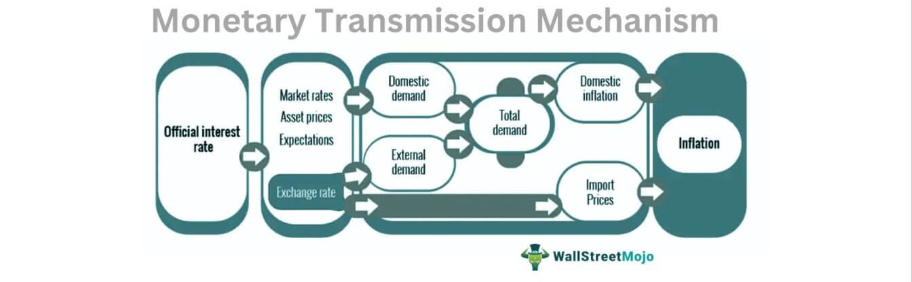

The financial landscape is a complex web of interrelated systems, and at its core lies the monetary system, which plays a critical role in maintaining economic stability. The monetary system includes the set of institutions, rules, and practices that a country employs to manage its currency supply and ensure the stability of its economy. Central to this understanding is the concept of currency circulation and monetary aggregates, both of which serve as essential barometers for assessing an economy's health.

Currency circulation pertains to the flow and usage of physical money within an economy. It reflects active transactional movements and is influenced by various factors, including economic cycles and technological progress. For instance, during periods of economic expansion, the demand for currency tends to rise, signifying increased economic activity. Conversely, a contraction may lead to a decrease in circulation as economic transactions slow down. Understanding these patterns is vital for formulating effective monetary policies and anticipating economic fluctuations.



Algorithmic trading, meanwhile, represents a transformative leap at the intersection of economic theory and technological innovation. It has revolutionized the way trades are executed by leveraging advanced algorithms to automate decision-making and trading processes. The integration of economic indicators such as currency circulation and monetary aggregates into algorithmic models enables traders to make informed decisions and optimize trading strategies. This innovative approach diminishes human errors and emotional biases, offering efficiency and precision in financial markets.

This article seeks to explore the dynamic relationship between monetary systems and algorithmic trading. By examining various economic examples and the implications of these factors on trading strategies, it provides a comprehensive understanding of how these elements shape the modern financial landscape. As such, the insights gained can prove invaluable for traders, policymakers, and financial institutions navigating the complexities of today's markets.

## Table of Contents

## Understanding the Monetary System

The monetary system refers to the structured network of institutions and methodologies that manage the circulation and supply of money within an economy. A foundational aspect of this system is the pivotal role played by central banks, which are charged with the responsibility of regulating money supply and ensuring economic stability through a combination of policies and regulatory oversight. Central banks, such as the Federal Reserve in the United States or the European Central Bank in the Eurozone, use a variety of tools to fulfill this role, including setting interest rates, modifying reserve requirements, and engaging in open market operations.

A critical aspect of the monetary system is maintaining a balance between money supply growth and key economic indicators like inflation and Gross Domestic Product (GDP). Inflation represents the rate at which the general level of prices for goods and services rises, leading to a decrease in purchasing power. It can be influenced by excessive expansion of the money supply. Conversely, GDP measures the economic performance of a country and is affected by the money supply as it directly impacts consumption and investment levels. Central banks often aim to strike an equilibrium where money supply growth supports economic expansion without triggering excessive inflation.

Efficient currency circulation, which refers to the active movement and availability of physical money within the economy, is essential for the seamless operation of both domestic and global markets. It facilitates transactions, encourages trade, and makes economic systems more responsive. When currency is efficiently circulated, it ensures that money is readily available where needed, reducing transaction costs and enhancing [liquidity](/wiki/liquidity-risk-premium).

To maintain this balance and ensure that currency circulation supports economic stability, central banks employ several tools. Interest rates are a primary instrument; by adjusting the rates, central banks influence borrowing and spending behaviors. For instance, lowering interest rates reduces the cost of borrowing, encouraging businesses and consumers to take loans, thereby stimulating economic activity. Conversely, raising interest rates can help cool down an overheated economy by discouraging borrowing.

Reserve requirements, another essential tool, dictate the minimum reserves each bank must hold to customer deposits and notes. By altering these requirements, central banks can directly influence the amount of money in circulation. Lower reserve requirements enable banks to lend more, increasing the money supply, while higher requirements restrict lending, decreasing it.

Central banks also engage in open market operations, which involve buying or selling government securities to alter the money supply. Purchasing securities injects money into the banking system, increasing liquidity, while selling them has the opposite effect, pulling money out of circulation. This mechanism allows central banks to quickly adjust the money supply in response to changing economic conditions.

In summary, the monetary system's complexity is rooted in its role to manage money supply and currency circulation to foster economic stability. Central banks employ a variety of tools to achieve a careful balance between encouraging economic growth and controlling inflation, all while ensuring the smooth flow of currency within domestic and international marketplaces.

## Currency Circulation: Examples and Effects

Currency circulation refers to the physical money in an economy that is actively used in various transactions. This includes both cash and coins exchanged between consumers, businesses, and financial institutions. The demand for physical currency can fluctuate significantly during different economic cycles and crises. For instance, during periods of economic uncertainty or downturns, individuals tend to increase their holdings of cash for precautionary reasons, leading to a rise in currency circulation. Conversely, in times of economic stability and growth, the demand for physical currency might decrease as alternative payment methods gain prominence.

Increased currency circulation often signals heightened economic activity as businesses and consumers engage more actively in spending. However, a surge in currency circulation without a corresponding increase in the supply of goods and services can result in inflation, as too much money chases too few goods. This inflationary pressure occurs because the overall money supply expands relative to the economy's productive capacity, often leading to price increases.

Global events and technological developments have significantly impacted currency circulation patterns. The advent and expansion of digital transactions, such as online banking, electronic funds transfers, and digital wallets (e.g., PayPal, Apple Pay), have decreased reliance on physical currency. During global events like the COVID-19 pandemic, this transition accelerated, with digital payment solutions offering a convenient and hygienic alternative to cash. The shift from physical to digital currency influences central banks' monetary policy and economic strategies, as they must consider the reduced need for physical money in circulation.

Understanding the dynamics of currency circulation is essential for anticipating changes in the economy. Monitoring trends in currency use provides insight into consumer confidence and spending behavior, which are critical components for developing effective monetary policies. Policymakers must adapt to these changes, incorporating them into their frameworks to maintain economic stability and respond adeptly to both domestic and global market conditions. Effective management of currency circulation helps ensure that central banks can balance the need for liquidity in the economy while avoiding excessive inflationary pressures.

## Algorithmic Trading: Integrating Economic Indicators

Algorithmic trading leverages computer algorithms to execute trades at optimal times, utilizing data analysis to drive decisions. Economic indicators, such as currency circulation and money supply, hold significant importance in these trading algorithms. By analyzing such indicators, traders can gain insights into market conditions and make informed decisions.

Currency circulation and money supply are key components of monetary aggregates, which reflect the amount of money available in an economy. These aggregates are critical inputs for constructing predictive models used in [algorithmic trading](/wiki/algorithmic-trading). These models incorporate various financial metrics and behavioral patterns to forecast market trends and optimize trading strategies. The integration of economic indicators into trading algorithms enables traders to recognize patterns and trends that might otherwise be missed in traditional trading approaches.

Algorithmic trading reduces human error and emotional biases often encountered in manual trading. By automating trading decisions, algorithms ensure consistent execution based on predefined criteria and real-time data. This automation leads to increased efficiency and reduced transaction costs, benefiting traders and financial institutions alike. Furthermore, the vast amount of data processed by these algorithms allows for the identification of market inefficiencies, providing opportunities for profit that are not readily apparent through manual analysis.

Technological advancements play a vital role in enhancing the efficiency and effectiveness of algorithmic trading. The development of high-speed computing and sophisticated data analysis tools has made it possible to process large volumes of data quickly and accurately. As technology continues to evolve, algorithmic trading strategies become more refined, incorporating emerging data sources and new economic indicators to maintain competitiveness in rapidly changing markets.

Overall, the integration of economic indicators like currency circulation and monetary aggregates into algorithmic trading represents an important intersection of economic theory and technological innovation. This integration not only enhances decision-making processes for traders but also contributes to the stability and efficiency of financial markets.

## Case Study: Monetary Aggregates and Trading Strategies

A case study of the post-2008 quantitative easing (QE) period provides significant insights into the impact of monetary aggregates on market dynamics and the subsequent adaptations in algorithmic trading strategies. In response to the global financial crisis, central banks, notably the Federal Reserve, implemented QE programs to inject liquidity into the economy. This process involved purchasing large-scale securities, which effectively increased the money supply and kept interest rates at historically low levels.

This surge in liquidity presented a unique challenge and opportunity for algorithmic traders who had to swiftly recalibrate their strategies. The key was to leverage real-time data analysis to exploit the changes in market liquidity and interest rates. Algorithmic trading systems, which rely heavily on economic indicators, adjusted by incorporating monetary aggregates as pivotal variables in their trading models.

Algorithmic traders focused on historical price movements and liquidity trends, which were considerably influenced by the QE measures. These traders integrated vast datasets into their algorithms, enabling them to recognize patterns, predict price movements, and execute trades at optimal times. The adaptability of these models was crucial, as they had to respond to unprecedented economic conditions marked by enhanced liquidity and fluctuating [volatility](/wiki/volatility-trading-strategies) levels. 

To maintain a competitive edge, algorithmic trading platforms evolved, ensuring real-time data processing capabilities. The use of economic indicators such as money supply data and shifts in interest rates became essential components in developing robust trading strategies. By dynamically adjusting parameters within their algorithms, traders could aim to predict market trends more accurately and reduce the risks associated with the increased liquidity and low-interest-rate environment.

Additionally, advancements in technology facilitated the continuous refinement of trading algorithms. Platforms incorporated [machine learning](/wiki/machine-learning) techniques, allowing the systems to learn from vast amounts of data and improve their decision-making processes. This evolution underscores the necessity for trading strategies to be flexible and data-driven, promoting an environment where algorithmic systems are constantly optimised for performance.

In conclusion, the period following the 2008 financial crisis highlighted the intricate relationship between monetary policies and market behavior. Algorithmic trading systems that adeptly integrated economic indicators, such as monetary aggregates, into their frameworks were better positioned to exploit the opportunities presented by central bank interventions. This case study exemplifies the critical role of understanding economic data in crafting strategies that perform robustly across varying market conditions.

## Conclusion

The interplay between the monetary system, currency circulation, and algorithmic trading defines the modern financial landscape. Understanding this relationship is crucial for traders, policymakers, and financial institutions seeking to navigate the complexities of contemporary markets. The monetary system, with its intricate mechanisms of money supply and regulation, creates a foundational context within which economic activities occur. Currency circulation, indicative of economic activity, informs both short-term transactional strategies and long-term economic planning.

Monetary aggregates, such as M1, M2, and M3, provide essential data points that influence economic policies and guide algorithmic trading strategies. By integrating these aggregates, traders gain insights into market liquidity and potential fluctuations. The success of trading algorithms relies heavily on how effectively these data are incorporated to predict trends and make data-driven decisions. A simple Python example demonstrates how these aggregates might be used in a trading algorithm:

```python
def calculate_liquidity_index(m1, m2, m3):
    # Example function to weigh monetary aggregates
    return 0.5 * m1 + 0.3 * m2 + 0.2 * m3

def trading_signal(liquidity_index):
    # Dummy rule for generating a trading signal
    if liquidity_index > threshold:
        return "BUY"
    else:
        return "SELL"
```

Continuous adaptation and efficient use of real-time data are imperative for developing robust trading strategies and ensuring economic stability. As technological advancements rapidly transform financial markets, the convergence of economic theory and technology facilitates innovative solutions. These solutions not only include more sophisticated trading algorithms but also advancements in areas like blockchain and digital currencies, which further redefine financial interactions and institutions.

This evolution illustrates that the financial landscape is not static but dynamic, necessitating a proactive and analytical approach. Traders and policymakers must therefore engage with this data-rich environment, leveraging the fusion of economic principles and technological capabilities to foster resilience and opportunity within the financial ecosystem.

## References & Further Reading

[1]: ["Advances in Financial Machine Learning"](https://www.amazon.com/Advances-Financial-Machine-Learning-Marcos/dp/1119482089) by Marcos Lopez de Prado

[2]: ["Machine Learning for Algorithmic Trading"](https://github.com/stefan-jansen/machine-learning-for-trading) by Stefan Jansen

[3]: ["Quantitative Trading: How to Build Your Own Algorithmic Trading Business"](https://www.amazon.com/Quantitative-Trading-Build-Algorithmic-Business/dp/1119800064) by Ernest P. Chan

[4]: Mishkin, F. S. (2019). ["The Economics of Money, Banking, and Financial Markets."](https://www.pearsonhighered.com/assets/preface/0/1/3/4/0134855388.pdf) Pearson.

[5]: ["Algorithmic and High-Frequency Trading"](https://www.cambridge.org/us/universitypress/subjects/mathematics/mathematical-finance/algorithmic-and-high-frequency-trading) by Alvaro Cartea, Sebastian Jaimungal, and José Penalva