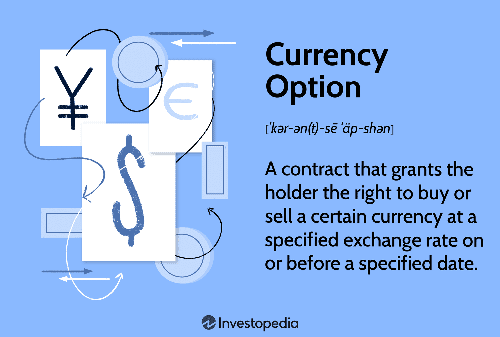

## Table of Contents

## What is a currency option?

A currency option is a financial tool that gives you the right, but not the obligation, to buy or sell a specific amount of one currency for another at a set price before a certain date. It's like a bet on how the value of one currency will change compared to another. People use currency options to protect themselves from big changes in currency values or to try to make money from these changes.

There are two main types of currency options: call options and put options. A call option lets you buy a currency at a set price, which is useful if you think that currency will become more valuable. A put option lets you sell a currency at a set price, which can be good if you think that currency will lose value. Both types help people manage the risks of dealing with different currencies in business or investment.

## What are the main types of currency options?

There are two main types of currency options: call options and put options. A call option gives you the right to buy one currency with another at a fixed price before a certain date. This is useful if you think the currency you want to buy will go up in value. For example, if you expect the euro to get stronger against the dollar, you might buy a call option to buy euros at today's rate, hoping to make a profit later.

On the other hand, a put option gives you the right to sell one currency for another at a fixed price before a certain date. This is helpful if you think the currency you own will lose value. For instance, if you think the pound will weaken against the yen, you could buy a put option to sell pounds at today's rate, protecting yourself from potential losses or even making a profit if the pound does drop.

Both call and put options are used by businesses and investors to manage the risks of currency fluctuations or to try to make money from these changes. They provide a way to hedge against unfavorable movements in exchange rates or to speculate on future currency values.

## How do call options differ from put options in currency trading?

In currency trading, call options and put options are two different tools that help people manage money risks or try to make money. A call option lets you buy one currency with another at a fixed price before a certain date. This is useful if you think the currency you want to buy will become more valuable. For example, if you believe the euro will get stronger against the dollar, you can buy a call option to buy euros at today's rate, hoping to make a profit later when the euro's value goes up.

A put option, on the other hand, lets you sell one currency for another at a fixed price before a certain date. This is helpful if you think the currency you own will lose value. For instance, if you think the pound will weaken against the yen, you could buy a put option to sell pounds at today's rate. This way, you protect yourself from losing money if the pound drops, or even make a profit from the difference in rates. Both call and put options are used to either hedge against bad changes in currency values or to speculate on future movements in the market.

## What are the key features of a currency option?

A currency option is a financial tool that gives you the right, but not the obligation, to buy or sell a certain amount of one currency for another at a set price before a specific date. This set price is called the strike price, and the specific date is known as the expiration date. You can use currency options to protect yourself from big changes in currency values or to try to make money from these changes. There are two main types of currency options: call options, which let you buy a currency at a set price, and put options, which let you sell a currency at a set price.

Currency options come with a cost called the premium, which you pay upfront to get the option. The premium depends on things like how much the currency values are expected to change, how long until the option expires, and the difference between the current market price and the strike price. If the market moves in your favor, you can use the option to make a profit or to protect against losses. If the market doesn't move in your favor, you don't have to use the option, and you just lose the premium you paid. This makes currency options a flexible tool for managing risk in the world of currency trading.

## What is the strike price in a currency option?

The strike price in a currency option is the fixed price at which you can buy or sell one currency for another. When you buy a call option, the strike price is the rate at which you can buy the currency you want. When you buy a put option, it's the rate at which you can sell the currency you have. The strike price is set when you buy the option and stays the same until the option expires.

The strike price is important because it helps you decide if using the option will make you money or save you from losing money. If the market price of the currency becomes better than the strike price, you can use the option to make a profit. If the market price is worse, you don't have to use the option, and you just lose the cost of the option, which is called the premium. This way, the strike price gives you a clear goal to aim for when you're trading currencies.

## How is the expiration date significant in currency options?

The expiration date is a key part of a currency option because it tells you when the option stops working. It's the last day you can use the option to buy or sell the currency at the strike price. If the market moves in a good way for you before this date, you can use the option to make money or avoid losing money. But if the market doesn't move in your favor by the expiration date, you won't use the option, and you'll lose the money you paid for it, called the premium.

Knowing the expiration date helps you plan your trading strategy. You need to think about how long you have until the option expires when you decide to buy it. If you think the currency will change in value soon, you might pick an option with a closer expiration date. If you think it will take longer, you might choose one with a later date. This way, the expiration date gives you a time limit to work with when you're trying to make the best use of your currency option.

## What does it mean to exercise a currency option?

To exercise a currency option means to use the right that the option gives you. If you have a call option, exercising it means you're buying the currency at the strike price that was set when you bought the option. If you have a put option, exercising it means you're selling the currency at that strike price. You would choose to exercise the option if doing so would be better for you than the current market price.

Exercising a currency option is a choice you make before the option's expiration date. If the market price is better than your strike price, it makes sense to exercise the option because you can make a profit or save money. But if the market price is worse, you don't have to exercise the option. You can just let it expire and only lose the premium you paid for it. This choice gives you flexibility in managing your currency risks or trying to make money from currency changes.

## What are American-style and European-style currency options?

American-style currency options let you use the option at any time before it expires. If you have an American-style option, you can decide to buy or sell the currency at the strike price whenever you want, as long as it's before the expiration date. This can be helpful if the market moves in a good way for you early on, and you want to take advantage of it right away. But, it also means you need to keep an eye on the market all the time to make the best choice.

European-style currency options are different because you can only use them on the expiration date, not before. If you have a European-style option, you have to wait until the very end to decide if you want to buy or sell the currency at the strike price. This can be simpler because you don't need to watch the market every day, but it also means you can't act quickly if the market changes in your favor earlier. Both types of options have their own uses depending on what you're trying to do with your trading strategy.

## How does the premium of a currency option get determined?

The premium of a currency option is the price you pay to buy the option. It's like a fee that gives you the right to use the option later. The premium is affected by several things. One big thing is how much the currency values are expected to change, which is called [volatility](/wiki/volatility-trading-strategies). If people think the currency will change a lot, the premium will be higher because there's more chance for big wins or losses. Another thing is how long until the option expires. The longer you have until the option expires, the more time there is for the currency to change, so the premium is usually higher. The difference between the current market price and the strike price, called the intrinsic value, also matters. If the strike price is better than the market price, the premium will be higher because the option is already worth something.

Another [factor](/wiki/factor-investing) that affects the premium is the interest rates of the currencies involved. If one currency has a much higher [interest rate](/wiki/interest-rate-trading-strategies) than the other, it can change how much people are willing to pay for the option. Also, the overall demand and supply for the option in the market can push the premium up or down. If a lot of people want to buy the same option, the premium might go up because of the high demand. On the other hand, if not many people want it, the premium might be lower. All these things together help decide how much you have to pay for the option, and it's important to think about them when you're choosing whether to buy a currency option.

## What are the strategies for using currency options in hedging?

People use currency options to protect themselves from big changes in currency values. This is called hedging. One way to do this is by buying a put option if you own a currency that you think might lose value. For example, if you have dollars and you think the dollar will go down compared to the euro, you can buy a put option to sell dollars at today's rate. If the dollar does drop, you can use the option to sell at the better rate and avoid losing money. If the dollar stays strong or goes up, you don't have to use the option, and you just lose the premium you paid for it. This way, you're protected against bad changes but can still benefit if things go well.

Another strategy is to buy a call option if you need to buy a currency in the future and you think it might get more expensive. For example, if you need to buy euros in a few months and you think the euro will go up against the dollar, you can buy a call option to buy euros at today's rate. If the euro does go up, you can use the option to buy at the lower rate and save money. If the euro stays the same or goes down, you don't have to use the option, and you just lose the premium. This helps you lock in a good rate for the future and avoid paying more if the currency gets more expensive. Both strategies help you manage the risks of currency changes while still giving you the chance to benefit if things go your way.

## How can currency options be used for speculative purposes?

People can use currency options to try to make money from changes in currency values. This is called speculation. If someone thinks a currency will go up in value, they can buy a call option. For example, if they believe the euro will get stronger against the dollar, they can buy a call option to buy euros at today's rate. If the euro does go up, they can use the option to buy euros at the lower rate and then sell them at the higher market rate, making a profit. If the euro doesn't go up, they don't have to use the option and just lose the money they paid for it, called the premium.

On the other hand, if someone thinks a currency will go down in value, they can buy a put option. For example, if they think the pound will weaken against the yen, they can buy a put option to sell pounds at today's rate. If the pound does drop, they can use the option to sell at the higher rate and then buy back pounds at the lower market rate, making a profit. If the pound doesn't go down, they don't have to use the option and just lose the premium. Speculating with currency options can be risky, but it gives people a way to try to make money from their guesses about future currency values.

## What are the advanced considerations for pricing currency options, including the use of models like Black-Scholes?

Pricing currency options involves more than just the basic factors like the strike price, expiration date, and market volatility. Advanced models like the Black-Scholes model help traders figure out how much an option should cost. The Black-Scholes model uses math to predict the future price of the option based on things like the current price of the currency, how much it's expected to change (volatility), the time until the option expires, and the interest rates of the two currencies involved. It also considers the cost of holding one currency over another, which can affect the option's value. Traders use these calculations to decide if an option is a good deal or not.

Even though the Black-Scholes model is very helpful, it's not perfect. It assumes that currency prices move in a smooth, predictable way, which isn't always true in the real world. Sometimes, currency values can jump suddenly due to big news or events, and the model doesn't account for these jumps well. Traders also need to think about other things like the political situation in the countries of the currencies involved, or any big economic changes that might happen. These factors can make the option's price go up or down in ways that the Black-Scholes model might not predict. So, while the model gives a good starting point, traders often adjust their pricing based on their own experience and understanding of the market.

## References & Further Reading

[1]: Taleb, N. N. (1997). ["Dynamic Hedging: Managing Vanilla and Exotic Options"](https://archive.org/details/dynamichedgingma0000tale). Wiley.

[2]: Hull, J. C. (2018). ["Options, Futures, and Other Derivatives"](https://www.semanticscholar.org/paper/Options%2C-Futures%2C-and-Other-Derivatives-Hull/89bdee500c8623864fc9eb7a471546aa713acc44). Pearson.

[3]: Lopez de Prado, M. (2018). ["Advances in Financial Machine Learning"](https://www.amazon.com/Advances-Financial-Machine-Learning-Marcos/dp/1119482089). Wiley.

[4]: Tsay, R. S. (2010). ["Analysis of Financial Time Series"](https://onlinelibrary.wiley.com/doi/book/10.1002/9780470644560). Wiley-Interscience.

[5]: Chan, E. P. (2009). ["Quantitative Trading: How to Build Your Own Algorithmic Trading Business"](https://github.com/ftvision/quant_trading_echan_book). Wiley.

[6]: Higham, D. J., & Higham, N. J. (2000). ["MATLAB Guide"](https://nhigham.com/matlab-guide/). SIAM.