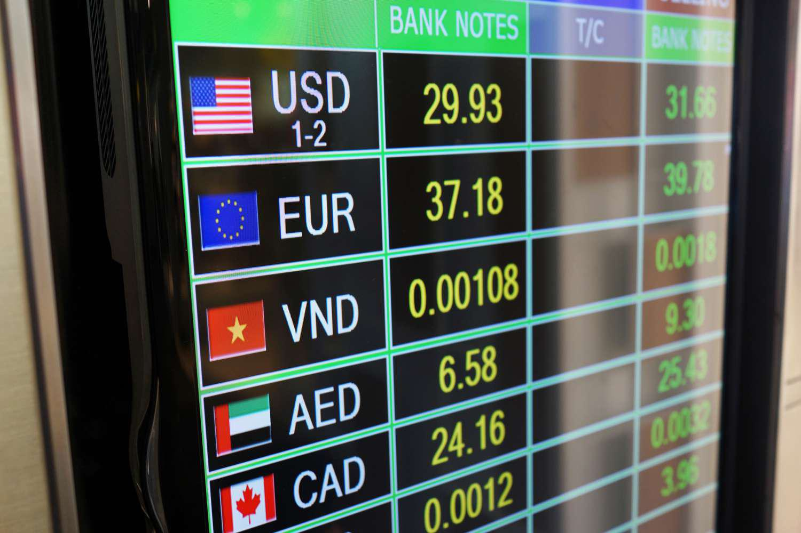

Currency options are financial instruments providing investors with the right, but not the obligation, to buy or sell a specified amount of a currency at a predetermined exchange rate on or before a certain expiration date. This inherent flexibility makes currency options pivotal for both hedging against adverse currency movements and engaging in speculative activities in the dynamic foreign exchange market. The ability to hedge protects businesses and investors from unpredictably unfavorable currency fluctuations, providing a layer of financial certainty in international trade and investment.

The advent and rapid advancement of algorithmic trading have significantly transformed the trading landscape for currency options. Algorithmic trading employs sophisticated computer programs to execute trades at high speed, based on predefined strategies. This has enabled traders to achieve more precise execution of trades and to explore strategic opportunities that were previously difficult to manage manually. Algorithms can react and adapt to market conditions almost instantaneously, allowing for the efficient handling of complex trading strategies and the enhanced capability to navigate through volatile market environments.



This article aims to provide a comprehensive overview of currency options, exploring their essential features such as strike price, expiration, and option premium. Moreover, it will examine the strategic considerations for deciding when to exercise these options and how algorithmic trading can be leveraged to optimize these strategies, ultimately leading to improved trading outcomes. Through an understanding of these critical components, traders can better navigate the intricate world of currency options and capitalize on the advantages brought forth by advanced trading technologies.

## Table of Contents

## Understanding Currency Options

Currency options are financial derivatives, integral to the landscape of foreign exchange (Forex) markets, that provide the right, without any obligation, to exchange a predetermined amount of one currency for another. This exchange occurs at a specified rate, known as the strike price, and must be executed on or before the option's expiration date. Such flexibility makes currency options indispensable tools for both policymakers and traders engaged in international financial markets.

Hedging against currency fluctuations is one of the primary uses of currency options. Companies dealing with international transactions are often exposed to significant currency risk due to volatile exchange rates. By purchasing currency options, they can lock in favorable exchange rates, thus safeguarding their revenues from adverse currency movements. For example, if a U.S.-based company expects to receive €1 million in six months, it can buy a euro call option with a strike price set at a favorable rate, ensuring that the exchange rate risk is mitigated.

In addition to risk management, currency options present lucrative speculative opportunities. Traders anticipating a strengthening or weakening currency can leverage options for potential profits. For instance, if a trader predicts that the Japanese yen will strengthen against the U.S. dollar, they might purchase a yen call option, allowing them to benefit from the currency movement with limited capital at risk.

Currency options can be categorized into two primary types: vanilla options and exotic options. Vanilla options, also known as standard options, include the familiar call and put options. Call options give the holder the right to buy a currency, while put options provide the right to sell. These straightforward contracts form the foundation for various simple trading strategies.

Exotic options, by contrast, offer more complex structures, catering to specific investor needs and market expectations. SPOT (Single Payment Options Trading) contracts are one type of exotic option, offering a payout based on the achievement of a certain currency price level within a predetermined time frame. The adaptability of exotic options often comes with higher premiums, reflecting their tailored nature and the intricacies involved in their pricing and execution.

Understanding these distinctions and inherent characteristics is crucial for effectively utilizing currency options in strategic trading and risk management. Each option type serves a distinct purpose and requires a comprehensive appreciation of market dynamics to maximize their potential benefits.

## Features of Currency Options

Currency options are structured around several key features, primarily the strike price, expiration date, and option premium. These elements fundamentally influence the trading strategies employed and outcomes achieved by market participants.

The strike price is the predetermined rate at which the currency can be bought or sold if the option is exercised. It plays a crucial role in determining the potential profitability of the option. For example, in a call option, the holder stands to profit if the market price exceeds the strike price by expiration, whereas for a put option, profitability is achieved if the market price falls below the strike price.

Expiration date refers to the deadline by which the holder must exercise the option. The time to expiration can affect the option's premium and the decision-making strategy. Options with longer expiration dates tend to have higher premiums due to the increased probability of significant price movements over time. As the expiration date approaches, the option's time value generally declines, a phenomenon known as time decay.

Option premium is the cost of purchasing the option, reflecting the intrinsic and time value of the option. Intrinsic value is the difference between the current market price and the strike price, applicable if the option is in the money. Time value represents the added premium based on the potential for price movement before expiration.

Vanilla options, encompassing basic call and put options, are characterized by their straightforward structure and are commonly used for both speculative and hedging purposes. They provide traders with a clear framework to capitalize on market movements or shield against adverse price changes.

In contrast, exotic options are more complex and offer flexible solutions, often tailored to specific market conditions or investor requirements. For instance, SPOT (single payment option trading) options allow for customized payout structures but typically involve higher premiums due to their specialized nature. These options can incorporate barriers, knock-in or knock-out conditions, and other features that may adjust the payoff depending on market scenarios.

Understanding these features is essential for implementing effective currency options strategies. Analyzing the implications of each component helps traders devise and execute strategies that align with their risk tolerance, market outlook, and financial goals, thereby maximizing their trading efficacy.

## When to Exercise Currency Options

Timing the exercise of currency options is an essential aspect of optimizing trading strategies, particularly when aiming to enhance profitability or minimize potential losses. Among the distinct styles of currency options, American-style options provide the holder with the privilege to exercise the option at any point before the expiration date. This flexibility is particularly advantageous for hedging strategies, allowing traders to adjust their positions in response to market fluctuations and capitalize on favorable conditions.

Several factors influence the decision of when to exercise currency options. A primary consideration is the prevailing market conditions, which encompass the spot exchange rate, [volatility](/wiki/volatility-trading-strategies), and overall economic indicators. Traders must assess whether the current market environment supports an advantageous exercise relative to the contracted strike price of the option.

Interest rates also significantly impact exercise timing. In options pricing models like the Black-Scholes model, interest rates influence the present value of the option premium and the cost of carrying the underlying asset. For instance, a rise in interest rates may increase the cost of holding the option, prompting traders to exercise early if the intrinsic value exceeds the option's current premium.

Transaction costs constitute another critical [factor](/wiki/factor-investing). These include brokerage fees, taxes, and other costs associated with transferring the underlying currency. Minimizing these costs can enhance the net gain from exercising the option. As such, traders often calculate the net payoff by considering both the intrinsic value of the option and the associated transaction costs to determine whether early exercise is financially justified.

In the context of financial [arbitrage](/wiki/arbitrage), the breakdown of the no-arbitrage condition provides a compelling reason for early exercise. If the price of the underlying asset significantly diverges from the option's strike price, arbitrage opportunities may arise, encouraging traders to exercise early to lock in risk-free profits.

In summary, deciding when to exercise currency options requires a comprehensive evaluation of market dynamics, interest rates, and transaction costs. By analyzing these variables, traders can strategically determine the optimal exercise timing, thereby enhancing their financial outcomes.

## Algorithmic Trading in Currency Options

Algorithmic trading, commonly referred to as algo trading, involves using computer algorithms to conduct trading activities based on predefined criteria. This approach enhances efficiency and precision in executing trades, particularly in the fast-paced world of currency options trading. By automating the trading process, algorithms can rapidly analyze extensive datasets, identify patterns, and execute transactions within milliseconds, thereby providing a competitive advantage over traditional manual trading methods.

In the context of currency options, [algorithmic trading](/wiki/algorithmic-trading) plays a crucial role. The foreign exchange market is characterized by high volatility and continuous fluctuations, making it challenging for traders to make timely decisions manually. Algorithms, equipped with advanced computational capabilities, can instantly process large volumes of market information, including historical data, real-time quotes, and news events. This capability allows for the timely identification of profitable trading opportunities and the swift execution of trades, minimizing the delay that could lead to missed opportunities or increased risks.

One of the primary benefits of algorithmic trading in currency options is its ability to manage complex trading strategies. Options trading often involves multifaceted strategies that require precise timing for entry and [exit](/wiki/exit-strategy) points to be effective. Algorithms can optimize these strategies by continuously monitoring market conditions and executing trades based on sophisticated models. For instance, they can implement delta-neutral strategies, where they balance the portfolio's sensitivity to price changes in the underlying asset, or use techniques such as gamma [scalping](/wiki/gamma-scalping), which involves adjusting delta hedges to benefit from volatility.

Algorithmic trading also aids in navigating volatile markets, which are common in currency trading. During periods of high market volatility, swift decision-making is essential to capitalize on price movements or to protect against adverse fluctuations. Algorithms can dynamically adjust trading parameters and execute trades that align with the trader's risk management guidelines. By doing so, they help maintain a balanced risk-reward ratio and protect investment portfolios from potential losses.

Furthermore, algo trading can incorporate [machine learning](/wiki/machine-learning) techniques to enhance predictive modeling. By learning from historical and real-time data, machine learning algorithms can improve forecasts of currency movements, allowing traders to make informed decisions with greater confidence. This approach reduces reliance on human intuition, which can be prone to biases and errors.

In conclusion, algorithmic trading provides a substantial edge in currency options trading by offering enhanced efficiency, precision, and the capability to manage complex strategies. As technology continues to advance, the integration of sophisticated algorithms in trading practices is expected to expand, offering further opportunities for traders to optimize their performance in dynamic markets.

## Strategies for Algorithmic Trading in Options

Algorithmic trading in options has revolutionized conventional trading mechanisms by introducing automation, precision, and speed into complex strategies. Traders can adopt and implement various strategies to optimize their positions and generate more consistent returns through algorithmic trading.

**Delta-Neutral Strategies**

Delta-neutral strategies are employed to create positions where the overall delta (Δ) — the rate of change of the option's price relative to changes in the underlying asset's price — becomes zero. This approach mitigates the risk associated with price movements in the underlying asset. Algorithmic trading plays a pivotal role in maintaining the delta-neutral state by continuously monitoring and rebalancing the portfolio as market conditions change. For instance, if the price of the underlying asset shifts, an algorithm can execute trades to adjust the position back to neutrality, thus minimizing market risk exposure.

**Using Neural Networks for Predictive Modeling**

Neural networks, a subset of machine learning, excel in identifying patterns in large datasets, making them suitable for predicting market movements. In options trading, neural networks can be trained on historical price data and various market indicators to forecast future price trends. Traders can leverage these predictions to make informed decisions on option pricing, the timing of trades, and early exercise opportunities. Python libraries such as TensorFlow and PyTorch provide robust frameworks for developing and deploying [neural network](/wiki/neural-network) models.

**Automating Early Exercise Decisions**

The decision of when to exercise options, especially American-style options, is crucial to maximizing returns. Algorithms can automate these decisions by assessing several variables, such as current market prices, volatility levels, and time decay, to determine the optimal time to exercise. By integrating these algorithms with broader risk management frameworks, traders can optimize their portfolio performance, reducing potential losses while capturing profits effectively.

```python
# Example of a simple framework for using neural network prediction in options trading
import numpy as np
from sklearn.model_selection import train_test_split
from sklearn.neural_network import MLPRegressor

# Simulated historical price data and indicators (features) and option prices (target)
features = np.random.rand(1000, 10)  # 1000 samples, 10 features
target = np.random.rand(1000)  # 1000 target values

# Split data into training and testing sets
X_train, X_test, y_train, y_test = train_test_split(features, target, test_size=0.2, random_state=42)

# Initialize and train the neural network
model = MLPRegressor(hidden_layer_sizes=(50, 50), max_iter=1000, random_state=1)
model.fit(X_train, y_train)

# Predict future option prices
predicted_prices = model.predict(X_test)
print(predicted_prices)
```

**Dynamic Position Adjustments**

The dynamic nature of the financial markets necessitates timely adjustments in trading positions. Algorithms excel in this area by providing real-time insights and prompt execution of trades, allowing traders to adapt swiftly to rapidly changing market conditions. This agility is achieved through continuous monitoring of market variables such as volatility, interest rates, and currency exchange rates, enabling traders to hedge risks and exploit arbitrage opportunities more efficiently.

In summary, by embracing algorithmic strategies like delta-neutral positioning, employing neural networks for predictive analysis, automating early exercise decisions, and dynamically adjusting trading positions, traders can significantly enhance their strategic capabilities and performance outcomes in the options market.

## Conclusion

The integration of algorithmic trading in currency options has revolutionized conventional trading methods by providing traders with the tools for enhanced precision and control in their strategies. This transformation is largely due to the ability of algorithmic systems to process vast amounts of market data and execute trades at speeds unattainable by human traders. As a result, traders can achieve improved accuracy in managing their positions, leading to more effective hedging, reduced transaction costs, and optimized decision-making processes.

Understanding the unique features of currency options—such as the strike price, expiration date, and associated premiums—is crucial for traders looking to optimize their trading outcomes. By mastering these elements, traders can better anticipate market movements and employ timely exercises of options, which is particularly pivotal in American-style options where early exercise can be financially beneficial.

Algorithmic trading platforms facilitate the development and deployment of sophisticated strategies. For instance, they enable the automation of complex tasks such as delta-neutral strategies, which maintain a position impervious to small movements in the underlying currency, and neural network modeling for predictive analytics. These tools allow traders to dynamically adjust their strategies in response to real-time market conditions, thereby enhancing their ability to minimize risk and capitalize on potential profit opportunities.

Embracing technological advancements within these platforms not only streamlines operations but also equips traders with competitive advantages. As financial markets continue to evolve, the adoption of algorithmic trading is becoming increasingly essential, providing modern traders with the capacity to adapt swiftly to market changes and sustain a pivotal edge in the competitive landscape of currency trading.

## References & Further Reading

[1]: Taleb, N. N. (1997). ["Dynamic Hedging: Managing Vanilla and Exotic Options"](https://archive.org/details/dynamichedgingma0000tale). Wiley.

[2]: Hull, J. C. (2018). ["Options, Futures, and Other Derivatives"](https://www.semanticscholar.org/paper/Options%2C-Futures%2C-and-Other-Derivatives-Hull/89bdee500c8623864fc9eb7a471546aa713acc44). Pearson.

[3]: Lopez de Prado, M. (2018). ["Advances in Financial Machine Learning"](https://www.amazon.com/Advances-Financial-Machine-Learning-Marcos/dp/1119482089). Wiley.

[4]: Tsay, R. S. (2010). ["Analysis of Financial Time Series"](https://onlinelibrary.wiley.com/doi/book/10.1002/9780470644560). Wiley-Interscience.

[5]: Chan, E. P. (2009). ["Quantitative Trading: How to Build Your Own Algorithmic Trading Business"](https://github.com/ftvision/quant_trading_echan_book). Wiley.

[6]: Higham, D. J., & Higham, N. J. (2000). ["MATLAB Guide"](https://nhigham.com/matlab-guide/). SIAM.