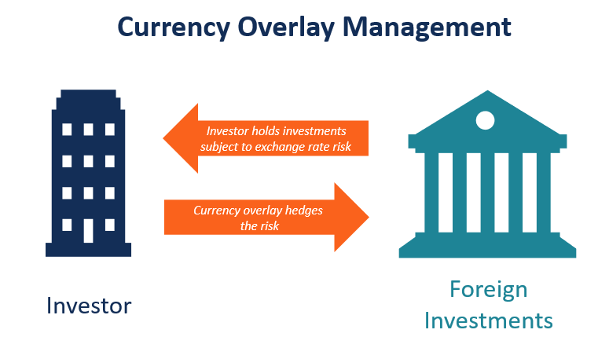

## Table of Contents

## What is currency overlay and why is it important?

Currency overlay is a strategy used by investors to manage the risk that comes from changes in currency exchange rates. When you invest in another country, the value of your investment can go up or down because of changes in the exchange rate between your home country's currency and the foreign country's currency. A currency overlay program helps protect against these changes by using financial tools like forward contracts and options to manage the currency risk.

This is important because it can help investors keep more of their investment returns. Without a currency overlay, big swings in currency values could wipe out the gains from the investment itself. By using a currency overlay, investors can focus on picking good investments without worrying as much about currency fluctuations. This makes their investment strategy more stable and potentially more profitable in the long run.

## How does currency overlay work in investment portfolios?

Currency overlay works in investment portfolios by managing the risk that comes from changes in currency exchange rates. When an investor puts money into foreign assets, like stocks or bonds in another country, the value of those investments can change because of the exchange rate between the investor's home currency and the foreign currency. To manage this risk, investors use a currency overlay program. This program uses financial tools like forward contracts, which are agreements to exchange currency at a set rate in the future, and options, which give the right to buy or sell currency at a certain price. These tools help to reduce the impact of currency swings on the overall value of the portfolio.

The goal of a currency overlay is to protect the returns from the investments themselves. Without it, a strong rise or fall in the foreign currency could eat into the profits from the stocks or bonds. For example, if an American investor buys Japanese stocks and the yen weakens against the dollar, the value of those stocks in dollars would go down, even if the stock prices in yen stayed the same. By using a currency overlay, the investor can hedge against these changes, making sure that the focus stays on the performance of the investments rather than on currency fluctuations. This helps to keep the portfolio more stable and can lead to better long-term results.

## What are the main objectives of implementing a currency overlay strategy?

The main objectives of implementing a currency overlay strategy are to protect the value of investments from changes in currency exchange rates and to improve the overall returns of a portfolio. When someone invests in another country, the value of their investment can go up or down because of the exchange rate between their home country's currency and the foreign country's currency. A currency overlay helps to manage this risk by using financial tools like forward contracts and options. These tools can lock in exchange rates or give the right to buy or sell currency at a certain price, which helps to keep the investment's value more stable.

Another important objective is to allow investors to focus on picking good investments without worrying too much about currency fluctuations. By using a currency overlay, investors can separate their investment choices from the risks that come from changing exchange rates. This makes it easier to stick to a long-term investment plan and can lead to better results over time. In the end, a currency overlay strategy aims to make a portfolio more stable and potentially more profitable by managing currency risk effectively.

## Can you explain the difference between passive and active currency overlay?

Passive currency overlay is a simpler way to manage currency risk. It works by automatically hedging all or part of the foreign currency exposure in an investment portfolio. This means that the investor uses financial tools like forward contracts to lock in the current exchange rate for future transactions. The goal is to protect the portfolio from big swings in currency values without trying to guess which way the currency will move. Passive overlay is easier to manage and usually costs less because it follows a set plan and doesn't need a lot of changes.

Active currency overlay, on the other hand, is more hands-on. It involves trying to predict how currencies will move and making decisions based on those predictions. Investors using an active approach might use the same financial tools as in passive overlay, but they will adjust their positions more often, trying to take advantage of changes in exchange rates to boost returns. This approach can be more complex and usually costs more because it requires more research and frequent adjustments. While it has the potential for higher returns, it also comes with more risk because the predictions about currency movements might not always be right.

## What are the common tools and techniques used in currency overlay management?

Currency overlay management uses several common tools and techniques to handle currency risk. One of the main tools is forward contracts. These are agreements to exchange currency at a set rate in the future. They help lock in the current exchange rate, protecting the value of investments from changes in currency values. Another tool is options, which give the investor the right, but not the obligation, to buy or sell currency at a certain price. This can be useful for managing risk while still leaving room to benefit from favorable currency movements.

Another technique used in currency overlay management is currency swaps. These involve exchanging one currency for another and then swapping them back at a later date. This can help manage exposure to currency fluctuations over time. Additionally, investors might use spot transactions, which are immediate currency exchanges at the current market rate. These can be useful for quick adjustments to the portfolio's currency exposure. Overall, these tools and techniques help investors manage the risks that come from investing in different currencies, making their portfolios more stable and potentially more profitable.

## How do currency fluctuations impact investment returns and what role does currency overlay play?

Currency fluctuations can have a big impact on investment returns. When someone invests in another country, the value of their investment can change because of the exchange rate between their home country's currency and the foreign country's currency. For example, if an American investor buys stocks in Europe and the euro gets weaker compared to the dollar, the value of those stocks in dollars will go down, even if the stock prices in euros stay the same. This means that even if the investment itself does well, the investor might still lose money because of the currency change.

Currency overlay helps to manage this risk. It uses tools like forward contracts and options to protect the value of investments from these currency swings. A forward contract can lock in the current exchange rate for a future date, so the investor knows exactly how much they will get in their home currency. Options give the investor the right to buy or sell currency at a set price, which can also help to manage the risk. By using these tools, investors can focus on picking good investments without worrying too much about currency changes, which can make their portfolio more stable and potentially more profitable.

## What are the risks associated with currency overlay and how can they be mitigated?

Currency overlay can have some risks. One big risk is that it can cost money to set up and manage. You have to pay for the tools like forward contracts and options, and sometimes these costs can eat into the profits from your investments. Another risk is that the predictions about how currencies will move might be wrong. If you think a currency will get stronger but it actually gets weaker, you might lose money even with a currency overlay. Also, if you use an active currency overlay, it can be more risky because it needs a lot of guessing and changing, which might not always work out.

You can try to lower these risks in a few ways. First, you can choose a passive currency overlay instead of an active one. A passive approach is simpler and usually cheaper because it follows a set plan without a lot of guessing. This can help keep costs down and make things more predictable. Second, you can work with experts who know a lot about currency markets. They can help you make better choices and manage the overlay more effectively. Finally, it's a good idea to keep an eye on how much you're spending on the overlay and make sure it's not taking too much away from your investment returns. By being careful and smart about how you use currency overlay, you can manage the risks and keep more of your investment profits.

## How do institutional investors typically approach currency overlay in their investment strategies?

Institutional investors often use currency overlay in their investment strategies to manage the risk that comes from changes in currency values. They invest a lot of money in different countries, so big swings in exchange rates can really affect their returns. To handle this, they might choose between a passive or an active approach. A passive approach means they automatically hedge their currency exposure, which is simpler and usually cheaper. An active approach involves trying to predict currency movements and making changes to take advantage of them, which can be more complex and costly but might lead to higher returns.

These investors often work with experts who specialize in currency markets to help them decide which approach to use and how to manage it. They look at the costs of the overlay and make sure it's not taking too much away from their investment profits. By using a currency overlay, institutional investors can focus more on picking good investments in different countries without worrying too much about currency fluctuations. This helps them keep their portfolios stable and potentially more profitable over time.

## What are the costs involved in setting up and maintaining a currency overlay program?

Setting up and maintaining a currency overlay program can cost money. You have to pay for the tools like forward contracts and options that are used to manage currency risk. These costs can add up, especially if you're using a lot of these tools or if the market rates for them are high. Also, if you choose an active currency overlay, it can be more expensive because it needs a lot of research and frequent changes to try to predict currency movements. This means you might need to hire experts or use special services, which can increase the costs even more.

On the other hand, a passive currency overlay might be cheaper to set up and maintain. This approach follows a set plan without trying to guess how currencies will move, so it doesn't need as much work or as many changes. Still, even a passive approach has costs, like the fees for the financial tools and maybe some management fees. It's important for investors to keep an eye on these costs and make sure they're not taking too much away from the returns on their investments. By being careful and smart about how they use currency overlay, investors can manage these costs and keep more of their investment profits.

## Can you discuss some case studies where currency overlay significantly impacted investment outcomes?

In one case, a large pension fund in the United States decided to invest in European stocks. They used an active currency overlay to try to predict how the euro would move against the dollar. At first, their predictions were right, and the euro got stronger. This helped their investments grow even more because they made money from both the stocks and the currency. But then, the euro started to get weaker, and their predictions were wrong. They lost a lot of the gains they had made from the stocks because the currency overlay didn't work out. This shows that while an active currency overlay can help a lot when it's right, it can also hurt a lot when it's wrong.

Another case involved a university endowment fund that invested in Japanese bonds. They chose a passive currency overlay to protect their investments from changes in the yen's value. The yen got weaker against the dollar, but because they had a passive overlay, they were able to keep most of their returns from the bonds. They didn't make extra money from the currency, but they didn't lose much either. This helped them keep their investment strategy stable and focus on the long-term growth of their portfolio. This case shows how a passive currency overlay can help protect investments without adding a lot of risk or cost.

## How does currency overlay integrate with other risk management strategies in a portfolio?

Currency overlay works well with other risk management strategies in a portfolio by helping to manage currency risk while other strategies focus on different kinds of risks. For example, an investor might use diversification to spread their money across different types of investments, like stocks, bonds, and real estate. This helps to lower the risk that comes from having all their money in one type of investment. At the same time, they can use a currency overlay to protect against changes in currency values. By using both strategies together, the investor can manage different kinds of risks and make their portfolio more stable.

Another way currency overlay integrates with other risk management strategies is by working with asset allocation. Asset allocation means deciding how much money to put into different types of investments based on the investor's goals and how much risk they are willing to take. If an investor puts a lot of money into foreign investments, they might use a currency overlay to protect those investments from currency swings. This helps them stick to their asset allocation plan without worrying too much about currency changes. By combining currency overlay with asset allocation and other risk management strategies, investors can create a strong plan that helps them reach their investment goals while managing different kinds of risks.

## What are the latest trends and innovations in currency overlay practices?

One of the latest trends in currency overlay practices is the use of technology and data analytics. Many investors are now using advanced computer programs and big data to help them make better decisions about how to manage currency risk. These tools can look at a lot of information quickly and find patterns that might be hard for people to see. This helps investors make more accurate predictions about how currencies will move and adjust their currency overlay strategies to get better results. Some investors are also using artificial intelligence (AI) to help with this, which can learn from past data and make smart choices about when to use different currency tools.

Another trend is the growing interest in sustainable and responsible investing. More investors want to make sure their money is used in ways that are good for the environment and society. This includes thinking about how currency overlay strategies might affect these goals. For example, some investors are looking at how their currency choices might support or hurt different countries' economies and their efforts to be more sustainable. This means they might choose currency overlay tools that fit with their values, even if they cost a bit more. This trend shows that investors are thinking about more than just making money—they also care about the bigger impact of their investments.

## References & Further Reading

[1]: Dodd, R. (2003). ["Derivatives, the Shape of International Capital Flows and the Virtues of Prudential Regulation."](https://ipdcolumbia.org/wp-content/uploads/2024/08/Derivatives_Dodd.pdf) United Nations Conference on Trade and Development.

[2]: Harris, L. (2003). ["Trading & Exchanges: Market Microstructure for Practitioners."](https://academic.oup.com/book/52292) Oxford University Press.

[3]: King, M. R., & Rime, D. (2010). ["The $4 trillion question: What explains FX growth since the 2007 survey?"](https://www.bis.org/publ/qtrpdf/r_qt1012e.pdf) Bank for International Settlements Quarterly Review, December 2010.

[4]: Lopez de Prado, M. (2018). ["Advances in Financial Machine Learning."](https://www.amazon.com/Advances-Financial-Machine-Learning-Marcos/dp/1119482089) Wiley.

[5]: Lyons, R. K. (2001). ["The Microstructure Approach to Exchange Rates."](https://direct.mit.edu/books/monograph/2004/The-Microstructure-Approach-to-Exchange-Rates) MIT Press.

[6]: Pojarliev, M., & Levich, R. M. (2012). ["A New Look at Currency Investing."](https://rpc.cfainstitute.org/-/media/documents/book/rf-publication/2012/rf-v2012-n4-1-pdf.pdf) Financial Analysts Journal, Vol. 68, No. 4.

[7]: Wälti, S. (2015). ["The Timing and Magnitude of FX Interventions by Central Banks."](https://www.bluewin.ch/en/sport/football/how-pia-sundhage-has-helped-the-swiss-womens-soccer-team-progress-2472798.html) The Economic Record, Vol. 88, Issue 283.