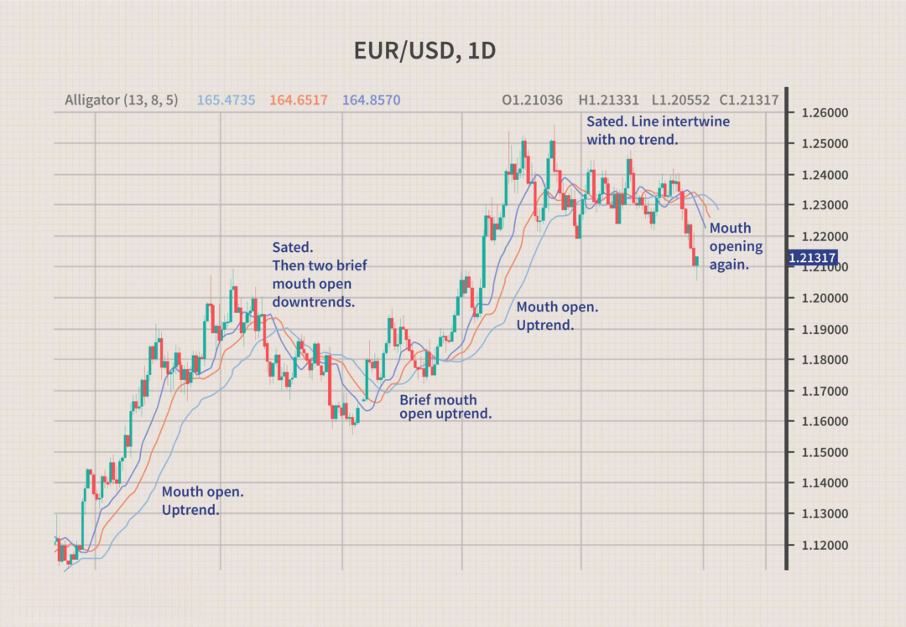

## Table of Contents

## What is a currency pair?

A currency pair is a way to show the value of one country's money compared to another country's money. It is used in the foreign exchange market, where people buy and sell different currencies. The first currency in the pair is called the base currency, and the second one is the quote currency. For example, if you see "USD/EUR," it means you're looking at how many euros (EUR) you can get for one US dollar (USD).

When you see a currency pair, the number you see is how much of the quote currency you need to get one unit of the base currency. If the USD/EUR pair shows 0.85, it means you need 0.85 euros to get one US dollar. This number changes all the time because the value of money goes up and down based on things like a country's economy, interest rates, and even big news events.

## What does EUR/USD represent?

EUR/USD is a currency pair that shows how many US dollars (USD) you can get for one Euro (EUR). It's like a price tag for Euros in terms of dollars. If you see EUR/USD at 1.10, it means you need 1.10 US dollars to buy one Euro.

This pair is very important because it's the most traded currency pair in the world. People, businesses, and banks use it to trade Euros and US dollars. The number changes all the time because the value of money can go up or down based on things like the economy, interest rates, and news.

## What does USD/EUR represent?

USD/EUR is a way to show how many Euros you can get for one US dollar. It's like a price tag that tells you how much of one type of money you need to buy another type. For example, if USD/EUR is at 0.85, it means you get 0.85 Euros for every US dollar you have.

This number changes all the time because the value of money goes up and down. Things like how well a country's economy is doing, what the interest rates are, and even big news can make the value change. People, businesses, and banks look at this number when they need to trade US dollars for Euros.

## How is the EUR/USD currency pair quoted?

The EUR/USD currency pair shows how many US dollars you get for one Euro. It's like a price tag that tells you how much of one type of money you need to buy another. If you see EUR/USD at 1.20, it means you need 1.20 US dollars to buy one Euro.

This pair is very important because it's the most traded in the world. People, businesses, and banks use it to trade Euros and US dollars. The number changes all the time because the value of money can go up or down based on things like the economy, interest rates, and news.

## How is the USD/EUR currency pair quoted?

The USD/EUR currency pair tells you how many Euros you get for one US dollar. It's like a price tag that shows how much of one type of money you need to buy another. If you see USD/EUR at 0.85, it means you get 0.85 Euros for every US dollar you have.

This number changes all the time because the value of money goes up and down. Things like how well a country's economy is doing, what the interest rates are, and even big news can make the value change. People, businesses, and banks look at this number when they need to trade US dollars for Euros.

## What is the difference between EUR/USD and USD/EUR?

EUR/USD and USD/EUR are two ways to show how Euros and US dollars compare to each other. EUR/USD tells you how many US dollars you get for one Euro. For example, if EUR/USD is 1.20, it means you need 1.20 US dollars to buy one Euro. This is the most common way to quote this pair and is used a lot in trading because it's the most traded currency pair in the world.

On the other hand, USD/EUR tells you how many Euros you get for one US dollar. If USD/EUR is 0.85, it means you get 0.85 Euros for every US dollar you have. This is just the opposite of EUR/USD. Both numbers change all the time because the value of money goes up and down based on things like the economy, interest rates, and news.

The main difference between the two is which currency is the base and which is the quote. In EUR/USD, the Euro is the base currency and the US dollar is the quote currency. In USD/EUR, the US dollar is the base currency and the Euro is the quote currency. This means they are inverses of each other, so if you know one, you can figure out the other by dividing 1 by the number you have.

## Why is EUR/USD more commonly used than USD/EUR?

EUR/USD is more commonly used than USD/EUR because it's the way most people in the trading world talk about these currencies. It's like a standard that everyone follows. When traders and banks want to buy or sell Euros and US dollars, they usually look at EUR/USD first. This is because the Euro is the world's second most traded currency, right after the US dollar, so it makes sense to put it first in the pair.

Also, using EUR/USD makes it easier for everyone to understand and compare prices. If everyone used a different way to show the pair, it could get confusing. By sticking to EUR/USD, traders can quickly see how many US dollars they need to buy one Euro, which is helpful for making quick decisions. This common way of quoting helps keep the trading world running smoothly.

## How do exchange rates affect the EUR/USD and USD/EUR quotations?

Exchange rates are like the price tags for different countries' money. They change all the time because of things like how well a country's economy is doing, interest rates, and even big news. When the exchange rate for EUR/USD goes up, it means you need more US dollars to buy one Euro. If it goes down, you need fewer US dollars for one Euro. For example, if the EUR/USD rate goes from 1.20 to 1.25, Euros are getting stronger compared to US dollars, so you need more dollars to buy one Euro.

The same thing happens with USD/EUR, but it's the other way around. When the exchange rate for USD/EUR goes up, it means you get more Euros for one US dollar. If it goes down, you get fewer Euros for one US dollar. For example, if the USD/EUR rate goes from 0.80 to 0.85, US dollars are getting stronger compared to Euros, so you get more Euros for one dollar. Both EUR/USD and USD/EUR are just different ways to show the same thing, but from opposite sides.

## What are the implications of trading EUR/USD versus USD/EUR?

Trading EUR/USD and USD/EUR are two sides of the same coin. When you trade EUR/USD, you're looking at how many US dollars you can get for one Euro. If you think the Euro will get stronger compared to the US dollar, you might want to buy EUR/USD because you'll get more dollars for each Euro. On the other hand, if you think the Euro will get weaker, you might want to sell EUR/USD because you'll need fewer dollars to buy one Euro. It's all about guessing which way the exchange rate will go.

When you trade USD/EUR, you're looking at how many Euros you can get for one US dollar. If you think the US dollar will get stronger compared to the Euro, you might want to buy USD/EUR because you'll get more Euros for each dollar. But if you think the US dollar will get weaker, you might want to sell USD/EUR because you'll get fewer Euros for each dollar. Both ways of trading are about making predictions on how the value of one currency will change compared to the other, but they use different numbers to show the same thing.

## How do market conventions influence the choice between EUR/USD and USD/EUR?

Market conventions play a big role in deciding whether to use EUR/USD or USD/EUR. In the trading world, most people stick to EUR/USD because it's like a standard way of showing how Euros and US dollars compare. It's easier for everyone to understand and use the same numbers. If traders and banks used different ways to show the pair, it could get confusing. By using EUR/USD, everyone knows how many US dollars they need to buy one Euro, which helps them make quick decisions and keeps the trading world running smoothly.

Even though USD/EUR shows the same information but in a different way, it's not used as much. This is because EUR/USD is the way most people in the trading world talk about these currencies. It's like everyone agrees to use this way, so it becomes the norm. If you're trading or looking at exchange rates, you'll usually see EUR/USD because it's what everyone else is using. This common way of quoting helps everyone stay on the same page and makes trading easier.

## What are the historical trends in the EUR/USD and USD/EUR exchange rates?

The EUR/USD exchange rate has had a lot of ups and downs over the years. It started in 1999 when the Euro was first introduced. Back then, one Euro was worth about 1.18 US dollars. Over the next few years, the Euro got stronger and by 2008, it was worth around 1.60 US dollars. But then, the global financial crisis hit, and the Euro started to fall. By 2015, it was down to about 1.10 US dollars. Since then, it's been going up and down but staying around 1.10 to 1.20 US dollars. These changes show how the value of money can go up or down because of things like the economy, interest rates, and big news.

The USD/EUR exchange rate is just the opposite of EUR/USD. When EUR/USD goes up, USD/EUR goes down, and when EUR/USD goes down, USD/EUR goes up. So, when the Euro was at its strongest in 2008, you would only get about 0.62 Euros for one US dollar. But during the financial crisis, when the Euro was weaker, you could get around 0.90 Euros for one US dollar. By 2015, it was back to around 0.90 Euros per US dollar. Since then, it's been moving between 0.83 and 0.90 Euros per US dollar. These trends show how the value of money changes over time and how it can affect how much of one type of money you get for another.

## How do advanced traders use EUR/USD and USD/EUR for arbitrage opportunities?

Advanced traders use EUR/USD and USD/EUR to find [arbitrage](/wiki/arbitrage) opportunities by looking for small differences in the exchange rates between different markets or platforms. Arbitrage is when you buy something in one place and sell it in another place for a higher price, making a profit from the difference. For example, if the EUR/USD rate is slightly higher on one trading platform than another, a trader can buy Euros on the platform with the lower rate and sell them on the platform with the higher rate, making a profit from the difference. These differences might be very small, but with large amounts of money, even tiny differences can add up to big profits.

These traders need to be very quick and use special tools to spot these opportunities. They often use computer programs that can check the exchange rates across different platforms in real time. This way, they can act fast before the rates change. It's important for them to know that arbitrage opportunities usually don't last long because the market quickly adjusts to close the gap. But if a trader can find and use these opportunities often enough, they can make a good profit.

## How can one craft effective EUR/USD strategies?

Combining fundamental and technical analysis is essential for developing effective trading strategies for the EUR/USD currency pair. The integration of these methods allows traders to construct well-rounded strategies that can adapt to the volatile nature of [forex](/wiki/forex-system) markets.

Technical analysis involves the utilization of various tools to predict future price movements based on historical data. Moving averages, such as the Simple Moving Average (SMA) and the Exponential Moving Average (EMA), are commonly used to identify trends over specific periods. For instance, the SMA is calculated as follows:

$$
\text{SMA} = \frac{P_1 + P_2 + \ldots + P_n}{n}
$$

where $P$ represents the closing prices over $n$ time periods. The MACD (Moving Average Convergence Divergence) is another popular tool, which combines moving averages to indicate momentum and potential reversals. The MACD is derived using:

$$
\text{MACD} = \text{EMA}_{12} - \text{EMA}_{26}
$$

Traders often use MACD signals alongside the signal line, a 9-day EMA of the MACD, to identify buy and sell opportunities.

Fundamental analysis, on the other hand, focuses on the economic indicators and policies that influence currency values. For the EUR/USD pair, key indicators include Gross Domestic Product (GDP), interest rates, and inflation rates within both the Eurozone and the United States. Central bank policies, such as those from the European Central Bank (ECB) and the Federal Reserve, play a significant role in shaping market expectations and currency movements.

To enhance the effectiveness of [algorithmic trading](/wiki/algorithmic-trading) strategies, integrating market sentiment and economic news is vital. Market sentiment reflects the overall attitude of investors, and can be gauged through surveys, sentiment indices, and social media analysis. This sentiment, combined with real-time economic news, contributes to making trading algorithms more responsive to sudden market shifts.

Consider a basic Python implementation to calculate an SMA and MACD for algorithmic strategies:

```python
import pandas as pd

def calculate_sma(prices, window):
    return prices.rolling(window=window).mean()

def calculate_ema(prices, window):
    ema = prices.ewm(span=window, adjust=False).mean()
    return ema

def calculate_macd(prices):
    ema_12 = calculate_ema(prices, 12)
    ema_26 = calculate_ema(prices, 26)
    macd_line = ema_12 - ema_26
    signal_line = calculate_ema(macd_line, 9)
    return macd_line, signal_line

# Example usage with closing prices data
# data = pd.Series([...]) # insert closing prices here
# sma = calculate_sma(data, 20)
# macd_line, signal_line = calculate_macd(data)
```

By employing such strategies, traders can enhance their algorithmic trading systems to make informed decisions based on robust data analysis. Combining technical indicators with fundamental insights ensures a comprehensive approach to EUR/USD trading, offering a balanced view of the market.

## What are the results of backtesting EUR/USD trading strategies?

Backtesting is a critical process in evaluating the potential success of a trading strategy by using historical data to simulate trades. It is particularly significant in the context of the highly traded EUR/USD currency pair due to its [liquidity](/wiki/liquidity-risk-premium) and market dynamics. By assessing a strategy's past performance, traders can gain insights into its effectiveness and adaptability to future market conditions.

Key metrics used in [backtesting](/wiki/backtesting) include profitability, which measures the net gain or loss from trading activities over a specific period. Risk-adjusted returns are another vital metric, providing insights into returns in relation to the risk taken. These can be computed using ratios such as the Sharpe Ratio, which is expressed as:

$$
\text{Sharpe Ratio} = \frac{E[R_p - R_f]}{\sigma_p}
$$

Where $E[R_p - R_f]$ is the expected return of the portfolio over the risk-free rate, and $\sigma_p$ is the standard deviation of the portfolio's excess return.

Another important consideration is drawdown, which represents the peak-to-trough decline during a specific period and indicates the strategy's risk exposure. Consistency is also crucial, as it evaluates the regularity in achieving positive returns over multiple timeframes, helping to ascertain the robustness of the strategy.

The process of backtesting helps in determining the resilience of a trading strategy under various historical market conditions. Traders can utilize programming languages like Python to automate and streamline backtesting. For instance, using Python, a simple vectorized backtest can be created with libraries such as pandas and numpy to efficiently handle historical price data, calculate indicators, and simulate trades. Below is a basic sample code illustrating a backtest framework:

```python
import pandas as pd
import numpy as np

def simple_moving_average(data, period):
    return data['Close'].rolling(window=period).mean()

def backtest_strategy(data, short_window, long_window):
    data['Short_MA'] = simple_moving_average(data, short_window)
    data['Long_MA'] = simple_moving_average(data, long_window)
    data['Signal'] = 0
    data.loc[data['Short_MA'] > data['Long_MA'], 'Signal'] = 1
    data['Position'] = data['Signal'].diff()

    # Calculate returns
    data['Strategy_Return'] = data['Position'].shift(1) * (data['Close'].pct_change())
    cumulative_return = (data['Strategy_Return'] + 1).cumprod()[-1]
    return cumulative_return, data['Strategy_Return'].std()

# Assumed historical data for EUR/USD with 'Close' prices
historical_data = pd.DataFrame({
    'Close': [1.27, 1.28, 1.29, 1.30, 1.31, 1.29, 1.28, 1.27, 1.29, 1.30]
})
cumulative_return, volatility = backtest_strategy(historical_data, short_window=3, long_window=5)
print(f"Cumulative Return: {cumulative_return}, Volatility: {volatility}")
```

This approach provides a quantitative basis to harmonize strategy development with real-world potential outcomes, enhancing preparedness for live market trading. Evaluating these metrics ensures strategies are not only profitable but also resilient, thus promoting sound trading practices.

## References & Further Reading

[1]: Bergstra, J., Bardenet, R., Bengio, Y., & Kégl, B. (2011). ["Algorithms for Hyper-Parameter Optimization."](https://dl.acm.org/doi/10.5555/2986459.2986743) Advances in Neural Information Processing Systems 24.

[2]: ["Advances in Financial Machine Learning"](https://www.amazon.com/Advances-Financial-Machine-Learning-Marcos/dp/1119482089) by Marcos Lopez de Prado

[3]: ["Evidence-Based Technical Analysis: Applying the Scientific Method and Statistical Inference to Trading Signals"](https://www.amazon.com/Evidence-Based-Technical-Analysis-Scientific-Statistical/dp/0470008741) by David Aronson

[4]: ["Machine Learning for Algorithmic Trading"](https://github.com/stefan-jansen/machine-learning-for-trading) by Stefan Jansen

[5]: ["Quantitative Trading: How to Build Your Own Algorithmic Trading Business"](https://www.amazon.com/Quantitative-Trading-Build-Algorithmic-Business/dp/1119800064) by Ernest P. Chan