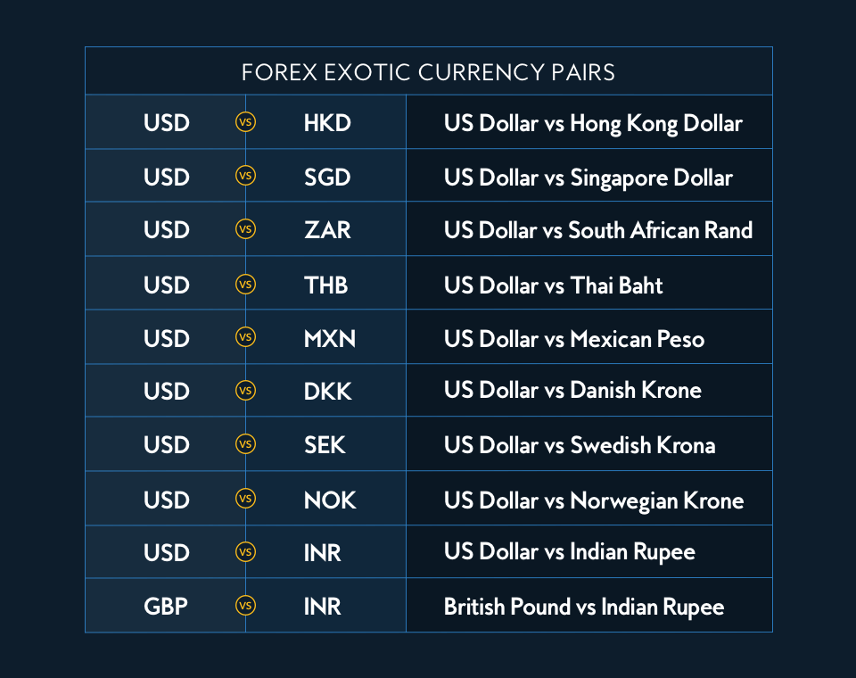

Forex trading, or foreign exchange trading, is a dynamic financial marketplace where currency pairs form the bedrock of all transactions. It is one of the largest and most liquid markets globally, with trillions of dollars traded daily. In this ever-evolving landscape, the introduction of algorithmic trading has added a new dimension, transforming traditional trading methodologies with high-speed decision-making and execution capabilities.

Currency pairs in Forex act as the foundation upon which trades are built. They represent the value of one currency relative to another, with the first currency in the pair labeled as the base currency and the second as the quote currency. Understanding these pairs is crucial for traders aiming to navigate Forex markets successfully. Exchange rates between these currencies fluctuate continuously due to factors like economic data releases, political events, and market sentiment, making the market both challenging and fascinating for participants.



The amalgamation of algorithmic trading with Forex trading has revolutionized this arena. Algorithmic trading employs automated, pre-programmed trading instructions accounting for variables like timing, price, and volume. Its rapid execution and ability to analyze large datasets at speeds beyond human capability give traders a competitive edge. The use of algorithms reduces human emotion-driven errors, leading to more consistent and strategic trading outcomes.

Through this detailed exploration, readers will gain insights into how currency pairs and algorithmic trading collectively shape the Forex trading environment. By setting the stage for an in-depth examination of algorithmic trading's impact, we highlight a significant evolution that continues to redefine trading methodologies and market dynamics.

## Table of Contents

## Understanding Currency Pairs in Forex Trading

Currency pairs are fundamental components in Forex trading, serving as the bedrock upon which the market operates. A currency pair consists of two different currencies, representing the value of one currency against another. In Forex trading, these are denoted with standardized codes, for instance, EUR/USD for the Euro and the US Dollar. Understanding currency pairs is essential for traders as it determines how transactions are conducted and how profits or losses are calculated.

### Base and Quote Currencies

Within a currency pair, the first currency is termed the base currency, and the second is the quote currency. The value of the base currency is always expressed in terms of the quote currency. For example, if the EUR/USD pair is quoted at 1.20, it means one Euro is equivalent to 1.20 US Dollars. This figure represents the exchange rate, a crucial indicator for traders analyzing price movements and making buying or selling decisions.

### Exchange Rate Fluctuations

Exchange rates in the Forex market are not static; they fluctuate continuously due to various factors including economic indicators, geopolitical events, and market sentiment. Traders analyze these fluctuations to engage in currency trading, aiming to buy low and sell high for profit. Exchange rate variability can be quantified using various models and analytical tools. For example, the rate of change in exchange rates can be modeled as:

$$
\Delta \text{Exchange Rate} = \text{Current Rate} - \text{Previous Rate}
$$

Factors such as [interest rate](/wiki/interest-rate-trading-strategies) differentials, trade balances, and inflation expectations also impact exchange rates. The Forex market's decentralized structure allows it to operate 24 hours a day, accommodating these constant changes across global trading sessions.

In summary, currency pairs form the foundational element of Forex trading, with their rates reflecting the dynamic economic environment. Understanding the relationship between base and quote currencies and the factors influencing exchange rates is vital for anyone trading in the Forex market. This understanding aids traders in making informed decisions and crafting effective trading strategies.

## Forex Market Basics

The Forex market, also known as the foreign exchange market, stands as the largest and most liquid financial market in the world. It operates across various countries, offering a platform for the trading of currencies. The core principle of the Forex market is currency exchange, where participants buy one currency while simultaneously selling another, functioning in pairs. This dual mechanism facilitates international trade, investment, and economic stability by allowing the conversion of currencies for various transactions.

One of the key features of the Forex market is its unparalleled [liquidity](/wiki/liquidity-risk-premium). Liquidity refers to the ease with which an asset can be bought or sold without causing a significant change in its price. The Forex market, with a daily trading [volume](/wiki/volume-trading-strategy) exceeding $6 trillion as of 2021, is highly liquid. This immense volume is primarily driven by the market’s accessibility and continuous operation, 24 hours a day on weekdays, across different global financial centers including London, New York, Tokyo, and Sydney. This uninterrupted flow allows for real-time execution of trades and immediate reflection of news and economic events on currency prices.

The Forex market is characterized by a diverse array of participants, each playing a distinct role. Major players include central banks, commercial banks, financial institutions, corporations, hedge funds, and individual retail traders. Central banks, such as the Federal Reserve or the European Central Bank, participate in the Forex market to stabilize or increase the value of their national currency by adjusting interest rates and using foreign reserves to affect currency supply. Commercial banks facilitate currency exchange for their clients and engage in speculative trading. Financial institutions and corporations use the market for hedging purposes to manage currency risk associated with international business operations. Hedge funds and retail traders, although smaller in scale, engage in Forex trading primarily for speculative gains.

Forex trading exerts significant influence on global economic realities, impacting both employment and inflation. Exchange rates, determined in the Forex market, influence the relative cost of goods and services between countries. A strong national currency can make exports more expensive and imports cheaper, potentially leading to trade deficits but lowering inflation by making foreign goods cheaper. Conversely, a weak currency can boost exports by making them cheaper for foreign buyers, thereby stimulating domestic economic activity and possibly increasing employment, but it may also lead to higher inflation as imports become more expensive.

Economic policies, such as a country’s monetary policy, are often directed towards controlling inflation and unemployment, with the exchange rate playing a central role. For instance, a central bank might devalue its currency to stimulate exports and reduce unemployment. However, this can lead to imported inflation as the cost of imported goods rises. Thus, maintaining a balanced exchange rate becomes crucial in achieving economic stability.

In summary, the Forex market is a complex yet integral part of the global financial system, with its operations influencing economic indicators like employment and inflation. Its global reach and liquidity offer participants various opportunities, while the interplay of diverse market players constantly shapes its dynamics.

 to Algorithmic Trading

Algorithmic trading, often referred to as "algo trading," involves using computer programs and algorithms to execute trading orders with minimal human intervention. In the Forex market, algorithms follow a set of defined instructions to conduct trades, making decisions based on complex mathematical models and market data. The primary types of [algorithmic trading](/wiki/algorithmic-trading) include statistical and auto-hedging.

Statistical algorithms focus on patterns in market data to predict future price movements. These algorithms analyze historical trends and use statistical models to identify profitable trading opportunities. Auto-hedging algorithms, on the other hand, automatically mitigate risks by creating offsetting positions in correlated assets. This ensures that potential losses in one trade can be balanced by gains in another, stabilizing the overall trading strategy.

The advantages of employing algorithms in Forex trading are significant. Algorithms can process large volumes of data at speeds unattainable by human traders, increasing execution speed and efficiency. This rapid processing capability enables traders to capitalize on fleeting market opportunities, reducing the time between identifying and executing trades. Moreover, algorithms eliminate human emotions from trading decisions, resulting in more consistent outcomes.

High-frequency trading ([HFT](/wiki/high-frequency-trading-strategies)) is a subset of algorithmic trading characterized by executing a large number of trades at extremely high speeds. In Forex markets, HFT strategies capitalize on the smallest price fluctuations by executing trades in fractions of a second, usually leveraging high trading volumes. This method enhances market liquidity and can lead to tighter spreads, offering potential benefits to both individual traders and large institutions. However, the rapid pace and complexity of HFT also pose challenges, such as increasing market [volatility](/wiki/volatility-trading-strategies) and potential regulatory concerns.

## Algorithmic Trading Strategies in Forex

Algorithmic trading in Forex involves a range of strategies that leverage computational power to optimize trading efficiency and profitability. Among the most prevalent strategies are high-frequency trading (HFT), market-making, and trend-following.

High-frequency trading (HFT) employs sophisticated algorithms to execute a large number of orders within fractions of a second. The goal is to capitalize on minute price discrepancies that occur over very short timescales. HFT is effective in Forex trading due to its capacity to process and react to market data almost instantaneously, exploiting [arbitrage](/wiki/arbitrage) opportunities between different currency pairs before the market adjusts. The speed and volume of trades facilitated by HFT can significantly enhance liquidity in the Forex market but also introduce increased market volatility on account of rapid price changes.

Market-making involves providing liquidity to the market by simultaneously placing buy and sell orders for a particular currency pair. Market makers profit from the spread between the bid and ask prices, [earning](/wiki/earning-announcement) a competitive edge through intricate algorithms that minimize risk and optimize pricing strategies. By continuously updating their orders based on current market conditions and order flow, market-makers help stabilize prices and encourage trades, thereby contributing to market efficiency.

Trend-following strategies are based on the identification and exploitation of ongoing price trends. These strategies rely on the premise that asset prices are more likely to continue their current trajectory than to reverse. Algorithms implementing trend-following approaches often utilize technical indicators such as moving averages or the relative strength index (RSI) to ascertain trend directions. By effectively identifying and riding these trends, traders can gain an advantage in the highly dynamic Forex market.

Machine learning and AI have become integral to developing these sophisticated trading strategies. Algorithms powered by AI can process massive datasets, identifying patterns and making predictions that may not be apparent through traditional statistical methods. A simple example of a trend-following strategy using Python might utilize a moving average crossover system:

```python
def moving_average(data, window_size):
    return data.rolling(window=window_size).mean()

def trade_signal(short_ma, long_ma):
    signal = []
    for short, long in zip(short_ma, long_ma):
        if short > long:
            signal.append(1)  # Buy
        elif short < long:
            signal.append(-1)  # Sell
        else:
            signal.append(0)  # Hold
    return signal

import pandas as pd

# Sample data
data = pd.Series([*sample_prices])

# Calculate short and long-term moving averages
short_ma = moving_average(data, 50)
long_ma = moving_average(data, 200)

# Generate trade signals
signals = trade_signal(short_ma, long_ma)
```

This code snippet demonstrates a basic framework for identifying buy and sell signals based on moving average crossovers, a common trend-following tactic. In practice, [machine learning](/wiki/machine-learning) models can be trained to refine these strategies by learning from historical trade data, adapting to changing market conditions, and optimizing for various risk parameters.

As computational technologies advance, so too does the sophistication of algorithmic strategies, highlighting the evolving nature of competitive advantage within Forex trading.

## Risks Involved in Algorithmic Forex Trading

Algorithmic trading in the Forex market presents a blend of efficiency and speed, but it comes with a spectrum of risks that traders must navigate. Understanding these risks is crucial for anyone looking to leverage algorithmic systems in currency trading.

One of the primary risks in algorithmic Forex trading is market volatility. Algorithms are designed to make decisions based on pre-programmed criteria and historical data. However, during periods of high market volatility, these systems might struggle to adjust to rapid price movements, leading to unexpected losses. For example, flash crashes may occur when algorithms make large sell or buy orders, causing significant price swings that can destabilize financial markets.

Technological disparities also pose significant challenges. The reliance on high-speed internet and computing power means any technological failure can result in substantial financial losses. Latency issues, server downtimes, and connectivity problems can disrupt trading operations, affecting decision-making processes and execution efficiency.

Regulatory challenges are another facet of algorithmic Forex trading risks. The global nature of the Forex market means different countries have varying regulatory frameworks, and staying compliant can be complicated. Algorithmic systems can sometimes engage in practices that, while not illegal, raise ethical questions and lead to increased scrutiny from regulators. For instance, practices like high-frequency trading (HFT) can be seen as manipulative, prompting calls for stricter regulations to ensure fair trading environments.

To mitigate these risks, traders can employ several strategies. Diversification is a key risk management tool. By not relying on a single algorithm or currency pair, traders can spread their risk across various markets and strategies. Ensuring robust technological infrastructure is another crucial step. Regular system audits, redundant internet connections, and up-to-date hardware can help prevent technology-related disruptions.

In addition, implementing real-time monitoring systems that can quickly adapt to sudden market changes can help in making rapid adjustments to trading strategies. Employing more complex, machine learning-based algorithms can also offer an edge as they can learn and adapt to new market conditions faster than traditional models.

Moreover, staying informed about regulatory changes and ensuring compliance with local and international trading laws can prevent legal issues and financial penalties. Collaborating with legal experts can provide insights into current and future regulatory trends.

In summary, while the integration of algorithmic trading in the Forex market offers significant opportunities, it also requires a deep understanding of the associated risks. Traders who proactively manage these risks through diversification, technological preparedness, and regulatory compliance will be better positioned to achieve sustained success in the volatile Forex landscape.

## The Impact of Algo Trading on Currency Pairs

Algorithmic trading has significantly transformed the landscape of Forex trading, particularly in terms of trading volume and liquidity of popular currency pairs. These systems leverage computational precision and speed, which allow traders to execute large volumes of trades at speeds that far exceed human capabilities. This automation enhances market liquidity and stabilizes bid-ask spreads, leading to a more efficient trading environment.

Algorithms are particularly adept at identifying arbitrage opportunities within Forex markets. Arbitrage involves exploiting price differences for the same asset across different markets. Algorithmic trading systems can monitor multiple markets simultaneously and execute trades in a fraction of a second to capitalize on these discrepancies. For instance, if the exchange rate for the EUR/USD currency pair differs between two trading platforms, an algorithm can quickly buy low on one and sell high on the other, securing a risk-free profit before the market adjusts. This not only benefits individual traders but also helps align currency prices across platforms, contributing to market efficiency.

The operational efficiencies gained through automated trading are multifaceted. Algorithms can process vast amounts of data to make informed trading decisions with high precision and minimal latency. This reduces the likelihood of human error, which can be significant in the fast-paced Forex market. The reduction of emotional bias—an inherent human trait—ensures that trades are executed based on data-driven insights rather than hunches or speculative decisions.

Furthermore, algorithmic trading can adapt to various market conditions by employing different strategies, such as trend-following or mean reversion, to optimize trading outcomes. By executing thousands of small trades across a range of strategies, these systems can manage risk more effectively than manual trading.

In summary, algorithmic trading profoundly impacts currency pairs in Forex markets by enhancing liquidity, identifying arbitrage opportunities efficiently, and optimizing operational workflows. These benefits contribute to a more dynamic and robust trading environment, continuously shaping the Forex market.

## Challenges and the Future of Forex Algo Trading

Algorithmic trading in the Forex market, while presenting significant opportunities, also introduces a range of challenges and potential futures that warrant careful consideration. As trading technologies advance, one can anticipate several key developments and challenges that may shape the trajectory of algorithmic trading in Forex markets.

### Future Developments in Algorithmic Trading Technology

The future of algorithmic trading in Forex is poised for substantial transformation through the integration of cutting-edge technologies. Artificial Intelligence (AI) and Machine Learning (ML) are increasingly deployed to enhance algorithmic strategies, allowing for more sophisticated pattern recognition and predictive analytics. These technologies facilitate more accurate modeling of market behaviors, enabling traders to develop algorithms that dynamically adapt to shifting market conditions.

With advancements in computational power, the processing speed and analytical capacity of algorithms are expected to improve, further enhancing the precision of trading decisions. Quantum computing, although still in its nascent stages, holds the potential to exponentially increase the speed at which complex calculations can be performed, thereby revolutionizing the speed and efficiency of algorithmic trading strategies.

### Evolving Regulatory Frameworks

As algorithmic trading becomes more pervasive, regulatory bodies worldwide are increasingly focused on establishing frameworks to manage its risks. These frameworks are designed to ensure the stability and integrity of financial markets, particularly in light of concerns regarding market manipulation, systemic risk, and the potential for market disruptions caused by algorithmic trades.

Regulators are moving towards implementing stricter guidelines on the transparency and accountability of algorithmic trading systems. This includes mandating pre-trade risk controls, transaction reporting, and the use of circuit breakers to prevent flash crashes. The European Union’s Markets in Financial Instruments Directive II (MiFID II), for example, requires rigorous testing and approval of algorithmic trading systems before they are deployed, emphasizing a trend towards stricter regulation.

### Market Trends Shaping the Future of Forex Trading

Several market trends are anticipated to shape the future landscape of Forex algorithmic trading. The growing demand for real-time market data analytics is pushing for the integration of big data technologies in trading algorithms. This trend enables traders to leverage a vast array of data points for more informed decision-making processes.

Additionally, there is an increasing shift towards decentralized trading systems facilitated by blockchain technology, which could redefine how Forex trading is conducted. Blockchain offers the potential for more transparent and secure trading environments, minimizing the risks of data tampering and fraud.

Furthermore, social trading platforms are emerging, allowing traders to share information and strategies in real-time. This trend indicates a shift towards more collaborative and interconnected trading environments, where algorithmic strategies can benefit from community insights and collective intelligence.

In conclusion, while the integration of algorithmic trading in Forex markets promises enhanced efficiency and profitability, it also presents challenges that necessitate robust technological and regulatory solutions. As the industry adapts to technological advancements and evolving market dynamics, stakeholders must remain vigilant to both harness opportunities and mitigate associated risks.

## Conclusion

The integration of algorithmic trading into the Forex market represents a significant evolution in the landscape of currency trading. By leveraging the power of sophisticated algorithms, traders have been able to enhance trading efficiency, capitalizing on speed and precision that surpass human capabilities. This has led to increased trading volumes and improved liquidity for many currency pairs, impacting both market dynamics and participants.

However, while the advantages of algorithmic trading are substantial, they are accompanied by notable risks. The same speed and automation that provide operational efficiencies can also introduce vulnerabilities, such as heightened market volatility and technological failures. Additionally, the complexity of financial algorithms can create regulatory challenges, as oversight bodies strive to ensure fair and transparent market practices.

As algorithmic trading continues to shape the Forex market, staying informed about technological advancements and evolving market trends becomes imperative for traders and stakeholders. Adapting to regulatory changes and understanding emerging risks are crucial steps in navigating this dynamic environment. The dual impact of increased efficiency and associated risk underscores the importance of balancing innovation with caution. As the Forex landscape continues to evolve, an informed approach will be essential for capitalizing on opportunities while minimizing potential pitfalls.

## References & Further Reading

[1]: King, M. R. (2010). ["Traders, Guns & Money: Knowns and Unknowns in the Dazzling World of Derivatives"](https://archive.org/details/tradersgunsmoney00dass_0) by Satyajit Das

[2]: Dagfinn Rime, Andreas Schrimpf (2013). ["The Anatomy of the Global FX Market through the Lens of the 2013 Triennial Survey"](https://www.bis.org/publ/qtrpdf/r_qt1312e.htm). Bank for International Settlements Quarterly Review.

[3]: De Prado, M. L. (2018). ["Advances in Financial Machine Learning"](https://www.amazon.com/Advances-Financial-Machine-Learning-Marcos/dp/1119482089) by Wiley.

[4]: Ivanauskas, V. (2017). ["Algorithmic and High-Frequency Trading"](https://assets.cambridge.org/97811070/91146/frontmatter/9781107091146_frontmatter.pdf) by Cambridge University Press.

[5]: Chan, E. (2009). ["Quantitative Trading: How to Build Your Own Algorithmic Trading Business"](https://github.com/ftvision/quant_trading_echan_book) by Wiley Trading.

[6]: Duhigg, C. (2009). ["How Companies Learn Your Secrets"](https://www.nytimes.com/2012/02/19/magazine/shopping-habits.html) by The New York Times Magazine.