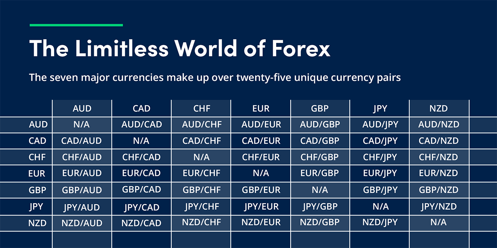

## Table of Contents

## What is a currency pair in forex trading?

A currency pair in forex trading is a way to show the value of one currency compared to another. It tells you how much of the second currency you need to buy one unit of the first currency. For example, if you see the pair EUR/USD, it means you are looking at the value of the Euro (EUR) in terms of the US Dollar (USD).

In forex trading, you always trade one currency for another. The first currency in the pair is called the base currency, and the second is the quote currency. If the EUR/USD pair is trading at 1.20, it means you need 1.20 US Dollars to buy one Euro. This is important because it helps traders decide when to buy or sell currencies based on their changing values.

## What is a spread in forex trading?

In forex trading, a spread is the difference between the buying price and the selling price of a currency pair. When you want to trade, you will see two prices: the bid price, which is what you get when you sell the base currency, and the ask price, which is what you pay to buy the base currency. The spread is how much these two prices differ, and it's usually shown in pips.

Brokers make money from the spread. Every time you make a trade, you're paying the spread as a cost. For example, if the EUR/USD pair has a bid price of 1.2000 and an ask price of 1.2002, the spread is 2 pips. A smaller spread means less cost for you, so it's good to look for brokers with tight spreads if you want to save money on your trades.

## What is a pip and how is it calculated?

A pip is the smallest price move that a currency pair can make. It stands for "percentage in point" or "price interest point." For most currency pairs, a pip is a one-digit move in the fourth decimal place of the exchange rate. For example, if the EUR/USD moves from 1.2000 to 1.2001, that's a one pip move.

Calculating pips is easy. You just look at the fourth decimal place of the price change. If the EUR/USD moves from 1.2000 to 1.2005, that's a five pip move. But, some currency pairs like the Japanese yen use only two decimal places, so a pip for those pairs is a one-digit move in the second decimal place. For example, if the USD/JPY moves from 110.00 to 110.01, that's a one pip move.

## Why are high spread-to-pip potential currency pairs important for day trading?

High spread-to-pip potential currency pairs are important for [day trading](/wiki/day-trading-spy) because they can offer more profit opportunities in a short time. Day traders want to make money from small price changes that happen quickly. When a currency pair has a high spread-to-pip potential, it means that even though the cost to enter the trade (the spread) might be higher, the potential for the price to move in a way that makes a profit is also higher. This can be good for day traders who are looking to make many trades in a day and need those trades to be profitable.

However, trading these pairs also comes with more risk. The high spread means a higher cost to enter and [exit](/wiki/exit-strategy) trades, so if the price doesn't move enough to cover the spread and make a profit, the trader can lose money. Day traders need to be careful and use good strategies to manage this risk. They need to watch the market closely and be ready to act fast to take advantage of the big price moves that these high spread-to-pip potential pairs can offer.

## How can a beginner identify currency pairs with high spread-to-pip potential?

A beginner can identify currency pairs with high spread-to-pip potential by looking at how much the price of the pair moves in a day. You can use charts and tools on trading platforms to see this. Look for pairs that have big ups and downs in their price. These pairs are more likely to have high spread-to-pip potential because they can move a lot in a short time, giving you more chances to make a profit.

Another way is to check the [volatility](/wiki/volatility-trading-strategies) of the currency pair. Volatility means how much the price changes. You can find this information on financial websites or trading platforms. Pairs with high volatility often have high spread-to-pip potential. But remember, high volatility also means more risk. So, it's important to learn about the pair and practice trading with small amounts before you start trading with more money.

## What are some common currency pairs with high spread-to-pip potential?

Some common currency pairs with high spread-to-pip potential are the GBP/JPY and the AUD/JPY. These pairs can move a lot in a day, which means they can offer good chances to make money if you're a day trader. The GBP/JPY, which is the British pound against the Japanese yen, is known for its big price swings. This can be good for traders who want to make quick profits. The AUD/JPY, which is the Australian dollar against the Japanese yen, is also known for its volatility. This pair can move a lot because of changes in the Australian and Japanese economies.

Another pair to look at is the EUR/GBP, which is the Euro against the British pound. This pair can also have high spread-to-pip potential because of the economic differences between the Eurozone and the UK. These differences can cause the price to go up and down a lot. When you're trading these pairs, remember that while they can offer good chances to make money, they also come with more risk. It's important to keep an eye on the market and be ready to act fast.

## How does market volatility affect the spread-to-pip potential of currency pairs?

Market volatility affects the spread-to-pip potential of currency pairs by making their prices move up and down more. When a currency pair is very volatile, it means that the price can change a lot in a short time. This can make the spread-to-pip potential higher because there's more chance for the price to move enough to cover the spread and make a profit. For example, if a currency pair like GBP/JPY moves a lot in a day, traders can buy and sell it quickly to make money from these big price changes.

However, high volatility also means more risk. The spread, which is the cost of trading, can get bigger when the market is very volatile. This is because brokers might increase the spread to protect themselves from the fast price changes. So, while high volatility can lead to more chances to make money, it also means that the cost to trade can go up. Traders need to be careful and watch the market closely to make the best use of high spread-to-pip potential while managing the risks that come with it.

## What are the risks associated with trading high spread-to-pip potential currency pairs?

Trading high spread-to-pip potential currency pairs can be risky because the price can change a lot in a short time. This means you could lose money quickly if the price goes the wrong way. The spread, which is the cost of trading, can also be bigger when the market is very up and down. This means you need the price to move even more just to make a profit, and if it doesn't move enough, you might lose money on the trade.

Another risk is that these pairs can be hard to predict. Because they move a lot, it can be tough to know which way the price will go next. This makes it important to watch the market closely and be ready to act fast. If you don't pay attention, you might miss good chances to make money or stay in a trade too long and lose money. So, while these pairs can offer big profits, they also need careful watching and quick decisions to manage the risks.

## How can an intermediate trader use technical analysis to optimize trades in high spread-to-pip potential pairs?

An intermediate trader can use technical analysis to optimize trades in high spread-to-pip potential pairs by looking at charts and using tools like moving averages, support and resistance levels, and indicators like the Relative Strength Index (RSI) and the Moving Average Convergence Divergence (MACD). These tools help the trader see patterns and trends in the price movements of the currency pair. For example, if the price of a pair like GBP/JPY is moving above its moving average, it might be a good time to buy because the trend seems to be going up. On the other hand, if the RSI shows that the pair is overbought, it might be a sign that the price could go down soon, and it might be a good time to sell.

Another way technical analysis can help is by using it to set entry and exit points for trades. High spread-to-pip potential pairs can move a lot in a short time, so it's important to know when to get in and out of a trade. By looking at support and resistance levels, a trader can see where the price might stop going down or up and change direction. For example, if the price of AUD/JPY is near a strong resistance level, it might be a good time to sell because the price might go down from there. Using these tools and watching the market closely can help an intermediate trader make better decisions and manage the risks that come with trading these volatile pairs.

## What role does economic news play in the spread-to-pip potential of currency pairs?

Economic news can make the spread-to-pip potential of currency pairs go up or down a lot. When big news comes out, like changes in interest rates or reports about how well a country's economy is doing, it can make the price of a currency pair move a lot in a short time. This is because traders and investors react to the news and start buying or selling the currency. If the news is good for a country's economy, the value of its currency might go up. If the news is bad, the value might go down. This big move in the price can make the spread-to-pip potential higher because there's more chance for the price to cover the spread and make a profit.

But, economic news can also make trading riskier. When the news comes out, the spread, which is the cost of trading, can get bigger. This is because brokers might increase the spread to protect themselves from the fast price changes that can happen after big news. So, while economic news can give traders more chances to make money from big price moves, it also means that the cost to trade can go up. Traders need to be careful and watch the news closely to use it to their advantage while also managing the risks that come with it.

## How can advanced traders use algorithmic trading strategies to exploit high spread-to-pip potential?

Advanced traders can use [algorithmic trading](/wiki/algorithmic-trading) strategies to take advantage of high spread-to-pip potential by setting up computer programs that automatically buy and sell currency pairs based on certain rules. These rules can be based on technical indicators, like moving averages or the RSI, or they can be based on economic news and events. The goal is to make trades quickly and without letting emotions get in the way, which can be hard for human traders. By using algorithms, traders can spot small price changes and act on them fast, which is important for making money from high spread-to-pip potential pairs that move a lot in a short time.

One common strategy is called [scalping](/wiki/gamma-scalping), where the algorithm makes many trades in a day to catch small price moves. The algorithm can be set up to buy a currency pair when the price goes up a little and sell it when it goes down a little, making a small profit each time. Another strategy is to use news-based algorithms, which can trade right after big economic news comes out. These algorithms can react to the news faster than human traders, taking advantage of the big price moves that happen right after the news. By using these strategies, advanced traders can make the most of high spread-to-pip potential pairs while managing the risks that come with them.

## What are some advanced risk management techniques specifically for trading high spread-to-pip potential currency pairs?

Advanced traders can use several risk management techniques when trading high spread-to-pip potential currency pairs. One important technique is using stop-loss orders. A stop-loss order is like a safety net that automatically closes your trade if the price moves against you by a certain amount. This can help you limit how much money you might lose on a trade. Another technique is position sizing, which means deciding how much money to put into each trade based on how risky the trade is. By only putting a small part of your trading money into each trade, you can spread out your risk and not lose everything if one trade goes wrong.

Another useful technique is using trailing stops. A trailing stop moves with the price of the currency pair, so if the price goes up, the stop-loss level goes up too. This lets you lock in profits as the price moves in your favor, but it also protects you if the price suddenly goes down. Also, advanced traders can use hedging strategies, where they open another trade to offset the risk of the first trade. For example, if you buy a high spread-to-pip potential pair, you might sell another pair that moves in the opposite way to protect yourself. By using these techniques, traders can manage the risks that come with trading these volatile pairs and keep their trading money safe.

## References & Further Reading

[1]: Aldridge, I. (2013). ["High-Frequency Trading: A Practical Guide to Algorithmic Strategies and Trading Systems."](https://www.amazon.com/High-Frequency-Trading-Practical-Algorithmic-Strategies/dp/1118343506) John Wiley & Sons.

[2]: Murphy, J. J. (1999). ["Technical Analysis of the Financial Markets: A Comprehensive Guide to Trading Methods and Applications."](https://archive.org/details/technicalanalysi0000murp) New York Institute of Finance.

[3]: Harris, L. (2003). ["Trading and Exchanges: Market Microstructure for Practitioners."](https://www.amazon.com/Trading-Exchanges-Market-Microstructure-Practitioners/dp/0195144708) Oxford University Press.

[4]: Chan, E. (2017). ["Machine Trading: Deploying Computer Algorithms to Conquer the Markets."](https://github.com/ftvision/quant_trading_echan_book) Wiley.

[5]: Nison, S. (1991). ["Japanese Candlestick Charting Techniques: A Contemporary Guide to the Ancient Investment Techniques of the Far East."](https://archive.org/details/japanesecandlest0000niso) Prentice Hall Press.

[6]: Investopedia. (n.d.). ["Forex Trading: A Beginner’s Guide."](https://www.investopedia.com/articles/forex/11/why-trade-forex.asp) Retrieved from https://www.investopedia.com/.

[7]: Babypips.com. (n.d.). ["School of Pipsology: Learn Forex Trading."](https://www.babypips.com/learn/forex) Retrieved from https://www.babypips.com/.